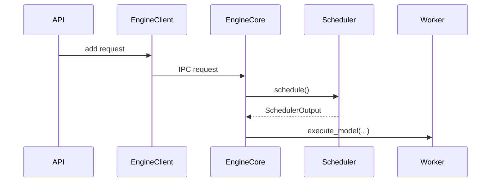

# AGENTS.md

本文件是 `vllm_reader` 的项目级协作规范，适用于所有参与源码阅读、知识整理、
文档写作、图示制作和实验验证的人类贡献者与 AI agents。

这个项目不是 vLLM 的镜像，也不是以修改 vLLM 为主要目标的开发仓库。它的核心
任务是：**利用大模型系统阅读 vLLM 源码，形成可验证、可维护、适合人类学习的
中文书籍与技术文档。**

---

## 1. 项目目标

项目交付物应帮助读者完成以下事情：

1. 找到一个功能在 vLLM 中的真实入口和实现边界。
2. 沿调用链理解请求、调度、KV Cache、模型执行和输出处理。
3. 理解关键对象的职责、生命周期、状态变化和并发关系。
4. 将抽象概念对应到具体源码、测试、配置和运行现象。
5. 看清设计取舍，而不只是复述函数名和代码流程。
6. 在 vLLM 升级后判断哪些结论仍然成立、哪些文档需要重验。

“写得像是正确的”不算完成。每个重要结论都必须能回到源码证据、测试证据、
官方设计文档或可复现实验。

---

## 2. 默认工作区

默认目录关系如下：

```text
~/Desktop/
├── vllm/          # 上游 vLLM 源码，默认只读
└── vllm_reader/   # 本项目，存放阅读成果
```

默认源码目录为：

```bash
VLLM_SOURCE_DIR=~/Desktop/vllm
```

开始任务前必须确认真实路径和版本：

```bash
test -d "${VLLM_SOURCE_DIR:-../vllm}/.git"
git -C "${VLLM_SOURCE_DIR:-../vllm}" status --short --branch
git -C "${VLLM_SOURCE_DIR:-../vllm}" rev-parse HEAD
git -C "${VLLM_SOURCE_DIR:-../vllm}" log -1 --format='%cs %s'
```

硬性要求：

- 默认只读取 `vllm/`，不要修改、格式化、切分支、拉取或清理上游仓库。
- 不要假设上游始终位于 `../vllm`；路径不一致时先定位实际仓库。
- 不要静默执行 `git pull`。源码升级会使行号、符号和结论发生漂移。
- 如果上游工作区存在未提交修改，必须记录 `HEAD` 和 dirty 状态。
- 只有用户明确要求修改 vLLM 时，才可进入上游开发流程；此时先阅读上游
  `AGENTS.md` 及相关领域说明。

---

## 3. 推荐目录结构

仓库逐步建设时优先采用以下结构；不要为了占位一次性创建空目录或空文件。

```text
book/
  README.md                    # 全书目录、阅读路线和章节状态
  01-transformer-inference/    # 自回归推理、prefill、decode、sampling
  02-vllm-architecture/        # 系统全景与一次请求的生命周期
  03-engine-core/              # Engine、EngineCore、IPC 与主循环
  04-scheduler/                # 调度、continuous batching、chunked prefill
  05-kv-cache/                 # block、prefix cache、分配与回收
  06-paged-attention/          # block table、metadata、attention backend
  07-model-execution/          # executor、worker、model runner、sampler
  08-compile-cuda-graph/       # async scheduling、compile、CUDA Graph
  09-distributed/              # TP/PP/DP/EP/CP 与多 GPU
  10-experiments/              # benchmark、profiling 与优化实验
notes/
  investigations/             # 尚未整理成章节的专题调查
  symbols/                    # 核心类、函数和数据结构索引
  experiments/                # 实验记录、命令、环境和结果
diagrams/                      # 可复用 Mermaid 图源或图示说明
glossary/
  terms.md                     # 全局术语表
meta/
  roadmap.md                   # 计划、依赖、状态和审阅进度
  source-revisions.md          # 阅读过的 vLLM revision 记录
scripts/                       # 文档检查和索引生成脚本
```

如果仓库已经形成不同结构，遵循现有结构，不为匹配本节进行无关重构。

---

## 4. 事实来源优先级

结论冲突时，按以下优先级处理：

1. 当前锁定 revision 下实际执行的源码。
2. 同 revision 的测试、fixture 和 benchmark。
3. 同 revision 的 `docs/design/`、配置说明和贡献者文档。
4. vLLM 官方论文、官方博客、release notes 和 issue/PR 讨论。
5. PyTorch、CUDA、NCCL、Triton、Transformers 等依赖的官方文档或源码。
6. 高质量外部文章，仅可用于补充背景，不可代替 vLLM 本身的证据。

代码注释表达的是设计意图，运行路径表达的是实际行为。两者不一致时必须指出，
不能挑选更容易讲述的一方。

禁止：

- 只凭模型记忆描述“当前 vLLM”。
- 只看类名、docstring 或单个函数就推断完整运行机制。
- 把旧版 V0、旧版 V1 或博客中的架构直接套到当前 revision。
- 把测试中的 mock 行为写成生产环境行为。
- 把“可能”“通常”“理论上”改写成无条件事实。
- 使用无法定位来源的精确数字、性能结论或硬件结论。

---

## 5. 证据规范

### 5.1 每篇正式文档必须绑定源码版本

正式章节和可发布专题文档开头使用以下元信息：

```yaml
---
title: "章节标题"
status: draft
source_repository: vllm-project/vllm
source_path: ../vllm
source_commit: <40-character commit SHA>
source_branch: <branch name or detached>
source_dirty: false
verified_at: YYYY-MM-DD
scope: "本章覆盖和不覆盖的内容"
prerequisites:
  - "前置章节或知识"
---
```

`status` 仅使用：

- `outline`：只有范围和提纲。
- `draft`：已有正文，但证据或实验尚未完成。
- `verified`：源码引用、调用链和实验均已复核。
- `stale`：上游更新后已知需要重新验证。

### 5.2 引用源码

重要结论应在正文附近引用：

```text
[源码] `vllm/v1/engine/core.py` - `EngineCore.step`
[测试] `tests/v1/.../test_....py` - `test_...`
[设计] `docs/design/....md` - “Section title”
```

要求：

- 优先引用“文件路径 + 符号名”，必要时补充固定 revision 下的行号。
- 不得只写 `core.py`、`scheduler.py` 等不完整路径。
- 调用链上的关键跳转必须分别给出调用者和被调用者。
- 行号是辅助信息，符号名和 commit 才是长期定位依据。
- 引用代码片段应保持最短，只保留解释结论所需的语句。
- 不大段复制上游源码；本项目的价值是解释、连接和验证。

### 5.3 区分结论强度

写作时明确使用以下标签或同等清晰的措辞：

- **源码事实**：当前 revision 可直接观察到的行为。
- **实验观察**：由记录完整的命令和输出支持。
- **设计意图**：来自官方设计文档、注释或维护者讨论。
- **推断**：由多处证据组合得到，但源码没有直接声明。
- **待确认**：证据不足或存在冲突，必须进入问题清单。

推断不能伪装成源码事实。无法验证时保留问题，比填补一个流畅但错误的解释更好。

---

## 6. 源码阅读流程

每个阅读任务遵循以下顺序。

### 第一步：定义问题与边界

先写清楚：

- 要回答的核心问题。
- 面向的读者层次。
- 包含哪些运行模式、平台和入口。
- 明确不覆盖什么。
- 预期交付：调查笔记、正式章节、术语表、图或实验。

不要以“解释整个 scheduler”这种无边界目标直接开始。应拆成可验证问题，例如：
“一次 engine step 如何选择 running 与 waiting requests，并形成
`SchedulerOutput`？”

### 第二步：固定 revision 并建立源码地图

先记录 commit，再用搜索定位定义、构造位置和调用点：

```bash
SRC="${VLLM_SOURCE_DIR:-../vllm}"
git -C "$SRC" rev-parse HEAD
rg -n "class Scheduler|def schedule" "$SRC/vllm" "$SRC/tests"
rg -n "Scheduler\(" "$SRC/vllm" "$SRC/tests"
rg -n "\.schedule\(" "$SRC/vllm" "$SRC/tests"
```

搜索优先使用 `rg` 和 `rg --files`。不要依赖文件名猜测实现位置。

源码地图至少包括：

- 用户或协议入口。
- 配置对象及其派生过程。
- 核心接口和具体实现。
- 数据结构及主要字段。
- 上游调用者和下游被调用者。
- 相关测试、设计文档和 benchmark。

全书章节级主锚点同时维护在 `meta/chapter-source-map.json` 和
`meta/chapter-source-map.md`。修改章节范围、主实现路径或关键类名时，必须同步更新
这两个文件并运行 `python3 scripts/check_book.py`。JSON 用于机械校验，Markdown 用于
人类审阅；二者不能代替章节内更细的调用链证据。

### 第三步：先宽后深

先阅读模块边界和主干路径，再进入分支细节：

1. `__init__`、protocol、interface、abstract base class。
2. 构造流程和依赖注入。
3. 主循环或主执行方法。
4. 输入、输出和状态对象。
5. 错误、取消、超时和 shutdown 路径。
6. 平台特化、优化分支和 fallback。

不要从一个 CUDA kernel 或工具函数开始，随后倒推整个系统，除非任务本身就是该
kernel。

### 第四步：追踪控制流与数据流

对每个关键步骤回答：

- 谁创建这个对象？
- 谁调用这个方法？
- 输入来自哪里，输出交给谁？
- 哪些字段在这里发生变化？
- 状态由谁拥有，生命周期多长？
- 代码运行在哪个进程、线程、设备或 event loop？
- 同步、异步、IPC、RPC 或 collective 边界在哪里？
- 正常路径之外，失败和取消如何传播？

至少追踪一条端到端 happy path；正式章节还应覆盖一个最重要的异常路径或边界
条件。

### 第五步：用测试和实验反证

主动寻找能推翻初始理解的证据：

- 是否有配置使实现切换到另一个类？
- CPU、CUDA、ROCm、TPU 路径是否不同？
- 单进程与多进程是否共享同一调用链？
- offline inference 与 online serving 是否在入口层分叉？
- feature flag、环境变量或 platform plugin 是否改变行为？
- 同名 V0/V1 类型是否容易混淆？

能运行时，优先做最小、可复现的验证。不能运行 GPU 路径时，明确写明“静态源码
验证”，不要声称已经运行验证。

### 第六步：从调查笔记提炼正式文档

调查过程可以保留搜索结果、错误假设和长引用；正式章节应重写为清晰的教学叙事。
不要把模型的逐步搜索日志直接当作章节正文。

### 第七步：独立复核

完成后重新从入口走一遍调用链，并检查：

- 每条关键边是否真实存在。
- 图、正文和代码引用是否一致。
- 是否混入其他 revision 的知识。
- 是否把可选分支写成必经路径。
- 是否遗漏关键状态变化或进程边界。

---

## 7. vLLM 阅读导航

当前 vLLM 变化很快，下面是阅读方向，不是固定文件清单。每次都要用当前 revision
重新搜索确认。

推荐主线：

1. 用户入口：offline `LLM.generate` 或 online API handler。
2. 请求预处理：prompt、sampling params、tokenization、request processor。
3. Engine client：同步/异步客户端与 EngineCore 通信。
4. EngineCore：请求接收、step loop、调度与执行协调。
5. Scheduler：waiting/running 状态、token budget、preemption。
6. KV Cache：block pool、cache manager、prefix caching、block table。
7. Executor/Worker：单进程、多进程、Ray 或平台特化执行。
8. Model Runner：batch 构造、模型前向、sampling、CUDA graph。
9. Output Processor：detokenization、streaming、finish reason、metrics。

常见专题支线：

- PagedAttention 与 attention backend。
- chunked prefill 与 continuous batching。
- prefix caching。
- tensor/pipeline/data/expert parallelism。
- speculative decoding。
- structured output、tool calling 和 reasoning parser。
- quantization、LoRA 与多模态。
- torch.compile、CUDA graph 与自定义 kernel。
- disaggregated prefill/decode 和 KV connector。

每条支线都应先说明它挂接到主线的哪个阶段，再展开内部实现。

---

## 8. 正式章节契约

每个正式章节原则上包含以下部分；小型专题可以合并相邻部分，但不能丢失证据和
验证信息。

```markdown
# 章节标题

> 一句话说明本章回答的问题。

## 阅读目标
## 前置知识
## 版本与范围
## 核心术语
## 全局位置
## 最小源码地图
## 主调用链
## 关键数据结构与状态变化
## 关键实现解析
## 并发、进程与设备边界
## 设计取舍
## 异常路径与边界条件
## 最小验证实验
## 常见误解
## 本章小结
## 自检问题
## 未解决问题
## 源码与资料索引
```

写作要求：

- 默认读者有 LLM 使用经验、代码开发基础和基础数学直觉，但可能没有系统学习过
  Transformer、编译器、CUDA、操作系统内存管理或分布式算法。
- 每个正文小节先给阅读入口，再进入公式、表格、代码或源码符号；不能让读者在标题后
  直接面对一屏实现细节。
- 解释复杂机制时按“使用现象 -> 生活化直觉 -> 最小例子 -> 必要公式 -> 张量 shape
  -> 当前源码 -> 边界和反例”的坡度展开。可以合并相邻层次，但不能从现象直接跳到
  kernel 或抽象公式。
- 公式首次出现时必须解释变量、shape、单位和它回答的问题。数学推导只保留理解实现
  所必需的部分，不用高等数学术语替代直觉解释。
- 类比必须明确适用边界。例如 KV Cache 可以类比仓库货位，但物理 tensor、逻辑 block
  和元数据对象仍要回到真实定义。
- 开头先给读者全局位置，再进入局部实现。
- 首次出现的关键专业名词必须就近解释；跨章节复用时加入术语表。
- 代码解析必须说明“为什么存在”和“与上下游怎样连接”，不能逐行翻译。
- 每个长章节至少提供一条完整调用链和一张结构图或时序图。
- 每章结尾给出 3-5 个需要解释、预测、追踪或修改代码的自检题。
- 自检题优先检查理解，不出只靠背诵类名即可回答的问题。
- 对版本敏感的部分使用明确提示，不用“最新版”“现在”等模糊表述。

---

## 9. 图示规范

优先使用 Mermaid，使图能被 diff、搜索和维护：



要求：

- 每张图后必须有“读图方法”或等价说明，告诉读者阅读方向、第一遍应追的主路径、第二遍
  才需要看的分支，以及读完后应得到的结论。
- 图中的节点名称必须能映射到真实模块、类或明确的概念层。
- 实线调用、异步消息、返回值和可选分支应有清晰区别。
- 跨进程、跨线程、IPC、网络、CPU/GPU 和 collective 边界必须标注。
- 图中每条关键边都应有源码依据。
- 图只表达一个主要问题，避免一张图塞入整个仓库。
- 图和正文引用同一 revision；架构变化后两者必须一起复核。

禁止使用看似完整但未经源码验证的“概念架构图”。

---

## 10. 实验记录契约

每个实验记录至少包含：

```markdown
# 实验名称

- Source commit:
- Reader commit:
- Date:
- Hardware:
- OS / driver / CUDA / Python / PyTorch:
- vLLM install mode:
- Model:
- Command:
- Expected observation:
- Actual observation:
- Conclusion:
- Limitations:
```

要求：

- 保存完整命令、关键配置、随机种子和必要环境变量。
- 区分功能验证、调用链观测和性能 benchmark。
- 没有 warmup、重复次数和硬件信息时，不下性能结论。
- 单次 trace 或 log 只证明该配置下发生过，不自动证明所有模式都如此。
- 大模型权重、trace、profile 和大日志不要直接提交；记录生成方式和摘要。
- 对无法在当前机器执行的 CUDA/NCCL 路径，提供静态验证范围和待运行清单。

---

## 11. LLM 写作与审阅规则

AI agent 必须：

- 先检索和阅读源码，再组织答案。
- 在开始大篇幅写作前给出源码地图和计划覆盖的调用链。
- 保留不确定性，主动记录反例、分支和待确认项。
- 对名称相似的类和新旧实现给出完整路径，避免混淆。
- 优先生成小而可审阅的章节，不一次批量生成整本书。
- 修改已有文档前先理解原有结构、受众和已绑定 revision。
- 保留人类作者的有效内容，不进行无关重写或文风清洗。
- 发现现有文档错误时，修正文档并说明对应证据，而不是修改事实以迁就文档。

AI agent 不得：

- 伪造已运行命令、测试、profile 或 benchmark。
- 伪造源码路径、符号、配置项、issue、PR、论文或引用。
- 用自然语言的流畅程度掩盖调用链缺口。
- 在未追踪构造与调用位置时断言“核心逻辑就在这个类”。
- 把自动生成内容直接标记为 `verified`。
- 为了让图更整齐而省略改变语义的中间层或边界。

---

## 12. 变更范围与提交纪律

- 一个变更聚焦一个章节、一个专题或一类基础设施。
- 不要把源码研究、全书目录重构和工具链改造塞进同一变更。
- 只修改完成任务所需文件；不要顺手格式化全仓库。
- 不提交本地绝对路径相关的临时缓存、模型权重、虚拟环境或运行日志。
- 正式文档新增术语时同步更新 `glossary/terms.md`（如果该文件已存在）。
- 正式章节状态变化时同步更新 `book/README.md` 或 `meta/roadmap.md`
  （如果这些索引已存在）。

推荐 commit subject：

```text
docs(<area>): explain <topic>
notes(<area>): trace <call-path>
test(docs): add <validation>
chore(reader): add <tooling>
```

---

## 13. 完成定义

调查笔记完成的最低标准：

- 记录了源码 commit 和研究问题。
- 找到了入口、关键符号、调用者、被调用者和相关测试。
- 区分了事实、推断与待确认项。
- 给出了下一步可执行的阅读或实验计划。

正式章节完成的最低标准：

- 元信息完整，源码 revision 明确。
- 章节范围清楚，关键术语已解释。
- 至少一条主调用链可由源码逐跳验证。
- 关键状态变化、并发边界和异常路径没有被忽略。
- 图示、正文、源码引用互相一致。
- 最小实验已运行，或明确说明无法运行及原因。
- 重要结论附近有源码、测试、设计文档或实验依据。
- 不包含无法定位的符号、引用或性能数字。
- 已完成一次独立复核，状态才可从 `draft` 改为 `verified`。

---

## 14. 开始任务时的标准动作

除非用户明确指定其他流程，每次任务按以下清单开始：

```text
[ ] 阅读本 AGENTS.md
[ ] 确认 vLLM 源码路径、branch、commit 和 dirty 状态
[ ] 检查本项目现有目录、roadmap、术语表和相关章节
[ ] 将用户问题缩小为可验证的源码问题
[ ] 搜索入口、符号、调用点、测试和官方设计文档
[ ] 建立最小源码地图后再开始写作
[ ] 完成后检查证据、版本、图示和实验记录
```

遇到证据不足时，先继续搜索、运行最小实验或明确标记待确认。不要让大模型替源码
补全答案。

---

Last reviewed: 2026-09-07.
