# 第01章 从 Transformer 到大模型推理

> 一段文本如何经过模型，变成一个又一个输出 token？

## 本章定位

本章不是完整的 Transformer 理论课，也不讨论训练、反向传播和优化器。目标是建立
阅读 vLLM 所需的最小推理模型，让读者在进入 Engine 和 Scheduler 前真正理解：

1. 模型接收和输出的究竟是什么。
2. prefill 与 decode 为什么是两种不同的工作负载。
3. KV Cache 为什么能加速生成，又为什么会占用大量显存。
4. vLLM 优化的是模型计算之外的哪些系统问题。

## 阅读目标

> **本节先看：** 下面的清单是读完本章后的能力检查，不要求你现在就会。先浏览一遍，阅读正文时再用它确认自己是否抓住主线。

- 解释 token、embedding、hidden state、logits 和 sampling 的关系。
- 画出一个 decoder-only Transformer 的单次 forward 数据流。
- 区分 prefill 与 decode 的输入形状和计算特征。
- 推导为什么 KV Cache 能减少重复计算，以及显存为何随序列增长。
- 将通用推理概念映射到 vLLM 的模型、Attention 和 Sampler 实现。

## 前置知识

> **本节先看：** 只需具备下面这些基础就可以开始。遇到陌生数学或系统概念时，本章会先给直觉和小例子，再进入源码。

- 能阅读 Python 类、函数、列表和循环。
- 知道向量是一组数字，矩阵可以对向量做线性变换。
- 知道 GPU 擅长执行大规模并行数值计算即可，不要求 CUDA 编程经验。

## 版本与范围

> **本节先看：** 这一部分先划定结论成立的源码版本和讨论边界。超出范围的实现不能直接套用本章结论，需要重新核对源码。

- 源码仓库：`vllm-project/vllm`
- 源码 commit：`5893426b88f7b3cd21101d194eb1c6f0a6f0e27b`
- 阅读主线：decoder-only 文本生成、vLLM V1 Engine、Llama 类模型。
- 本章使用单层、单 attention head 的教学模型建立直觉；真实模型通常有多层、
  多个 query heads，并可能使用 GQA、量化、TP 和不同 attention backend。
- 本章中的复杂度只用于解释增长趋势，不代替具体 kernel benchmark。

## 核心术语

> **本节先看：** 这张表给出术语在本章中的工作定义。第一次阅读理解含义即可，看到它们在调用链中的位置后再回来看会更清楚。

| 术语 | 本章中的含义 |
|---|---|
| Token | Tokenizer 划分出的离散单位，模型实际处理的是 token ID。 |
| Vocabulary | 模型能够输出的全部 token 集合。 |
| Embedding | 将 token ID 查表转换成连续向量。 |
| Hidden state | 某个 token 在网络当前层中的向量表示。 |
| Logits | 模型对词表中每个候选 token 给出的未归一化分数。 |
| Attention | 让当前位置按相关程度聚合历史位置 Value 的计算。 |
| Causal mask | 禁止一个位置读取未来 token 的约束。 |
| RoPE | 通过旋转 Query/Key 向量注入位置信息的方法。 |
| Prefill | 处理尚未计算的 prompt token，建立 KV Cache；可拆成多个 chunk。 |
| Decode | 利用已有 KV Cache 继续生成 token。 |
| KV Cache | 保存各层历史 token 的 Key 和 Value。 |
| Sampling | 对 logits 做规则处理并选出下一个 token。 |

## 全局位置

先把一次生成压缩成一张图。Transformer 负责把已有 token 变成下一 token 的
logits；sampling 决定选择哪个 token；自回归循环把新 token 再送回模型。

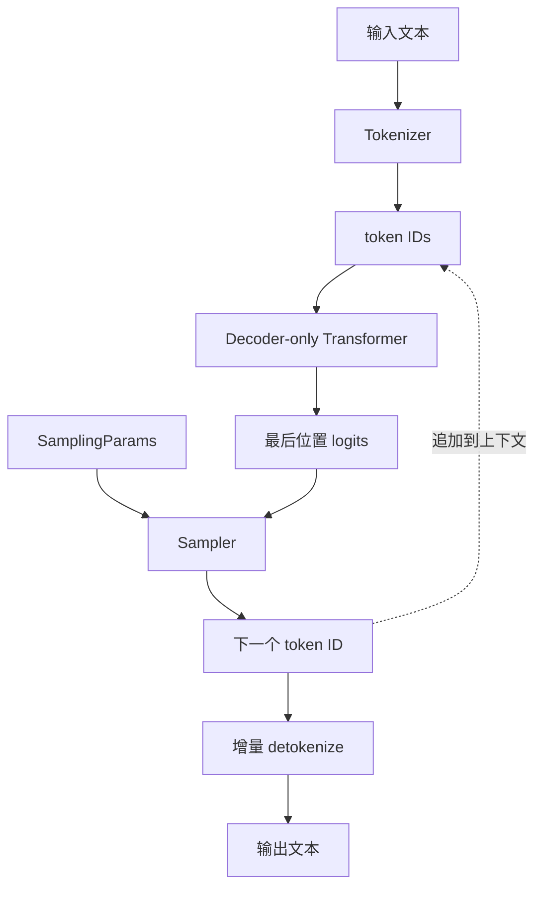

> **读图方法：** 阅读“全局位置”这张流程图时，先把方框看成对象或状态，把箭头看成数据或控制的移动。第一遍从上向下建立顺序，第二遍再核对分支发生的条件。

这张图有两个重要边界：

- **模型边界：** 输入 token IDs 和位置，输出 hidden states 或 logits。
- **系统边界：** 多个请求何时进入模型、每次放多少 token、KV 放在哪里，不由
  Transformer 数学本身决定，而是 vLLM 后续章节的核心。

### 本章阅读路线

本章按“对象 -> 单层计算 -> 时间维度 -> 系统实现”的顺序推进：

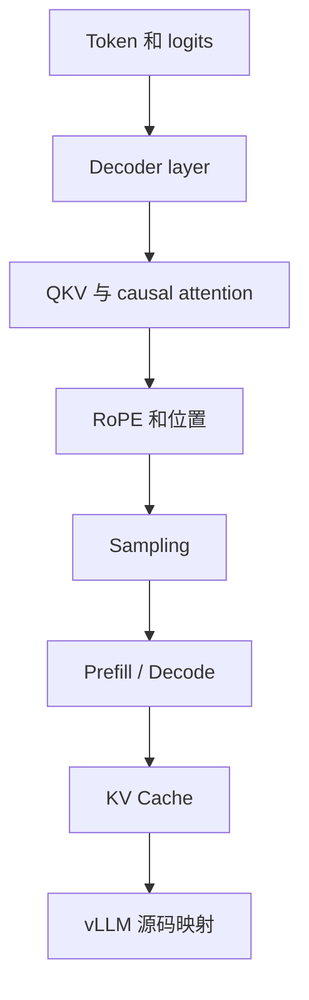

> **读图方法：** 这张图用于压缩“本章阅读路线”的整体关系。先从上向下找到起点、关键转换和终点，再问每条跨层箭头是否意味着函数调用、消息传递、内存访问或状态更新。

第一次阅读时，先抓住每节开头的图和结论；第二次再手算数值例子并运行代码；第三次
进入第 1.9 节，逐跳对照 vLLM 源码。不要一开始就在 CUDA kernel 中寻找完整的
Transformer 结构，kernel 通常只实现其中一个局部算子。

## 如何阅读本章

你可以把这一章当作“使用过 LLM 之后的原理补课”。我们默认你知道 prompt、token、
temperature 和上下文长度这些产品概念，但不要求你学过深度学习课程。第一次阅读只需
回答三个问题：数据长什么样、一次 forward 做什么、为什么生成必须重复 forward。

遇到向量和矩阵公式时，先看 shape，不要先做代数推导。例如 `[T, D] -> [T, V]`
首先表示“每个待计算 token 的隐藏向量被变成一组词表分数”。公式中的求和、softmax
和旋转随后只是解释这些 shape 内部怎样计算。书中的小数字例子用于建立直觉，不要求
你手算真实模型的 4096 维向量。

本章可以使用一条贯穿始终的类比：token ID 是字典编号，embedding 是查到的工作向量，
attention 是按相关性翻阅历史笔记，KV Cache 是保存已经整理好的历史笔记，sampler
则根据模型给出的候选分数做最后选择。类比只帮助入门，进入源码时仍以张量、位置和
缓存所有权为准。

**先补两个读图工具。** Tensor（张量）可以先当作多维数组，shape 是各维的长度；
`[3,4]` 就是 3 行、每行 4 个数。forward 是一次从输入算到输出的前向计算，不包含训练。
prompt 是用户交给模型的已有文本；上下文是预测时允许参考的 token 序列。

**第一遍走法：** 先读 1.1、1.3 的手算例子、1.5–1.8，再读 1.2 和 1.4 补齐模型结构，
最后进入 1.9 的源码；TP/PP 和两代 Runner 先只认职责，留到第 07、09 章。
**停下来算：** prompt 有 4 个 token，刚采样出第一个输出时，缓存有几个位置？
答案是 4：新 token 的 KV 要等下一次 forward 才生成。

## 1.1 语言模型到底输出什么

> **本节先看：** 本节要回答：**语言模型到底输出什么**。下面的小节会逐层拆开概念、运行过程和源码落点；第一次阅读先抓对象之间的关系，第二次再记类名、字段和分支。

### 文本不会直接进入神经网络

神经网络只能处理数值。Tokenizer 先把字符串转换成 token ID 序列。例如下面只是
示意，不代表任何真实 tokenizer：

```text
"我喜欢读源码"
    ↓ tokenizer
[101, 4287, 2301, 992, 7612]
```

Token 不等于“单词”。同一段中文可能按字、词片段、字节或特殊组合切分；空格、
标点和前缀空格也可能属于 token 的一部分。因而：

- 字符数不能直接当作 token 数。
- 同样长度的中英文字符串可能产生不同数量的 token。
- 模型最大上下文和计费通常按 token，而不是按字符。

### Token ID 如何变成向量

模型有一张 embedding 表：

```text
embedding_table.shape = [vocab_size, hidden_size]
```

token ID 是这张表的行号。若 `vocab_size=32,000`、`hidden_size=4,096`，那么一个
token ID 会被查成一个长度为 4,096 的向量。这个向量不是人工定义的词义，而是训练
得到的数值表示。

### Logits 为什么不是概率

经过所有 decoder layers 后，模型把 hidden state 投影回词表维度：

```text
hidden state: [hidden_size]
       ↓ lm_head
logits:       [vocab_size]
```

每个 logit 对应一个候选 token。logit 越大，候选通常越有可能被选择，但 logit 本身
可以为负，也不要求总和为 1。概率需要经过 softmax：

```math
p_i = \frac{e^{z_i}}{\sum_j e^{z_j}}
```

这里的 `z` 是形状 `[V]` 的分数向量，`V` 是词表大小；`z_i` 是候选 `i` 的分数，
`e` 是自然指数的底数，分母把所有候选的指数分数相加。`p_i` 是无单位概率，所有
`p_i` 相加为 1。例如两个候选分数相同，就各分到 1/2 的概率。实际高性能 sampler 不一定显式构造完整
softmax；数学上的概率定义与实现是否物化整张概率表是两回事。

## 1.2 Decoder-only Transformer 的最小结构

Decoder-only 模型由多层相同结构堆叠而成。以当前 revision 的 Llama 路径为例，
`LlamaModel` 持有 embedding、若干 `LlamaDecoderLayer` 和最终 RMSNorm；
`LlamaForCausalLM` 再增加 `lm_head` 与 `LogitsProcessor`。

### 单层数据流

> **本节先看：** 这一小节先用图建立“单层数据流”的整体路径。先找输入、关键状态和输出，再阅读图后的源码解释，不必一开始记住全部节点。

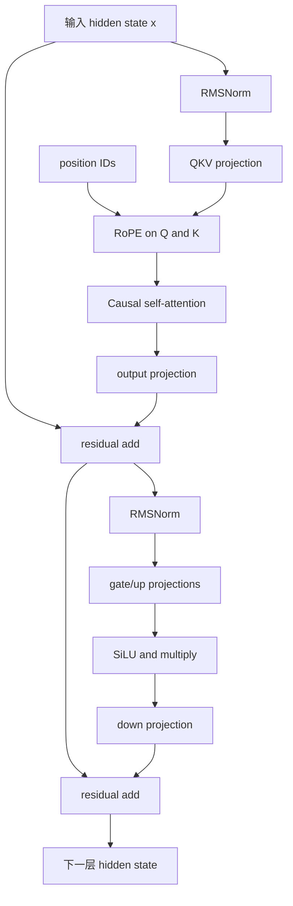

> **读图方法：** 这是“单层数据流”的流程图。先从上向下只追一条主路径，确认输入经过哪些关键阶段到达输出；第二遍再看虚线、回边和旁路，它们通常表示反馈、复用或可选分支。

图中每个模块解决的问题不同：

- **Attention：** 在 token 位置之间交换信息。
- **MLP：** 对每个 token 的向量做非线性变换，不直接混合不同位置。
- **Residual：** 保留原输入并让深层网络更容易传递信息。
- **RMSNorm：** 控制数值尺度。它规范化的是向量，不是把值变成概率。

当前 Llama 实现使用 pre-norm 风格。`LlamaDecoderLayer.forward` 先对输入做
`input_layernorm`，执行 self-attention，再经过 `post_attention_layernorm` 和 MLP。
vLLM 的 RMSNorm 接口能够把 residual 融合进调用，因此源码中的写法和教学图不一定
逐行相同，但数据依赖一致。

### MLP 不是一个普通的两层 ReLU

当前 `LlamaMLP` 使用 gate/up 两个投影与 SiLU 门控，概念上可写成：

```math
MLP(x) = W_{down}(SiLU(W_{gate}x) \odot W_{up}x)
```

`x` 是一个 token 的列向量，shape 为 `[D]`；`D` 是 hidden size。设 MLP 中间宽度为
`I`，则 `W_gate`、`W_up` 的 shape 为 `[I,D]`，`W_down` 为 `[D,I]`。两个投影先把
`[D]` 变成 `[I]`，`⊙` 把对应位置相乘，最后投影回 `[D]`，便于与输入相加。
SiLU 是平滑的非线性函数 `u/(1+exp(-u))`，可理解为按输入大小调节通过量的门。
本式用列向量；下一节为了展示多 token batch，改用每行一个 token 的矩阵表示。源码中 `gate_proj` 与 `up_proj` 被合并为
`MergedColumnParallelLinear`，这是执行优化和 Tensor Parallel 布局，不改变上述
数学角色。

## 1.3 Self-Attention 与张量形状

> **本节先看：** 本节要回答：**Self-Attention 与张量形状**。下面的小节会逐层拆开概念、运行过程和源码落点；第一次阅读先抓对象之间的关系，第二次再记类名、字段和分支。

### 先区分教学形状与 vLLM 形状

教程通常使用带 batch 和 sequence 维度的形状：

```text
X: [B, S, D]
```

- `B`：batch size。
- `S`：序列长度。
- `D`：hidden size。

vLLM 为了把不同长度请求放进同一个 step，常把本轮实际计算的 token 打包成一个
扁平维度：

```text
X: [T, D]
```

`T` 是本 step 所有被调度 token 的总数。每个请求的边界、长度和 KV 位置由
attention metadata 与 block table 描述。看到 `[T,D]` 不代表 sequence 维度消失，
而是它从规则 tensor 维度转移到了元数据。

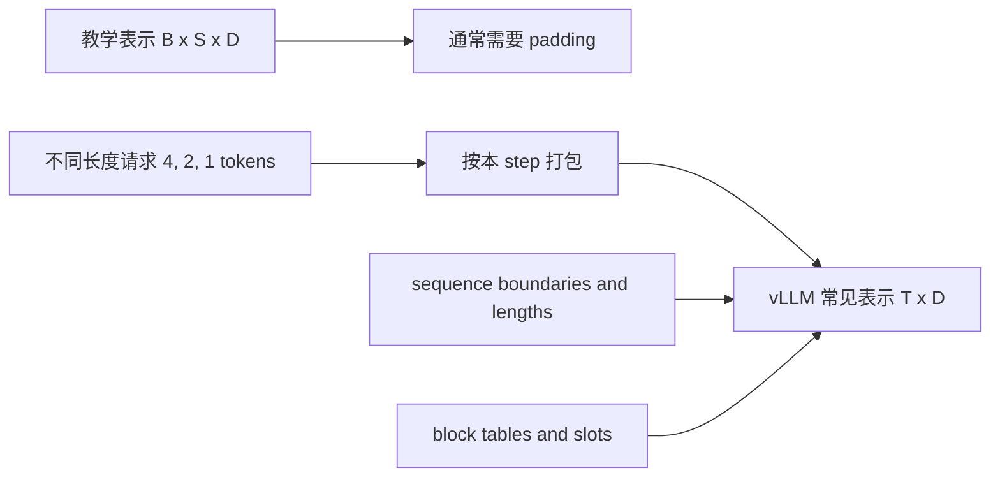

> **读图方法：** 阅读“先区分教学形状与 vLLM 形状”这张流程图时，先把方框看成对象或状态，把箭头看成数据或控制的移动。第一遍从左向右建立顺序，第二遍再核对分支发生的条件。

### Q、K、V 是什么

对每个 token 的 hidden state 做三个线性投影：

```math
Q = XW_Q, \quad K = XW_K, \quad V = XW_V
```

可以把它们理解为：

- **Query：** 当前 token 想找什么信息。
- **Key：** 当前 token 提供什么可匹配的索引特征。
- **Value：** 匹配后真正被聚合的内容。

单个 head 的 attention 为：

```math
Attention(Q,K,V) = softmax(\frac{QK^T}{\sqrt{D_h}} + M)V
```

先取单 head、无 batch 的例子：若本轮有 `Nq` 个 Query、可读取 `Nk` 个历史及当前
位置，则 `Q:[Nq,D_h]`、`K:[Nk,D_h]`、`V:[Nk,D_v]`。上标 `T` 表示转置，
所以 `QK^T` 是 `[Nq,Nk]` 的相关性表；softmax 对每一行归一化，乘 `V` 后得到
`[Nq,D_v]`。`D_h`、`D_v` 分别是每个 Key/Query 和 Value 向量的长度。`M` 与分数表
同形状，允许位置填 0，屏蔽位置填负无穷；这些分数和权重没有时间或字节单位。除以 `sqrt(D_h)` 是为了避免点积随维度增大
而过度放大，导致 softmax 过于尖锐。

### 一个可以手算的 Attention

假设当前位置是序列中的第 3 个 token，因此它能看到三个 Key。为了能手算，把 head
size 缩小为 2：

```text
Q  = [1.0, 0.5]
K0 = [1.0, 0.0]    V0 = [1.0, 0.0]
K1 = [0.0, 1.0]    V1 = [0.0, 2.0]
K2 = [1.0, 1.0]    V2 = [2.0, 1.0]
```

第一步，计算缩放点积：

| Key | 原始点积 `Q·K` | 除以 `sqrt(2)` 后的 score |
|---|---:|---:|
| K0 | 1.0 | 0.7071 |
| K1 | 0.5 | 0.3536 |
| K2 | 1.5 | 1.0607 |

第二步，对 scores 做 softmax：

```text
attention weights = [0.3199, 0.2246, 0.4555]
```

第三步，用权重聚合 Value：

```math
output = 0.3199V_0 + 0.2246V_1 + 0.4555V_2
       = [1.2309, 0.9047]
```

这组数字可以通过 `examples/ch01_numerical_walkthrough.py` 复现。这里最容易混淆的
一点是：**Query/Key 决定权重，Value 决定被混合的内容。** Key 本身不会直接按权重
相加成为 attention 输出。

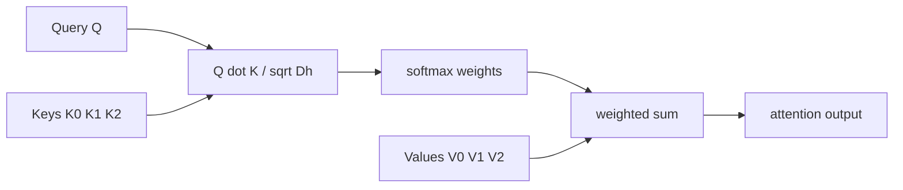

> **读图方法：** 这张图用于压缩“一个可以手算的 Attention”的整体关系。先从左向右找到起点、关键转换和终点，再问每条跨层箭头是否意味着函数调用、消息传递、内存访问或状态更新。

### Multi-Head 与 GQA

真实模型会把 hidden 维拆成多个 heads：

| Tensor | 教学形状 | vLLM attention 层内部常见形状 |
|---|---|---|
| Query | `[B,S,Hq,Dh]` | `[T,Hq,Dh]` |
| Key | `[B,S,Hkv,Dh]` | `[T,Hkv,Dh]` |
| Value | `[B,S,Hkv,Dh]` | `[T,Hkv,Dv]` |
| Output | `[B,S,Hq,Dv]` | `[T,Hq*Dv]` |

普通 Multi-Head Attention 中 `Hq = Hkv`。Grouped-Query Attention（GQA）让多组
query heads 共享较少的 KV heads，即 `Hkv < Hq`。这样可以显著减少 KV Cache，
也是容量公式必须使用 `num_key_value_heads` 而不是盲目使用
`num_attention_heads` 的原因。

当前 `LlamaAttention.forward` 的顺序非常清晰：

```text
hidden_states
  -> qkv_proj
  -> split(q_size, kv_size, kv_size)
  -> rotary_emb(positions, q, k)
  -> Attention(q, k, v)
  -> o_proj
```

而 `Attention.forward` 会把扁平 Q/K/V reshape 成 head 维度，再交给实际 attention
backend。PagedAttention 和 backend 选择将在第 06 章展开。

## 1.4 Causal Mask 与 RoPE

> **本节先看：** 本节要回答：**Causal Mask 与 RoPE**。下面的小节会逐层拆开概念、运行过程和源码落点；第一次阅读先抓对象之间的关系，第二次再记类名、字段和分支。

### 为什么不能读取未来

自回归模型在位置 `i` 预测下一个 token 时，只允许读取位置 `0..i`。长度为 4 的
causal attention 可见关系如下：

| Query 位置 | K0 | K1 | K2 | K3 |
|---:|:---:|:---:|:---:|:---:|
| Q0 | 可见 | 屏蔽 | 屏蔽 | 屏蔽 |
| Q1 | 可见 | 可见 | 屏蔽 | 屏蔽 |
| Q2 | 可见 | 可见 | 可见 | 屏蔽 |
| Q3 | 可见 | 可见 | 可见 | 可见 |

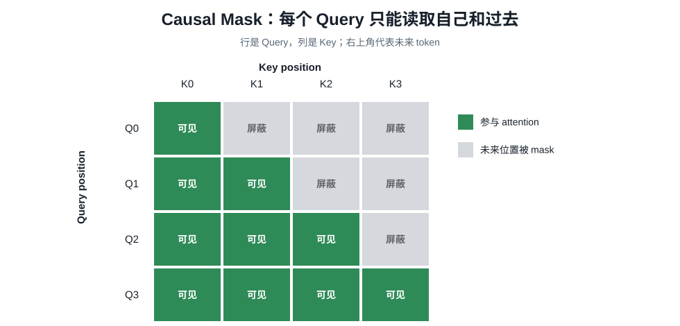

训练或 prefill 时可以一次计算所有位置，但上三角的未来位置会被 mask 成极小值，
softmax 后概率近似为 0。并行计算所有位置不等于允许看到未来。

从矩阵还能直接看出计算量增长：第 0 行读取 1 个 Key，第 1 行读取 2 个，依次到第
`S-1` 行读取 `S` 个，总数为 `1+2+...+S=S(S+1)/2`。这就是 causal prefill 中
attention score 数量呈二次增长的来源。

### 只有 token 含义还不够

如果没有位置信息，“我喜欢源码”和“源码喜欢我”包含相同 token 集合，attention
难以区分顺序。Llama 使用 RoPE，把位置编码作用在 Query 和 Key 上，而不是简单加到
Value 上。

对向量中的一对维度 `(x_0, x_1)`，RoPE 可直观理解为按位置旋转：

```math
\begin{bmatrix}x'_0\\x'_1\end{bmatrix} =
\begin{bmatrix}\cos\theta & -\sin\theta\\\sin\theta & \cos\theta\end{bmatrix}
\begin{bmatrix}x_0\\x_1\end{bmatrix}
```

不同维度对使用不同频率，`theta` 随 position 变化。旋转后的 Q/K 点积包含相对位置
关系。当前 Llama 路径中，`qkv_proj` 和 split 之后立即执行
`self.rotary_emb(positions, q, k)`，然后才进入 attention。

## 1.5 从 Logits 到下一个 Token

> **本节先看：** 本节要回答：**从 Logits 到下一个 Token**。下面的小节会逐层拆开概念、运行过程和源码落点；第一次阅读先抓对象之间的关系，第二次再记类名、字段和分支。

### Greedy 与随机采样

最简单的方法是 greedy：选择最大 logit 的 token。

```math
token = argmax(logits)
```

给定完全相同的 logits 和并列值处理规则，它总会选择同一项；但不同硬件或 batch
引起的浮点误差仍可能改变非常接近的分数，所以 `temperature=0` 不是跨环境逐字复现
的保证。随机采样则按处理后的概率分布选择。

### Temperature

Temperature 在 softmax 前缩放 logits：

```math
p_i(T) = softmax(z_i / T)
```

这里的 `T` 是无单位温度参数，与前面表示 token 数的 `T` 含义不同；本公式只适用于
`T > 0`，输入和输出都是长度为词表大小的向量。

- `0 < T < 1`：差距被放大，分布更尖锐。
- `T > 1`：差距被压平，选择更多样。
- 在 vLLM `SamplingParams` 中，`temperature=0` 表示 greedy。

固定 logits `[4,2,1,0]`，只改变 temperature：

| Token | Logit | `T=0.5` | `T=1.0` | `T=2.0` |
|---|---:|---:|---:|---:|
| A | 4 | 97.93% | 83.10% | 57.93% |
| B | 2 | 1.79% | 11.25% | 21.31% |
| C | 1 | 0.24% | 4.14% | 12.93% |
| D | 0 | 0.03% | 1.52% | 7.84% |

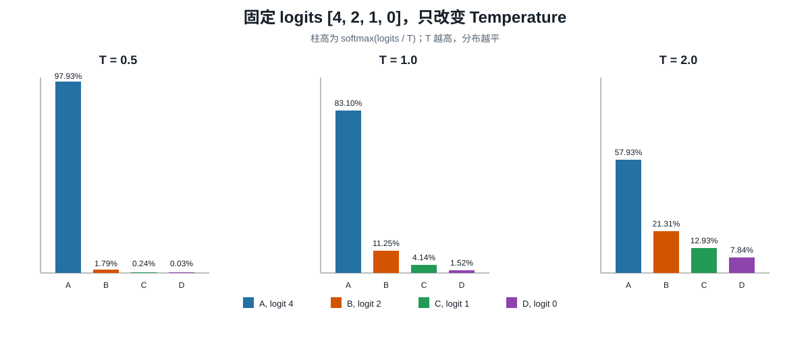

Temperature 不会改变 logit 的大小顺序，所以单纯改变 temperature 不会改变 greedy
的 argmax；它改变的是随机采样时各候选被选中的相对概率。

### Top-k 与 Top-p

> **本节先看：** 下面先给出“Top-k 与 Top-p”的结论清单。先理解每一项为什么存在，再记参数名或实现细节。

- **Top-k：** 只保留 logit 最大的 `k` 个候选。
- **Top-p：** 按概率从高到低保留，直到累计概率达到 `p`。

仍使用 `T=1` 的概率：

```text
A: 0.8310
B: 0.1125    cumulative A+B = 0.9435
C: 0.0414
D: 0.0152
```

- `top_k=2` 保留 A、B，再把二者概率重新归一化为约 88.08% 和 11.92%。
- `top_p=0.9` 先保留 A，但累计概率只有 83.10%；加入 B 后达到 94.35%，因此也保留
  A、B。
- 当 `T=2` 时，A+B 只有 79.24%，`top_p=0.9` 还需要加入 C。这说明 temperature
  会间接改变 nucleus 的候选数量。

Top-k 与 top-p 最终都通过 mask 排除候选，并对保留项重新归一化。两者同时开启时，
不能把“先截断并归一化，再用新概率计算另一个阈值”的教学捷径当成所有实现的精确
语义；应查看固定 revision 的 `apply_top_k_top_p` 及其等价性测试。

### Penalty、Bias 与约束

生产请求通常不只有 temperature、top-k 和 top-p：

| 参数或约束 | 作用对象 | 直觉 |
|---|---|---|
| presence penalty | 是否出现过 | 出现过一次就调整，鼓励或抑制重复主题 |
| frequency penalty | 出现次数 | 出现越多，调整越多 |
| repetition penalty | prompt 与输出中的已有 token | 按 logit 符号和倍率改变重复倾向 |
| logit bias | 指定 token IDs | 人工提高或降低候选分数 |
| allowed token IDs | 候选集合 | 只允许白名单 token |
| bad words | token 序列 | 防止生成能够完成禁用序列的最后 token |
| structured output mask | 语法允许集合 | 只保留当前语法状态允许的 token |

这些操作不是纯粹的“语言模型概率”。它们在模型给出 logits 后改变可选集合或分数，
因此同一模型、同一上下文可以因请求参数不同而输出不同 token。

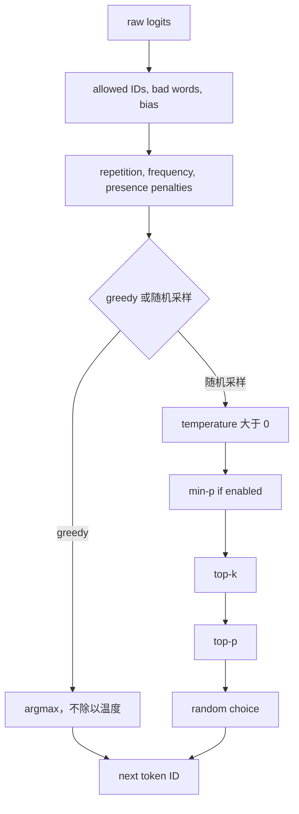

> **读图方法：** 这是“Penalty、Bias 与约束”的流程图。先从上向下只追一条主路径，确认输入经过哪些关键阶段到达输出；第二遍再看虚线、回边和旁路，它们通常表示反馈、复用或可选分支。

这张图只展示 MRV1 的基础采样依赖，省略 logprobs 和批内混合 greedy/random 请求的
合并操作。greedy 在影响 argmax 的约束和 penalty 之后取最大值，绕过温度缩放与随机
过滤；不要把图当作 MRV2 的逐函数顺序。固定 revision 下：

- MRV1 `vllm/v1/sample/sampler.py::Sampler.forward`、`sample` 和
  `apply_logits_processors` 实际执行上述分支，类注释可辅助阅读。
- MRV2 把 sampling state、penalty、bad words、logprob 等拆到
  `vllm/v1/worker/gpu/sample/`，并大量使用 Triton 实现。其 `Sampler.apply_sampling_params`
  实际按 bias → penalties → bad words → thinking budget → temperature → min-p 处理，
  随后在采样路径应用 top-k/top-p；不能把 MRV1 的顺序原样套过去。
- MRV2 可以使用 Gumbel sampling 等方法避免简单地“先物化完整 softmax 再抽样”。

因此源码阅读时要区分三层：参数语义、数学等价形式、实际 kernel 实现。

## 1.6 Prefill 与 Decode

假设 prompt 有 4 个 token：

```text
[我] [喜欢] [读] [源码]
```

### Prefill

Prefill 处理尚未计算的 prompt token。先看不分块、无前缀命中的简化情况：一次提交
全部 prompt token。每个位置通过 causal mask 读取自己和之前的位置，生成
所有层的初始 K/V。通常只需要最后一个有效位置的 logits 来选择首个输出 token；若
请求 prompt logprobs，则还可能保留其他位置的 logits 结果。

### Decode

首个输出 token 被追加后，下一轮只需要为这个新 token 计算新的 Q/K/V。它的 Query
读取历史 KV Cache，得到下一个 logits。之后不断重复。

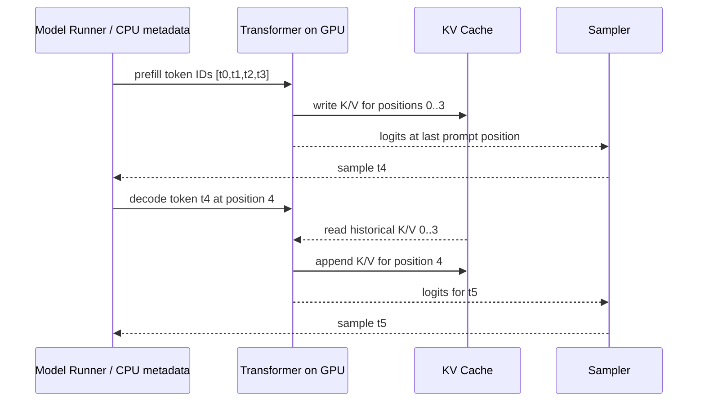

> **读图方法：** 这是“Decode”的时序图。先从左到右确认参与者分别负责什么，再从上到下追踪消息；第一遍只看正常路径，第二遍再看返回、异步消息和失败分支。

### 两类工作负载为什么不同

> **本节先看：** 下面先用表格整理“两类工作负载为什么不同”。先横向比较每一列解决的问题和适用边界，再把具体名称映射到源码。

| 对比项 | Prefill | Decode |
|---|---|---|
| 本轮新 token 数 | 通常较多 | 普通生成通常每请求 1 个 |
| 历史 KV | 起始时没有或部分命中 | 通常已有完整历史 |
| 主要并行维度 | 本层内的 prompt token、head、矩阵元素 | 请求数、head、历史长度 |
| 常见瓶颈直觉 | 大矩阵计算更突出 | 内存读取和 launch overhead 更突出 |
| 输出 | 建立 KV，产生首个采样位置 | 追加 KV，产生后续采样位置 |

同一请求的 decoder layers 依赖上一层输出，不能同时独立计算。第 09 章的流水线并行
是让不同批次占据不同层段，不会消除这个依赖。

[源码] `vllm/model_executor/models/llama.py` - `LlamaModel.forward` 的逐层循环

### 用三个请求理解扁平 Token Batch

假设一个调度 step 中有三个请求：

| 请求 | 已有上下文长度 | 本 step 新计算 token | 类型 |
|---|---:|---:|---|
| R0 | 0 | 4 | 新 prompt 的 prefill chunk |
| R1 | 37 | 1 | 普通 decode |
| R2 | 100 | 2 | 被切分的 prefill 或多 token 路径 |

教学框架可能构造 `[B=3,S=4,D]` 并为 R1、R2 padding。vLLM 更接近把实际工作打包：

```text
input_ids: [r0t0, r0t1, r0t2, r0t3, r1t37, r2t100, r2t101]
T = 4 + 1 + 2 = 7
hidden_states.shape = [7, D]
```

仅凭这 7 个 token 无法恢复请求边界，因此还必须有：

- 每个请求本 step 的 token 数。
- query start locations，例如 `[0,4,5,7]`。
- 每个请求的完整 sequence length，例如 `[4,38,102]`。
- 当前 token 写入 KV Cache 的 slot mapping。
- 每个请求读取历史 KV 的 block table。

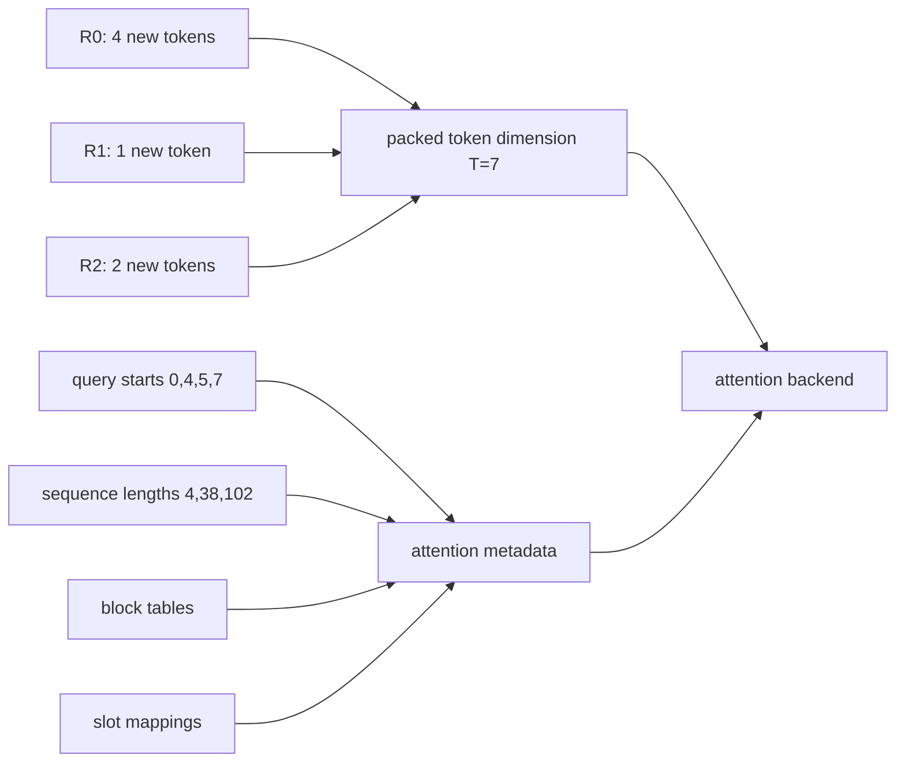

> **读图方法：** 这张图用于压缩“用三个请求理解扁平 Token Batch”的整体关系。先从左向右找到起点、关键转换和终点，再问每条跨层箭头是否意味着函数调用、消息传递、内存访问或状态更新。

这正是 vLLM 源码比普通 Transformer 教程复杂的原因：数学公式往往只写一个规则
矩阵，而推理系统必须描述每个 token 属于谁、能读哪些历史、写到哪里。

### 一个请求的状态账本

对普通自回归请求，可以用下面的账本理解状态增长：

| 时刻 | token IDs | 本轮 Query | KV Cache 中的位置 | 用于采样的 logits |
|---|---|---|---|---|
| prefill 前 | `[t0,t1,t2,t3]` | 无 | 空 | 无 |
| prefill 后 | `[t0,t1,t2,t3]` | `t0..t3` | `K/V 0..3` | position 3 |
| sample 后 | `[t0..t3,t4]` | 尚未计算 t4 | 仍为 `0..3` | 已消费 position 3 |
| decode t4 后 | `[t0..t4]` | `t4` | `K/V 0..4` | position 4 |
| sample 后 | `[t0..t5]` | 尚未计算 t5 | 仍为 `0..4` | 已消费 position 4 |

“token 已经被采样”与“这个 token 的 K/V 已经写入缓存”不是同一时刻。新 token 先由
上一位置 logits 选出，下一次 model forward 才为它计算 hidden state 与 K/V。阅读
Scheduler 和 Model Runner 时，这个一拍的差异非常重要。

“decode 每次只有一个 token”是普通自回归生成的基础直觉，但 speculative decoding、
multi-token prediction 等机制可以让一个请求在 step 中处理多个 token。第 04、07 章
会说明 vLLM 为什么以“本 step 调度多少 token”而不是僵硬的二阶段状态机建模。

## 1.7 KV Cache 为什么有效

> **本节先看：** 本节要回答：**KV Cache 为什么有效**。下面的小节会逐层拆开概念、运行过程和源码落点；第一次阅读先抓对象之间的关系，第二次再记类名、字段和分支。

### 没有缓存会重复什么

生成新 token 后，如果把整个增长后的序列重新送入模型，历史 token 在每一层的 K/V
都会被重复计算。序列越长，浪费越大。

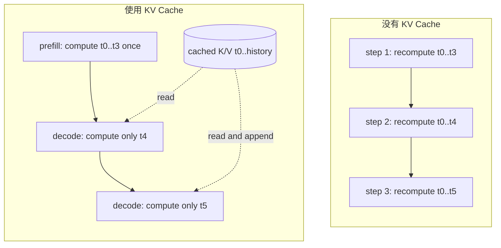

> **读图方法：** 这是“没有缓存会重复什么”的流程图。先从上向下只追一条主路径，确认输入经过哪些关键阶段到达输出；第二遍再看虚线、回边和旁路，它们通常表示反馈、复用或可选分支。

缓存后，历史 K/V 不需要重新投影，但新 Query 仍要与历史 Keys 做 attention，并读取
历史 Values。因此 KV Cache 消除了重复投影和历史层计算，却没有让 decode 成为常数
时间；单个新 token 的 attention 工作仍随上下文长度增长。

### 计算量直觉

只数 causal attention 中的 QK 点积：长度 `S` 的完整序列约需要
`S(S+1)/2` 次。带缓存的一个 decode token 只新增约 `S` 次点积。

本章最小实验使用 `P=128` 的 prompt 生成 `G=32` 个 token，得到：

```text
完整重算 QK 次数: 333136
缓存路径 QK 次数: 12720
```

这里的数字只统计教学模型中的 QK score，不包含 QKV projection、MLP、kernel launch、
显存访问和 batch 效率，不能当作 26 倍端到端加速结论。

### KV Cache 容量公式

更一般地，一个 token 的基础 KV 字节数可估算为：

```math
bytes/token = L \times (H_kD_k + H_vD_v) \times bytes(dtype)
```

- `L`：attention layers 数量。
- `H_k,D_k`：Key 的 head 数和 head size。
- `H_v,D_v`：Value 的 head 数和 head size。

普通 Llama 类 attention 中 Key/Value 通常拥有相同的 head 数和 head size，于是简化为：

```math
bytes/token = 2 \times L \times H_{kv} \times D_h \times bytes(dtype)
```

当前通用 `Attention` 接口已经允许 `head_size_v` 与 `head_size` 不同，因此更一般的
公式不是纯理论洁癖；阅读 MLA 或其他变体时不能继续机械套用前面的 `2×` 简式。

例：32 层、32 个 KV heads、head size 128、FP16/BF16（2 bytes）：

```text
2 * 32 * 32 * 128 * 2 = 524288 bytes/token = 512 KiB/token
2048 tokens ≈ 1 GiB
```

若同样模型采用 8 个 KV heads 的 GQA：

```text
2 * 32 * 8 * 128 * 2 = 131072 bytes/token = 128 KiB/token
2048 tokens ≈ 256 MiB
```

把同一公式扩展到并发请求：

```math
total\ bytes \approx bytes/token \times \sum_r cached\_tokens_r
```

例如 8 个请求平均各缓存 2,048 token，在前述 8 KV heads 配置下，仅基础 K/V 数值就
约为 `8 × 256 MiB = 2 GiB`。如果请求继续生成，缓存还会逐 token 增长。

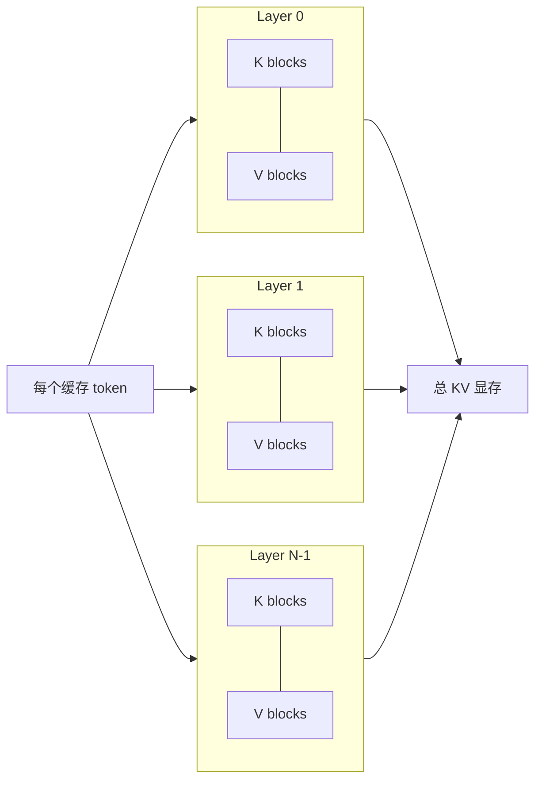

> **读图方法：** 阅读“KV Cache 容量公式”这张流程图时，先把方框看成对象或状态，把箭头看成数据或控制的移动。第一遍从左向右建立顺序，第二遍再核对分支发生的条件。

这解释了为什么并发请求和长上下文会迅速消耗显存。实际 vLLM 容量还受 block 对齐、
pipeline/tensor parallel、KV dtype、滑动窗口、MLA、Mamba、prefix sharing 和运行时
预留显存影响，第 05 章会建立完整模型。

### 公式还没有包含什么

> **本节先看：** 下面先给出“公式还没有包含什么”的结论清单。先理解每一项为什么存在，再记参数名或实现细节。

- **Block 对齐：** 最后一个 block 可能只使用部分 token slots。
- **Tensor Parallel：** KV heads 可能分片，也可能在 KV head 少于 TP size 时复制，
  不能始终简单除以 TP size。
- **量化元数据：** FP8 等格式可能需要额外 scale。
- **混合 KV：** sliding-window、Mamba state、MLA 等不一定使用相同公式。
- **Prefix sharing：** 两个请求共享物理 blocks 时，逻辑 token 总数不等于实际占用。
- **运行时预留：** CUDA Graph、activation、workspace 和通信 buffer 也会占显存。

因此本节公式用于建立数量级直觉；第 05 章会从 `KVCacheSpec` 和实际配置反推物理
block 数，而不是只用一个理论公式决定可用容量。

### KV Cache 缓存的不是输出文本

KV Cache 是每层 attention 的中间张量，不是 token 文本、完整 hidden state 或最终
logits。它依赖模型权重、位置、token 前缀和具体层结构，不能随意跨模型复用。

## 1.8 可运行的最小推理器

本章提供一个只依赖 Python 标准库的教学实现：

- [最小推理器](../../examples/ch01_minimal_inference.py)
- [数值推导脚本](../../examples/ch01_numerical_walkthrough.py)
- [一致性测试](../../tests/test_ch01_minimal_inference.py)
- [数值推导测试](../../tests/test_ch01_numerical_walkthrough.py)
- [完整实验记录](../../experiments/ch01-minimal-inference.md)

它包含一层 decoder、一个 attention head、RMSNorm、RoPE 风格旋转、门控 MLP、
causal attention、KV Cache 和 temperature/top-k/top-p sampling。权重由固定随机种子
生成，因此输出没有语言意义；实验验证的是计算结构，不是模型质量。

### 关键接口

> **本节先看：** 下面的代码或调用链只保留“关键接口”的主干。阅读时依次寻找输入、状态变化和输出，暂时忽略辅助分支。

```python
full_logits = model.forward_full(token_ids)
prefill_logits, cache = model.prefill(token_ids)
next_logits = model.decode_one(next_token_id, cache)
```

- `forward_full`：不复用缓存，完整重算序列。
- `prefill`：一次构造 prompt K/V。
- `decode_one`：只追加新 token 的 K/V，并读取全部历史缓存。

### 代码如何对应 Transformer

`ToyDecoder` 有意保留真实结构的所有关键边，同时删除并行和硬件细节：

| 教学代码 | 对应概念 | 真实 vLLM 中的扩展 |
|---|---|---|
| `embeddings[token_id]` | token embedding lookup | vocab parallel embedding、PP first rank |
| `_qkv` | RMSNorm、QKV projection、RoPE | fused QKV、多个 heads、TP shard、custom RoPE op |
| `_finish_layer` 前半 | attention score、softmax、Value 聚合 | backend metadata、KV blocks、Flash/Triton/CUDA kernel |
| `_finish_layer` 后半 | output projection、residual、gated MLP | fused activation、quantization、TP collective |
| `_logits` | LM head | vocab parallel projection、gather 或 local logits |
| `prefill` | prompt forward 和初始缓存 | packed tokens、chunked prefill、prefix cache |
| `decode_one` | 单 token cached decode | continuous batching、多请求、speculative tokens |
| `sample_logits` | temperature/top-k/top-p | per-request states、penalties、Triton/Gumbel/FlashInfer |

最重要的等价性断言是：

```python
token_ids = prompt_ids + [next_token_id]
_, cache = model.prefill(prompt_ids)
recomputed = model.forward_full(token_ids)[-1]
cached = model.decode_one(next_token_id, cache)
assert max_abs_diff(cached, recomputed) < 1e-12
```

缓存优化若改变了对应位置的数学结果，就是正确性错误，而不是允许的性能取舍。真实
低精度 kernel 可能有浮点容差，但仍需和参考实现比较，而不是只看生成文本“似乎差不多”。

### 逐步阅读 `prefill`

> **本节先看：** 下面先给出“逐步阅读 `prefill`”的结论清单。先理解每一项为什么存在，再记参数名或实现细节。

1. 每个 token 经过 `_qkv`，得到带位置的 Query/Key 和 Value。
2. 所有 Key/Value 保存到 cache；它们将在未来 decode 中重复读取。
3. 第 `i` 个 Query 只读取 `keys[:i+1]`，这就是 causal mask 的列表实现。
4. 每个位置完成 output projection、residual 和 MLP。
5. 最后 hidden state 通过 tied embedding 得到 logits。

### 逐步阅读 `decode_one`

> **本节先看：** 下面先给出“逐步阅读 `decode_one`”的结论清单。先理解每一项为什么存在，再记参数名或实现细节。

1. `position=len(keys)`，因此新 token 的位置紧跟缓存末尾。
2. 只计算新 token 的 Query/Key/Value。
3. 把新 Key/Value 追加到 cache。
4. 新 Query 读取包括自己在内的全部 cached keys/values。
5. 返回新位置 logits，供下一轮 sampling 使用。

这个实现把 cache 写成 Python lists。vLLM 的关键差异不是“是否缓存”，而是如何在固定
显存池中分页管理这些 K/V，并为动态 batch 构造可被 kernel 消费的地址映射。

### 运行命令

> **本节先看：** 下面的代码或调用链只保留“运行命令”的主干。阅读时依次寻找输入、状态变化和输出，暂时忽略辅助分支。

```bash
python3 examples/ch01_minimal_inference.py
python3 -m unittest tests/test_ch01_minimal_inference.py
python3 examples/ch01_numerical_walkthrough.py
python3 -m unittest tests/test_ch01_numerical_walkthrough.py
```

### 2026-09-07 实际观察

> **本节先看：** 下面的代码或调用链只保留“2026-09-07 实际观察”的主干。阅读时依次寻找输入、状态变化和输出，暂时忽略辅助分支。

```text
prompt: <bos> 我 喜欢 读
prefill cache entries per layer: 4
decode step 1: max cached/full diff=0.00e+00, sampled=5:学习
decode step 2: max cached/full diff=0.00e+00, sampled=5:学习
decode step 3: max cached/full diff=0.00e+00, sampled=6:。
QK score count example (P=128, G=32): no-cache=333136, cached=12720
```

缓存路径与完整重算在三个 decode step 上得到相同 logits，最大绝对误差为 0。测试还
覆盖 prefill 全位置一致性、连续 decode 一致性、temperature=0 greedy 和 top-k=1。

数值推导脚本同时复现了正文使用的 temperature 与 attention 表：

```text
T=0.5: [0.9793, 0.0179, 0.0024, 0.0003]
T=1.0: [0.8310, 0.1125, 0.0414, 0.0152]
T=2.0: [0.5793, 0.2131, 0.1293, 0.0784]
attention scores: [0.7071, 0.3536, 1.0607]
attention probabilities: [0.3199, 0.2246, 0.4555]
attention output: [1.2309, 0.9047]
```

### 实验限制

> **本节先看：** 下面先给出“实验限制”的结论清单。先理解每一项为什么存在，再记参数名或实现细节。

- 使用 Python list 和循环，没有 GPU kernel，也不代表真实性能。
- 只有一层、一个 head，没有 GQA、TP、PagedAttention 和动态 batch。
- 使用随机权重，生成 token 只用于验证流程。
- `prefill` 的 Python 写法仍逐位置完成聚合；真实 backend 会并行处理大量 token。

### 实验结果应该怎样解释

本章实验能证明：

- 给定同一权重和输入，教学模型的 cached/full 路径数学等价。
- causal attention、temperature 和 Value 加权的数值与公式一致。
- KV Cache 能减少教学计数中的重复 QK 工作。

它不能证明：

- vLLM 在某张 GPU 上必然获得相同倍数的性能提升。
- 任意 attention backend 都逐 bit 一致。
- Python lists 的 cache 布局与 PagedAttention 物理布局相同。
- 随机权重模型的 token 输出具有语言质量。

## 1.9 映射到当前 vLLM 源码

> **本节先看：** 本节要回答：**映射到当前 vLLM 源码**。下面的小节会逐层拆开概念、运行过程和源码落点；第一次阅读先抓对象之间的关系，第二次再记类名、字段和分支。

### 最小源码地图

> **本节先看：** 下面先用表格整理“最小源码地图”。先横向比较每一列解决的问题和适用边界，再把具体名称映射到源码。

| 教学概念 | 当前源码入口 | 作用 |
|---|---|---|
| Llama 模型主体 | `vllm/model_executor/models/llama.py::LlamaModel` | embedding、decoder layers、final norm |
| 单层 decoder | `vllm/model_executor/models/llama.py::LlamaDecoderLayer` | attention/MLP/residual/RMSNorm |
| QKV 与 RoPE | `vllm/model_executor/models/llama.py::LlamaAttention` | QKV projection、split、RoPE、attention |
| 通用 attention 层 | `vllm/model_executor/layers/attention/attention.py::Attention` | KV 写入、backend attention、输出 |
| LM head/logits | `vllm/model_executor/models/llama.py::LlamaForCausalLM.compute_logits` | hidden states 投影到 vocabulary |
| Logits processor | `vllm/model_executor/layers/logits_processor.py::LogitsProcessor` | 并行 LM head 与 logits 处理 |
| 用户采样参数 | `vllm/sampling_params.py::SamplingParams` | temperature、top-k、top-p、penalties 等 |
| MRV1 sampling | `vllm/v1/sample/sampler.py::Sampler` | MRV1 logits processing 与采样 |
| MRV2 sampling | `vllm/v1/worker/gpu/sample/sampler.py::Sampler` | MRV2 stateful、Triton-oriented sampling |

### 模型内部调用链

> **本节先看：** 这一小节先用图建立“模型内部调用链”的整体路径。先找输入、关键状态和输出，再阅读图后的源码解释，不必一开始记住全部节点。

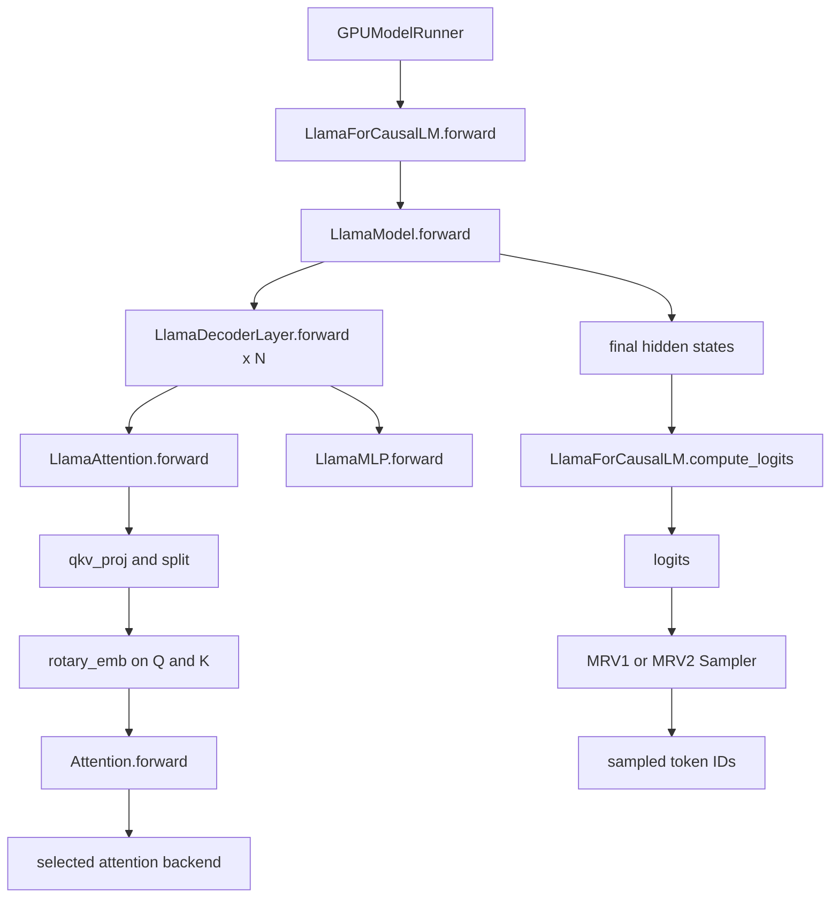

> **读图方法：** 这张图用于压缩“模型内部调用链”的整体关系。先从上向下找到起点、关键转换和终点，再问每条跨层箭头是否意味着函数调用、消息传递、内存访问或状态更新。

图中 `GPUModelRunner`、attention backend 与 sampler 都存在 MRV1/MRV2 或配置分支。
本章只确认概念接口，不在这里展开 runner 选择和 kernel dispatch。

### 关键源码事实

以下行号只适用于本章固定 commit，长期定位应优先使用完整路径和符号名：

1. `LlamaAttention.forward` 在 `vllm/model_executor/models/llama.py:224` 附近执行 QKV projection，随后 split、
   RoPE，再调用 `self.attn(q,k,v)`。
2. `LlamaDecoderLayer.forward` 在 `vllm/model_executor/models/llama.py:313` 附近体现两次 RMSNorm、attention、
   MLP 与 residual 数据流。
3. `LlamaModel.forward` 在 `vllm/model_executor/models/llama.py:406` 附近遍历当前 PP rank 所拥有的 layers，
   最后一个 PP rank 执行 final norm。
4. `LlamaForCausalLM.forward` 只返回模型 hidden states；`compute_logits` 在
   `vllm/model_executor/models/llama.py:546` 附近单独调用 `LogitsProcessor`。模型 forward 不等于 sampling。
5. 通用 `Attention` 类在 `vllm/model_executor/layers/attention/attention.py:223` 附近声明自己的职责包括写 KV Cache、
   执行 attention 和返回输出；具体 backend 由配置和能力选择。
6. `Attention.forward` 接收扁平 token tensor，并 reshape 为
   `[num_tokens,num_heads,head_size]` 后进入实现层。
7. MRV1 `Sampler` 在 `vllm/v1/sample/sampler.py:21`，MRV2 `Sampler` 在
   `vllm/v1/worker/gpu/sample/sampler.py:33`。二者不能因为同名而混为一个类。

### 第一步：模型对象怎样组装

`LlamaForCausalLM.__init__` 并不是把所有计算平铺在一个类中。它持有：

- `self.model`：`LlamaModel`，负责 embedding、decoder layers 和 final norm。
- `self.lm_head`：把 hidden size 投影到 vocabulary；只在最后一个 PP rank 上存在
  真正实现，其他 rank 使用 `PPMissingLayer`。
- `self.logits_processor`：只在最后 PP rank 构造，负责应用 LM head、处理 TP gather、
  vocabulary padding、scale 和 soft cap 等。

当 `tie_word_embeddings=True` 时，输出 head 可以与输入 embedding 共享权重。共享权重
不代表输入输出语义相同：输入侧按 token ID 查一行，输出侧用整个权重矩阵对 hidden
state 做投影，得到每个 token 的 score。

### 第二步：`LlamaModel.forward` 怎样穿过 layers

在第一个 PP rank：

```text
input_ids -> embed_input_ids -> hidden_states
```

在中间或最后 PP rank：输入可能来自上一 stage 的 `IntermediateTensors`。随后只遍历
当前 rank 拥有的 `[start_layer,end_layer)`。非最后 rank 把 hidden states 和 residual
重新包装为 `IntermediateTensors`；最后 rank 执行 final RMSNorm 并返回 hidden states。

这说明教学图里的“所有 N 层连续执行”是单设备视角。在 Pipeline Parallel 下，数学
层次不变，但对象所有权和数据传输跨进程/设备分段。

### 第三步：`LlamaDecoderLayer.forward` 的 residual 为什么看起来特殊

教学伪代码通常写成：

```python
x = x + attention(norm(x))
x = x + mlp(norm(x))
```

当前 vLLM Llama 实现传递 `(hidden_states,residual)`，让 RMSNorm 可以融合 residual add：

```text
input_layernorm(hidden_states, residual)
  -> self_attn(...)
post_attention_layernorm(hidden_states, residual)
  -> mlp(...)
```

阅读这种 fused 接口时不要只盯变量名。应追踪函数返回值中哪个代表规范化输入、哪个
保留 residual，再确认下一次 fused norm 在哪里完成加法。否则容易误判源码“漏掉了
residual connection”。

### 第四步：QKV、RoPE 与 Attention 的边界

`LlamaAttention` 负责模型结构相关部分：

1. 根据 TP size 推导本 rank 的 query heads 和 KV heads。
2. 用 `QKVParallelLinear` 一次生成打包的 QKV。
3. 按 `q_size,kv_size,kv_size` split。
4. 给 Q/K 应用模型配置对应的 RoPE。
5. 调用通用 `Attention` 层。
6. 用 row-parallel `o_proj` 投影回 hidden size。

通用 `Attention` 负责执行系统相关部分：

1. 根据 head size、dtype、KV dtype、sliding window、attention type 和平台能力选择
   backend，或使用调用者显式传入的 backend。
2. 构造 backend implementation，并注册到 compilation static forward context。
3. 在 `forward` 中从 forward context 读取 Model Runner 预先设置的 attention metadata。
4. 将 Q/K/V reshape 为 head 维度，写入/读取已经绑定的 KV cache，并执行实现层。

因此 `LlamaAttention` 与 `Attention` 不能合并理解：前者知道 Llama 的 head 配置和投影，
后者知道 vLLM 的 backend、KV cache 和运行时 metadata 契约。

### 第五步：Hidden States 怎样成为 Logits

`LlamaForCausalLM.compute_logits` 把工作交给 `LogitsProcessor`。后者的关键步骤是：

```text
hidden_states
  -> lm_head projection
  -> gather vocabulary shards when TP > 1
  -> remove vocabulary padding
  -> optional soft cap
  -> optional scale
  -> logits
```

当前实现还提供 `compute_logits_local`。MRV2 的 batch-sharded sampling 可以先在各 TP
rank 计算 local vocabulary logits，再通过专门通信只为本 rank 负责的请求拼出完整
词表。由此可见，“logits tensor 一定先在每个 rank 完整生成”不是可靠假设。

### 第六步：MRV2 怎样选择采样位置

模型 forward 可能为一个 step 产生多个 token 的 hidden states，但并非每个位置都需要
采样。MRV2 `GPUModelRunner.sample` 使用 `input_batch.logits_indices` 选择需要产生
logits 的 hidden states：

```text
hidden_states[input_batch.logits_indices]
  -> model.compute_logits(...)
  -> optional structured-output grammar mask
  -> self.sampler(logits, input_batch)
  -> SamplerOutput
```

普通未完成的 prefill chunk 不会在每个 chunk 末尾都向用户生成 token；prompt
logprobs 又可能要求额外位置的 logits。`logits_indices` 正是“模型计算了哪些 hidden
states”和“哪些位置需要进入 sampling”的显式桥梁。

在 `sample_tokens` 中，最后 PP rank 执行上述 sampling，并把 sampled tokens 广播给
其他 PP ranks；非最后 rank 没有最终 hidden states，因此不能独立完成 LM head 和
sampling。这是模型数学与分布式所有权结合的一个具体例子。

### 第七步：`SamplingParams` 在进入 Sampler 前做什么

固定 revision 下，`SamplingParams.__post_init__` 和 `_verify_args` 会规范化并校验参数：

- 极小但非零的 temperature 会被提高到内部最小值，以降低 NaN/Inf 风险。
- temperature 必须有限、非负，并且当前校验范围为 `[0,2]`。
- `top_p` 必须在 `(0,1]`。
- `top_k=0` 或 `-1` 表示禁用，其他值至少为 1。
- `min_p` 必须在 `[0,1]`。
- temperature 小于 greedy epsilon 时，会把 top-p、top-k、min-p 重置为禁用状态，
  再检查 greedy 条件，例如 `n` 必须为 1。
- stop strings 需要 detokenization；空 stop string 会被拒绝。

这些是 API 参数进入 kernel 前的契约。Sampler 内部仍有防御性处理，但不能把所有
非法参数都留给 GPU kernel 才发现。

### 源码证据矩阵

> **本节先看：** 下面先用表格整理“源码证据矩阵”。先横向比较每一列解决的问题和适用边界，再把具体名称映射到源码。

| 结论 | 生产源码 | 相关上游测试 |
|---|---|---|
| RoPE 修改 Query/Key | `vllm/model_executor/models/llama.py::LlamaAttention.forward`、`rotary_embedding/` | `tests/kernels/core/test_rotary_embedding.py` |
| SamplingParams 校验 greedy、top-k/top-p | `vllm/sampling_params.py` | `tests/test_sampling_params.py`、`tests/benchmarks/test_sampling_params.py` |
| MRV1 penalty 行为 | `vllm/v1/sample/sampler.py` | `tests/v1/sample/test_sampler.py` |
| top-k/top-p 参考实现与 kernel 等价 | `vllm/v1/sample/ops/topk_topp_sampler.py` | `tests/v1/sample/test_topk_topp_sampler.py` |
| Attention backend 由条件选择 | `vllm/v1/attention/selector.py` | `tests/v1/attention/test_attention_backends_selection.py` |

测试不是设计文档，但它能揭示维护者认为必须保持的行为。阅读生产函数后，应主动找
参数化测试、reference implementation 和 backend equivalence 测试反证自己的理解。

## 并发、进程与设备边界

本章的数学计算最终发生在 Worker 所管理的 accelerator 上，但以下工作不属于
Transformer 层本身：

- Tokenization 和多数请求校验通常在 frontend CPU 路径。
- Scheduler 决定本 step 哪些请求获得多少 token budget。
- Model Runner 把不同请求打包为 GPU 输入并构造 attention metadata。
- Attention backend 根据 metadata 和 block table 访问 KV Cache。
- Sampler 通常在 GPU 执行主要数值处理，再把必要结果交回输出侧。
- Detokenization、streaming 和 stop string 处理属于输出处理路径。

因此“模型一次 forward”与“用户收到一个 token”之间还有调度、数据准备、GPU 同步、
采样、IPC 和输出处理。后续章节会逐层展开这些边界。

## 设计取舍

> **本节先看：** 下面不只说明代码怎样写，还解释为什么采用这种边界。比较每个方案时，同时考虑正确性、复杂度、显存和性能。

### 为什么缓存 K/V，而不缓存所有结果

历史 token 的 K/V 会被未来每个 Query 重复使用，缓存收益明确。完整 hidden states
虽然也可能被某些功能使用，但普通下一 token attention 的直接依赖是每层 K/V；全部
缓存会进一步放大显存占用，且不能消除新 token 穿过所有 layers 的计算。

### 为什么不把所有请求 padding 到同一长度

规则 `[B,S,D]` tensor 容易理解，但在线服务的请求长度差异大。大量 padding 会让 GPU
为不存在的 token 做工作。vLLM 使用 token packing、metadata 和分页 KV，把“规则
矩形”转化为“紧凑 token + 显式边界”，代价是实现复杂度提高。

### 为什么 sampling 不塞进模型类

同一个模型 logits 可以用于 greedy、随机采样、logprobs、打分或受约束生成。把采样
作为独立阶段能让请求拥有不同参数，也便于在 Model Runner 中批量处理和优化。

## 异常路径与边界条件

> **本节先看：** 下面先给出“异常路径与边界条件”的结论清单。先理解每一项为什么存在，再记参数名或实现细节。

- 空 prompt 通常需要 BOS 或其他输入策略，不能假设模型可以对零 token 直接采样。
- `temperature < 0`、非法 `top_p`、越界 token ID 应在进入 kernel 前被拒绝。
- `temperature=0` 走 greedy 语义，不能直接执行除以 0。
- FP16/BF16 logits 常转为 FP32 再处理，以降低采样数值问题；当前 MRV1 sampler 明确
  执行该转换。
- EOS、stop token、stop string 和最大生成长度是不同停止条件，部分发生在 token
  侧，部分需要 detokenize 后判断。
- KV Cache 中的 position、token 前缀或模型身份不匹配会破坏正确性，缓存不是任意
  可拼接的字节数组。
- Prompt logprobs、speculative decoding、structured output 会改变需要计算或保留的
  logits，不能把“只取最后位置”推广到所有请求。

## 最小验证实验

> **本节先看：** 先用最小实验验证机制和边界，再扩大模型与负载。功能正确、调用链可见和性能更好是三种不同结论。

| 验证项 | 方法 | 当前状态 | 能证明什么 |
|---|---|---|---|
| 教学模型 cached/full 等价 | Python 标准库 + 4 个单元测试 | 已运行 | KV 复用不改变教学模型结果 |
| Attention/temperature 数值 | 固定向量与 logits + 2 个单元测试 | 已运行 | 正文表格、公式和插图数值一致 |
| vLLM 静态调用链 | 固定 commit 的路径、符号和上游测试 | 已完成 | 当前 revision 存在所述职责边界 |
| 真实预训练模型输出 | `examples/basic/offline_inference/basic.py` | 未运行 | tokenizer、模型权重和生成闭环 |
| GPU runtime trace | NVIDIA GPU + vLLM 可运行环境 | 未运行 | 当前配置实际选择的 runner/backend/kernel |

完整的已运行命令和环境记录见
[第 01 章最小推理实验记录](../../experiments/ch01-minimal-inference.md)。

### 真实 vLLM 验证清单

在具备 NVIDIA GPU、PyTorch 和已编译 vLLM 的环境中，使用上游自带最小示例：

```bash
cd /path/to/vllm
VLLM_LOGGING_LEVEL=DEBUG python3 examples/basic/offline_inference/basic.py
```

运行时至少记录：

1. 模型和 tokenizer 名称、revision、dtype。
2. `VLLM_USE_V2_MODEL_RUNNER` 是否显式设置，最终选择 MRV1 还是 MRV2。
3. 实际 attention backend。
4. prompt token IDs、prompt length、输出 token IDs。
5. 首次 prefill 与后续 decode 的 scheduled token 数。
6. CUDA Graph 是否启用；为了阅读 eager 调用栈，可另做 `enforce_eager` 对照。
7. 一个 greedy 请求与一个随机采样请求，确认参数语义和复现条件。

该实验没有在当前机器执行，因此本章没有填写虚构日志或性能数字。

## 阅读与调试指南

> **本节先看：** 调试时先确定请求停在哪一层，再选择日志、断点或 profile。不要从最底层 kernel 开始漫无目的地搜索。

| 看到的现象 | 先检查什么 | 不要先下什么结论 |
|---|---|---|
| 输出 token 不同 | temperature、seed、top-k/top-p、模型 revision | 模型 forward 一定错误 |
| logits shape 不像 `[B,S,V]` | `logits_indices`、packed token 数、TP local/global logits | sequence 维度丢失 |
| 源码没看到显式 causal mask | backend metadata、kernel 的 causal 参数 | 模型允许读取未来 |
| decoder layer 没看到 `x + f(x)` | fused RMSNorm 的 residual 输入输出 | residual connection 被删掉 |
| KV cache tensor 不连续 | block table 和 slot mapping | attention 无法读取完整历史 |
| prefill chunk 没输出 token | 是否仍有 prompt token 未计算 | sampler 丢失输出 |
| temperature 很小却不是原值 | `SamplingParams.__post_init__` 的最小温度规范化 | 浮点计算随机改变参数 |
| TP rank 没拿到完整 logits | `compute_logits_local`、gather、batch-sharded sampling | LM head 只覆盖部分词表 |

## 常见误解

> **本节先看：** 下面集中修正最容易由名称或旧版本经验造成的误解。先判断自己原来的理解，再用后面的源码事实校正。

- **误解：Token 就是一个单词。** 实际切分由 tokenizer 决定。
- **误解：Logits 已经是概率。** 它们是未归一化分数。
- **误解：Prefill 是训练。** Prefill 没有反向传播，仍是推理。
- **误解：有 KV Cache 后 decode 是 O(1)。** 新 Query 仍需读取并关注历史 KV。
- **误解：KV Cache 保存完整 hidden states。** 普通 attention cache 保存各层 K/V。
- **误解：模型 forward 会直接返回字符串。** forward 返回 tensor，采样和
  detokenization 在其他组件完成。
- **误解：源码没有 `[B,S,D]` 就没有 batch/sequence。** vLLM 常用 `[T,D]` 加元数据
  表达 ragged batch。
- **误解：Sampling 是 Transformer 的固定组成。** 它是模型 logits 之后的策略层。

## 本章小结

Decoder-only 推理是一个循环：token IDs 经 embedding 和多层 Transformer 变成 hidden
states，LM head 产生词表 logits，sampler 选择下一个 token，再把它追加到上下文。

Prefill 并行处理 prompt 并建立 KV Cache；decode 每轮处理新 token，复用历史 K/V。
KV Cache 避免重复计算，但显存随层数、KV heads、head size 和缓存 token 数增长。
vLLM 的核心任务，是在多个不同长度请求之间高效安排这些 token 计算和 KV 存储。

## 自检问题

> **本节先看：** 建议先不看答案，用自己的话回答下面的问题。能够解释原因、画出数据流并指出源码位置，才算真正理解。

1. 为什么 prefill 能一次处理多个位置，却没有违反 causal 约束？
2. 一个模型从 32 个 KV heads 改为 8 个 KV heads，在其他条件不变时，每 token KV
   Cache 理论容量怎样变化？为什么 Query heads 不一定同步减少？
3. 为什么有 KV Cache 后，新 token 仍需要经过所有 decoder layers？
4. 在 vLLM 中看到 hidden state 形状 `[T,D]` 时，如何找到每个请求的 sequence 边界？
5. 为什么 `temperature=0` 应走 greedy 分支，而不是直接套用 `logits/T`？

## 源码追踪题

> **本节先看：** 这些题目要求把概念重新落到代码。先从给出的入口搜索定义和调用点，再记录对象、状态与边界，不要只找到同名符号。

1. 从 `LlamaForCausalLM.forward` 追踪到一次 `Attention.forward`，记录每一跳输入输出。
2. 在 `LlamaAttention.forward` 中标注 Q/K/V split 后的本 rank 维度来源。
3. 找到 `Attention` 选择 backend 的位置，列出影响选择的至少四个条件。
4. 对比 MRV1 与 MRV2 sampler 中 temperature、penalty、top-k/top-p 的代码组织方式。
5. 从 MRV2 `GPUModelRunner.sample_tokens` 追踪到 `model.compute_logits` 和 sampler，
   说明为什么模型类没有 `sample()` 主入口。

## 自检题参考答案

<details>
<summary>1. 为什么 prefill 并行处理多个位置仍然保持 causal？</summary>

并行描述的是 GPU 同时计算多个 Query；可见性由 causal mask 或等价的 backend 边界
保证。位置 `i` 的 Query 只聚合 `0..i` 的 K/V，未来位置即使同时存在于 tensor 中，
其 score 也被屏蔽。
</details>

<details>
<summary>2. 从 32 个 KV heads 改为 8 个，KV 容量怎样变化？</summary>

在层数、head size、dtype 和 token 数不变，且 Key/Value 形状相同的简化条件下，容量
与 KV head 数成正比，因此降为原来的 `8/32=1/4`。Query heads 可以继续保持 32，
由每组多个 Query heads 共享一个 KV head，这就是 GQA。
</details>

<details>
<summary>3. 为什么有 KV Cache 后，新 token 仍要经过所有 decoder layers？</summary>

缓存只保存历史 token 在每层的 K/V。新 token 在第 0 层的输出会成为第 1 层输入，
因此仍需逐层计算新的 Q/K/V、attention、MLP 和 residual；只是每层不再重算历史 token
的投影和 hidden states。
</details>

<details>
<summary>4. `[T,D]` 中怎样恢复请求边界？</summary>

依赖 Model Runner 构造的元数据，例如每请求 scheduled token 数、query start locations、
sequence lengths、request ordering，以及用于 KV 寻址的 block tables 和 slot mappings。
不能只看 tensor 本身。
</details>

<details>
<summary>5. 为什么 temperature=0 不能直接计算 logits/T？</summary>

除以 0 没有定义，会产生 Inf/NaN。temperature=0 的 API 语义是 greedy，因此参数校验
会禁用随机采样过滤并让 sampler 走 argmax 路径。
</details>

## 未解决问题

这些问题在后续章节回答：

- 不同长度请求如何组成一个没有大量 padding 的 step？见第 04 章。
- KV Cache 怎样分页、共享、释放和淘汰？见第 05 章。
- `[T,D]` token 怎样通过 block table 找到非连续 KV？见第 06 章。
- MRV1/MRV2 如何准备 tensor、执行 forward 和 sampling？见第 07 章。
- CUDA Graph 为什么要求稳定地址和 shape？见第 08 章。

## 源码与资料索引

> **本节先看：** 下面按主题整理本章使用的证据入口。需要复核结论时，优先按路径和符号定位，不依赖可能漂移的行号。

- `vllm/model_executor/models/llama.py`
  - `LlamaMLP`
  - `LlamaAttention`
  - `LlamaDecoderLayer`
  - `LlamaModel`
  - `LlamaForCausalLM`
- `vllm/model_executor/layers/attention/attention.py::Attention`
- `vllm/model_executor/layers/rotary_embedding/`
- `vllm/model_executor/layers/logits_processor.py::LogitsProcessor`
- `vllm/sampling_params.py::SamplingParams`
- `vllm/v1/sample/sampler.py::Sampler`
- `vllm/v1/worker/gpu/sample/sampler.py::Sampler`
- `docs/design/model_runner_v2.md`
- `tests/test_sampling_params.py`
- `tests/v1/sample/test_sampler.py`
- `tests/v1/sample/test_topk_topp_sampler.py`
- `tests/kernels/core/test_rotary_embedding.py`
- `examples/basic/offline_inference/basic.py`
- [本项目章节源码映射](../../meta/chapter-source-map.md)
- [第 01 章实验记录](../../experiments/ch01-minimal-inference.md)

## 完成状态

> **本节先看：** 这里区分正文完成、静态源码核对和真实 GPU 运行验证。没有执行过的实验不会因为正文完整就被标记为已验证。

- [x] 核心概念从 token 讲到自回归循环。
- [x] Attention、RoPE、sampling、prefill/decode、KV Cache 有公式与图解。
- [x] 提供可运行的最小模型、数值推导和 6 个单元测试。
- [x] 映射到固定 commit 的 Llama、Attention、LogitsProcessor 和 MRV1/MRV2 Sampler。
- [x] 包含异常路径、设计取舍、自检题、答案和源码追踪题。
- [ ] 在真实 NVIDIA GPU 上执行预训练模型与 vLLM runtime trace。
- [ ] 由独立审阅者复核后将状态从 `draft` 改为 `verified`。

本章内容已经完整，`content_complete=true`。按照本项目规则，AI 生成内容不能仅因篇章
完成就自行标记为 `verified`；当前 `runtime_verified=false`，等待 GPU 动态验证和独立
审阅。
