# 第02章 vLLM 全景与一次请求的生命周期

> 调用 `LLM.generate()` 或发送一条 HTTP 请求后，数据究竟经过哪些对象、线程、
> 进程和设备？

## 本章定位

第 01 章解释了一个 decoder-only Transformer 怎样预测下一个 token。本章把镜头拉远：
模型只是 vLLM 的一个执行部件。一个可用的推理系统还要接收请求、渲染 chat template、
做 tokenization、检查参数、管理并发、选择当前要算的 token、组织 GPU 输入、把 token
重新解码成文本，并在客户端断开时及时释放状态。

本章先建立全书最重要的一张地图。后续章节会分别放大其中的局部：

- 第 03 章：Engine、EngineCore、IPC 和主循环。
- 第 04 章：Scheduler 与 Continuous Batching。
- 第 05 章：KV Cache block 的生命周期。
- 第 06 章：block table 怎样变成 attention 的真实寻址。
- 第 07 章：Executor、Worker、Model Runner 和 Sampler。

本章以当前固定 revision 的 **V1 文本生成路径**为准。多模态、pooling、beam search、
structured output、speculative decoding 和分离式 prefill/decode 只在它们改变主链边界时
指出，不展开内部算法。

## 阅读目标

读完本章后，你应该能够：

1. 分清 offline `LLM.generate()` 和 online OpenAI-compatible API 的前端差异。
2. 解释 Renderer、InputProcessor、Engine client、EngineCore、Scheduler、Executor、
   OutputProcessor 各自负责什么。
3. 画出一个请求从 JSON 或 Python 对象到 GPU，再回到文本的完整路径。
4. 区分 `EngineInput`、`EngineCoreRequest`、`Request`、`SchedulerOutput`、
   `ModelRunnerOutput`、`EngineCoreOutput` 和 `RequestOutput`。
5. 指出哪些边界是普通函数调用，哪些是 asyncio queue、线程队列、ZMQ 或 GPU 执行。
6. 解释客户端取消后 abort 为什么必须同时清理前端状态和 EngineCore 状态。
7. 不再把 `LLMEngine`、`AsyncLLM`、`EngineCore`、Worker 和模型混成一个“引擎”。

## 如何阅读本章

这一章最容易出现的问题不是数学太难，而是类名太多。不要尝试一次记住所有对象；先把
一次请求当成一张工单，观察它如何经过“接单、标准化、排队、执行、交付”五个阶段。
之后再把 Renderer、EngineCore、Scheduler、Worker 和 OutputProcessor 放回对应阶段。

第一次阅读只追一条普通文本生成的 happy path，看到多模态、structured output、DP
或异常分支时先知道它挂在哪里即可。第二次阅读再区分函数调用、线程队列、ZMQ 和 GPU
边界，因为同一个 Python 方法名跨过这些边界后，性能和失败传播方式会完全不同。

本章不要求你理解 attention kernel。你需要建立的是系统地图：谁拥有请求状态，谁拥有
调度权，谁拥有设备内存，谁把 token 还原成用户看到的文本。后续章节都是对这张地图的
局部放大。

**先分清三种并发对象。** 进程拥有自己的内存空间；线程共享所在进程的内存；
asyncio task 是事件循环调度的一段协程，在 `await` 等待时允许其他 task 继续。
IPC 是进程间通信，ZMQ 是这里传递消息的库，SSE 是服务器持续向 HTTP 客户端发送事件
的格式。它们都不会自动让 Transformer 层并行计算。

**第一遍走法：** 读 2.1–2.4、2.6–2.12，再运行 2.17 的模拟器；用 2.14 检查取消路径。
**停下来追：** token ID 已从 GPU 返回，为什么用户还没看到文字？先查 OutputProcessor
的增量解码，再查 collector 与 SSE；模型输出不直接等于 HTTP 输出。

## 2.1 为什么模型外面还需要一套系统

只看单个请求，推理循环似乎很简单：

```text
prompt -> tokenize -> model.forward -> sample -> decode -> text
```

但服务面对的是持续到达、长度不同、参数不同的许多请求。一个请求可能有 2,000 个
prompt token，只生成 8 个 token；另一个 prompt 很短，却要生成 1,000 个 token。它们
到达时间不同，也可能中途取消。如果每个请求独占 GPU 直到结束，就会出现三个问题：

1. **GPU 利用率低。** Decode 每步通常只有少量新 token，单请求难以填满 GPU。
2. **KV Cache 浪费。** 按最大长度为每个请求连续预留显存，会产生大量空洞。
3. **延迟失控。** 一个长请求会阻塞后到达的短请求，流式响应和取消也很难处理。

vLLM 的系统价值可以先压缩为一句话：

> 前端把不同形式的用户请求统一成内部请求；EngineCore 在每个 step 重新决定算谁；
> 执行层把这一轮 token 工作变成 GPU 计算；输出层再把增量 token 还原成用户协议。

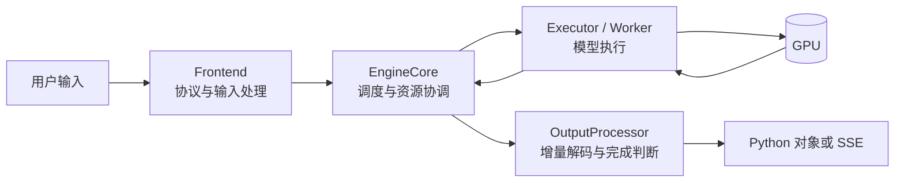

> **读图方法：** 阅读“为什么模型外面还需要一套系统”这张流程图时，先把方框看成对象或状态，把箭头看成数据或控制的移动。第一遍从左向右建立顺序，第二遍再核对分支发生的条件。

这张图有两个重要含义：

- 模型并不理解 HTTP、chat message、SSE 或用户提供的 request ID。
- API Server 不直接决定 GPU 当前计算哪些 token；这个决定属于 Scheduler。

## 2.2 三层心智模型：协议面、控制面、数据面

为了避免被类名淹没，可以先把整个系统分成三层。

### 协议面

协议面面对用户，处理 Python API、HTTP、OpenAI-compatible schema、chat template、
tokenization、流式 JSON、tool/reasoning parser 等问题。

典型对象：

- `LLM`
- `OpenAIServingChat`
- `OnlineRenderer` / `BaseRenderer`
- `InputProcessor`
- `OutputProcessor`

### 控制面

控制面维护请求状态和资源决策。它传递的主要是 request metadata、token 预算、block
ID、完成状态，而不是模型的大型 activation tensor。

典型对象：

- `EngineCoreClient`
- `EngineCore`
- `Scheduler`
- `KVCacheManager`
- `SchedulerOutput`

### 数据面

数据面把调度结果变成 device tensor 和 kernel 执行，包括模型权重、hidden states、
KV Cache、attention、sampling 以及必要的 collective。

典型对象：

- `Executor`
- `Worker`
- `GPUModelRunner`
- 模型 `torch.nn.Module`
- attention backend 和 CUDA/Triton kernel

### 生活化类比：现代餐厅运作系统

初学者在第一次面对 `Renderer`、`InputProcessor`、`EngineCoreClient`、`EngineCore`、`Scheduler`、`Worker`、`ModelRunner`、`OutputProcessor` 等十几个类时，极易陷入“类名迷宫”。为了建立稳固的第一直觉，可以把 vLLM 想象成一家高度工业化的现代中餐厅：

| 餐厅角色与运作流程 | vLLM 对应组件 | 在系统中所处的责任面 |
|---|---|---|
| **顾客点单与菜品清单** | 用户 HTTP API / OpenAI 格式输入 | 外部输入 |
| **前厅接待与点菜员** | `Renderer` & `InputProcessor` | **协议面**：把顾客口语化的点单转换成后厨能认的标准工单（`EngineCoreRequest`），并校验规格与忌口 |
| **前厅对讲机 / 传菜铃** | `EngineCoreClient`（IPC 通信） | **协议与控制面边界**：在多进程路径传递工单；同步/异步等待方式取决于 client 类型 |
| **后厨调度总管 / 领班** | `EngineCore` & `Scheduler` | **控制面**：根据请求进度、token 预算与 KV 容量，在每一个出菜节拍决定本轮计算哪些请求（`SchedulerOutput`） |
| **调料库管员** | `KVCacheManager` | **控制面**：管理公用酱料与已腌制好的半成品（KV Block），告诉总管还能不能接新菜、哪些桌可以复用老汤（Prefix Cache） |
| **各灶台大厨工位** | `Executor` & `Worker` | **数据面**：管理特定的一台或多台燃气灶（GPU），负责提前把锅烧热、准备设备执行环境 |
| **炒锅与装盘托盘** | `GPUModelRunner` | **数据面**：把总管派来的单子倒进锅里，装配成火候所需的数据结构（Tensor），驱动锅内翻炒（Model Forward） |
| **出菜检验打包装盒员** | `OutputProcessor` | **协议面返回端**：从后厨接过刚出锅的菜，核对是否上齐，把 token 逐个转换回人类可读的文字，流式端给顾客（SSE 响应） |

类比说明职责，不代表真实对象一一对应进程：Model Runner 负责组织计算，模型与 GPU
算子负责数值运算；OutputProcessor 生成用户层输出，SSE 格式由 API 层包装。

### 软件工程基础：进程、线程与协程边界

在深入具体类之前，软件工程类学生必须牢固区分三类并发抽象，因为它们在 vLLM 中承担着完全不同的职责：

- **进程**：拥有独立的虚拟地址空间；多个进程仍可映射同一共享内存。常见启用 GIL
  的 CPython 部署中，各进程的解释器锁独立，能减少前后端争用；资源竞争和故障传播
  仍可能跨进程发生，不能保证后端崩溃对服务没有影响。
- **线程**：共享所在进程的地址空间，但有自己的执行栈。启用 GIL 的 CPython 中，
  同一解释器通常不能让多个线程同时执行 Python 字节码；释放 GIL 的扩展与阻塞 IO
  可以重叠。不能把这个限制推广到所有 Python 实现或 free-threaded 构建。
- **异步协程/task**：在事件循环内协作推进，等待尚未就绪的操作时可让出执行机会。
  切换 task 不需要每次都切换 OS 线程，但事件循环仍有调度成本；并非遇到任意
  `await` 都一定让出执行。直接在协程中执行长时间同步计算仍会阻塞该事件循环。

[Python 官方说明](https://docs.python.org/3/howto/free-threading-python.html)区分了启用
GIL 与 free-threaded 构建；本书常见部署的 GIL 解释需要带上这个前提。

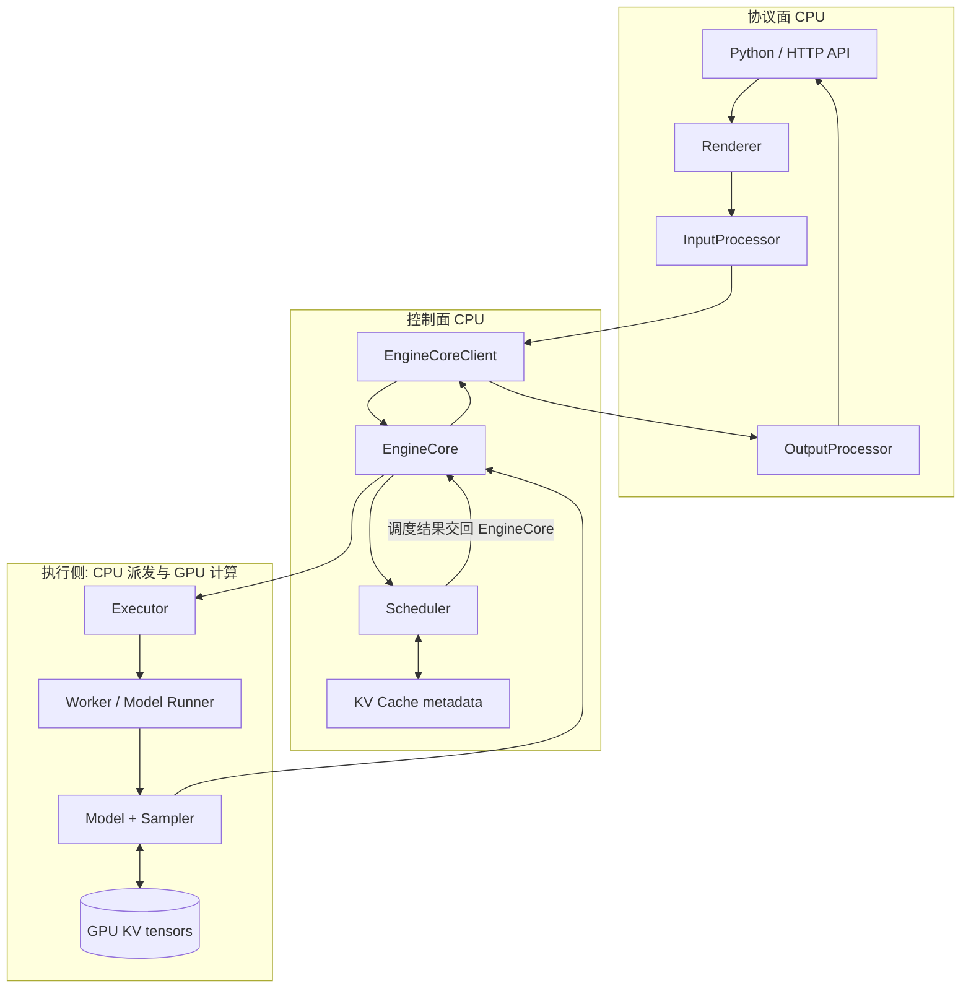

> **读图方法：** 这张图用于压缩“数据面”的整体关系。先从上向下找到起点、关键转换和终点，再问每条跨层箭头是否意味着函数调用、消息传递、内存访问或状态更新。

注意：这是**职责分层**，不等于固定的进程分层。`UniProcExecutor` 会让逻辑 Worker
对象与 EngineCore 位于同一个操作系统进程；`MultiprocExecutor` 或 Ray 才会把 Worker
放到其他进程。后文会专门修正这一点。

## 2.3 两个主要入口

> **本节先看：** 本节要回答：**两个主要入口**。下面的小节会逐层拆开概念、运行过程和源码落点；第一次阅读先抓对象之间的关系，第二次再记类名、字段和分支。

### 离线入口：`LLM.generate()`

离线推理适合脚本、评测、批处理和数据生成。调用者提交一组 prompt，函数通常等到
全部请求结束后返回 `list[RequestOutput]`。

```python
from vllm import LLM, SamplingParams

llm = LLM(model="your-model")
outputs = llm.generate(
    ["Explain KV cache", "Explain continuous batching"],
    SamplingParams(temperature=0, max_tokens=64),
)
```

当前源码中的主干是：

```text
LLM.generate
  -> OfflineInferenceMixin._run_completion
  -> OfflineInferenceMixin._add_completion_requests
  -> Renderer.render_cmpl
  -> LLMEngine.add_request
  -> OfflineInferenceMixin._run_engine
       while has_unfinished_requests():
           LLMEngine.step()
```

`LLM.generate()` 自己没有写模型循环。它先检查 runner type、补默认
`SamplingParams`，然后交给 `_run_completion()`。`_run_engine()` 才持续调用
`LLMEngine.step()`，收集完成项，最后按数值 request ID 排序，保证返回顺序与输入顺序
一致，即使短请求先完成。

[源码] `vllm/entrypoints/llm.py` - `LLM.generate`

[源码] `vllm/entrypoints/offline_utils.py` -
`OfflineInferenceMixin._run_completion`、`_run_engine`

### 在线入口：OpenAI-compatible chat API

在线服务面对的是 HTTP 请求和异步并发。以 chat completion 为例，入口接收到
`ChatCompletionRequest` 后，要先校验模型、渲染消息、计算 `max_tokens`、构造
`SamplingParams`，再从 `AsyncLLM.generate()` 得到一个异步生成器。

```text
POST /v1/chat/completions
  -> OpenAIServingChat.create_chat_completion
  -> OpenAIServingChat._create_chat_completion
  -> OnlineRenderer.render_chat
  -> AsyncLLM.generate
  -> per-request RequestOutputCollector
  -> stream generator / full generator
  -> JSON or data: ...\n\n
```

当 `stream=true` 时，API 层遍历 `RequestOutput`，组装
`ChatCompletionStreamResponse`，最终写成 SSE：

```text
data: {"id":"chatcmpl-...","choices":[...]}

data: [DONE]
```

这里有两层“流”：

1. `AsyncLLM.generate()` 产生 vLLM 内部的 `RequestOutput`。
2. `chat_completion_stream_generator()` 把它变成 OpenAI-compatible SSE chunk。

模型和 EngineCore 都不负责 JSON 序列化。

[源码] `vllm/entrypoints/openai/chat_completion/serving.py` -
`OpenAIServingChat._create_chat_completion`、`chat_completion_stream_generator`

[源码] `vllm/v1/engine/async_llm.py` - `AsyncLLM.generate`

### 两条路径的共享与分叉

> **本节先看：** 下面先用表格整理“两条路径的共享与分叉”。先横向比较每一列解决的问题和适用边界，再把具体名称映射到源码。

| 问题 | 离线 `LLM.generate` | 在线 chat serving |
|---|---|---|
| 用户输入 | Python prompt/list | HTTP JSON messages |
| chat template | `LLM.chat` 时使用 | `OnlineRenderer.render_chat` |
| 请求推进 | 前端循环 `LLMEngine.step()` 取结果；默认后端有独立 busy loop | EngineCore 后台 busy loop |
| 常见 client | 默认 `SyncMPClient`；显式关闭 MP 时为 `InprocClient` | `AsyncMPClient` 或 DP 变体 |
| 输出交付 | 返回最终 `list[RequestOutput]` | 每请求异步 collector，再转 SSE/JSON |
| 取消来源 | 调用方显式 abort | HTTP 断开、task cancel、显式 abort |
| 共同后端 | EngineCore、Scheduler、Executor、Worker、Model Runner | 同左 |

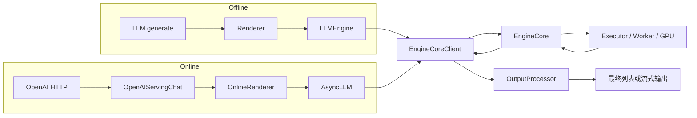

> **读图方法：** 这是“两条路径的共享与分叉”的流程图。先从左向右只追一条主路径，确认输入经过哪些关键阶段到达输出；第二遍再看虚线、回边和旁路，它们通常表示反馈、复用或可选分支。

## 2.4 Renderer 与 InputProcessor 不是同一个阶段

初学者常把“输入处理”理解成一个 tokenize 函数。当前 V1 实际上有两层。

### Renderer：从用户语义到 `EngineInput`

Renderer 处理更靠近用户协议的工作：

- 解析字符串、token IDs、chat messages 或多模态输入。
- 应用 chat template。
- 调用 tokenizer。
- 执行多模态 processor，生成 placeholder 和 feature metadata。
- 给处理后的输入附加 arrival time。

`BaseRenderer.render_cmpl()` 的骨架是：

```text
render_prompts
  -> tokenize_prompts
  -> apply prompt extras
  -> process_for_engine
  -> EngineInput
```

`render_chat()` 多一步 `render_messages()`，先把 role、content、tools 等消息结构变成
模型可读的 prompt。

[源码] `vllm/renderers/base.py` - `BaseRenderer.render_cmpl`、`render_chat`

[源码] `vllm/renderers/online_renderer.py` - `OnlineRenderer.render_chat`

### InputProcessor：从 `EngineInput` 到 `EngineCoreRequest`

`InputProcessor.process_inputs()` 处理靠近 EngineCore 契约的工作：

1. 校验 `SamplingParams` 或 `PoolingParams`。
2. 校验 LoRA 与 data-parallel rank。
3. 必要时兼容旧的 raw prompt 路径。
4. 拆分 encoder/decoder input。
5. 检查 prompt 长度、token ID 范围和平台限制。
6. clone 并补全 request-local 参数，例如默认 `max_tokens` 和 EOS。
7. 整理多模态 feature。
8. 构造可跨 client 边界传输的 `EngineCoreRequest`。

当前代码已经把 raw prompt 直接传给 `InputProcessor` 标记为 deprecated。推荐理解是：

```text
用户输入 --Renderer--> EngineInput --InputProcessor--> EngineCoreRequest
```

而不是：

```text
用户输入 --InputProcessor 一步完成所有事情--> Request
```

在线 raw prompt 的兼容路径会使用 `process_inputs_async`，它通过 Renderer 的线程池执行
阻塞预处理，避免 tokenization 或媒体处理卡住 asyncio event loop。

[源码] `vllm/v1/engine/input_processor.py` - `InputProcessor.__init__`、
`process_inputs`

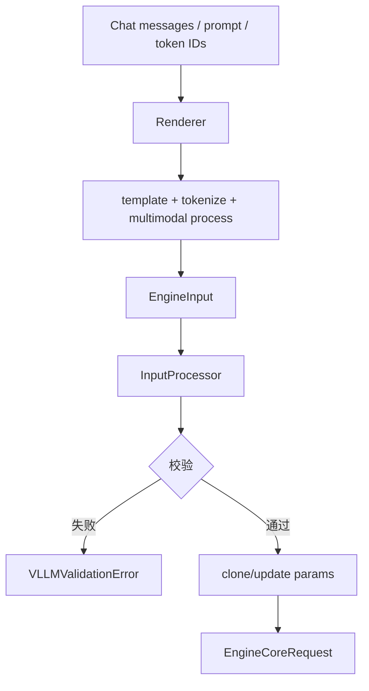

> **读图方法：** 阅读“InputProcessor：从 `EngineInput` 到 `EngineCoreRequest`”这张流程图时，先把方框看成对象或状态，把箭头看成数据或控制的移动。第一遍从上向下建立顺序，第二遍再核对分支发生的条件。

## 2.5 Request ID 为什么有两份

`InputProcessor.assign_request_id()` 会把用户提供的 ID 保存到
`external_req_id`，并通常给内部 `request_id` 追加 8 个随机字符。

```text
external_req_id = "chatcmpl-42"
internal request_id = "chatcmpl-42-a1b2c3d4"
```

这样做不是装饰。多个调用方可能重复使用同一个外部 ID；若内部 Scheduler、KV Cache
和输出状态直接以它为唯一键，就可能互相覆盖。随机化后的 ID 用于内部所有权和资源
管理，外部 ID 用于返回用户、日志关联以及 `abort(internal=False)`。

`OutputProcessor` 维护：

```text
external_req_id -> [internal_req_id, ...]
internal_req_id -> RequestState
```

当 `n > 1` 时，一个父请求还会 fan out 成多个 child request。这说明“一次 HTTP
请求”“一个外部 request ID”“一个 Scheduler request”并不总是一一对应。

[源码] `vllm/v1/engine/input_processor.py` - `InputProcessor.assign_request_id`

[源码] `vllm/v1/engine/output_processor.py` - `OutputProcessor.add_request`、
`abort_requests`

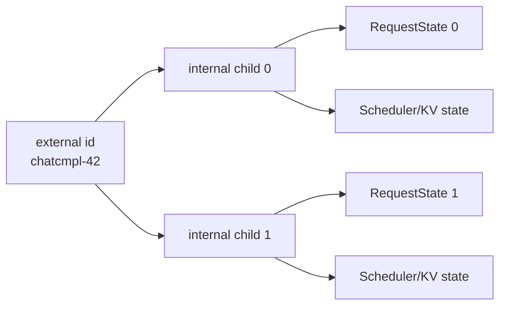

> **读图方法：** 这张图用于压缩“Request ID 为什么有两份”的整体关系。先从左向右找到起点、关键转换和终点，再问每条跨层箭头是否意味着函数调用、消息传递、内存访问或状态更新。

## 2.6 EngineCoreClient：相同接口，不同边界

前端不应根据 EngineCore 是否同进程而重写业务逻辑，因此 V1 用
`EngineCoreClient` 抽象请求的 push/pull。

### `InprocClient`

`InprocClient` 直接构造 `EngineCore`：

- `add_request()` 直接调用 `preprocess_add_request()` 和 `add_request()`。
- `get_output()` 直接调用 `EngineCore.step_fn()`。
- 没有 ZMQ，也没有独立 EngineCore busy loop。
- 用于显式关闭 `VLLM_ENABLE_V1_MULTIPROCESSING` 后的同步兼容或调试路径。当前该环境
  变量默认值为 `1`，所以默认同步 `LLMEngine` 使用的是 `SyncMPClient`，不能把
  `InprocClient` 写成默认离线拓扑。这里的“兼容”也只指 API 门面，不代表回到旧 V0 内核。

### `SyncMPClient`

同步多进程 client 通过 ZMQ 把请求发送到后台 `EngineCoreProc`，并用一个输出线程把
ZMQ 消息放入本地 `outputs_queue`。前端调用 `get_output()` 时阻塞读取这个队列。

### `AsyncMPClient`

异步 client 同样使用 ZMQ，但输出落入 `asyncio.Queue`，`get_output_async()` 可以被
`AsyncLLM.output_handler` await。`add_request_async()` 还会设置 `client_index`，确保多
API Server 场景中输出回到提交请求的 client。

### DP 变体

当 `data_parallel_size > 1` 时：

- external load balancer 路径使用 `DPAsyncMPClient`。
- internal load balancer 路径使用 `DPLBAsyncMPClient`。

它们改变路由和 EngineCore 数量，不改变“前端通过 client 提交
`EngineCoreRequest`、接收 `EngineCoreOutputs`”这一基本契约。

[源码] `vllm/v1/engine/core_client.py` - `EngineCoreClient.make_client`、
`make_async_mp_client`、`InprocClient`、`AsyncMPClient`

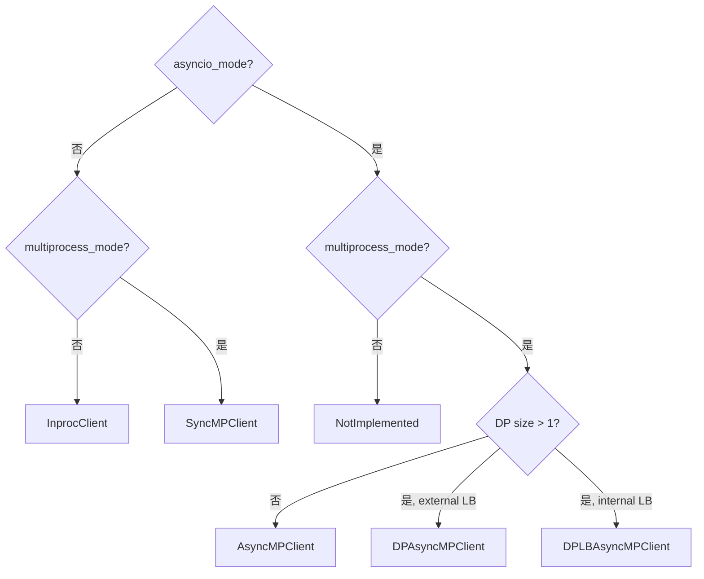

> **读图方法：** 这是“DP 变体”的流程图。先从上向下只追一条主路径，确认输入经过哪些关键阶段到达输出；第二遍再看虚线、回边和旁路，它们通常表示反馈、复用或可选分支。

## 2.7 当前进程拓扑：不要把逻辑对象等同于进程

> **本节先看：** 本节要回答：**当前进程拓扑：不要把逻辑对象等同于进程**。下面的小节会逐层拆开概念、运行过程和源码落点；第一次阅读先抓对象之间的关系，第二次再记类名、字段和分支。

### 单 GPU 在线服务的常见拓扑

在线 `AsyncLLM` 必须使用 multiprocessing client，因此 API 前端与 EngineCore 通常是
两个进程。但当 `world_size == 1` 时，`ParallelConfig` 默认把 executor backend 设为
`"uni"`，`Executor.get_class()` 选择 `UniProcExecutor`。

`UniProcExecutor._init_executor()` 在当前 EngineCore 进程里直接创建
`WorkerWrapperBase`、初始化设备并加载模型。于是常见单 GPU 逻辑是：

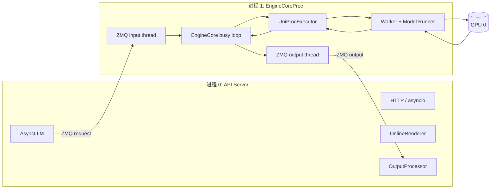

> **读图方法：** 阅读“单 GPU 在线服务的常见拓扑”这张流程图时，先把方框看成对象或状态，把箭头看成数据或控制的移动。第一遍从左向右建立顺序，第二遍再核对分支发生的条件。

这里有一个对源码阅读非常重要的修正：

> “每个 GPU 都有一个逻辑 Worker”是成立的；“每个 GPU 必然有一个额外的独立 Worker
> 进程”在当前 revision 并不成立。单 rank 的 `UniProcExecutor` 把 Worker 放在
> EngineCore 进程内。

官方 `docs/design/arch_overview.md` 的进程计数把 Worker 描述为独立进程，适合作为
多进程部署的总体直觉，但阅读当前代码时必须结合 executor backend 修正。

[源码] `vllm/config/parallel.py` - `ParallelConfig.__post_init__`

[源码] `vllm/v1/executor/abstract.py` - `Executor.get_class`

[源码] `vllm/v1/executor/uniproc_executor.py` - `UniProcExecutor._init_executor`

### TP/PP 多 rank 路径

当 backend 为 `mp` 时，`MultiprocExecutor` 创建多个 Worker 进程，并通过共享内存
message queue 等机制广播 `SchedulerOutput`、收集执行结果。此时才更接近：

```text
API process
  + EngineCore process
  + N worker processes
```

N 通常由当前 DP rank 内的 TP、PP、PCP 等并行维度决定，完整公式放到第 09 章。

### 离线 in-process 路径

显式设置 `VLLM_ENABLE_V1_MULTIPROCESSING=0` 时，离线 `LLMEngine` 使用
`InprocClient`。配合单 rank 的 `UniProcExecutor`，此时 EngineCore 和 `UniProcExecutor`
Worker 都在调用者进程，`LLM.generate()` 的调用线程主动推进 step：

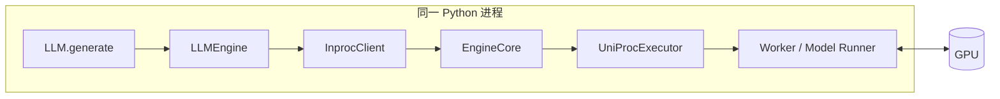

> **读图方法：** 这张图用于压缩“离线 in-process 路径”的整体关系。先从左向右找到起点、关键转换和终点，再问每条跨层箭头是否意味着函数调用、消息传递、内存访问或状态更新。

因此，任何进程图都必须带上三个条件：入口、EngineCore client 类型、executor backend。

## 2.8 在线请求怎样跨过 ZMQ 边界

以 `AsyncMPClient` 和 `EngineCoreProc` 为主线：

1. `AsyncLLM._add_request()` 先在前端 `OutputProcessor` 注册 `RequestState`。
2. 然后 await `engine_core.add_request_async(request)`。
3. client 用 msgpack 编码 `EngineCoreRequest`，通过 ZMQ multipart 发送。
4. EngineCore 的 input socket thread 收到消息并反序列化。
5. input thread 调用 `preprocess_add_request()`，把 wire object 变成内部 `Request`。
6. 处理后的 `(request_type, request)` 进入线程安全的 `input_queue`。
7. busy loop 从队列取出 ADD，调用 `EngineCore.add_request()`。
8. `EngineCore.add_request()` 最终交给 `Scheduler.add_request()`。

为什么先在前端注册、再做第一次 await？源码注释给出了并发理由：并发 task 必须在
请求跨进程前就能看见该请求，避免输出或取消到来时本地没有对应状态。

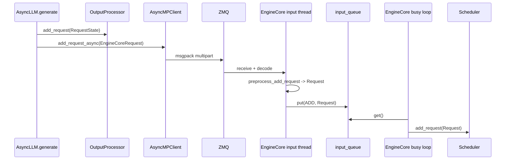

> **读图方法：** 这是“在线请求怎样跨过 ZMQ 边界”的时序图。先从左到右确认参与者分别负责什么，再从上到下追踪消息；第一遍只看正常路径，第二遍再看返回、异步消息和失败分支。

### 为什么在 input thread 中构造 `Request`

`preprocess_add_request()` 可能读取多模态 receiver cache、计算 block hash、启动
structured-output grammar 初始化。把它放在 input thread，可以与 GPU forward 并行，
减少 busy loop 的串行 CPU 开销。

这也说明 input thread 不只是“搬运 socket 字节”，它承担一部分可并行的 request
初始化。但真正改变 Scheduler 队列仍发生在 busy loop，避免多个线程任意修改核心
状态。

[源码] `vllm/v1/engine/core.py` - `EngineCore.preprocess_add_request`、
`EngineCoreProc.process_input_sockets`、`_handle_client_request`

## 2.9 一次 EngineCore step 的骨架

当 Scheduler 有请求时，`EngineCore.step()` 的主线非常短，却串起整套系统：

```text
if no scheduler requests:
    return {}, False

scheduler_output = scheduler.schedule(...)
future = model_executor.execute_model(scheduler_output, non_block=True)
grammar_output = scheduler.get_grammar_bitmask(scheduler_output)
model_output = future.result()
if model_output is None:
    model_output = model_executor.sample_tokens(grammar_output)

process aborts received during model execution
engine_outputs = scheduler.update_from_output(scheduler_output, model_output)
return engine_outputs, model_was_executed
```

它可以拆成五个阶段：

| 阶段 | 所有者 | 输入 | 输出 |
|---|---|---|---|
| 选择工作 | Scheduler | waiting/running 请求、token/KV 预算 | `SchedulerOutput` |
| 执行模型 | Executor/Worker | `SchedulerOutput` | future / `ModelRunnerOutput` |
| 必要时采样 | Worker/Sampler | logits、grammar mask | sampled token |
| 处理并发 abort | EngineCore | abort queue | 被终止的 Scheduler request |
| 更新状态 | Scheduler | 调度快照 + 模型输出 | `EngineCoreOutputs` |

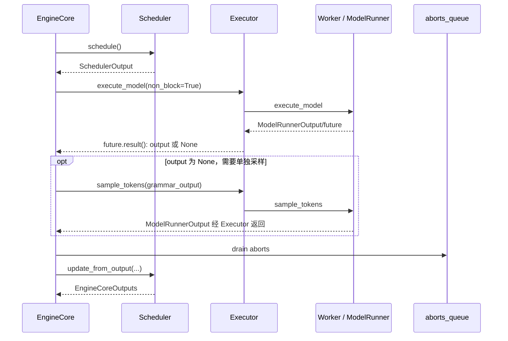

> **读图方法：** 这是“一次 EngineCore step 的骨架”的时序图。先从左到右确认参与者分别负责什么，再从上到下追踪消息；第一遍只看正常路径，第二遍再看返回、异步消息和失败分支。

### 为什么 abort 要在 `update_from_output()` 前处理

假设一个请求的最后一步正在 GPU 上执行，此时客户端取消。如果先让
`update_from_output()` 把它标成 `FINISHED_LENGTH_CAPPED`，再处理 abort，KV connector
等资源清理逻辑可能看到错误的完成原因。当前代码在模型结果返回后、Scheduler 消费
结果前调用 `_process_aborts_queue()`，让取消优先。

`tests/v1/engine/test_abort_final_step.py::test_abort_during_final_step` 专门构造了这一竞争
条件，验证 connector 观察到 `FINISHED_ABORTED`。

[源码] `vllm/v1/engine/core.py` - `EngineCore.step`、`_process_aborts_queue`

[测试] `tests/v1/engine/test_abort_final_step.py` -
`test_abort_during_final_step`

## 2.10 数据形态怎样逐层变化

同一个请求在不同层不是同一个 Python 对象。每次转换都在缩小或改变责任边界。

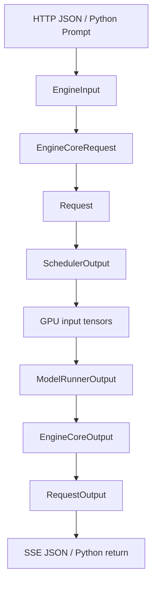

> **读图方法：** 这张图用于压缩“数据形态怎样逐层变化”的整体关系。先从上向下找到起点、关键转换和终点，再问每条跨层箭头是否意味着函数调用、消息传递、内存访问或状态更新。

### `EngineInput`

Renderer 的输出，已经完成模板化和 tokenization。它可能表示纯 token、prompt embeds、
多模态输入或 encoder-decoder 输入。

### `EngineCoreRequest`

前端和 EngineCore 之间的消息契约。关键字段包括：

- 内部/外部 request ID
- prompt token IDs 或 embeds
- `SamplingParams` / `PoolingParams`
- arrival time、priority、LoRA
- client index、DP rank
- 多模态 feature、trace header、session 信息

它使用 `msgspec.Struct`，适合 msgpack 序列化。它不是 Scheduler 的完整运行状态。

### `Request`

EngineCore 内部的可变状态对象。它增加：

- `RequestStatus`
- `num_computed_tokens`
- output token 列表
- speculative token、in-flight token、preemption 计数
- block hashes、prefill stats、streaming state

`EngineCoreRequest` 是“提交消息”，`Request` 是“被系统持续推进的实体”。

### `SchedulerOutput`

一次 step 的工作说明，包含：

- 新请求的完整数据 `scheduled_new_reqs`
- 已缓存请求的增量数据 `scheduled_cached_reqs`
- 每请求本步 token 数
- 新 block IDs、finished/preempted request IDs
- encoder input、spec decode token、common prefix 信息

它回答“这一轮 Worker 应该做什么”，不等于长期 Request 状态。它是普通可变
`dataclass`，不是 Python 层面的不可变对象；异步执行时还会更新草稿 token 等字段。

[源码] `vllm/v1/core/sched/output.py` - `SchedulerOutput`

### `ModelRunnerOutput`

执行侧返回的模型级结果，主要包含采样 token、logprobs、pooling output、KV/encoder
connector metadata、draft token 等。它还不是用户文本。

### `EngineCoreOutput`

Scheduler 把模型结果按 request 切分、应用停止条件和状态更新后，形成面向前端的增量
输出：`new_token_ids`、finish reason、stop reason、事件、prefill stats 等。

### `RequestOutput`

OutputProcessor 增量 detokenize、处理 stop string、logprobs 和多路 sampling 后形成的用户
层结果。在线路径把它送入每请求 collector；离线路径把它放入返回列表。

| 数据 | 主要所有者 | 是否跨 ZMQ | 是否含文本 | 生命周期 |
|---|---|---:|---:|---|
| `EngineInput` | Renderer/frontend | 通常不直接跨 | 可保留 prompt | 单次预处理 |
| `EngineCoreRequest` | InputProcessor/client | 是，MP 路径 | 通常以 token 为主 | 提交消息 |
| `Request` | EngineCore/Scheduler | 否 | 否 | 整个推理请求 |
| `SchedulerOutput` | Scheduler/Worker | Executor 决定 | 否 | 一个 step |
| `ModelRunnerOutput` | Worker/EngineCore | Executor 决定 | 否 | 一个 step |
| `EngineCoreOutput` | Scheduler/frontend | 是，MP 路径 | 否 | 一个 step/请求 |
| `RequestOutput` | OutputProcessor/API | 否 | 是 | 增量或最终输出 |

## 2.11 OutputProcessor 怎样把 token 变回用户输出

EngineCore 返回 token ID 后，前端还要完成多项工作：

1. 根据内部 request ID 找到 `RequestState`。
2. 更新统计信息和 prefill cache 命中数据。
3. 用 `IncrementalDetokenizer` 把新 token 拼成文本。
4. 在文本层检查 stop string。
5. 整理 prompt/sample logprobs。
6. 构造 `CompletionOutput` 和 `RequestOutput`。
7. 如果完成，删除前端 request state。
8. 若 stop string 由前端发现而 EngineCore 尚未完成，把 request ID 放入
   `reqs_to_abort`，通知后端清理。

### 离线输出

离线 `LLMEngine.step()` 调用 `engine_core.get_output()`，然后
`output_processor.process_outputs()`。因为 `RequestState.queue is None`，结果被收集到
`request_outputs` 列表并返回调用线程。

### 在线输出

在线 `AsyncLLM` 有一个长期运行的 `output_handler` task：

```text
await EngineCoreClient.get_output_async()
  -> chunk EngineCoreOutputs to avoid blocking event loop too long
  -> OutputProcessor.process_outputs()
  -> RequestOutputCollector.put()
  -> each AsyncLLM.generate() task reads its own collector
```

`RequestOutputCollector` 不是普通无限队列。它只有一个当前 output slot；当 DELTA 模式
下 producer 比 consumer 快时，后续 delta 会合并到已有 `RequestOutput`，减少积压，且
保留 `n > 1` 的不同 choice index。

[源码] `vllm/v1/engine/output_processor.py` - `RequestOutputCollector`、
`OutputProcessor.process_outputs`

[测试] `tests/v1/engine/test_output_processor.py` - collector merge 与
`test_abort_requests`

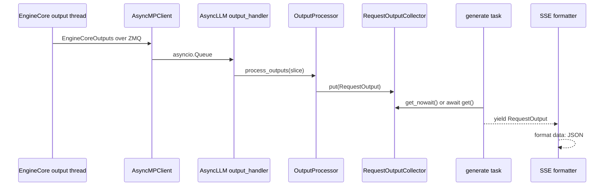

> **读图方法：** 这是“在线输出”的时序图。先从左到右确认参与者分别负责什么，再从上到下追踪消息；第一遍只看正常路径，第二遍再看返回、异步消息和失败分支。

## 2.12 从请求到输出的完整在线时序

下面把前面所有局部拼成一条最小 happy path。为了保持清晰，图中省略 DP、multi-modal
cache 和 speculative decoding。

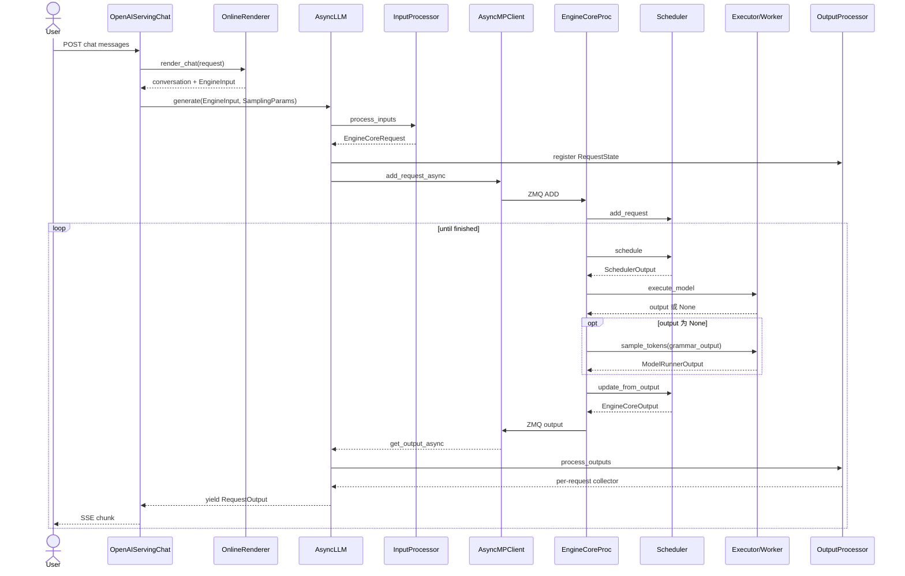

> **读图方法：** 这是“从请求到输出的完整在线时序”的时序图。先从左到右确认参与者分别负责什么，再从上到下追踪消息；第一遍只看正常路径，第二遍再看返回、异步消息和失败分支。

图中以 `EngineCore.step` 的非队列路径展开执行与采样；启用异步调度等配置时会选择
`step_with_batch_queue`，第 03、08 章再解释多批次在途。不要由本图推断每次提交后
CPU 都必须等到 GPU 完成才允许下一次调度。

这里最容易忽略的是：一次用户请求通常经历许多次 loop。只有 prefill 和若干次 decode
全部完成，或者遇到 EOS、stop、length、abort、error 等结束条件，生命周期才终止。

## 2.13 Busy loop、线程与队列

`EngineCoreProc` 为 ZMQ 包装器。它在初始化时创建：

- input socket thread：Socket -> decode/preprocess -> `input_queue`
- output socket thread：`output_queue` -> encode -> Socket
- 主线程 busy loop：处理 client request、执行 EngineCore step

输入/输出线程的意义不只是代码整洁。ZMQ I/O 会释放 GIL，序列化/反序列化也可与 GPU
执行发生部分重叠，从而减少主循环等待网络消息的时间。

busy loop 的骨架是：

```text
while shutdown state allows running:
    process input queue until work exists
    maybe publish DP load stats
    run one engine step
    maybe publish DP load stats again
```

当没有 work 时，`_process_input_queue()` 可以阻塞等待输入；有 work 后转为持续推进。
若本 step 没有实际模型执行，但 Scheduler 仍在等待远端 KV 等后台工作，代码会短暂
sleep 1ms，让后台 transfer thread 获得进展机会。

[源码] `vllm/v1/engine/core.py` - `EngineCoreProc.run_busy_loop`、
`_process_input_queue`、`_process_engine_step`

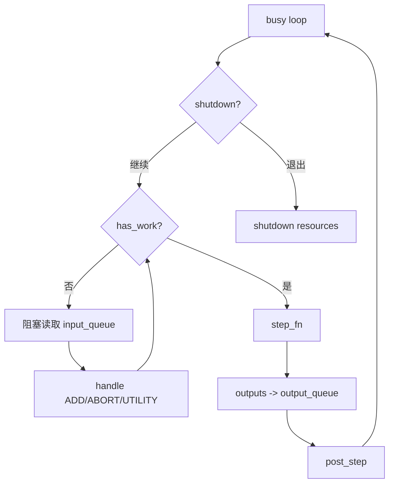

> **读图方法：** 这张图用于压缩“Busy loop、线程与队列”的整体关系。先从上向下找到起点、关键转换和终点，再问每条跨层箭头是否意味着函数调用、消息传递、内存访问或状态更新。

## 2.14 取消、stop string 与异常传播

> **本节先看：** 本节要回答：**取消、stop string 与异常传播**。下面的小节会逐层拆开概念、运行过程和源码落点；第一次阅读先抓对象之间的关系，第二次再记类名、字段和分支。

### 客户端断开

在线调用者断开连接时，处理 HTTP 的 task 或 `AsyncLLM.generate()` generator 会被
取消。`generate()` 捕获 `asyncio.CancelledError` / `GeneratorExit` 后调用：

```text
AsyncLLM.abort(internal=True)
  -> OutputProcessor.abort_requests
  -> EngineCoreClient.abort_requests_async
  -> ZMQ ABORT
  -> EngineCore.abort_requests
  -> Scheduler.finish_requests(FINISHED_ABORTED)
```

前端清理和后端清理缺一不可：

- 只清前端：GPU/KV 仍可能继续为无人消费的请求工作。
- 只清后端：前端 collector、detokenizer 和 ID mapping 仍可能泄漏。

### stop string 由前端发现

token 级 EOS 可以由 EngineCore 处理，但任意字符串 stop 依赖增量 detokenize 后的文本。
若 `OutputProcessor` 发现 stop string，而 `EngineCoreOutput.finished` 仍为 false，它先向
用户产生完成输出，再把内部 ID 放进 `reqs_to_abort`，由 Engine client 通知 Scheduler
清理剩余状态。

### EngineCore 或 output handler 出错

`AsyncLLM.output_handler` 捕获异常后调用 `OutputProcessor.propagate_error()`，把异常写入
所有活跃 request collector。每个 `generate()` task 在读取 collector 时重新抛出，避免
请求永久挂起。

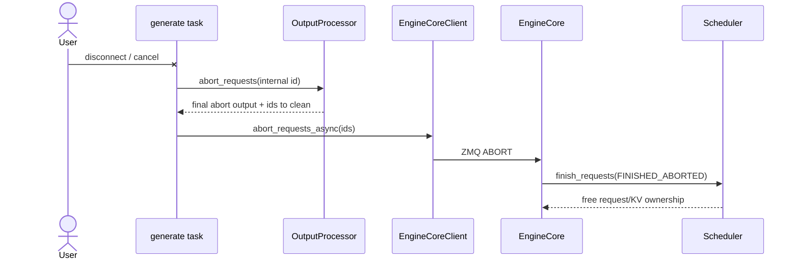

> **读图方法：** 这是“EngineCore 或 output handler 出错”的时序图。先从左到右确认参与者分别负责什么，再从上到下追踪消息；第一遍只看正常路径，第二遍再看返回、异步消息和失败分支。

[源码] `vllm/v1/engine/async_llm.py` - `AsyncLLM.generate`、`abort`、
`_run_output_handler`

[源码] `vllm/v1/engine/output_processor.py` - `abort_requests`、
`propagate_error`

[测试] `tests/v1/engine/test_async_llm.py` - `test_abort`

## 2.15 背压和队列不是同一回事

在线系统里至少有几种不同含义的“队列”：

| 队列/集合 | 所在层 | 作用 |
|---|---|---|
| API 并发 task | API Server | 等待/处理 HTTP 请求 |
| `RequestOutputCollector` | 每请求前端 | 交付增量输出，并可合并 delta |
| client `outputs_queue` | EngineCoreClient | 接收跨进程 EngineCoreOutputs |
| EngineCore `input_queue` | EngineCoreProc | Socket thread 向 busy loop 交接消息 |
| EngineCore `output_queue` | EngineCoreProc | busy loop 向 output thread 交接结果 |
| Scheduler waiting/running | EngineCore | 决定请求何时获得 token/KV 预算 |

API 的 admission control 通过 `max_num_queued_reqs` 和
`max_num_queued_tokens` 在进入 EngineCore 前拒绝过量请求。`get_num_queued_tokens()` 当前
对仍在 prefill 的请求使用完整 `prompt_len`，不会减去 chunked prefill 已完成部分或
prefix hit，因为这些进度要到 prefill 完成后才传播给 API Server。这是保守估计：可能
更早拒绝，但有利于保护 TTFT。

不要把 admission queue、Scheduler waiting queue 和 output queue 混成一个指标。它们的
容量、所有者和拥塞表现完全不同。

[源码] `vllm/v1/engine/async_llm.py` - `AsyncLLM.check_admission`

[源码] `vllm/v1/engine/output_processor.py` - `get_num_queued_tokens`

## 2.16 配置怎样贯穿全系统

入口层接收大量 Python 参数或 CLI flags，最终汇聚到 `VllmConfig`。各层保存自己关心的
子配置引用：

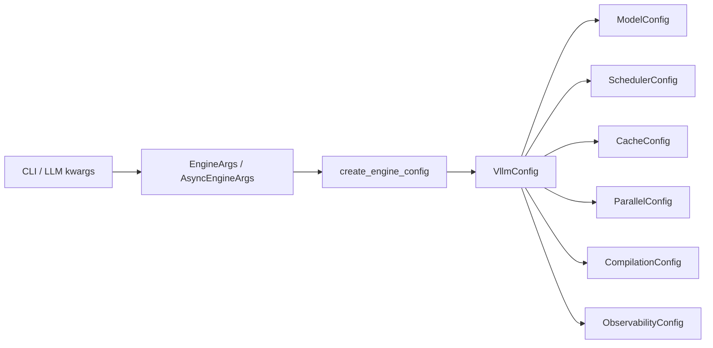

> **读图方法：** 阅读“配置怎样贯穿全系统”这张流程图时，先把方框看成对象或状态，把箭头看成数据或控制的移动。第一遍从左向右建立顺序，第二遍再核对分支发生的条件。

这种设计让 Model Runner 可以直接读取 compilation config，Scheduler 可以读取 cache
和 parallel 约束，而不必在每层 constructor 上继续增加参数。但代价是：一个配置字段
可能在很远的模块才真正产生行为，读源码必须同时追踪“字段定义、默认值推导、校验、
消费位置”。第 03 章会完整展开配置初始化顺序。

## 2.17 最小可运行生命周期模拟器

本项目提供一个不依赖 PyTorch、CUDA 或 vLLM 安装的教学模拟器：

- [源码](../../examples/ch02_request_lifecycle.py)
- [测试](../../tests/test_ch02_request_lifecycle.py)

它保留了以下真实边界：

```text
raw prompt
  -> EngineInput
  -> EngineCoreRequest
  -> CoreRequestState
  -> SchedulerOutput
  -> ModelRunnerOutput
  -> EngineCoreOutput
  -> RequestOutput
```

它故意省略真实模型、KV Cache、batch packing 和 ZMQ，只用确定性的 token plan 展示：

- 离线请求怎样持续 step 并只返回最终结果。
- 在线请求怎样每 step 返回 delta。
- internal ID 怎样用于 core，external ID 怎样返回用户。
- abort 怎样产生最终完成状态。
- 前端为什么应在提交到 core 前注册本地 state。

运行：

```bash
python3 examples/ch02_request_lifecycle.py
python3 -m unittest tests/test_ch02_request_lifecycle.py
```

2026-09-07 在本项目环境中的输出：

```text
offline final outputs:
  req-A: 它让推理 (length)
  req-B: 它让推理更高效。 (length)
online stream:
  step 1: ['它']
  step 2: ['让']
  step 3: ['推理']
  abort: [('', 'abort')]
```

八个测试覆盖以下边界：

1. 离线结果保持提交顺序，外部 ID 的字典顺序不决定返回顺序。
2. 在线结果按 token delta 交付。
3. core 使用内部 ID，用户仍看到外部 ID。
4. 前端 state 在 core submission 前已经存在。
5. prompt + output 超过教学模型长度时被拒绝。
6. 重复外部 ID 不会混淆两次提交的输出顺序。
7. `max_tokens` 大于六个 token 的初始响应计划时，不会被意外提前截断。
8. 最后一个请求取消后，仍交付 abort 输出并清理前端状态。

教学响应计划会循环使用固定六个 token，直到达到请求上限；它只验证长度和状态推进，
没有语言生成质量含义。提交顺序由内部 ID 对应的序号记录，而不是对用户 ID 做排序。

[源码] `vllm/entrypoints/offline_utils.py` - `OfflineInferenceMixin._add_request`、`_run_engine`

真实 `LLM.generate` 用递增数值 ID 记录输入顺序，最终按该数值排序；本项目教学程序
允许自定义外部 ID，因此需要另记提交序号。两种实现的目标都是保持输入顺序。

还有一处刻意简化：教学 `InputProcessor` 直接拒绝 prompt 加请求输出上限超过模型
长度的组合；真实 `InputProcessor` 主要校验 prompt，并只在 `max_tokens` 未指定时
补默认值，执行侧再通过长度停止条件限制生成。不要把教学异常当作所有在线/离线
入口都会执行的同一校验。Core 也保留教学用终态记录，不模拟完整后台资源回收。

[源码] `vllm/v1/engine/input_processor.py` - `InputProcessor._validate_prompt_len`、`process_inputs`

[源码] `vllm/v1/core/sched/utils.py` - `check_stop`

这个模拟器不能证明 vLLM 性能，也不能代替 GPU 集成测试。它的作用是让读者在进入
复杂源码前，先看见对象所有权和状态转换。

## 2.18 源码逐跳核对

下面把在线 happy path 的每条边落实到当前 revision。

| 跳转 | 源码证据 | 关键观察 |
|---|---|---|
| HTTP request -> render | `OpenAIServingChat._create_chat_completion` | 调用 `render_chat_request`，生成 `engine_inputs` |
| render -> EngineInput | `OnlineRenderer.render_chat`、`BaseRenderer.render_chat_async` | template、tokenize、process for engine |
| EngineInput -> engine generator | `OpenAIServingChat._create_chat_completion` | 调用 `engine_client.generate(...)` |
| generator -> EngineCoreRequest | `AsyncLLM.add_request`、`InputProcessor.process_inputs` | 校验并构造 request |
| 注册前端 state | `AsyncLLM._add_request` | 第一次 await 前调用 `OutputProcessor.add_request` |
| request 跨进程 | `AsyncMPClient.add_request_async` | msgpack + ZMQ multipart |
| wire request -> Request | `EngineCoreProc.process_input_sockets`、`preprocess_add_request` | input thread 中完成反序列化与初始化 |
| Request -> Scheduler | `EngineCore.add_request` | `scheduler.add_request(request)` |
| Scheduler -> Worker | `EngineCore.step` | `schedule()` 后 `execute_model(non_block=True)` |
| Worker -> Scheduler | `EngineCore.step` | `update_from_output(scheduler_output, model_output)` |
| core output 跨进程 | `EngineCoreProc.process_output_sockets` | msgpack/ZMQ，按 `client_index` 发送 |
| output -> text | `OutputProcessor.process_outputs` | detokenize、stop、logprobs、完成清理 |
| text -> per-request stream | `AsyncLLM._run_output_handler` | collector `put()` |
| stream -> SSE | `chat_completion_stream_generator` | `data: JSON\n\n` |

## 2.19 设计取舍

> **本节先看：** 下面不只说明代码怎样写，还解释为什么采用这种边界。比较每个方案时，同时考虑正确性、复杂度、显存和性能。

### 为什么 tokenization 留在前端

> **本节先看：** 下面先给出“为什么 tokenization 留在前端”的结论清单。先理解每一项为什么存在，再记参数名或实现细节。

- API Server 已经拥有 tokenizer 和用户协议上下文。
- 阻塞预处理可以放进前端线程池，不占用 EngineCore busy loop。
- EngineCore 只接收更稳定的 token/request 契约。
- 多 API Server 可以扩展 CPU 预处理能力。

代价是 tokenizer、Renderer cache 和 OutputProcessor state 占用前端 CPU/内存，而且
多前端时需要 request 路由和 `client_index`。

### 为什么 Scheduler 与模型执行分层

Scheduler 操作 request 状态、预算和 block metadata；Model Runner 操作 tensor 和 device
执行。分层使调度算法可以在 CPU 上快速变化，也让不同 accelerator/backend 复用同一
请求语义。

### 为什么输出处理回到前端

> **本节先看：** 下面先给出“为什么输出处理回到前端”的结论清单。先理解每一项为什么存在，再记参数名或实现细节。

- detokenization 和 stop string 是字符串/协议问题。
- 在线输出需要每请求异步队列和 HTTP streaming。
- 避免 EngineCore 被 JSON、tool parser 等复杂前端逻辑拖慢。

代价是 EngineCore 和前端都拥有一份与请求相关的状态，abort 和完成必须双边一致清理。

### 为什么新请求与 cached request 在 `SchedulerOutput` 中分开

Worker 会缓存请求的稳定数据。第一次调度发送完整 `NewRequestData`，后续 step 只发送
token、block 和计数差异，降低 CPU 序列化及进程通信成本。第 07 章会展开 persistent
batch 如何消费这些增量。

## 2.20 常见误解

> **本节先看：** 下面集中修正最容易由名称或旧版本经验造成的误解。先判断自己原来的理解，再用后面的源码事实校正。

### 误解 1：`LLMEngine` 就是 Scheduler

不是。`LLMEngine` 是前端兼容门面，持有 InputProcessor、OutputProcessor 和
EngineCoreClient。Scheduler 位于 EngineCore 内部。

### 误解 2：API Server 只是 HTTP 转发器

不是。它承担模型检查、chat template、tokenization、多模态预处理、参数转换、输出
协议、tool/reasoning parsing、streaming 和取消传播。

### 误解 3：一次请求只调用一次模型

通常不是。请求至少经历 prefill，随后每个 decode step 再次参与调度和执行，直到结束。

### 误解 4：所有在线对象都在一个 asyncio event loop

不是。API Server 有 asyncio task；EngineCoreProc 有独立进程、input/output 线程和
busy loop；Worker 是否独立进程取决于 executor backend；GPU kernel 在 device 上执行。

### 误解 5：每张 GPU 必然对应一个额外 Worker 进程

当前单 rank `UniProcExecutor` 直接在 EngineCore 进程内创建 Worker。应区分逻辑 Worker
和进程部署。

### 误解 6：EngineCoreOutput 已经是最终文本

不是。它的核心仍是 `new_token_ids`。OutputProcessor 才做增量 detokenization 和文本
stop 检查。

### 误解 7：abort 只需要停止 HTTP stream

不够。还必须释放 OutputProcessor state、Scheduler request、KV block 及相关 connector
资源。

### 误解 8：官方设计文档永远等同于当前代码

设计文档提供总体意图，但可能保留历史类名或概括部署。当前行为要以锁定 revision 的
构造和调用路径为准。本章对 UniProc Worker 进程边界的修正就是一个例子。

## 2.21 阅读与调试指南

遇到一次请求“卡住”“没有输出”或“取消后仍占显存”，不要从 CUDA kernel 开始。按
数据形态逐层定位：

| 观察点 | 要确认什么 | 典型源码 |
|---|---|---|
| API 入口 | schema、model、max_tokens 是否通过 | OpenAI serving |
| Renderer | chat template 后 prompt/token 是否正确 | `renderers/` |
| InputProcessor | 长度、token、params、internal ID | `vllm/v1/engine/input_processor.py` |
| EngineCoreClient | ADD 是否发送、client 是否 alive | `vllm/v1/engine/core_client.py` |
| Engine input thread | 是否 decode/preprocess 并入队 | `vllm/v1/engine/core.py::process_input_sockets` |
| Scheduler | request 在 waiting/running/finished 哪一处 | 第 04 章 |
| Executor | `SchedulerOutput` 是否被执行 | 第 07 章 |
| Engine output thread | output 是否按 client index 发回 | `process_output_sockets` |
| OutputProcessor | state 是否存在、是否被 stop/abort | `vllm/v1/engine/output_processor.py` |
| SSE formatter | 是否产生 JSON chunk 与 `[DONE]` | chat serving |

一个实用规则是始终打印或记录同一个 internal request ID。外部 ID 可能映射到多个 child，
只用外部 ID 很难区分并行 sampling 的状态。

## 2.22 静态验证与运行限制

本章完成了三类验证：

1. **源码静态核对**：从两个入口逐跳走到 EngineCore、执行层和输出层。
2. **上游测试交叉验证**：检查 collector merge、abort、final-step abort 竞争等测试。
3. **CPU 教学实验**：运行生命周期模拟器及 8 个单元测试。

当前机器没有安装可用的 PyTorch/CUDA/vLLM GPU runtime，因此未完成以下动态验证：

- 启动真实 OpenAI-compatible server 并采集 PID/thread/ZMQ 拓扑。
- 运行真实模型，记录一个请求跨进程的时间线。
- 在 GPU forward 中途取消请求，观察显存和 KV usage 回落。
- 对比 `InprocClient`、`SyncMPClient` 和 `AsyncMPClient` 的真实调用栈。

因此本章 `content_complete=true`，但 `runtime_verified=false`，状态保持 `draft`。

## 2.23 本章小结

一个生成请求不是“调用模型然后返回字符串”，而是一条跨层生命周期：

```text
用户协议
  -> Renderer
  -> EngineInput
  -> InputProcessor
  -> EngineCoreRequest
  -> EngineCoreClient / IPC
  -> Request / Scheduler
  -> SchedulerOutput
  -> Executor / Worker / GPU
  -> ModelRunnerOutput
  -> EngineCoreOutput
  -> OutputProcessor
  -> RequestOutput
  -> Python return 或 SSE
```

离线与在线路径共享 EngineCore 之后的大部分后端。默认两者的 EngineCoreProc 都在
后台推进；离线前端循环调用 `LLMEngine.step()` 同步取结果，在线前端用异步 output
handler 分发结果。只有显式关闭多进程的离线 `InprocClient` 路径，调用线程才直接
执行 `EngineCore.step_fn()`。

[源码] `vllm/v1/engine/llm_engine.py` - `LLMEngine.from_engine_args`、`step`

[源码] `vllm/v1/engine/core_client.py` - `InprocClient.get_output`、`SyncMPClient.get_output`

理解 vLLM 源码时必须同时问四个问题：当前对象拥有什么状态、运行在哪个并发边界、
输入输出是什么数据形态、完成或取消时由谁清理。只记住类名不能回答这些问题。

## 2.24 自检问题

第一遍先完成前 5 题；余下题目是第二遍源码阅读的扩展题库，不要求一次做完。

> **本节先看：** 建议先不看答案，用自己的话回答下面的问题。能够解释原因、画出数据流并指出源码位置，才算真正理解。

1. Renderer 与 InputProcessor 的职责差异是什么？
2. 为什么 `EngineCoreRequest` 到 EngineCore 后还要转成 `Request`？
3. `LLM.generate()` 为什么能保持输入顺序，即使请求完成顺序不同？
4. 在线路径为什么先注册 OutputProcessor state，再 await 跨进程提交？
5. `InprocClient` 与 `AsyncMPClient` 的核心差异是什么？
6. 为什么不能断言“一张 GPU 一定多一个 Worker 进程”？
7. `SchedulerOutput` 与 `EngineCoreOutput` 分别描述哪个方向的数据？
8. OutputProcessor 在什么情况下会反向要求 EngineCore abort？
9. 客户端取消时为什么需要前后端双边清理？
10. `RequestOutputCollector` 为什么会合并 DELTA 输出？

## 2.25 源码追踪题

> **本节先看：** 这些题目要求把概念重新落到代码。先从给出的入口搜索定义和调用点，再记录对象、状态与边界，不要只找到同名符号。

1. 从 `LLM.generate()` 出发，找到真正的 `while has_unfinished_requests()` 循环。
2. 从 `OpenAIServingChat._create_chat_completion()` 出发，找到
   `AsyncLLM.generate()` 的调用点。
3. 追踪一个 `EngineCoreRequest` 如何被 msgpack 编码、在 input thread 解码并转成
   `Request`。
4. 找到 `EngineCore.step()` 中处理 abort 与 `update_from_output()` 的先后顺序，并说明
   对应测试。
5. 找到 `OutputProcessor.process_outputs()` 中在线 queue 与离线 return list 的分叉。
6. 从 `ParallelConfig` 找到单 rank默认 `"uni"`，再追踪到
   `UniProcExecutor._init_executor()`。

## 2.26 参考答案

<details>
<summary>1. Renderer 与 InputProcessor</summary>

Renderer 面向用户语义，负责模板化、tokenization 和多模态 processing，产出
`EngineInput`。InputProcessor 面向 EngineCore 契约，负责参数与长度校验、request-local
参数补全以及构造 `EngineCoreRequest`。
</details>

<details>
<summary>2. 为什么还要构造 Request</summary>

`EngineCoreRequest` 是可序列化的提交消息；`Request` 是 EngineCore 内持续变化的运行
状态，包含 status、computed/output token、block hash、preemption、in-flight token 等。
</details>

<details>
<summary>3. 离线返回顺序</summary>

`OfflineInferenceMixin._run_engine()` 只收集 finished output，循环结束后按整数 request ID
排序。request ID 按输入遍历顺序由 counter 生成。
</details>

<details>
<summary>4. 为什么先注册前端状态</summary>

这样并发 task、取消逻辑和可能很快返回的 output 都能找到本地 RequestState；源码明确
要求在第一次 await 前完成注册。
</details>

<details>
<summary>5. Client 差异</summary>

`InprocClient` 直接调用同进程 EngineCore，并由调用者触发 step；`AsyncMPClient` 使用
msgpack/ZMQ 与后台 EngineCoreProc 通信，通过 asyncio queue 异步接收输出。
</details>

<details>
<summary>6. Worker 进程边界</summary>

单 rank 默认 `UniProcExecutor`，它在 EngineCore 进程内实例化 WorkerWrapperBase。只有
mp、Ray 等 backend 才把 Worker 放进其他进程。
</details>

<details>
<summary>7. 两个 Output</summary>

`SchedulerOutput` 从控制面发往执行侧，描述本 step 要算哪些 request/token/block；
`EngineCoreOutput` 从 EngineCore 发回前端，描述每个请求新产生的 token 和完成状态。
</details>

<details>
<summary>8. 前端触发 abort</summary>

当增量 detokenization 发现 stop string，而 EngineCore 尚未把请求标记 finished 时，
OutputProcessor 生成用户完成输出，并把内部 ID 放入 `reqs_to_abort`。
</details>

<details>
<summary>9. 双边清理</summary>

前端拥有 collector、detokenizer 和 ID mapping；后端拥有 Scheduler、KV Cache 和 Worker
状态。只清理一侧都会产生泄漏或无效计算。
</details>

<details>
<summary>10. DELTA 合并</summary>

当 producer 快于 consumer 时，合并多个 delta 能限制前端输出积压和 task 切换，同时
保留已经生成的文本、token、logprobs 以及不同 choice index。
</details>

## 2.27 源码与资料索引

> **本节先看：** 下面按主题整理本章使用的证据入口。需要复核结论时，优先按路径和符号定位，不依赖可能漂移的行号。

- `vllm/entrypoints/llm.py`
  - `LLM.generate`
- `vllm/entrypoints/offline_utils.py`
  - `OfflineInferenceMixin._add_completion_requests`
  - `OfflineInferenceMixin._run_completion`
  - `OfflineInferenceMixin._run_engine`
- `vllm/entrypoints/openai/chat_completion/serving.py`
  - `OpenAIServingChat.create_chat_completion`
  - `OpenAIServingChat._create_chat_completion`
  - `OpenAIServingChat.chat_completion_stream_generator`
- `vllm/renderers/base.py`
  - `BaseRenderer.render_cmpl`
  - `BaseRenderer.render_chat`
- `vllm/renderers/online_renderer.py`
  - `OnlineRenderer.render_chat`
- `vllm/v1/engine/input_processor.py`
  - `InputProcessor.process_inputs`
  - `InputProcessor.assign_request_id`
- `vllm/v1/engine/llm_engine.py`
  - `LLMEngine.add_request`
  - `LLMEngine.step`
- `vllm/v1/engine/async_llm.py`
  - `AsyncLLM.add_request`
  - `AsyncLLM.generate`
  - `AsyncLLM._run_output_handler`
  - `AsyncLLM.abort`
- `vllm/v1/engine/core_client.py`
  - `EngineCoreClient.make_client`
  - `InprocClient`
  - `SyncMPClient`
  - `AsyncMPClient`
- `vllm/v1/engine/core.py`
  - `EngineCore.preprocess_add_request`
  - `EngineCore.add_request`
  - `EngineCore.step`
  - `EngineCoreProc.run_busy_loop`
  - `EngineCoreProc.process_input_sockets`
  - `EngineCoreProc.process_output_sockets`
- `vllm/v1/engine/output_processor.py`
  - `RequestOutputCollector`
  - `OutputProcessor.process_outputs`
  - `OutputProcessor.abort_requests`
- `vllm/v1/request.py`
  - `Request`
  - `RequestStatus`
- `vllm/v1/core/sched/output.py`
  - `SchedulerOutput`
- `vllm/v1/executor/abstract.py`
  - `Executor.get_class`
- `vllm/v1/executor/uniproc_executor.py`
  - `UniProcExecutor`
- `tests/v1/engine/test_output_processor.py`
- `tests/v1/engine/test_async_llm.py`
- `tests/v1/engine/test_abort_final_step.py`
- `docs/design/arch_overview.md`
- [本项目第 2 章模拟器](../../examples/ch02_request_lifecycle.py)
- [本项目第 2 章测试](../../tests/test_ch02_request_lifecycle.py)
- [第 2 章实验记录](../../experiments/ch02-request-lifecycle.md)
- [全书章节源码映射](../../meta/chapter-source-map.md)

## 完成状态

> **本节先看：** 这里区分正文完成、静态源码核对和真实 GPU 运行验证。没有执行过的实验不会因为正文完整就被标记为已验证。

- [x] 对比 offline 与 online 两条入口。
- [x] 逐跳追踪 Renderer、InputProcessor、EngineCoreClient、EngineCore 和 OutputProcessor。
- [x] 区分七种关键数据形态。
- [x] 标出 asyncio、线程、ZMQ、进程和 GPU 边界。
- [x] 修正单 GPU `UniProcExecutor` 下 Worker 并非独立进程的过度概括。
- [x] 覆盖 stop string、client cancel、final-step abort 和 output handler error。
- [x] 提供可运行生命周期模拟器和 8 个单元测试。
- [ ] 在真实 NVIDIA GPU 上采集 online/offline 运行 trace。
- [ ] 由独立审阅者复核后将状态改为 `verified`。

本章内容已经完整，`content_complete=true`。由于当前环境没有真实 vLLM GPU runtime，
`runtime_verified=false`，按本项目规则保持 `draft`。
