# 第03章 Engine 与 EngineCore

> Engine 如何把持续到来的请求，变成一轮轮可执行、可取消、可排空的 GPU 工作？

## 本章定位

第 02 章沿着一次请求走完了端到端路径。本章把镜头固定在中间的控制面：

```text
LLMEngine / AsyncLLM
        <-> EngineCoreClient
        <-> EngineCore / EngineCoreProc
        <-> Scheduler + Executor
```

这一层不实现 Transformer 数学，也不负责把 token 解码成最终文本。它解决的是另一组
系统问题：配置如何汇合、前后端怎样隔离、谁驱动主循环、一轮执行何时算完成、GPU
执行期间到达的 abort 怎样生效、多个 batch 如何保持在途，以及进程退出或 worker
故障如何被前端看见。

本章绑定源码 revision `5893426b88f7b3cd21101d194eb1c6f0a6f0e27b`。文中区分：

- **源码事实**：可在固定 revision 的实现或测试中直接定位。
- **设计含义**：由多个源码事实推导出的工程解释。
- **教学模型**：随书最小实现，用于验证控制流，不等价于完整 vLLM。

## 阅读目标

读完本章后，你应该能够：

1. 区分 `LLMEngine`、`AsyncLLM`、`EngineCoreClient`、`EngineCore` 和
   `EngineCoreProc`。
2. 解释 `EngineArgs -> VllmConfig -> Executor -> EngineCore` 初始化链。
3. 根据 multiprocessing、asyncio 和 data parallel 配置判断 client 类型。
4. 逐步解释 `EngineCore.step()` 的 schedule、execute、sample、abort、update。
5. 说明 `non_block=True` 为什么不必然意味着调用者不阻塞。
6. 画出 input socket thread、core busy loop、output socket thread 的协作关系。
7. 解释 batch queue 如何保持多个 batch 在途，并按 FIFO 结算。
8. 区分 abort、pause、sleep、shutdown 和 executor failure。
9. 说明 Ray `EngineCoreActor` 复用了什么，又替换了什么。

## 如何阅读本章

可以把 EngineCore 看成推理系统的主控循环，而不是“另一个模型类”。它反复做三件事：
接收新请求，向 Scheduler 询问本轮工作，把工作交给 Executor 并结算结果。先掌握这个
循环，再研究同步、异步和多进程版本如何改变等待方式。

阅读状态机和队列代码时，建议在纸上保留三栏：新输入、在途 batch、已返回结果。每看到
一次 enqueue、dequeue、schedule 或 update，就把对象在三栏之间移动。这样比记忆每个
成员变量更容易发现背压、乱序结果和 shutdown 的真实含义。

本章涉及的“异步”主要是控制流并发，不等于 GPU kernel 自动并行。看到 async、线程或
ZMQ 时先问“谁可以继续做别的工作”，再问“结果由谁、在何时确认”。

**先理解 Future。** Future 像一张取货凭证：拿到它表示有地方领取结果；
`.result()` 可能需要等待，也可能立刻得到已经完成的结果。队列的 enqueue/dequeue
就是入队/出队；FIFO 表示先进先出，RPC 表示经通信边界请求另一端调用方法。

**第一遍走法：** 读 3.1、3.3–3.4、3.8–3.11，再运行 3.18；配置回写、pause 和 Ray
留作第二遍。**停下来追：** 前端 `LLMEngine.step()` 正在等结果，后端还能继续工作吗？
默认 SyncMPClient 可以，因为后端有独立 busy loop；InprocClient 则由同一调用链推进。

## 3.1 Engine 不是 EngineCore

源码里最容易产生误解的词是 “Engine”。不同类名字接近，却处在不同责任层。

| 组件 | 面向谁 | 持有的核心状态 | 不负责什么 |
|---|---|---|---|
| `LLMEngine` | 同步离线调用者 | Renderer、输入/输出处理器、client | 不直接运行 Scheduler 算法 |
| `AsyncLLM` | 在线 asyncio 服务 | collector、output handler、client | 不直接轮询 ZMQ socket |
| `EngineCoreClient` | Engine 前端 | IPC、进程管理、输出接收、utility RPC | 不决定本轮算哪些 token |
| `EngineCore` | 控制面内核 | Scheduler、Executor、KV 配置、batch queue | 不做 tokenization、SSE |
| `EngineCoreProc` | 多进程运行壳 | ZMQ 线程、队列、busy loop、shutdown state | 不替代 EngineCore 算法 |

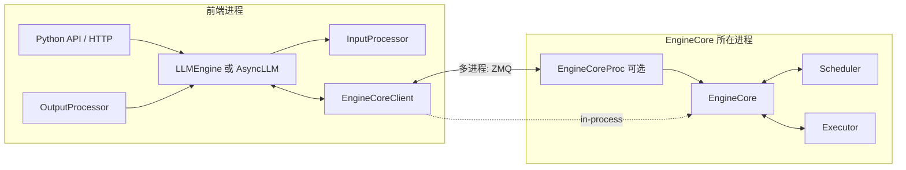
```mermaid
flowchart LR
    subgraph Frontend[前端进程]
        API[Python API / HTTP]
        FE[LLMEngine 或 AsyncLLM]
        IP[InputProcessor]
        OP[OutputProcessor]
        CL[EngineCoreClient]
        API --> FE
        FE --> IP
        OP --> FE
        FE <--> CL
    end
    subgraph CoreSide[EngineCore 所在进程]
        PROC[EngineCoreProc 可选]
        CORE[EngineCore]
        SCH[Scheduler]
        EX[Executor]
        PROC --> CORE
        CORE <--> SCH
        CORE <--> EX
    end
    CL <-->|多进程: ZMQ| PROC
    CL -. in-process .-> CORE
```

> **读图方法：** 阅读“Engine 不是 EngineCore”这张流程图时，先把方框看成对象或状态，把箭头看成数据或控制的移动。第一遍从左向右建立顺序，第二遍再核对分支发生的条件。

**源码事实：** `LLMEngine` 的类注释是 “Legacy LLMEngine for backwards
compatibility”。Legacy 指同步兼容门面，不代表它连接的是旧 V0 内核。当前类依然创建
V1 `InputProcessor`、`OutputProcessor` 和 `EngineCoreClient`。

阅读时不要笼统地问“Engine 在哪里”，而要问：当前方法位于用户协议侧、client 侧还是
core 侧？它是在提交工作、推进工作，还是接收结果？这次调用是否跨线程、跨进程或跨
设备？

### 在线路径为什么把 EngineCore 放在独立进程？

把 Scheduler 循环放进 `asyncio.create_task()`，并不会自动让其中的同步 CPU 工作
让出事件循环。将前端请求处理与 EngineCore 主循环分开，可以让两侧独立推进；常见
启用 GIL 的 CPython 部署也可减少解释器锁竞争。这是对源码分工的工程解释，不是
未经测量就断言必有某个毫秒数的改善。离线还保留显式关闭多进程的 InprocClient。

进程隔离也提供故障检测边界，但**不等于自动恢复服务**。当前
`MPClient.start_engine_core_monitor` 发现 core 意外退出后标记 `engine_dead` 并清理，
后续操作抛 `EngineDeadError`。API 可报告错误；已经开始的流式响应不能再把 HTTP
状态改为 500。默认故障退出逻辑还会要求服务退出，没有在这里安全重建引擎的保证。

[源码] `vllm/v1/engine/core_client.py` - `MPClient.start_engine_core_monitor`

[源码] `vllm/entrypoints/serve/exception_handling/handlers/vllm_error.py` - `engine_error_handler`

[源码] `vllm/entrypoints/launchers/launcher.py` - `terminate_if_errored`

## 3.2 配置对象怎样诞生

用户看到的是大量 CLI 或 Python 参数，例如模型名、dtype、最大 batch token 数、TP/PP
大小、KV cache dtype 和 CUDA Graph 模式。内核不适合携带几百个散落参数，因此
`EngineArgs.create_engine_config()` 会把它们整理为一个 `VllmConfig` 聚合对象。

### 3.2.1 不是把字典塞进 dataclass

`create_engine_config()` 的工作包括：

1. 让当前 platform 预注册并修正参数。
2. 校验环境变量。
3. 创建 `ModelConfig`，由模型信息推导 tokenizer、dtype、最大长度等。
4. 解析 cache、parallel、scheduler、compilation、observability 等子配置。
5. 根据硬件、usage context 和功能组合补默认值。
6. 构造 `VllmConfig`，触发跨配置一致性检查。

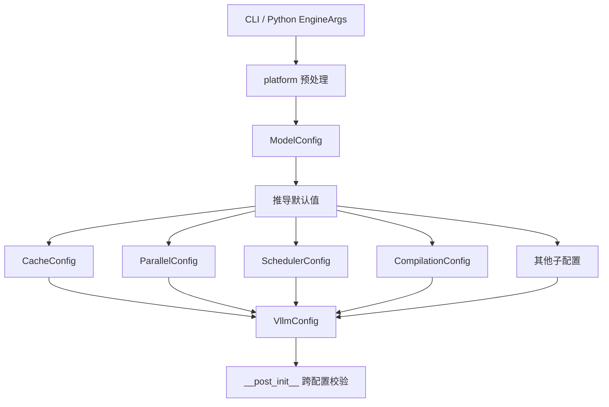
```mermaid
flowchart TB
    A[CLI / Python EngineArgs] --> P[platform 预处理]
    P --> M[ModelConfig]
    M --> D[推导默认值]
    D --> C1[CacheConfig]
    D --> C2[ParallelConfig]
    D --> C3[SchedulerConfig]
    D --> C4[CompilationConfig]
    D --> C5[其他子配置]
    C1 --> V[VllmConfig]
    C2 --> V
    C3 --> V
    C4 --> V
    C5 --> V
    V --> X[__post_init__ 跨配置校验]
```

> **读图方法：** 这张图用于压缩“不是把字典塞进 dataclass”的整体关系。先从上向下找到起点、关键转换和终点，再问每条跨层箭头是否意味着函数调用、消息传递、内存访问或状态更新。

`VllmConfig` 保留多个领域子配置，而不是变成扁平参数表：

| 子配置 | 主要回答的问题 |
|---|---|
| `ModelConfig` | 加载什么模型、长度和架构是什么 |
| `CacheConfig` | KV 用多少显存、block 多大、是否 prefix cache |
| `ParallelConfig` | TP/PP/DP/EP 等拓扑如何组织 |
| `SchedulerConfig` | 一轮最多多少请求和 token、调度策略是什么 |
| `CompilationConfig` | eager、compile、CUDA Graph 如何配置 |
| `ObservabilityConfig` | trace、metrics 和迭代详情如何采集 |

这种结构使各模块读取自己的领域配置，同时仍能在 `VllmConfig.__post_init__()` 做跨领域
约束。模型能力、并行方式、KV connector 与 CUDA Graph 组合不能总是独立决定。

### 3.2.2 启动后配置还会回写

前端创建 `VllmConfig` 时，尚不知道模型加载后究竟还剩多少 GPU 显存给 KV cache。
`EngineCore._initialize_kv_caches()` 会 profile 内存，计算 block 数，并可能因 auto-fit
调小 `max_model_len`。

多进程模式下，EngineCore 通过 `EngineCoreReadyResponse` 把最终的
`max_model_len`、`num_gpu_blocks`、`block_size`、dtype 和并行大小回传给 client；client
再同步前端配置。因此“配置对象已构造”不等于“所有运行时容量已定值”。

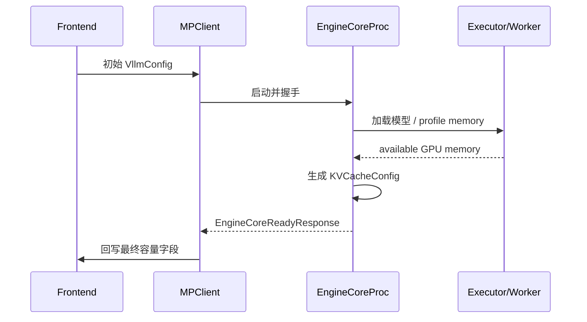
```mermaid
sequenceDiagram
    participant F as Frontend
    participant C as MPClient
    participant E as EngineCoreProc
    participant W as Executor/Worker
    F->>C: 初始 VllmConfig
    C->>E: 启动并握手
    E->>W: 加载模型 / profile memory
    W-->>E: available GPU memory
    E->>E: 生成 KVCacheConfig
    E-->>C: EngineCoreReadyResponse
    C->>F: 回写最终容量字段
```

> **读图方法：** 这是“启动后配置还会回写”的时序图。先从左到右确认参与者分别负责什么，再从上到下追踪消息；第一遍只看正常路径，第二遍再看返回、异步消息和失败分支。

## 3.3 两个前端门面怎样驱动内核

> **本节先看：** 本节要回答：**两个前端门面怎样驱动内核**。下面的小节会逐层拆开概念、运行过程和源码落点；第一次阅读先抓对象之间的关系，第二次再记类名、字段和分支。

### 3.3.1 同步 `LLMEngine`

同步离线前端由调用线程循环取结果；默认后台 EngineCore 独立推进：

```text
add_request(...)
while has_unfinished_requests():
    outputs = llm_engine.step()
```

`LLMEngine.step()` 本身不实现模型计算。它做四件事：

1. 从 `engine_core.get_output()` 获取一组 `EngineCoreOutputs`。
2. 交给 `OutputProcessor.process_outputs()` 做 detokenization 和用户输出组装。
3. 把 stop string 等前端条件产生的 `reqs_to_abort` 发回 core。
4. 记录 scheduler 与 iteration metrics。

若 client 是 `InprocClient`，`get_output()` 会直接调用 `EngineCore.step_fn()`；若是
`SyncMPClient`，它会阻塞等待后台输出线程把 ZMQ 消息放入本地 queue。

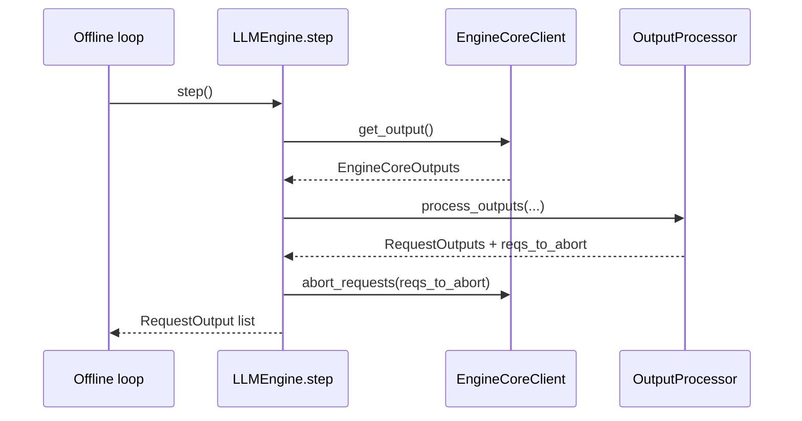
```mermaid
sequenceDiagram
    participant U as Offline loop
    participant L as LLMEngine.step
    participant C as EngineCoreClient
    participant O as OutputProcessor
    U->>L: step()
    L->>C: get_output()
    C-->>L: EngineCoreOutputs
    L->>O: process_outputs(...)
    O-->>L: RequestOutputs + reqs_to_abort
    L->>C: abort_requests(reqs_to_abort)
    L-->>U: RequestOutput list
```

> **读图方法：** 这是“同步 `LLMEngine`”的时序图。先从左到右确认参与者分别负责什么，再从上到下追踪消息；第一遍只看正常路径，第二遍再看返回、异步消息和失败分支。

### 3.3.2 异步 `AsyncLLM`

在线服务不能让每个 HTTP coroutine 各自调用全局 step。`AsyncLLM` 使用后台 output
handler：

- `generate()` 为请求建立 collector，并提交到 `AsyncMPClient`。
- EngineCoreProc 自己运行 busy loop。
- output handler 持续 `await engine_core.get_output_async()`。
- OutputProcessor 把请求结果推入对应 collector。
- 每个 `generate()` coroutine 只消费自己的 collector 并 yield。

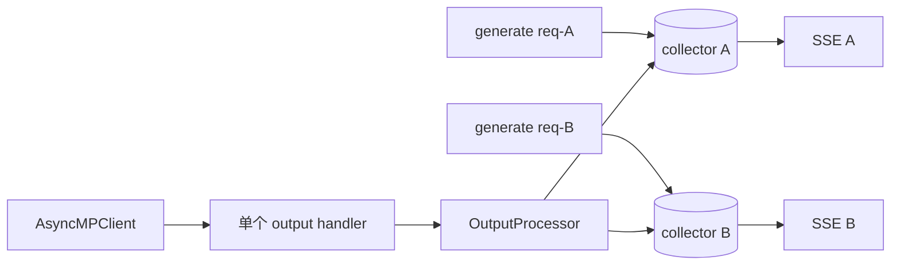
```mermaid
flowchart LR
    G1[generate req-A] --> Q1[(collector A)]
    G2[generate req-B] --> Q2[(collector B)]
    MP[AsyncMPClient] --> H[单个 output handler]
    H --> OP[OutputProcessor]
    OP --> Q1
    OP --> Q2
    Q1 --> S1[SSE A]
    Q2 --> S2[SSE B]
```

> **读图方法：** 这张图用于压缩“异步 `AsyncLLM`”的整体关系。先从左向右找到起点、关键转换和终点，再问每条跨层箭头是否意味着函数调用、消息传递、内存访问或状态更新。

output handler 按 `VLLM_V1_OUTPUT_PROC_CHUNK_SIZE` 切分大输出批次，并在 chunk 之间
`await asyncio.sleep(0)`，避免一次 CPU 输出处理长期占用 event loop。这里优化的是前端
公平性，不是 GPU batch 大小。

## 3.4 Client 工厂：四种组合，三条有效路径

`EngineCoreClient.make_client()` 的关键决策是 multiprocessing 与 asyncio：

| multiprocessing | asyncio | 结果 |
|---:|---:|---|
| false | false | `InprocClient` |
| true | false | `SyncMPClient` |
| true | true | `AsyncMPClient` 或 DP 变体 |
| false | true | 不支持，抛出 `NotImplementedError` |

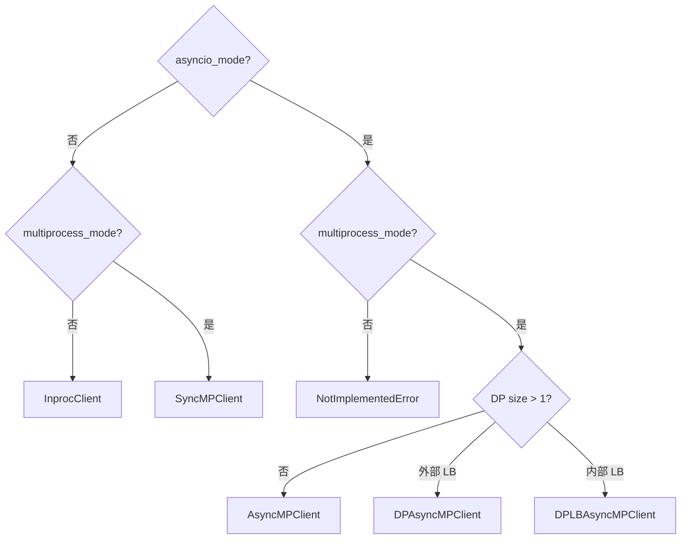
```mermaid
flowchart TD
    A{asyncio_mode?}
    A -- 否 --> B{multiprocess_mode?}
    B -- 否 --> I[InprocClient]
    B -- 是 --> S[SyncMPClient]
    A -- 是 --> C{multiprocess_mode?}
    C -- 否 --> X[NotImplementedError]
    C -- 是 --> D{DP size > 1?}
    D -- 否 --> AM[AsyncMPClient]
    D -- 外部 LB --> DP[DPAsyncMPClient]
    D -- 内部 LB --> LB[DPLBAsyncMPClient]
```

> **读图方法：** 这是“Client 工厂：四种组合，三条有效路径”的流程图。先从上向下只追一条主路径，确认输入经过哪些关键阶段到达输出；第二遍再看虚线、回边和旁路，它们通常表示反馈、复用或可选分支。

随书教学模型将前三条基础分支实现为
`examples/ch03_engine_core_loop.py::select_client`。

### 3.4.1 `InprocClient`

它在当前进程直接构造 `EngineCore`：

```text
add_request -> preprocess_add_request -> EngineCore.add_request
get_output  -> EngineCore.step_fn -> post_step
```

它没有后台 core busy loop，也没有 ZMQ 序列化。调用者不调用 `get_output()`，内核就不会
前进一步。这条路径容易调试，但不能代表在线服务的进程拓扑。

### 3.4.2 `SyncMPClient`

它启动或连接 EngineCore 后台进程，输入用 ZMQ 发送，输出由独立线程接收并放进
`queue.Queue`。同步调用者在 `get_output()` 上等待本地 queue，而不是直接等待 GPU。

### 3.4.3 `AsyncMPClient`

它使用 `zmq.asyncio`，输出进入 `asyncio.Queue`。`add_request_async()` 会先给 request
写入 `client_index`，以便多个前端共享 EngineCore 时，结果仍回到正确 client。utility
方法使用 `call_id -> Future` 映射把远端结果交给等待 coroutine。

## 3.5 多进程拓扑与三条 CPU 通道

普通非 DP 在线路径至少包含三条 CPU 执行通道：

1. **input socket thread**：轮询 ZMQ、反序列化、预处理 ADD、写 input queue。
2. **core main thread**：唯一修改 Scheduler 主状态，运行 busy loop 和 step。
3. **output socket thread**：读 output queue、序列化并发送。

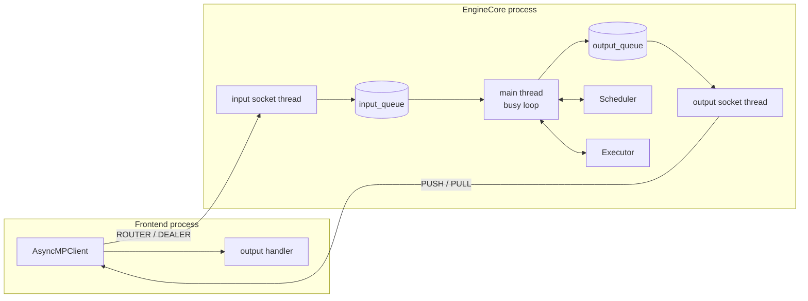
```mermaid
flowchart LR
    subgraph Frontend[Frontend process]
        FC[AsyncMPClient]
        OH[output handler]
    end
    subgraph CoreProc[EngineCore process]
        IS[input socket thread]
        IQ[(input_queue)]
        BL[main thread<br/>busy loop]
        OQ[(output_queue)]
        OS[output socket thread]
        SCH[Scheduler]
        EX[Executor]
        IS --> IQ --> BL
        BL <--> SCH
        BL <--> EX
        BL --> OQ --> OS
    end
    FC -->|ROUTER / DEALER| IS
    OS -->|PUSH / PULL| FC
    FC --> OH
```

> **读图方法：** 阅读“多进程拓扑与三条 CPU 通道”这张流程图时，先把方框看成对象或状态，把箭头看成数据或控制的移动。第一遍从左向右建立顺序，第二遍再核对分支发生的条件。

socket IO 和部分序列化可以与 GPU 执行重叠，同时 Scheduler 的核心可变状态仍由 busy
loop 单线程拥有。这比网络线程直接改 Scheduler 更容易维持顺序和一致性。

### 3.5.1 ADD 为什么在 input thread 预处理

`process_input_sockets()` 对 ADD 使用类型化 `MsgpackDecoder(EngineCoreRequest)`，随后
调用 `preprocess_add_request()`，把传输对象转为运行态 `Request`。多模态缓存缺失或请求
预处理错误可在这里变成 request-scoped error，而不是让 core 主循环崩溃。

### 3.5.2 ABORT 为什么同时进入两个队列

ABORT 被放入：

- `aborts_queue`：让正在等待 GPU Future 的 step 在 update 前尽快看见取消。
- `input_queue`：保持与 ADD 等消息的有序处理，避免竞态导致请求泄漏。

Scheduler abort 是幂等的，所以双路径处理不会重复破坏状态。

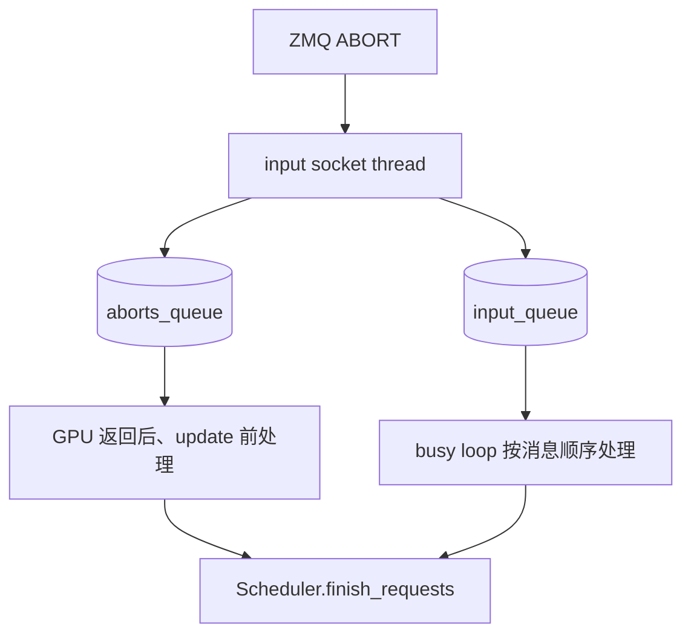
```mermaid
flowchart TB
    Z[ZMQ ABORT] --> IT[input socket thread]
    IT --> AQ[(aborts_queue)]
    IT --> IQ[(input_queue)]
    AQ --> FAST[GPU 返回后、update 前处理]
    IQ --> ORDER[busy loop 按消息顺序处理]
    FAST --> S[Scheduler.finish_requests]
    ORDER --> S
```

> **读图方法：** 这张图用于压缩“ABORT 为什么同时进入两个队列”的整体关系。先从上向下找到起点、关键转换和终点，再问每条跨层箭头是否意味着函数调用、消息传递、内存访问或状态更新。

## 3.6 EngineCore 初始化：顺序就是契约

`EngineCore.__init__()` 的主顺序可以压缩为：

```text
load plugins
-> create Executor
-> register executor failure callback
-> discover/profile/allocate KV cache
-> create StructuredOutputManager
-> create Scheduler
-> connect KV/EC aggregators
-> configure batch queue and request block hasher
-> choose step_fn
-> freeze startup heap / cache env reads
```

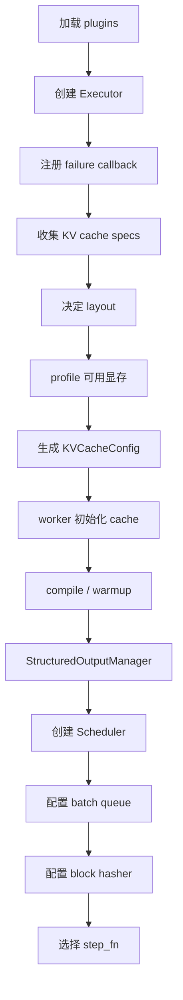
```mermaid
flowchart TD
    P[加载 plugins] --> E[创建 Executor]
    E --> F[注册 failure callback]
    F --> K1[收集 KV cache specs]
    K1 --> K2[决定 layout]
    K2 --> K3[profile 可用显存]
    K3 --> K4[生成 KVCacheConfig]
    K4 --> K5[worker 初始化 cache]
    K5 --> W[compile / warmup]
    W --> SO[StructuredOutputManager]
    SO --> S[创建 Scheduler]
    S --> B[配置 batch queue]
    B --> H[配置 block hasher]
    H --> SF[选择 step_fn]
```

> **读图方法：** 这是“EngineCore 初始化：顺序就是契约”的流程图。先从上向下只追一条主路径，确认输入经过哪些关键阶段到达输出；第二遍再看虚线、回边和旁路，它们通常表示反馈、复用或可选分支。

### 3.6.1 Executor 必须先于 Scheduler

KV cache 的真实规格来自执行侧模型层，容量又依赖加载模型后的可用显存。Scheduler 需要
最终 `KVCacheConfig` 才能创建 block manager。因此不能先凭 CLI 参数创建完整 Scheduler，
再让 Worker 猜 cache。

### 3.6.2 KV 初始化不只是分配 tensor

`_initialize_kv_caches()` 会：

1. 从 worker 收集每层 KV spec。
2. 根据 backend 和模型能力解析 cache layout。
3. profile 可用内存。
4. 生成各 worker cache config 和 scheduler 汇总 config。
5. 更新 block 数、block size、容量与可能 auto-fit 的最大长度。
6. 调用 executor 初始化 cache。
7. compile 或 warm up 模型。

第 05 章会展开 block 生命周期；这里要记住的是 Scheduler 创建之前，内存契约必须确定。

### 3.6.3 `step_fn` 在启动时绑定

`VllmConfig.max_concurrent_batches` 决定是否创建 batch queue：

- 值为 1：`step_fn = step`。
- 值大于 1：创建有界 deque，`step_fn = step_with_batch_queue`。

设 `P` 为 PP stage 数（至少 1）。关闭 async scheduling 时容量为 `P`；开启时，
MRV2 容量为 `P+1`，MRV1 在 `P=1` 时为 2，在 `P>1` 时仍返回 `P`。这是
`VllmConfig.max_concurrent_batches` 的规则；其他配置校验还可能拒绝不支持的组合。
例如 MRV2、PP=4、async 开启时容量为 5，并不是固定 2。

[源码] `vllm/config/vllm.py` - `VllmConfig.max_concurrent_batches`

[源码] `vllm/v1/engine/core.py` - `EngineCore.__init__` 中 `step_fn` 的绑定

## 3.7 请求消息与 Utility RPC

`EngineCoreRequestType` 使用单字节值，避免再编码一层字符串：

| 类型 | 用途 | 普通用户路径 |
|---|---|---|
| `ADD` | 提交请求 | 是 |
| `ABORT` | 取消请求 | 是 |
| `START_DP_WAVE` | DP wave 协调 | 否 |
| `UTILITY` | profile、LoRA、sleep、cache reset 等 RPC | 间接 |
| `EXECUTOR_FAILED` | executor failure callback 的进程内哨兵 | 否 |
| `WAKEUP` | shutdown 时唤醒阻塞 input queue | 否 |

同步 client 为 utility call 创建 `concurrent.futures.Future`，异步 client 创建
`asyncio.Future`。消息携带 `call_id`，core 返回 `UtilityOutput` 后，client 查表设置结果或
异常。

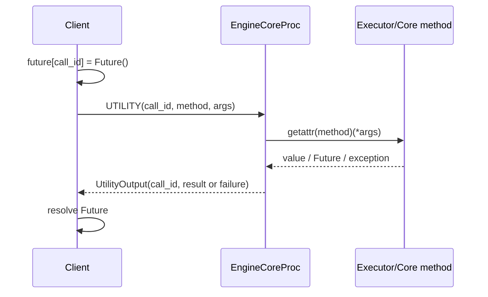
```mermaid
sequenceDiagram
    participant C as Client
    participant E as EngineCoreProc
    participant X as Executor/Core method
    C->>C: future[call_id] = Future()
    C->>E: UTILITY(call_id, method, args)
    E->>X: getattr(method)(*args)
    X-->>E: value / Future / exception
    E-->>C: UtilityOutput(call_id, result or failure)
    C->>C: resolve Future
```

> **读图方法：** 这是“请求消息与 Utility RPC”的时序图。先从左到右确认参与者分别负责什么，再从上到下追踪消息；第一遍只看正常路径，第二遍再看返回、异步消息和失败分支。

返回值本身也可能是 Future，例如 pause 要等 engine 真正 idle。`_invoke_utility_method()`
会注册 callback，而不是阻塞 core 主线程。

## 3.8 普通 `EngineCore.step()` 的精确顺序

普通 step 主链为：

```python
if not scheduler.has_requests():
    return {}, False

scheduler_output = scheduler.schedule(...)
future = model_executor.execute_model(scheduler_output, non_block=True)
grammar_output = scheduler.get_grammar_bitmask(scheduler_output)
model_output = future.result()
if model_output is None:
    model_output = model_executor.sample_tokens(grammar_output)

_process_aborts_queue()
outputs = scheduler.update_from_output(scheduler_output, model_output)
return outputs, scheduler_output.total_num_scheduled_tokens > 0
```

伪代码省略 tracing、统计和错误 dump，但保留了时序契约。

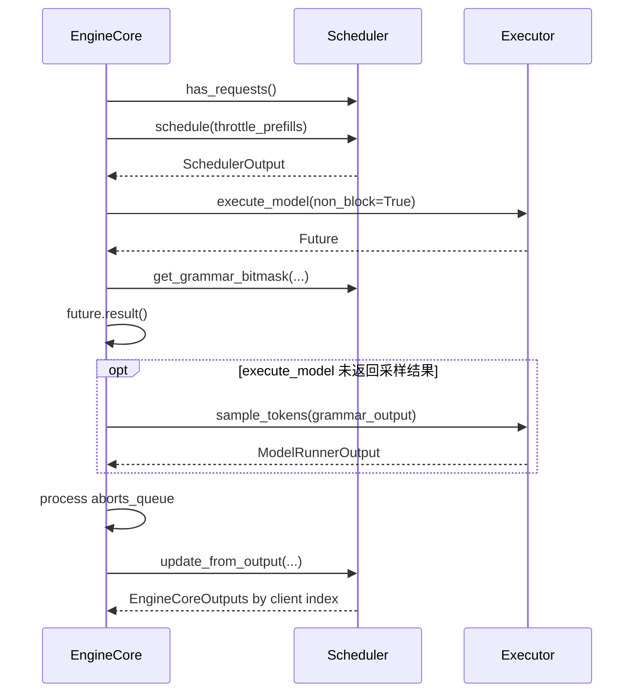
```mermaid
sequenceDiagram
    participant EC as EngineCore
    participant S as Scheduler
    participant E as Executor
    EC->>S: has_requests()
    EC->>S: schedule(throttle_prefills)
    S-->>EC: SchedulerOutput
    EC->>E: execute_model(non_block=True)
    E-->>EC: Future
    EC->>S: get_grammar_bitmask(...)
    EC->>EC: future.result()
    opt execute_model 未返回采样结果
        EC->>E: sample_tokens(grammar_output)
        E-->>EC: ModelRunnerOutput
    end
    EC->>EC: process aborts_queue
    EC->>S: update_from_output(...)
    S-->>EC: EngineCoreOutputs by client index
```

> **读图方法：** 这是“普通 `EngineCore.step()` 的精确顺序”的时序图。先从左到右确认参与者分别负责什么，再从上到下追踪消息；第一遍只看正常路径，第二遍再看返回、异步消息和失败分支。

### 3.8.1 `SchedulerOutput` 是执行契约

它描述“这一轮准备做什么”，包括每个请求的 token 数、block 变化、running/resumed/
preempted 信息，以及 structured output、KV connector、encoder input 等 metadata。
EngineCore 不把 Scheduler 内部可变对象直接交给 Worker，而是交付一个本轮快照。

### 3.8.2 `non_block=True` 的真实边界

它表示 executor 以 Future 形式交付结果；这不保证 Python 方法本身在后台线程运行。
例如 `UniProcExecutor.collective_rpc` 仍在当前线程执行 `run_method`，GPU 操作可异步入队，
返回值再包装为 Future。普通 step 随后就在同一函数调用
`future.result()`。因此：

> `non_block=True` 不等于整个 `EngineCore.step()` 不阻塞。

普通 step 统一了 executor API，并允许 IO 线程与设备执行重叠；真正让多个模型 batch
保持未结算状态的是 batch queue。

### 3.8.3 sample 为什么可能是第二阶段

某些 executor 的 `execute_model()` 返回完整 `ModelRunnerOutput`；另一些路径把 forward
与 sampling 拆开，forward 结果为 `None`，EngineCore 再调用
`sample_tokens(grammar_output)`。structured output 的 grammar bitmask 也在此边界参与。

### 3.8.4 `model_executed` 不等于“有用户输出”

布尔值来自 `total_num_scheduled_tokens > 0`。某一步可能只推进 connector、DP 协调或空
batch 控制状态，没有执行 token；模型执行也不一定立刻产生可发送文本。`post_step()`
和 busy loop 因而不能用“输出列表非空”替代它。

## 3.9 Abort 竞态：为什么必须在 update 前处理

考虑时间线：Scheduler 已把请求 R 放进 batch；GPU 正在执行 R 的最后一个 token；客户
端断开，ABORT 到达；随后 GPU 返回。如果先 `update_from_output()`，R 可能被报告为正常
stop/length 完成，connector 也看到错误完成原因。

当前实现先 drain `aborts_queue`，再把模型结果交给 Scheduler。

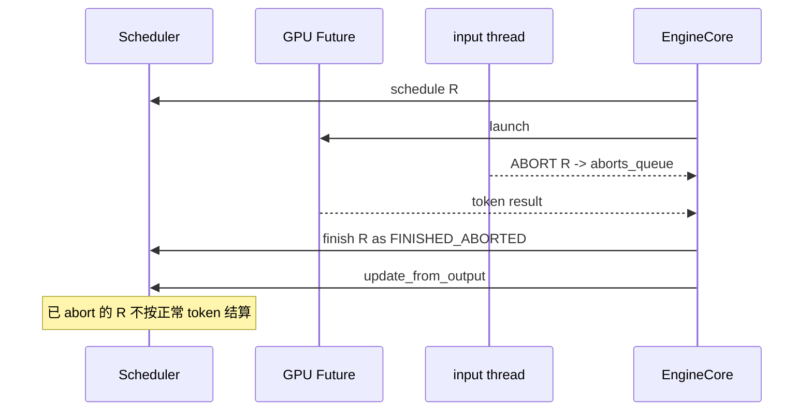
```mermaid
sequenceDiagram
    participant S as Scheduler
    participant G as GPU Future
    participant I as input thread
    participant E as EngineCore
    E->>S: schedule R
    E->>G: launch
    I-->>E: ABORT R -> aborts_queue
    G-->>E: token result
    E->>S: finish R as FINISHED_ABORTED
    E->>S: update_from_output
    Note over S: 已 abort 的 R 不按正常 token 结算
```

> **读图方法：** 这是“Abort 竞态：为什么必须在 update 前处理”的时序图。先从左到右确认参与者分别负责什么，再从上到下追踪消息；第一遍只看正常路径，第二遍再看返回、异步消息和失败分支。

上游 `tests/v1/engine/test_abort_final_step.py` 覆盖 final-step abort，并验证 connector 观察
到 `FINISHED_ABORTED`。随书测试 `test_abort_between_launch_and_update_wins` 用标准库模型
复现同一顺序。

## 3.10 Busy loop：空闲时等待，工作时推进

`EngineCoreProc.run_busy_loop()` 每轮为：

```text
while handle_shutdown():
    process_input_queue()
    maybe_publish_request_counts()
    process_engine_step()
    maybe_publish_request_counts()
raise SystemExit
```

真正行为取决于 `has_work()`、input queue 是否阻塞、batch queue 是否非空、DP engines
是否运行和 shutdown state。

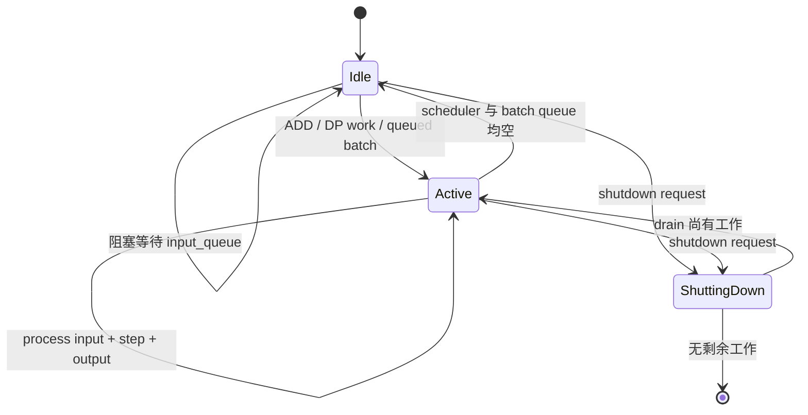
```mermaid
stateDiagram-v2
    [*] --> Idle
    Idle --> Idle: 阻塞等待 input_queue
    Idle --> Active: ADD / DP work / queued batch
    Active --> Active: process input + step + output
    Active --> Idle: scheduler 与 batch queue 均空
    Idle --> ShuttingDown: shutdown request
    Active --> ShuttingDown: shutdown request
    ShuttingDown --> Active: drain 尚有工作
    ShuttingDown --> [*]: 无剩余工作
```

> **读图方法：** 这是“Busy loop：空闲时等待，工作时推进”的状态图。先找初始状态，再沿箭头观察触发条件和状态变化；重点不是背状态名，而是弄清谁触发转换、转换后哪些资源需要更新。

### 3.10.1 `has_work()` 不只看 Scheduler

它返回以下三者的或：

```text
engines_running
or scheduler.has_requests()
or bool(batch_queue)
```

即使 Scheduler 暂无可继续调度的请求，只要 batch queue 还有 Future，core 就不能 idle；
DP wave 仍运行时也一样。

### 3.10.2 空闲等待为什么使用 input queue

没有工作且状态为 RUNNING 时，主线程阻塞在 `input_queue.get()`，避免空转。shutdown
signal handler 不直接触碰可能被锁住的 queue mutex，而是通过 `SignalCallback` 放入
`WAKEUP` 哨兵，让主线程醒来后处理状态。

### 3.10.3 没有模型执行时为什么短暂 sleep

若本轮 `model_executed=False` 但 Scheduler 仍有请求，可能正在等 remote KV 或延迟 free。
busy loop 会 sleep 1ms，让持有 GIL 的后台传输线程获得进展机会，避免控制面热循环。

## 3.11 Batch queue：把提交与结算拆开

当 `max_concurrent_batches > 1` 时，EngineCore 使用 `step_with_batch_queue()`。queue 元素为：

```text
(sampling_or_execute_future, scheduler_output, execute_model_future)
```

保留原始 execute Future，是为了 sampling Future 返回异常信号时追溯真正执行异常。

### 3.11.1 三条规则

> **本节先看：** 下面先给出“三条规则”的结论清单。先理解每一项为什么存在，再记参数名或实现细节。

1. queue 未满时优先 schedule 并提交新 batch。
2. 提交后仍未满且还有工作时返回 `None`，不急着等输出。
3. queue 已满或没有新工作时，从另一端 pop 最老 batch，等待并结算。

`appendleft()` 配合 `pop()` 形成 FIFO：新 batch 放左边，最老 batch 从右边取出。

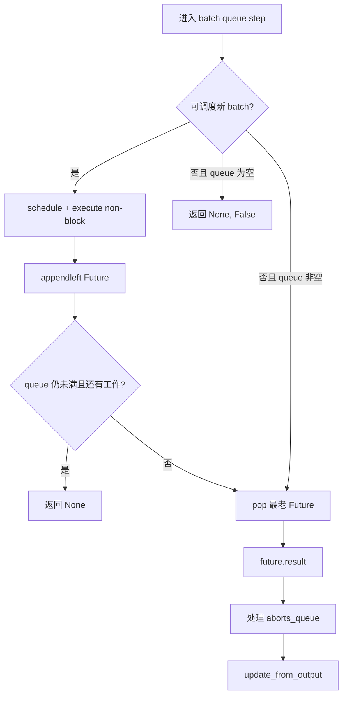
```mermaid
flowchart TD
    A[进入 batch queue step] --> B{可调度新 batch?}
    B -- 是 --> C[schedule + execute non-block]
    C --> D[appendleft Future]
    D --> E{queue 仍未满且还有工作?}
    E -- 是 --> R[返回 None]
    E -- 否 --> P[pop 最老 Future]
    B -- 否且 queue 非空 --> P
    B -- 否且 queue 为空 --> N[返回 None, False]
    P --> W[future.result]
    W --> AB[处理 aborts_queue]
    AB --> U[update_from_output]
```

> **读图方法：** 这张图用于压缩“三条规则”的整体关系。先从上向下找到起点、关键转换和终点，再问每条跨层箭头是否意味着函数调用、消息传递、内存访问或状态更新。

### 3.11.2 容量为 2 的时间线

以下先看教学模型：同一请求有 3 份顺序工作，队列容量为 2。教学 executor 根据位置
生成固定 token，所以可以提前提交。真实自回归生成还依赖前一个采样 token；要得到
类似时间线，需要 async scheduling 的 placeholder 和 Worker 内部 token 回填配合。
仅有 batch queue，不保证同一请求能连续提前 decode；PP 场景还受调度节奏限制。

| 调用 | 新提交 | 调用后在途 | 本次结算 | 返回 |
|---|---|---|---|---|
| 1 | batch 1 | batch 1 | 无 | `None` |
| 2 | batch 2 | batch 2 | batch 1 | token 0 |
| 3 | batch 3 | batch 3 | batch 2 | token 1 |
| 4 | 无 | 空 | batch 3 | token 2 / finished |

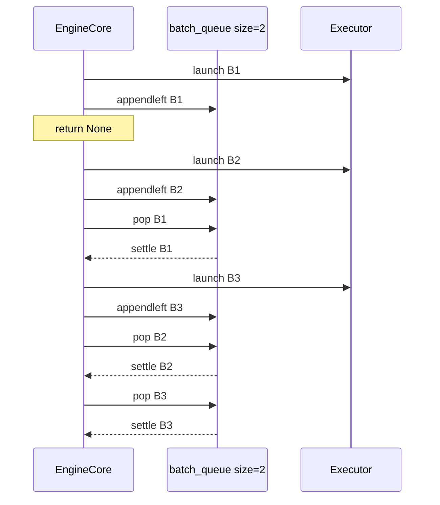
```mermaid
sequenceDiagram
    participant EC as EngineCore
    participant Q as batch_queue size=2
    participant E as Executor
    EC->>E: launch B1
    EC->>Q: appendleft B1
    Note over EC: return None
    EC->>E: launch B2
    EC->>Q: appendleft B2
    EC->>Q: pop B1
    Q-->>EC: settle B1
    EC->>E: launch B3
    EC->>Q: appendleft B3
    EC->>Q: pop B2
    Q-->>EC: settle B2
    EC->>Q: pop B3
    Q-->>EC: settle B3
```

> **读图方法：** 这是“容量为 2 的时间线”的时序图。先从左到右确认参与者分别负责什么，再从上到下追踪消息；第一遍只看正常路径，第二遍再看返回、异步消息和失败分支。

`None` 与 `{}` 都不会产生待发送输出，但语义不同：`None` 主要表示 pipeline 填充；空
字典可能表示某个已结算步骤没有请求级输出。

### 3.11.3 structured output 的延迟 sampling

若新 batch 的 grammar bitmask 依赖前一轮刚产生的 token，就不能提前采样。实现暂存
`deferred_scheduler_output`，先结算旧结果，再计算 grammar mask、异步 sample，最后把
deferred batch 放回 queue。正确性依赖优先于最大化重叠。

## 3.12 Pause、Sleep 与 Resume

Pause 是 Scheduler 状态，不等于进程退出。

| mode | 已在途请求 | 新请求 | pause 完成条件 |
|---|---|---|---|
| `abort` | 立即标记 abort | 入队但不调度 | abort 输出发送、设备 idle |
| `wait` | 已 running 请求允许继续完成 | waiting 请求不准入，包括暂停前已排队者 | running 与在途 batch 排空 |
| `keep` | 冻结并保留 | 入队但不调度 | 在途 batch/输出排空 |

基础 `EngineCore.pause_scheduler()` 不支持 in-process 的 `wait`；`EngineCoreProc` 覆盖该
方法，可返回 Future，在 engine idle callback 中同步设备并清 cache。

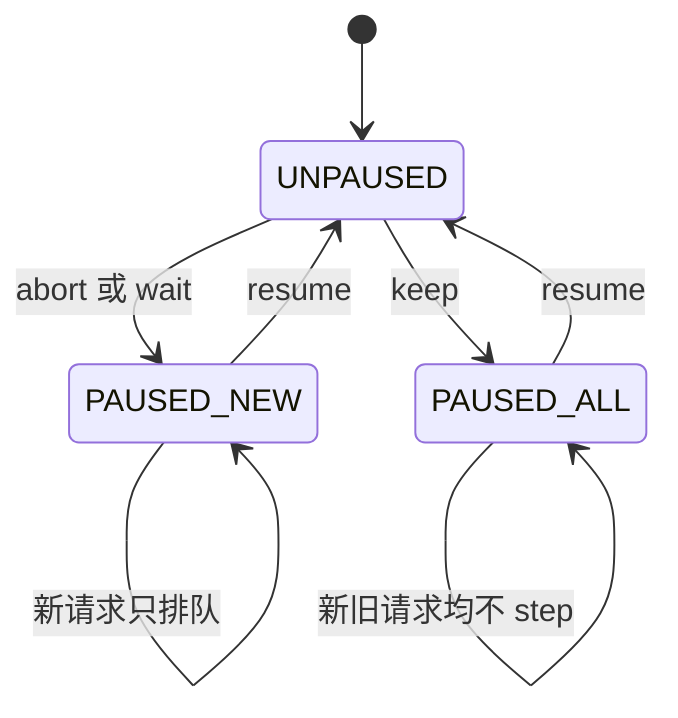
```mermaid
stateDiagram-v2
    [*] --> UNPAUSED
    UNPAUSED --> PAUSED_NEW: abort 或 wait
    UNPAUSED --> PAUSED_ALL: keep
    PAUSED_NEW --> UNPAUSED: resume
    PAUSED_ALL --> UNPAUSED: resume
    PAUSED_NEW --> PAUSED_NEW: 新请求只排队
    PAUSED_ALL --> PAUSED_ALL: 新旧请求均不 step
```

> **读图方法：** 这是“Pause、Sleep 与 Resume”的状态图。先找初始状态，再沿箭头观察触发条件和状态变化；重点不是背状态名，而是弄清谁触发转换、转换后哪些资源需要更新。

这里的“旧请求”仅指已经 running 的请求，不包括暂停前已进入 waiting 的请求；
`Scheduler.schedule` 只在 `UNPAUSED` 时接纳 waiting。

[源码] `vllm/v1/core/sched/scheduler.py` - `Scheduler.schedule`、`get_num_unfinished_requests`

`_finish_pause()` 先调用 executor collective RPC `synchronize_device`，再按需 reset cache。
否则调用者收到“pause 完成”时 GPU 仍可能访问即将释放的 KV。上游测试固定顺序为：

```text
synchronize_device -> reset_caches -> Future complete
```

Sleep 在 pause 之上增加设备内存管理：level 0 只暂停调度；level 1 offload 权重并丢弃
KV；level 2 不保留 sleep backend 管理的权重/KV 内容，Worker 会另存必要的模型
buffers。它不保证进程所有 GPU 占用降到零；源码日志仍会报告残余占用。wake up
只有在 executor 已不 sleeping 时才恢复
Scheduler，避免权重尚未驻留就调度请求。

## 3.13 Shutdown：立即 abort 与优雅 drain

EngineCoreProc 的状态为：

```text
RUNNING -> REQUESTED -> SHUTTING_DOWN
```

信号处理只设置 REQUESTED 并触发 WAKEUP，策略由 busy loop 的 `_handle_shutdown()` 执行。

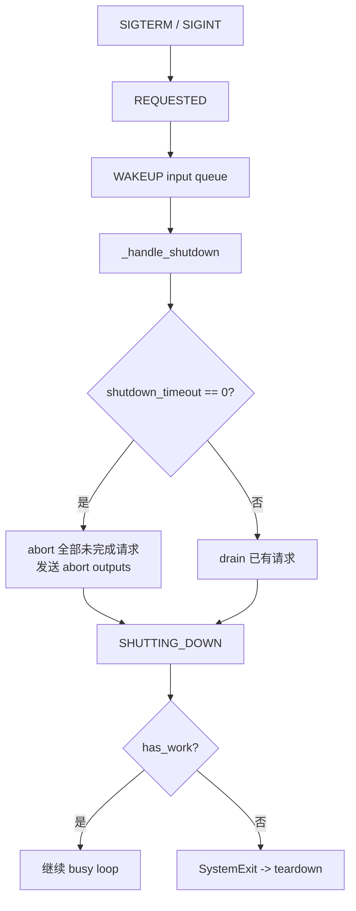
```mermaid
flowchart TD
    S[SIGTERM / SIGINT] --> R[REQUESTED]
    R --> W[WAKEUP input queue]
    W --> H[_handle_shutdown]
    H --> T{shutdown_timeout == 0?}
    T -- 是 --> A[abort 全部未完成请求<br/>发送 abort outputs]
    T -- 否 --> D[drain 已有请求]
    A --> SD[SHUTTING_DOWN]
    D --> SD
    SD --> Q{has_work?}
    Q -- 是 --> L[继续 busy loop]
    Q -- 否 --> X[SystemExit -> teardown]
```

> **读图方法：** 这张图用于压缩“Shutdown：立即 abort 与优雅 drain”的整体关系。先从上向下找到起点、关键转换和终点，再问每条跨层箭头是否意味着函数调用、消息传递、内存访问或状态更新。

进入非 RUNNING 状态后，新 ADD 被拒绝并返回 abort output；新 UTILITY 返回 “Server
shutting down” failure；已有 drain 请求继续推进。

`VllmConfig.shutdown_timeout` 描述请求 drain 宽限期。client/进程管理器的 shutdown
timeout 还负责等待进程和资源清理，两者不能混为一个 join timeout。

`EngineCore.shutdown()` 清理 structured output backend、executor、scheduler，撤销启动
时的 `gc.freeze()`，再清理 distributed environment 和显存缓存。MP client 侧还需停止
engine manager、关闭 socket、结束输出线程或 asyncio task。

## 3.14 Executor failure：请求错误与进程错误

请求输入不合法、多模态缓存漂移等可以转成单请求输出；Executor 整体失败可能破坏设备
或 worker 状态，不能假装只有一个请求失败。

```text
executor failure callback
-> input_queue.put(EXECUTOR_FAILED)
-> busy loop dispatch
-> raise RuntimeError("Executor failed.")
-> run_engine_core exception handler
-> output_queue ENGINE_CORE_DEAD
-> output socket thread sends sentinel
-> MPClient marks engine_dead
-> later operations raise EngineDeadError
```

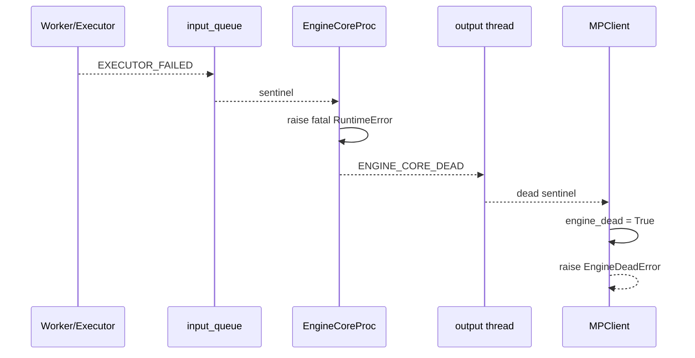
```mermaid
sequenceDiagram
    participant W as Worker/Executor
    participant IQ as input_queue
    participant EC as EngineCoreProc
    participant OT as output thread
    participant C as MPClient
    W-->>IQ: EXECUTOR_FAILED
    IQ-->>EC: sentinel
    EC->>EC: raise fatal RuntimeError
    EC-->>OT: ENGINE_CORE_DEAD
    OT-->>C: dead sentinel
    C->>C: engine_dead = True
    C-->>C: raise EngineDeadError
```

> **读图方法：** 这是“Executor failure：请求错误与进程错误”的时序图。先从左到右确认参与者分别负责什么，再从上到下追踪消息；第一遍只看正常路径，第二遍再看返回、异步消息和失败分支。

MP client 另有 liveness monitor。若 EngineCore 未发送 sentinel 就意外退出，monitor 同样
标记 `engine_dead` 并清理。这是消息内故障和进程外故障的双保险。

## 3.15 Ray EngineCoreActor 改变了什么

`EngineCoreActor` 通过多重继承组合 `EngineCoreActorMixin + EngineCoreProc`，不是另一套
EngineCore 算法。

复用内容：EngineCore 初始化、Scheduler、Executor、step、batch queue、socket thread、
busy loop、pause、shutdown 和 utility dispatch。

替换内容：进程由 Ray actor 管理；地址在创建前已知，因此握手直接 yield；actor 按 Ray
分配尽早设置可见 GPU；`wait_for_init()` 通过 Ray method completion 表示初始化完成。

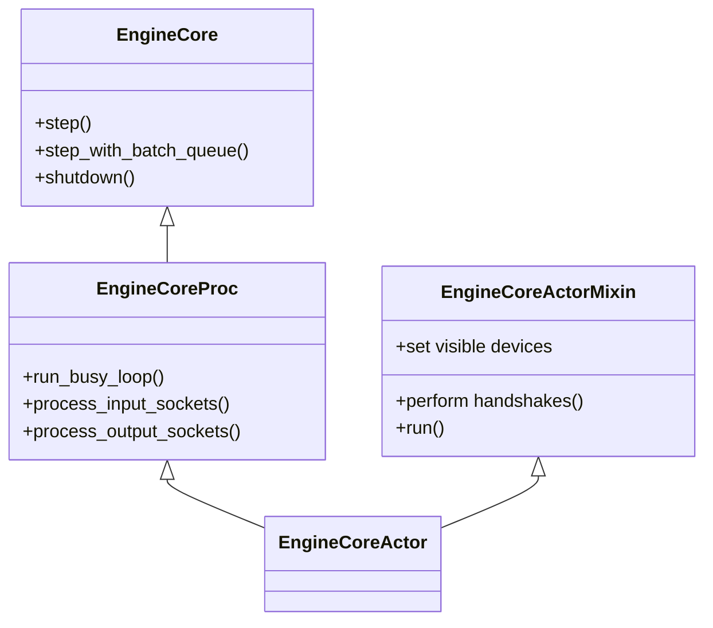
```mermaid
classDiagram
    class EngineCore {
      +step()
      +step_with_batch_queue()
      +shutdown()
    }
    class EngineCoreProc {
      +run_busy_loop()
      +process_input_sockets()
      +process_output_sockets()
    }
    class EngineCoreActorMixin {
      +set visible devices
      +perform handshakes()
      +run()
    }
    class EngineCoreActor
    EngineCore <|-- EngineCoreProc
    EngineCoreProc <|-- EngineCoreActor
    EngineCoreActorMixin <|-- EngineCoreActor
```

> **读图方法：** 这是“Ray EngineCoreActor 改变了什么”的类型关系图。先分清接口、实现和持有关系，再结合正文确认运行时真正实例化的是哪个类；类图说明结构，不等同于调用先后。

MP 与 Ray 的主要差异在部署和生命周期控制。阅读 Ray 路径时先找 mixin 覆盖的方法，再
回到 EngineCoreProc 看复用主链。

## 3.16 四条完整调用链

> **本节先看：** 本节要回答：**四条完整调用链**。下面的小节会逐层拆开概念、运行过程和源码落点；第一次阅读先抓对象之间的关系，第二次再记类名、字段和分支。

### 离线 in-process

> **本节先看：** 下面的代码或调用链只保留“离线 in-process”的主干。阅读时依次寻找输入、状态变化和输出，暂时忽略辅助分支。

```text
OfflineInferenceMixin._run_engine
-> LLMEngine.step
-> InprocClient.get_output
-> EngineCore.step_fn
-> Scheduler.schedule
-> Executor.execute_model
-> 等待结果；若为 None，再 Executor.sample_tokens
-> Scheduler.update_from_output
-> OutputProcessor.process_outputs
```

同一调用线程主动推进，没有 core busy loop 和 ZMQ。

### 离线 multiprocess

> **本节先看：** 下面的代码或调用链只保留“离线 multiprocess”的主干。阅读时依次寻找输入、状态变化和输出，暂时忽略辅助分支。

```text
LLMEngine.step
-> SyncMPClient.get_output
-> local outputs_queue.get
<- SyncMPClient output thread
<- ZMQ PULL
<- EngineCoreProc output thread
<- output_queue
<- busy loop step
```

API 同步，但 core 在后台进程持续工作。

### 在线 async multiprocess

> **本节先看：** 下面的代码或调用链只保留“在线 async multiprocess”的主干。阅读时依次寻找输入、状态变化和输出，暂时忽略辅助分支。

```text
AsyncLLM.generate
-> AsyncMPClient.add_request_async
-> ZMQ
-> EngineCoreProc input thread
-> input_queue
-> busy loop step
-> output_queue
-> output thread
-> AsyncMPClient output task
-> AsyncLLM output handler
-> per-request collector
-> generate yields RequestOutput
```

### Utility call

> **本节先看：** 下面的代码或调用链只保留“Utility call”的主干。阅读时依次寻找输入、状态变化和输出，暂时忽略辅助分支。

```text
frontend method
-> client call_utility[_async]
-> UTILITY(call_id, method, args)
-> EngineCoreProc invoke
-> UtilityOutput
-> client resolves Future
-> caller resumes
```

## 3.17 调试方法

> **本节先看：** 本节要回答：**调试方法**。下面的小节会逐层拆开概念、运行过程和源码落点；第一次阅读先抓对象之间的关系，第二次再记类名、字段和分支。

### 请求提交后没有输出

按顺序检查：OutputProcessor 是否先注册请求；client 是否发送 ADD；input thread 是否
解码并入队；Scheduler 是否有请求且未 pause；batch queue 是否只在填充阶段返回
`None`；output thread 和前端 output task 是否存活。

### CPU 高但 GPU 没工作

检查 `model_executed` 是否持续为 false、Scheduler 是否等待 remote KV、busy loop 是否
给后台 transfer thread 让出 GIL，以及 pause/DP wave 是否让 `has_work()` 为真却没有
token batch。

### 服务卡在启动

区分三类等待：HELLO/READY 握手；模型加载、KV profile、compile/warmup；MP client 等待
各 engine identity 的 ready response。`VLLM_ENGINE_READY_TIMEOUT_S` 是秒，传给 ZMQ
poll 时换成毫秒。不要用无限增大 timeout 掩盖 EngineCore 已死亡。

### 关闭时状态异常

同时记录 `shutdown_timeout`、core state、新 ADD 是否被拒绝、batch queue 是否仍有
Future、output queue 是否发完 abort/final outputs。

## 3.18 可运行教学实验

教学模型位于
[`examples/ch03_engine_core_loop.py`](../../examples/ch03_engine_core_loop.py)，只依赖 Python
标准库。它实现 client 选择、Future executor、普通 step、FIFO batch queue、abort
时序、pause/resume、queue-facing EngineCoreProc、shutdown 与 executor failure。

运行：

```bash
python3 examples/ch03_engine_core_loop.py
python3 -m unittest tests/test_ch03_engine_core_loop.py
```

预期核心输出：

```text
tick=0 launched=True queue=1 outputs=None
tick=1 launched=True queue=1 outputs=(... token_ids=(100,) ...)
tick=2 launched=True queue=1 outputs=(... token_ids=(101,) ...)
tick=3 launched=False queue=0 outputs=(... token_ids=(102,), finish_reason='length')
```

第一轮只提交；第二、三轮提交新 batch 并结算旧 batch；第四轮只排空队列。

| 教学不变量 | 对应上游行为 |
|---|---|
| async + no multiprocessing 被拒绝 | client factory |
| 普通 step 同轮等待 Future | `EngineCore.step` |
| abort 在 update 前处理 | `_process_aborts_queue` 位置 |
| batch queue 先填后排、FIFO | `appendleft` + `pop` |
| keep pause 冻结调度 | `PauseState.PAUSED_ALL` |
| executor failure 为 fatal | `EXECUTOR_FAILED` dispatch |
| 零秒 shutdown abort 请求 | `_handle_shutdown` |

教学模型没有单独区分暂停前的 waiting 与 running，且 token 由位置直接生成，因此
不能用于证明真实 pause 准入规则或自回归 token 的数据依赖。

模型没有模拟真实 token budget、KV block、structured output、spec decode、ZMQ 序列化、
GPU stream 和分布式 collective，所以只验证控制流解释，不验证性能。

## 3.19 推荐源码阅读路线

> **本节先看：** 下面先给出“推荐源码阅读路线”的结论清单。先理解每一项为什么存在，再记参数名或实现细节。

1. `LLMEngine.__init__` 和 `LLMEngine.step`。
2. `AsyncLLM.__init__`、`generate`、`_run_output_handler`。
3. `EngineCoreClient.make_client`。
4. 三种 client 的 get/add/output 方法。
5. `EngineCore.__init__` 与 `_initialize_kv_caches`。
6. `EngineCore.step`，再读 `step_with_batch_queue`。
7. `run_busy_loop`、`_process_input_queue`、`_process_engine_step`。
8. 两个 socket thread。
9. shutdown、pause、engine dead。
10. 最后读 Actor mixin，只标覆盖点。

每读一个方法，记录四项：运行线程/进程、输入类型、输出类型、修改的持久状态。这样可以
快速区分“只是传输”“真正推进状态”和“只做资源操作”的代码。

## 3.20 常见误解与修正

> **本节先看：** 下面先给出“常见误解与修正”的结论清单。先理解每一项为什么存在，再记参数名或实现细节。

1. **`LLMEngine` 是旧内核。** Legacy 只指兼容同步门面，内部仍连接 V1 EngineCore。
2. **AsyncLLM 自己运行 step loop。** 在线主循环在 EngineCoreProc；AsyncLLM 主要接收和
   分发输出。
3. **`non_block=True` 后 step 立即返回。** 普通 step 随后调用 `future.result()`。
4. **input thread 直接操作 Scheduler。** 它做 IO、解码和预处理，主状态由 core main
   thread 修改。
5. **batch queue 是用户请求队列。** 它保存已 schedule、已提交的 batch Future。
6. **pause 就是 shutdown。** pause 可保留模型、排队新请求并 resume；shutdown 不可逆。
7. **所有错误都变成 EngineDeadError。** 请求错误可局部返回；致命 core/executor 错误才
   标记 engine dead。
8. **Ray Actor 重写 EngineCore。** Actor 主要替换部署、GPU 可见性和握手。

## 3.21 本章小结

Engine 前端与 EngineCore 分离，使 vLLM 可以在不改变 Scheduler 核心算法的前提下支持
同步离线、异步在线、in-process 调试、多进程隔离、DP client 和 Ray 部署。

普通 step 的关键顺序是：

```text
schedule
-> execute non-block shaped call
-> wait/sample
-> process racing aborts
-> update scheduler
-> emit EngineCoreOutputs
```

EngineCoreProc 在外部增加 input socket thread、core busy loop 和 output socket thread。
batch queue 再把提交与结算分开，使多个 batch 能同时在途。

下一章进入 Scheduler 内部，回答每个 step 选择哪些请求、分配多少 token，以及
continuous batching 为什么自然地从 token 级调度产生。

## 3.22 自检问题

第一遍先完成前 5 题；余下题目是第二遍源码阅读的扩展题库，不要求一次做完。

> **本节先看：** 建议先不看答案，用自己的话回答下面的问题。能够解释原因、画出数据流并指出源码位置，才算真正理解。

1. 为什么 `LLMEngine` 被称为 Legacy，却仍属于 V1 路径？
2. `EngineArgs.create_engine_config()` 为什么不能只做字段拷贝？
3. 哪种 client 组合当前不支持？
4. `InprocClient.get_output()` 与 `SyncMPClient.get_output()` 分别在等什么？
5. EngineCore 为什么先创建 Executor，再创建 Scheduler？
6. `non_block=True` 为什么不代表普通 step 不阻塞？
7. ABORT 为什么同时进入 input queue 和 aborts queue？
8. `model_executed` 与“返回用户 token”有什么区别？
9. batch queue 为什么用 `appendleft()` 和 `pop()`？
10. `wait` 与 `keep` pause 的关键差异是什么？
11. shutdown timeout 为 0 时如何处理未完成请求？
12. request-scoped error 与 fatal error 如何传播？
13. Ray Actor 为什么可复用 EngineCoreProc 的 busy loop？

## 3.23 源码追踪题

> **本节先看：** 这些题目要求把概念重新落到代码。先从给出的入口搜索定义和调用点，再记录对象、状态与边界，不要只找到同名符号。

1. 从 `LLMEngine.from_engine_args()` 追到 VllmConfig 和 executor class。
2. 找到 `VllmConfig.max_concurrent_batches` 的 PP 与 async scheduling 规则。
3. 列出 client 工厂四种组合并解释不支持的一种。
4. 在 KV 初始化中标出 profile、config、worker init、warmup。
5. 找到普通 step 处理 abort 的位置，与 final-step abort 测试对照。
6. 在 batch queue 路径证明 FIFO。
7. 从 ZMQ ABORT frame 追到 Scheduler `finish_requests()`。
8. 从 executor failure callback 追到 `EngineDeadError`。
9. 找到 pause 完成前同步设备的测试。
10. 对比普通握手与 Actor 的 `_perform_handshakes()`。

## 3.24 参考答案

<details>
<summary>1. Legacy 的含义</summary>

Legacy 指兼容旧式同步 API。该类创建 V1 InputProcessor、OutputProcessor 和
EngineCoreClient，内核仍是 V1 EngineCore。
</details>

<details>
<summary>2. 配置为什么不是字段拷贝</summary>

模型元数据、硬件、usage context 和功能组合会改变默认值与合法性；构造还要做跨配置
校验。KV 容量等字段甚至要在 EngineCore 启动后回写。
</details>

<details>
<summary>3. 不支持的 client 组合</summary>

`asyncio_mode=True` 且 `multiprocess_mode=False`。
</details>

<details>
<summary>4. 两个 get_output</summary>

InprocClient 直接调用 EngineCore step 并等待 executor Future；SyncMPClient 等本地输出
线程从 ZMQ 收到并放入 queue 的 EngineCoreOutputs。
</details>

<details>
<summary>5. 初始化顺序</summary>

Executor/Worker 提供真实 KV spec，并在加载后 profile 可用显存。Scheduler 构造需要最终
KVCacheConfig 和 block size。
</details>

<details>
<summary>6. non_block 边界</summary>

executor 返回 Future，但普通 step 紧接着 `future.result()`。它不保证调用者立即返回。
</details>

<details>
<summary>7. Abort 双队列</summary>

aborts queue 让取消在 GPU 返回后、Scheduler update 前生效；input queue 保持与 ADD 的
顺序。Scheduler abort 幂等。
</details>

<details>
<summary>8. model_executed</summary>

它表示本轮是否调度正数 token。控制面可变化但没有模型执行；模型执行也不一定立刻产生
用户文本。
</details>

<details>
<summary>9. Batch queue FIFO</summary>

新 Future `appendleft()`，结算 `pop()`，因此从右侧取出最老元素。
</details>

<details>
<summary>10. wait 与 keep</summary>

两者暂停 waiting 准入；wait 允许已有 running 请求 drain，暂停前尚在 waiting 的请求
也会等待 resume。keep 冻结 running 请求，只排空已提交的工作。
</details>

<details>
<summary>11. 零秒 shutdown</summary>

全部未完成请求标记 `FINISHED_ABORTED`，发送 abort outputs，进入 SHUTTING_DOWN，等
`has_work()` 为 false 后退出。
</details>

<details>
<summary>12. 两类错误</summary>

请求预处理错误可生成对应 client 的 error output；executor failure 触发致命哨兵和
ENGINE_CORE_DEAD，client 后续抛 EngineDeadError。
</details>

<details>
<summary>13. Actor 复用</summary>

Actor mixin 提供 Ray 生命周期、可见 GPU 和免握手覆盖；EngineCoreProc 已封装主循环和
传输线程，因此可以继承复用。
</details>

## 3.25 源码与资料索引

> **本节先看：** 下面按主题整理本章使用的证据入口。需要复核结论时，优先按路径和符号定位，不依赖可能漂移的行号。

- `vllm/engine/arg_utils.py`：`EngineArgs.create_engine_config`
- `vllm/config/vllm.py`：`VllmConfig.__post_init__`、`max_concurrent_batches`
- `vllm/v1/engine/llm_engine.py`：`LLMEngine.__init__`、`step`
- `vllm/v1/engine/async_llm.py`：`AsyncLLM.__init__`、`generate`、
  `_run_output_handler`、`abort`
- `vllm/v1/engine/core_client.py`：client factory、`InprocClient`、`MPClient`、
  `SyncMPClient`、`AsyncMPClient`、liveness monitor
- `vllm/v1/engine/core.py`：EngineCore 初始化、KV 初始化、两种 step、abort queue、
  busy loop、socket threads、pause、shutdown、Actor
- `vllm/v1/engine/__init__.py`：request/output/message/ready 类型
- `tests/v1/engine/test_engine_core.py`：batch queue 与 pause 顺序
- `tests/v1/engine/test_engine_core_client.py`：ready timeout 与 client 生命周期
- `tests/v1/engine/test_abort_final_step.py`：final-step abort
- `tests/v1/engine/test_startup_watch_processes.py`：进程 shutdown 与清理
- [本项目第 3 章教学模型](../../examples/ch03_engine_core_loop.py)
- [本项目第 3 章测试](../../tests/test_ch03_engine_core_loop.py)
- [第 3 章实验记录](../../experiments/ch03-engine-core-loop.md)
- [全书章节源码映射](../../meta/chapter-source-map.md)

## 完成状态

> **本节先看：** 这里区分正文完成、静态源码核对和真实 GPU 运行验证。没有执行过的实验不会因为正文完整就被标记为已验证。

- [x] 解释 Engine 前端、client、EngineCore 与 EngineCoreProc 边界。
- [x] 追踪 `EngineArgs -> VllmConfig -> Executor/EngineCore` 初始化链。
- [x] 覆盖 Inproc、同步 MP、异步 MP 与 DP client 分支。
- [x] 逐阶段解释普通 step 和 batch queue step。
- [x] 画出 input thread、busy loop、output thread 和 ZMQ 拓扑。
- [x] 覆盖 abort、pause、sleep、shutdown 与 executor failure。
- [x] 解释 Ray EngineCoreActor 的复用边界。
- [x] 提供标准库教学模型、7 个单元测试和实验记录。
- [ ] 在真实 NVIDIA GPU 上采集 Future、CUDA stream 与 batch queue 时间线。
- [ ] 启动真实在线服务验证信号、ZMQ 和 EngineDeadError 传播。
- [ ] 由独立审阅者复核后将状态改为 `verified`。

本章正文已经完整，`content_complete=true`。当前机器缺少可用 vLLM GPU runtime，
因此 `runtime_verified=false`，按项目规则保持 `draft`。
