# 第04章 Scheduler 与 Continuous Batching

> 面对不同时间到达、不同 prompt 长度和不同输出长度的请求，当前 step 到底应该算谁？

## 本章定位

第 03 章看到 `EngineCore.step()` 反复执行：

```text
schedule -> execute_model -> update_from_output
```

本章进入第一个动作 `schedule()`。Scheduler 不执行 Transformer，也不直接管理 GPU
tensor；它根据请求进度、计算预算、KV 容量和调度策略，生成下一轮 Model Runner 应执行
的工作描述。

Continuous Batching 不是源码中的一个独立 `ContinuousBatching` 类。它是以下行为共同产生
的系统效果：

1. 请求可以在任意 engine step 之间进入 waiting queue；
2. Scheduler 每轮重新选择请求，而不是固定一个 batch 一直跑到底；
3. 已完成请求及时退出并释放容量；
4. 新请求可以填补空出的 sequence slot 和 token budget；
5. 长 prefill 可以切成多个 chunk，与 decode 工作共享一轮计算。

本章绑定源码 revision `5893426b88f7b3cd21101d194eb1c6f0a6f0e27b`。文中继续区分：

- **源码事实**：固定 revision 的实现或测试可直接证明。
- **设计含义**：由多个源码事实推导出的系统解释。
- **教学模型**：随书最小实现，只保留核心状态机，不等价于完整 vLLM。

## 阅读目标

读完本章后，你应该能够：

1. 解释 static batching 为什么产生 head-of-line blocking 和 GPU 空洞。
2. 说明 continuous batching 为什么是逐 step 重组工作，而不是动态拼 tensor 的别名。
3. 区分 waiting、running、preempted、blocked 和 finished 状态。
4. 用 `num_computed_tokens` 与 `num_tokens_with_spec` 推导当前请求的工作量。
5. 区分 `max_num_scheduled_tokens`、`max_num_batched_tokens`、`max_num_seqs`、
   `max_model_len` 和 KV 容量。
6. 逐段解释 running-first、waiting-second 两个调度循环。
7. 说明 chunked prefill 如何降低短请求被长 prompt 阻塞的时间。
8. 解释 KV 不足时怎样选 victim、回收预算、重置进度并恢复请求。
9. 读懂 `SchedulerOutput` 如何把调度决策交给 Model Runner。
10. 解释 schedule 的乐观计数与 update 的回滚、完成和延迟释放。

## 如何阅读本章

Scheduler 可以先理解为一个受多种预算约束的工单调度员：请求很多，但每轮只有有限的
token 预算、序列名额和 KV block。它不是预测模型，也不是简单地从队列头取固定数量的
请求，而是在每个 step 重新分配稀缺资源。

本章公式优先按“账本”来读。`num_computed_tokens` 是已经完成的工作，目标 token 数是
当前希望推进到的位置，两者之差就是待安排工作。先用几个整数手算，再看 chunked
prefill、speculative decoding 和 async scheduling 如何复用同一套差额模型。

第一次阅读抓住 waiting、running、preempted 三种状态和一次 `schedule()` 的主路径；
第二次再看 priority、encoder budget、remote KV 和 fence。调参前必须先明确优化的是
TTFT、TPOT、吞吐还是公平性，因为同一个参数不可能同时把所有指标都推向更好。

## 4.1 Static Batch 的基本问题

先忽略 vLLM，考虑最直观的服务实现：收集一组请求，组成固定 batch，直到这一组请求都
生成完毕，才接收下一组。

假设 A、B、C 同时开始：

| 请求 | prompt | 生成长度 | 特点 |
|---|---:|---:|---|
| A | 8 | 2 | 很快结束 |
| B | 8 | 8 | 中等 |
| C | 8 | 20 | 很慢 |

固定 batch 在 A 结束后仍保留一个空位置，在 B 结束后又多一个空位置。新到达的 D、E
即使很短，也必须等待 C 完成。

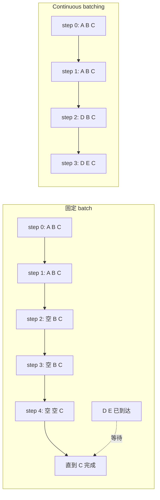

> **读图方法：** 阅读“Static Batch 的基本问题”这张流程图时，先把方框看成对象或状态，把箭头看成数据或控制的移动。第一遍从左向右建立顺序，第二遍再核对分支发生的条件。

固定 batch 的问题不只是“吞吐少一点”：

- **空槽浪费**：结束得早的 sequence 不再贡献计算，却占据 batch 生命周期。
- **队首阻塞**：一个长输出拖住整批之后的请求。
- **TTFT 变差**：新请求的 first token 必须等待旧批次全部完成。
- **长度异质性惩罚**：生产请求长度差异越大，浪费越明显。

把序列 padding 到相同长度只能让 tensor 形状合法，不能消除上述生命周期问题。

## 4.2 Continuous Batching 的本质

Continuous Batching 更准确的中文是“连续重组批次”：每个 engine step 都允许批次成员
变化。

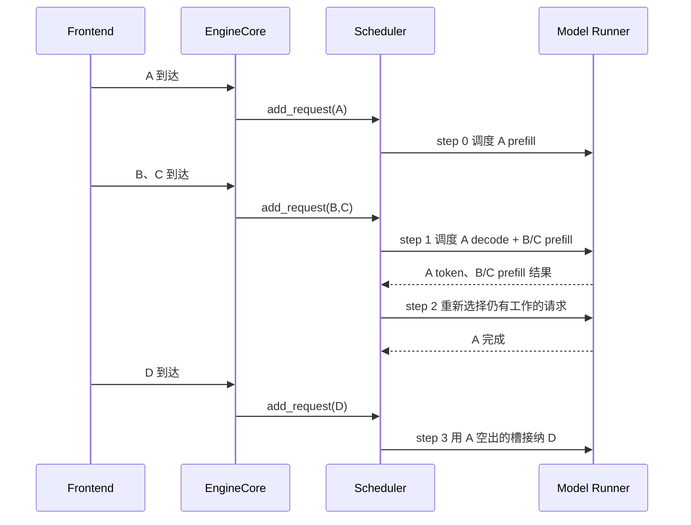

> **读图方法：** 这是“Continuous Batching 的本质”的时序图。先从左到右确认参与者分别负责什么，再从上到下追踪消息；第一遍只看正常路径，第二遍再看返回、异步消息和失败分支。

这里有三个层次不要混淆：

| 层次 | 含义 |
|---|---|
| 请求集合 | 哪些请求处于 waiting、running、finished |
| step 工作集合 | 本轮真正获得正数 token 的请求 |
| GPU batch | Model Runner 把 step 工作整理成设备输入后的执行形态 |

`running` 不等于“本轮一定执行”。源码允许某个 RUNNING 请求因 encoder budget、PP
cadence、Mamba 对齐或其他约束在本轮获得 0 token，而较后的请求继续执行。因此：

```text
scheduled requests <= running requests
```

Continuous Batching 描述的是跨 step 的成员变化；真正的 tensor 布局属于第 07 章。

## 4.3 Scheduler 在系统中的位置

Scheduler 位于协议前端和 GPU 执行之间。它接收已经 tokenized、参数已规范化的
`Request`，输出 `SchedulerOutput`。

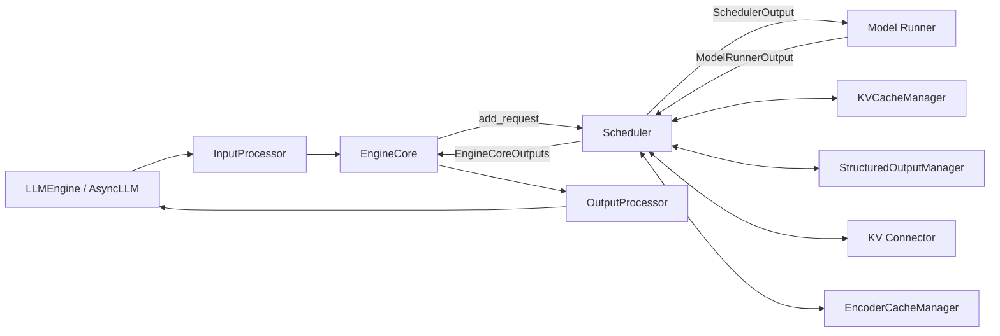

> **读图方法：** 这是“Scheduler 在系统中的位置”的流程图。先从左向右只追一条主路径，确认输入经过哪些关键阶段到达输出；第二遍再看虚线、回边和旁路，它们通常表示反馈、复用或可选分支。

Scheduler 的职责包括：

- 维护请求状态与 waiting/running 容器；
- 计算本轮每个请求的 token 数；
- 请求 KV block 分配、命中已有 prefix 或发起远端 KV 加载；
- 在容量不足时抢占 running 请求；
- 输出新请求全量数据和旧请求增量数据；
- 接收模型输出，追加 token、判断 stop、释放资源。

它不负责 tokenizer、chat template、Transformer kernel、HTTP streaming、文本
detokenize 和 PagedAttention 的物理寻址实现。

## 4.4 Request 的状态与计数

> **本节先看：** 本节要回答：**Request 的状态与计数**。下面的小节会逐层拆开概念、运行过程和源码落点；第一次阅读先抓对象之间的关系，第二次再记类名、字段和分支。

### 4.4.1 状态并不只有 waiting/running/finished

当前 `RequestStatus` 的非完成状态包括：

| 状态 | 含义 |
|---|---|
| `WAITING` | 尚未首次进入 Model Runner |
| `WAITING_FOR_STRUCTURED_OUTPUT_GRAMMAR` | 等待 grammar 准备完成 |
| `WAITING_FOR_REMOTE_KVS` | 已发起异步 KV 加载，尚不能 forward |
| `WAITING_FOR_STREAMING_REQ` | 可恢复的流式会话等待后续输入 |
| `RUNNING` | 已进入运行集合并持有执行侧状态 |
| `PREEMPTED` | 被抢占后回到等待队列，之后需要恢复 |

枚举中 `PREEMPTED` 之后的状态都被视为 finished，包括 stopped、length capped、aborted、
ignored、error 和 repetition。

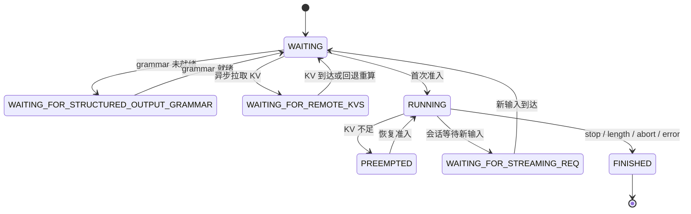

> **读图方法：** 这是“状态并不只有 waiting/running/finished”的状态图。先找初始状态，再沿箭头观察触发条件和状态变化；重点不是背状态名，而是弄清谁触发转换、转换后哪些资源需要更新。

图中把多个 finished 枚举合并为一个终态；真实源码保留具体 finish reason。

### 4.4.2 决策依赖的是一组计数

`Request` 中与本章最相关的字段是：

| 字段 | 回答的问题 |
|---|---|
| `num_prompt_tokens` | prompt 有多少 token |
| `_output_token_ids` | 已经接受了哪些输出 token |
| `spec_token_ids` | 本轮可验证的 draft token |
| `num_computed_tokens` | 已被 Scheduler 视为算到哪个位置 |
| `num_output_placeholders` | 异步调度预留了多少尚未回传的输出位置 |
| `num_in_flight_tokens` | 有多少已提交 token 尚未 update |
| `num_stale_output_tokens` | 抢占后仍在途、需要特殊处理的旧结果 |
| `is_prefill_chunk` | 乐观推进后是否仍未追上当前 token 序列 |
| `num_preemptions` | 被抢占次数 |
| `priority`、`arrival_time` | priority queue 的排序键 |

不要把 `num_computed_tokens` 理解成“已向用户返回的 token 数”。它是调度器对模型计算
位置的记账，可以包含已提交但尚未收到结果的工作。

## 4.5 V1 的统一 Token 差额模型

Scheduler 源码在 `schedule()` 开头明确说明：调度器内部没有必须二选一的全局
“prefill phase”或“decode phase”。每个请求只有当前目标和已计算进度。

```math
N_{target}
= N_{prompt} + N_{accepted\ output} + N_{spec}
```

忽略异步 placeholder 时，本轮需要追赶的差额为：

```math
N_{new} = N_{target} - N_{computed}
```

源码中的 running 路径还会加入 `num_output_placeholders`：

```math
N_{new}
= N_{tokens\ with\ spec} + N_{placeholders} - N_{computed}
```

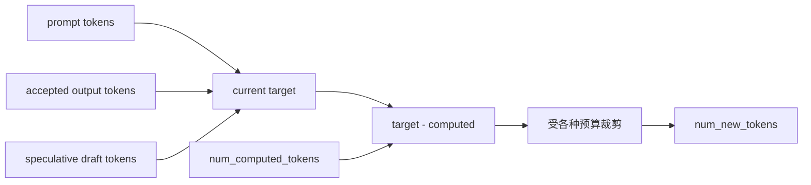

> **读图方法：** 这张图用于压缩“V1 的统一 Token 差额模型”的整体关系。先从左向右找到起点、关键转换和终点，再问每条跨层箭头是否意味着函数调用、消息传递、内存访问或状态更新。

### 4.5.1 一个最小例子

请求 prompt 长度为 4，尚无输出：

```text
target = 4
computed = 0
deficit = 4
```

首次 step 计算 4 个 prompt token，并从最后位置采样得到第一个输出 token `x1`。之后：

```text
target = prompt 4 + output 1 = 5
computed = 4
deficit = 1
```

下一轮差额为 1，这就是普通自回归 decode 常见的一 token 工作量。再采样出 `x2` 后，
target 变成 6，computed 变成 5，下一轮又差 1。

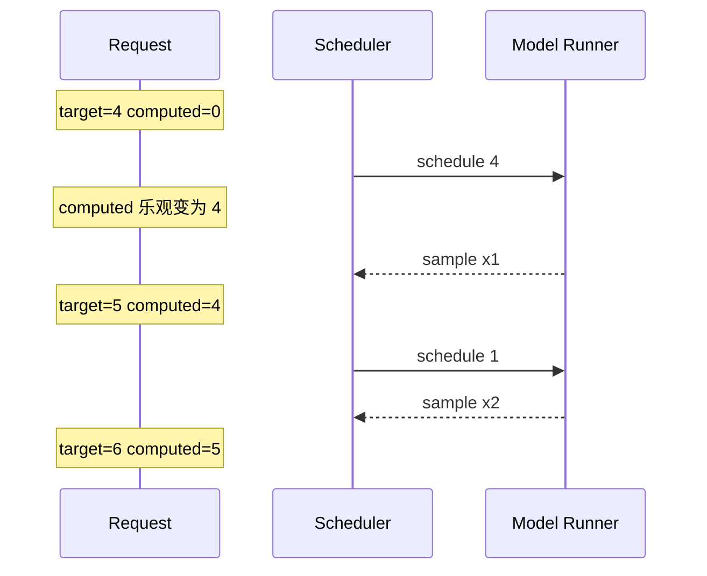

> **读图方法：** 这是“一个最小例子”的时序图。先从左到右确认参与者分别负责什么，再从上到下追踪消息；第一遍只看正常路径，第二遍再看返回、异步消息和失败分支。

普通 decode 通常表现为每请求一轮 1 个待计算 token，但不要把它写成 Scheduler 的绝对
定律。推测解码、扩散模型、多 token 采样和未来的 jump decoding 都会改变差额形态；
统一模型正是为了容纳这些情况。

### 4.5.2 同一公式怎样覆盖不同优化

> **本节先看：** 下面先用表格整理“同一公式怎样覆盖不同优化”。先横向比较每一列解决的问题和适用边界，再把具体名称映射到源码。

| 场景 | 对差额的影响 |
|---|---|
| Chunked prefill | 差额很大，但每轮只取预算允许的一部分 |
| Prefix caching | 命中部分直接增加 computed 起点，减少差额 |
| Speculative decoding | draft token 增加 target，一轮可能验证多个位置 |
| Async scheduling | placeholder 代表已预留但结果未回来的位置 |
| KV load failure | 降低 computed，使无效区间重新进入差额 |
| Preemption | computed 重置为 0，触发 recompute |

## 4.6 五类约束不要混成一个参数

调度常被错误简化为“batch size”。真实 Scheduler 至少同时受五类约束。

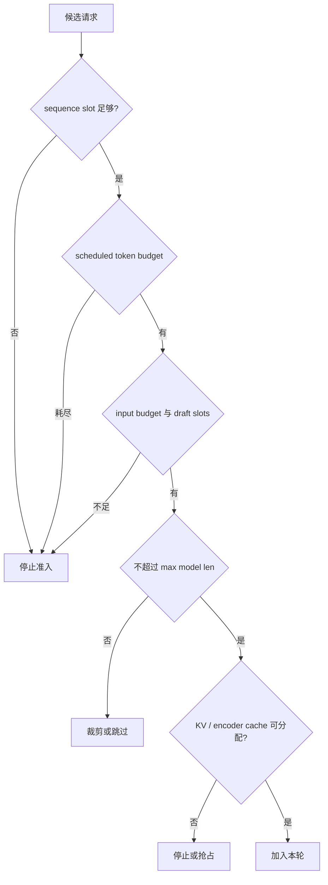

> **读图方法：** 阅读“五类约束不要混成一个参数”这张流程图时，先把方框看成对象或状态，把箭头看成数据或控制的移动。第一遍从上向下建立顺序，第二遍再核对分支发生的条件。

### 4.6.1 `max_num_scheduled_tokens`

这是 Scheduler 一轮最多发出的实际 token 工作量：

```math
\sum_r N_{scheduled}(r) \le max\_num\_scheduled\_tokens
```

若配置为 `None`，Scheduler 初始化时回退到 `max_num_batched_tokens`。

### 4.6.2 `max_num_batched_tokens`

这是单次迭代可处理的输入容量。通常与 scheduled token 上限相同，但当前源码允许两者
不同。模型可能在 batch 中追加位置，例如 speculative decoding，因此 Scheduler 发出的
token 数可以比最终输入容量上限更小。

源码每调度一个请求时，大致执行：

```text
token_budget -= num_new_tokens
input_budget -= num_new_tokens + draft_slots
```

所以 `draft_slots` 消耗 input budget，却不等同于本轮已确认的 scheduled token。

### 4.6.3 `max_num_seqs`

它限制同时处于运行侧的 sequence 数量，不限制 token 总量。100 个短 decode 请求和一个
10K prompt 会受到完全不同的瓶颈。

暂停等待 streaming input 的会话虽然不在普通 running 列表中，仍可能占 Model Runner
request slot；源码在准入时把它们计入 running 数。

### 4.6.4 `max_model_len`

即使本轮还有预算，也不能让位置越过模型最大长度。running 路径还要为本轮采样位置
留出空间。

### 4.6.5 KV 与 encoder 容量

token budget 是计算配额，不代表 KV 一定有空间。Scheduler 必须调用
`KVCacheManager.allocate_slots()`；多模态请求还受 encoder compute budget 和 encoder
cache 约束。

因此合法调度不是单变量最小值，而是多个资源约束的交集。

## 4.7 一次 `schedule()` 的总体流程

去掉 connector、structured output 和模型特例后，主干如下：

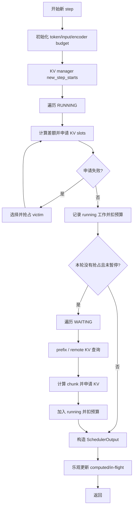

> **读图方法：** 这张图用于压缩“一次 `schedule()` 的总体流程”的整体关系。先从上向下找到起点、关键转换和终点，再问每条跨层箭头是否意味着函数调用、消息传递、内存访问或状态更新。

可以把它记成四句话：先保护已经运行的请求；必要时通过抢占解决其 KV 扩容；本轮没有
发生抢占时再用剩余预算接纳 waiting；最后输出工作清单并乐观推进计数。

“本轮有抢占就不接纳 waiting”是重要稳定性策略。系统刚因容量不足驱逐请求时，立即
再加入新请求通常只会制造更多抖动。

## 4.8 第一段：先调度 RUNNING 请求

running 循环从列表头部向后遍历。对每个请求执行以下逻辑：

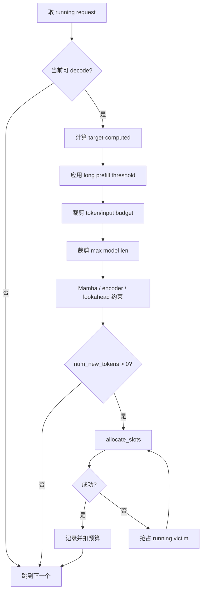

> **读图方法：** 这是“第一段：先调度 RUNNING 请求”的流程图。先从上向下只追一条主路径，确认输入经过哪些关键阶段到达输出；第二遍再看虚线、回边和旁路，它们通常表示反馈、复用或可选分支。

### 4.8.1 Running 优先不等于每个 running 都必跑

当 `num_new_tokens == 0` 时，源码使用 `continue` 而不是 `break`。注释明确承认，这会
允许更靠后的低优先级请求执行，因此不是严格 FCFS。

可能导致 0 token 的原因包括 PP 或 async scheduling 已把目标位置提交在途、达到模型
长度、encoder compute/cache 耗尽、Mamba block 对齐和 MTP prefill lookahead 约束。

工程上，这比为了纯粹队列顺序让整个 step 空转更合理。

### 4.8.2 Running 分配失败会尝试抢占

已经 running 的请求需要扩展 KV 时，如果 `allocate_slots()` 返回 `None`，Scheduler
会从当前 running 集合中选择 victim，释放其 block，再重试当前请求。

如果 victim 在本 step 已经获得工作，源码还会撤销它的调度记录，并恢复 token budget、
input budget 与 draft slots、新 block 记录、speculative token 记录和 encoder compute
budget。这保证最终 `SchedulerOutput` 与预算账本一致。

## 4.9 第二段：再接纳 WAITING 请求

waiting 循环只有在本轮没有 preempted request、Scheduler 未暂停、预算未耗尽且 sequence
slot 尚有空间时才开始。

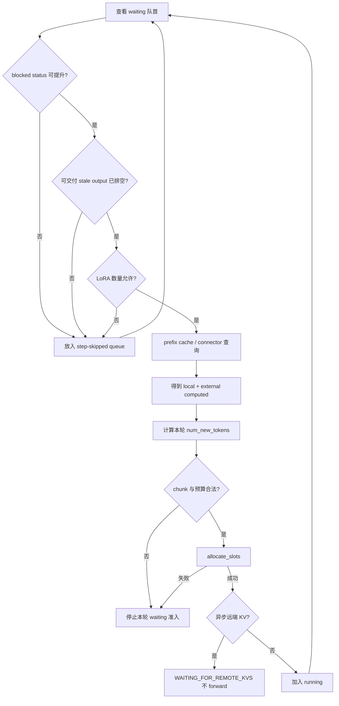

> **读图方法：** 阅读“第二段：再接纳 WAITING 请求”这张流程图时，先把方框看成对象或状态，把箭头看成数据或控制的移动。第一遍从上向下建立顺序，第二遍再核对分支发生的条件。

### 4.9.1 Skip 与 break 的区别

当前会阻塞 waiting 准入的状态包括：structured-output grammar 尚未就绪、远端 KV 尚未
接收完成，以及 streaming request 正在等待下一段输入。除此之外，可交付的 stale output
仍在途（`drop_stale_output=false`）、LoRA 数量限制、connector 暂时无法确定命中长度或
encoder-cache transfer 尚未完成，也都可能只影响当前请求。源码会把这类请求临时移到
step-skipped queue，然后继续检查其他请求。若配置为丢弃 stale output，则不需要等待旧
输出排空，不能把所有 stale 情况都概括为同一条阻塞规则。

但 sequence slot 已满、预算不足、关闭 chunked prefill 时队首请求放不下，或当前 waiting
请求 KV 无法分配时，通常执行 `break`。这决定了后面的请求能否绕过队首。

### 4.9.2 Waiting 分配失败不会立即抢占 running

Running 路径会为已有请求抢占；waiting 准入路径的 `allocate_slots()` 失败则停止接纳。
默认策略优先保护已有工作，不会为了每个新请求立刻驱逐 running 请求。

高优先级新请求也不是一到达就无条件打断 GPU 上的低优先级请求。Priority 首先影响
waiting 顺序；只有后续 KV 压力触发 victim 选择时，低优先级 running 才更可能被抢占。

## 4.10 Chunked Prefill 怎样工作

长 prompt 的 prefill 通常计算密集，而 decode 请求每轮工作量较小。如果一个 8K prompt
独占整轮甚至多轮，已经在输出的请求会出现明显 inter-token latency 抖动。

Chunked prefill 把长差额裁成预算允许的片段：

```math
N_{chunk}
= \min(N_{remaining},\ token\ budget,\ input\ budget,\ threshold,\ other\ caps)
```

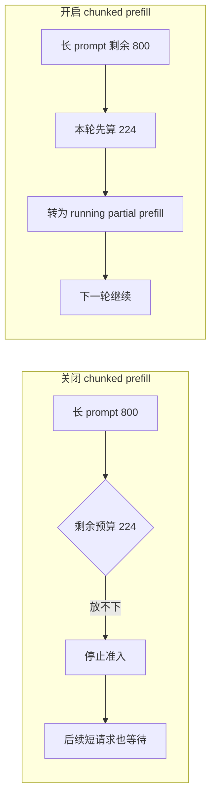

> **读图方法：** 这张图用于压缩“Chunked Prefill 怎样工作”的整体关系。先从左向右找到起点、关键转换和终点，再问每条跨层箭头是否意味着函数调用、消息传递、内存访问或状态更新。

### 4.10.1 上游测试给出的精确例子

`test_schedule_concurrent_partial_requests` 设置 3 个 800-token prompt、
`max_num_batched_tokens=1024`、`long_prefill_token_threshold=400`。

第一轮分配为：

| 请求 | 本轮 token | 原因 |
|---|---:|---|
| R0 | 400 | threshold 截断 |
| R1 | 400 | threshold 截断 |
| R2 | 224 | 剩余 budget 为 1024 - 400 - 400 |

第二轮仍是 `400, 400, 224`。第三轮 R0、R1 已进入普通 decode，各获得 1；R2 获得
`800 - 224 - 224 = 352` 个剩余 prefill token。

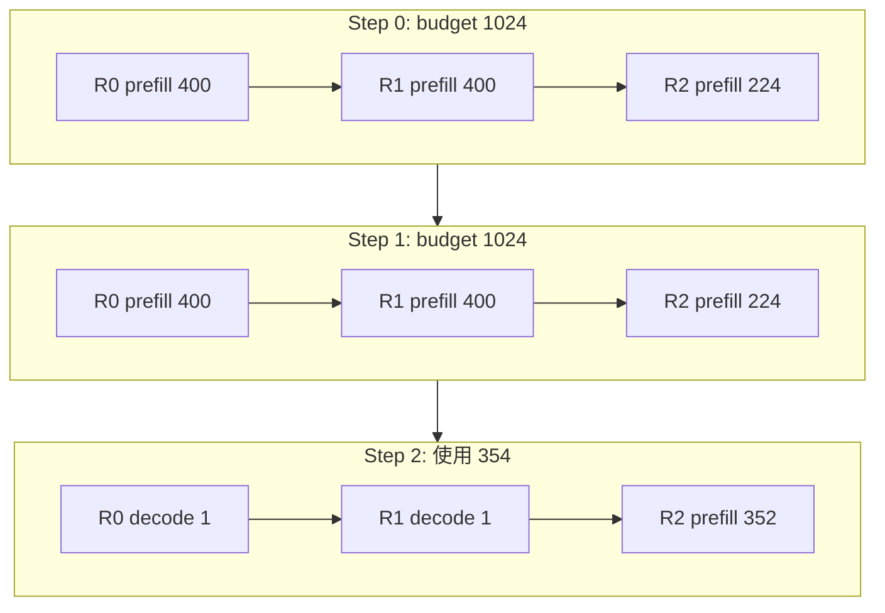

> **读图方法：** 这是“上游测试给出的精确例子”的流程图。先从上向下只追一条主路径，确认输入经过哪些关键阶段到达输出；第二遍再看虚线、回边和旁路，它们通常表示反馈、复用或可选分支。

图中方框不按 token 数等比例缩放，标签给出精确预算。

### 4.10.2 关闭切片后的队首语义

上游 `test_schedule_order` 用两个 800-token 长请求和两个 10-token 短请求验证：关闭
chunked prefill 后，如果下一个长请求整体放不进剩余 budget，Scheduler 不会跳过它去
提前执行后面的短请求。

这样保留了 waiting queue 的顺序语义，但会让预算出现空余。开启 chunked prefill 后，
长请求可以部分进入，减少这一类空洞。

### 4.10.3 Threshold 不是总 chunk 大小

`long_prefill_token_threshold` 只是一个额外上限，最终 chunk 还受当前 token/input budget、
encoder、Mamba 对齐和 lookahead 等限制。设为 0 表示关闭该额外 cap，不表示关闭
chunked prefill。

## 4.11 Continuous Batching 的逐步例子

下面用简化模型演示动态到达：

| 请求 | 到达 step | prompt | 最大输出 |
|---|---:|---:|---:|
| A | 0 | 12 | 3 |
| B | 1 | 3 | 2 |
| C | 2 | 2 | 2 |

设置：

```text
max_num_scheduled_tokens = 8
long_prefill_token_threshold = 6
max_num_seqs = 3
```

教学模型得到：

```text
step=00 work=[A:p6]
step=01 work=[A:p6, B:p2]
step=02 work=[A:d1, B:p1, C:p2]
step=03 work=[A:d1, B:d1, C:d1]
```

其中 `p` 表示 prefill，`d` 表示普通 decode。关键现象是：B、C 不需要等 A 完整输出
结束才进入 GPU 工作集合。

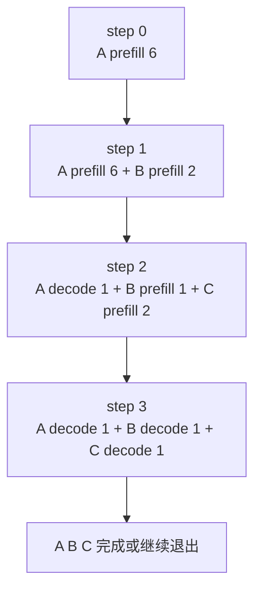

> **读图方法：** 阅读“Continuous Batching 的逐步例子”这张流程图时，先把方框看成对象或状态，把箭头看成数据或控制的移动。第一遍从上向下建立顺序，第二遍再核对分支发生的条件。

这就是 continuous batching 的核心：批次边界仍然存在，但批次成员和每个成员的 token
数在每个边界重新计算。

## 4.12 KV Cache 是调度的硬约束

Scheduler 可以算出理想 token 分配，但只有 KV block 可用时才能真正提交。

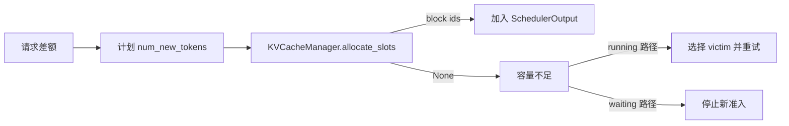

> **读图方法：** 这张图用于压缩“KV Cache 是调度的硬约束”的整体关系。先从左向右找到起点、关键转换和终点，再问每条跨层箭头是否意味着函数调用、消息传递、内存访问或状态更新。

`scheduler_reserve_full_isl=True` 时，准入新请求会检查完整 input sequence 是否能放进 KV，
而不是只看第一个小 chunk。它的目的不是声称“立刻占用所有 prompt block”，而是避免
因首 chunk 很小而过度接纳，随后多个请求一起增长并频繁抢占。

`watermark` 只在本 step 已经调度了其他请求时，对 waiting/preempted 请求的新准入要求
保留一部分空闲 block，给后续增长留出余量。若当前 step 还是空的，第一个请求不受该
门槛阻挡，避免系统在有可用 KV 时仍无法启动任何工作。

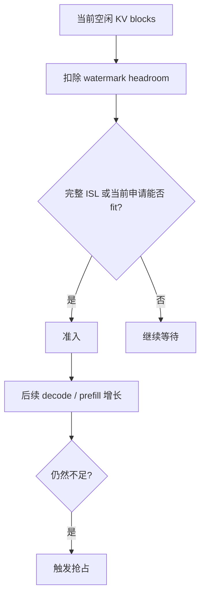

> **读图方法：** 这是“KV Cache 是调度的硬约束”的流程图。先从上向下只追一条主路径，确认输入经过哪些关键阶段到达输出；第二遍再看虚线、回边和旁路，它们通常表示反馈、复用或可选分支。

KV block 的哈希、prefix cache、引用计数、partial block 和 CoW 属于第 05 章。本章只关心
Scheduler 与 KV manager 的资源协议。

## 4.13 Preemption：释放、重置、回队

当前默认抢占语义接近 recompute：被抢占请求释放本地执行状态，之后重新计算。

`_preempt_request()` 的关键动作是：

1. 释放请求持有的 KV block；
2. 释放 encoder cache 状态；
3. 从 in-flight prefill 集合移除；
4. 把状态改为 `PREEMPTED`；
5. 把 `num_computed_tokens` 重置为 0；
6. 清空 speculative tokens；
7. 处理异步在途输出的 stale 计数；
8. 清空 output placeholders；
9. 增加 `num_preemptions`；
10. 把请求放回 waiting queue，并记录 preempted id。

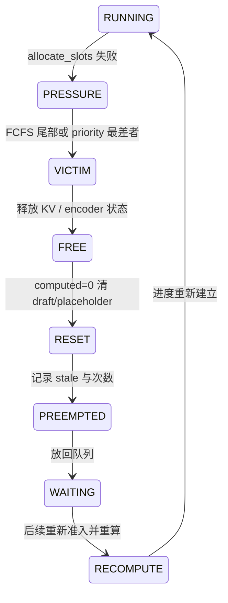

> **读图方法：** 这是“Preemption：释放、重置、回队”的状态图。先找初始状态，再沿箭头观察触发条件和状态变化；重点不是背状态名，而是弄清谁触发转换、转换后哪些资源需要更新。

### 4.13.1 为什么重置为 0

计算过 token 不代表其 KV 仍存在。既然抢占释放了 block，之后不能仅把序列位置指针挪
回来；必须重新建立 attention 所需状态。Prefix cache 或远端 KV 可能让恢复时重新命中
部分前缀，但本地 `num_computed_tokens` 先归零，避免把已释放状态当成有效状态。

### 4.13.2 为什么抢占可能浪费计算

请求被反复抢占会重复 prefill，增加计算量并恶化 TTFT/TPOT。因此调大并发序列数并不
总能提高吞吐；当 KV 容量不足时，它可能只增加 thrashing。

## 4.14 FCFS 与 Priority 的真实含义

> **本节先看：** 本节要回答：**FCFS 与 Priority 的真实含义**。下面的小节会逐层拆开概念、运行过程和源码落点；第一次阅读先抓对象之间的关系，第二次再记类名、字段和分支。

### 4.14.1 Waiting queue

FCFS 使用 `deque`：

```text
add      -> append
pop      -> popleft
prepend  -> appendleft
```

Priority 使用 heap，排序键来自 `Request.__lt__()`：

```text
(priority, arrival_time, request_id)
```

数值越小，优先级越高；priority 相同则更早到达者优先；再用 request id 保证稳定可比较。
Priority queue 没有“插到最前”概念，`prepend_request()` 与普通 add 等价，最终仍按排序键
决定位置。

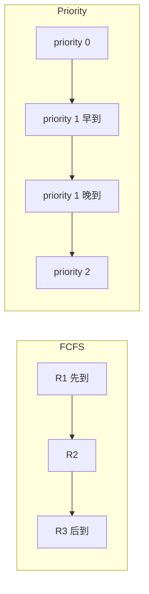

> **读图方法：** 这张图用于压缩“Waiting queue”的整体关系。先从左向右找到起点、关键转换和终点，再问每条跨层箭头是否意味着函数调用、消息传递、内存访问或状态更新。

### 4.14.2 Preemption victim

当 running KV 扩容失败：

| 策略 | victim 选择 |
|---|---|
| FCFS | `running.pop()`，即当前 running 列表尾部 |
| Priority | `(priority, arrival_time)` 最大者，即数值优先级最低、同级更晚者 |

注意“调度谁”和“抢占谁”是两次不同决策。新高优先级请求可能先进入 running；只有当
KV 继续增长并不足时，Scheduler 才选择较差 running victim。

上游 priority 测试证明：输入优先级 `[2, 0, 1]` 时调度顺序是 priority 0、1、2；KV
不足的恢复测试则证明低优先级 running 被抢占，高优先级请求保留并最终让被抢占者恢复。

## 4.15 Prefix Cache 与远端 KV 如何改变准入

Waiting 请求第一次调度时，Scheduler 先询问本地 prefix cache。若命中 `H_local` 个
token，又从 connector 获得 `H_external` 个有效 token，则起始进度近似为：

```math
N_{computed}=H_{local}+H_{external}
```

剩余工作变成：

```math
N_{new}=N_{tokens}-N_{computed}
```

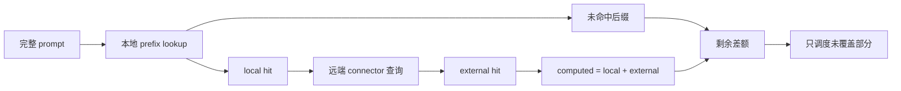

> **读图方法：** 这是“Prefix Cache 与远端 KV 如何改变准入”的流程图。先从左向右只追一条主路径，确认输入经过哪些关键阶段到达输出；第二遍再看虚线、回边和旁路，它们通常表示反馈、复用或可选分支。

真实实现还处理 partial tail、block alignment、Mamba state 边界和外部命中覆盖本地尾块等
细节，第 05 章会展开。

如果 connector 选择异步加载，Scheduler 本轮可以先分配 block 并把请求转为
`WAITING_FOR_REMOTE_KVS`，但 `num_new_tokens=0`，不会执行 forward。等传输完成后再恢复
到可调度状态。

同步加载则会在本轮标记 `has_sync_kv_loads`，让执行侧知道输入依赖外部 KV。

## 4.16 多模态与 Encoder Budget

对文本模型，token budget 和 KV 通常是主约束。多模态请求还需要安排图像、音频等
encoder 输入。

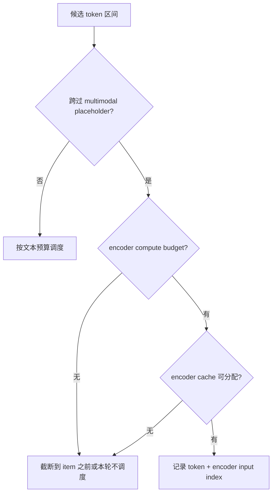

> **读图方法：** 阅读“多模态与 Encoder Budget”这张流程图时，先把方框看成对象或状态，把箭头看成数据或控制的移动。第一遍从上向下建立顺序，第二遍再核对分支发生的条件。

`SchedulerOutput.scheduled_encoder_inputs` 记录每个 request 本轮需要处理的 encoder input
索引。源码测试还验证：如果多模态 item 尚未编码，encoder-only request 不能提前被视为
成功完成。

`disable_chunked_mm_input=True` 时，一个多模态 item 不会被从中间切开。例如文本 `TTTT`
后接图像 token `IIIIIIIIII`，预算只能容纳 `TTTTIIIII` 时，Scheduler 可以先只调度
`TTTT`，下一轮再完整处理图像 item。

## 4.17 SchedulerOutput 是执行合同

调度器最终不返回一个简单 request id 列表，而是一个多层数据合同。

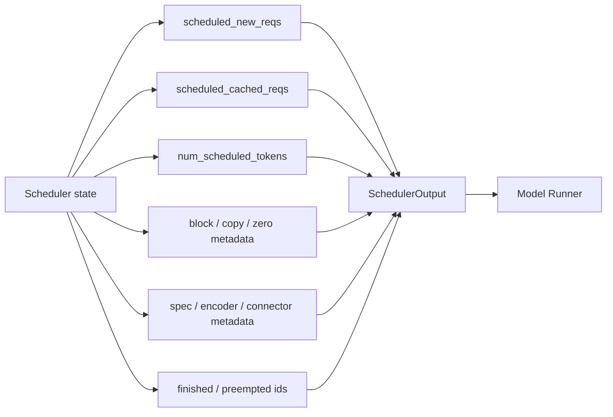

> **读图方法：** 这张图用于压缩“SchedulerOutput 是执行合同”的整体关系。先从左向右找到起点、关键转换和终点，再问每条跨层箭头是否意味着函数调用、消息传递、内存访问或状态更新。

### 4.17.1 新请求与缓存请求分开

`scheduled_new_reqs` 携带首次发送给 worker 的完整请求数据。Worker 会缓存这些数据，
之后 `scheduled_cached_reqs` 只发送变化部分，降低每 step 的 CPU/IPC 开销。

V2 Model Runner 会把 resumed request 合并进 new request 路径；旧路径可以在 cached data
中表达 resumed 差异。读源码时要确认当前 runner 分支。

### 4.17.2 核心字段

> **本节先看：** 下面先用表格整理“核心字段”。先横向比较每一列解决的问题和适用边界，再把具体名称映射到源码。

| 字段 | 作用 |
|---|---|
| `num_scheduled_tokens` | request id 到本轮 token 数的映射 |
| `total_num_scheduled_tokens` | 上述值之和，用于不变量和执行判断 |
| `scheduled_spec_decode_tokens` | 本轮要验证的 draft token |
| `scheduled_encoder_inputs` | 需要执行的多模态 encoder item |
| `num_common_prefix_blocks` | running 集合共同前缀，可用于 cascade attention |
| `finished_req_ids` | 两轮之间完成、需通知 worker 清理的请求 |
| `preempted_req_ids` | 本轮抢占、需重置 worker 状态的请求 |
| `new_block_ids_to_zero` | 新 block 使用前需要清零的 id |
| `kv_cache_block_copies` | 本轮执行前需要完成的 CoW copy |
| connector metadata | KV/encoder cache 传输协议数据 |
| `num_spec_tokens_to_schedule` | 动态 speculative decoding 的 K |

SchedulerOutput 把控制面决定转换为第 07 章 Model Runner 能消费的增量协议。

## 4.18 为什么 Schedule 后立即乐观推进

`_update_after_schedule()` 在 Model Runner 返回前就执行：

```text
request.num_computed_tokens += num_scheduled_token
request.num_in_flight_tokens += num_scheduled_token
```

然后更新 `is_prefill_chunk`。

```mermaid
sequenceDiagram
    participant S as Scheduler
    participant Q as Request counters
    participant M as Model Runner
    S->>M: step N SchedulerOutput
    S->>Q: computed += scheduled
    S->>Q: in_flight += scheduled
    Note over S,Q: 不等待 step N 完成即可规划后续 step
    S->>M: 可提交 step N+1
    M-->>S: step N output
    S->>Q: in_flight -= scheduled
    S->>Q: 必要时回滚 rejected/stale
```

> **读图方法：** 这是“为什么 Schedule 后立即乐观推进”的时序图。先从左到右确认参与者分别负责什么，再从上到下追踪消息；第一遍只看正常路径，第二遍再看返回、异步消息和失败分支。

这样做支持 PP 或 async scheduling 下多个 batch 同时在途。如果一定等 output 才推进，
Scheduler 就无法为下一轮构造正确位置。

代价是状态变成“预测账本”：后续必须处理 speculative rejection、KV load failure、abort
和 preemption 造成的回滚或 stale output。

## 4.19 `update_from_output()` 怎样结算

Model Runner 返回后，Scheduler 不只是把 token 传出去。主要步骤包括：

```mermaid
flowchart TB
    A[ModelRunnerOutput] --> B[完成 deferred free fence]
    B --> C[处理 connector invalid blocks]
    C --> D[逐 request 减少 in-flight]
    D --> E{request 已 abort/finish?}
    E -->|是| SKIP[忽略迟到结果]
    E -->|否| F{stale output?}
    F -->|drop| SKIP
    F -->|可处理| G[结算 speculative accepted/rejected]
    G --> H[追加 sampled token / pooling output]
    H --> I[检查 stop、length、grammar、error]
    I --> J{完成?}
    J -->|是| FREE[释放 request 和 block]
    J -->|否| KEEP[保留 running/preempted 状态]
    FREE --> OUT[生成 EngineCoreOutput]
    KEEP --> OUT
```

> **读图方法：** 阅读“`update_from_output()` 怎样结算”这张流程图时，先把方框看成对象或状态，把箭头看成数据或控制的移动。第一遍从上向下建立顺序，第二遍再核对分支发生的条件。

### 4.19.1 In-flight 先减账

每个 scheduled request 先执行 `num_in_flight_tokens -= num_tokens_scheduled`。如果这部分
属于抢占前的 stale share，同时减少 `num_stale_output_tokens`。

### 4.19.2 Abort 与迟到结果

请求可能在 GPU 执行期间被 abort。此时 output 回来后，Scheduler 发现 request 不存在或已
finished，直接跳过，不能让迟到 token 复活请求。这与第 03 章 abort race 的顺序相接。

### 4.19.3 Speculative rejection 回滚

Scheduler 乐观地把 draft 位置计入 computed；Model Runner 验证后若拒绝一部分，update
必须从 `num_computed_tokens` 和 async placeholder 中减去拒绝数。

### 4.19.4 完成后释放

新 token 可能触发 stop string、EOS、长度上限、grammar error 或其他终止条件。完成请求
被移出 running/preempted 集合，释放 KV/encoder/connector 资源，并生成带 finish reason
的 `EngineCoreOutput`。

Partial prefill 本身通常不产生可见 token 输出；只有到达可采样位置后才向上游发送结果。

## 4.20 多个在途 Batch 为什么需要 Fence

第 03 章看到 PP 或 async scheduling 可以让多个 batch 同时在途。此时“请求已逻辑完成”
不等于“GPU 已停止写它的 block”。

```mermaid
sequenceDiagram
    participant S as Scheduler
    participant G as GPU stream
    participant P as KV block pool
    S->>G: step 10 写 block 7
    S->>S: request abort / finish
    Note over S,P: 不能立刻把 block 7 给新请求
    S->>P: deferred free, fence=10
    G-->>S: step 10 output 完成
    S->>P: processed fence 到达, block 7 可回池
```

> **读图方法：** 这是“多个在途 Batch 为什么需要 Fence”的时序图。先从左到右确认参与者分别负责什么，再从上到下追踪消息；第一遍只看正常路径，第二遍再看返回、异步消息和失败分支。

当前实现对某些 KV connector consumer + 多在途 batch 组合启用 `defer_block_free`：

- 非空 schedule step 增加 `sched_step_seq`；
- request 记录最后调度序号；
- update 确认 GPU 写入完成后增加 `processed_step_seq`；
- 只有 fence 满足时才真正把 block 归还 pool。

否则，新请求或远端 KV load 可能重用一个仍被旧 GPU 工作写入的 block，形成数据竞争。

## 4.21 Pause、Prefill Cadence 与“还有工作”

> **本节先看：** 本节要回答：**Pause、Prefill Cadence 与还有工作**。下面的小节会逐层拆开概念、运行过程和源码落点；第一次阅读先抓对象之间的关系，第二次再记类名、字段和分支。

### 4.21.1 Pause

`PAUSED_ALL` 会把本轮 token budget 置 0，不调度任何请求。`PAUSED_NEW` 的行为边界在
EngineCore 控制流中体现：已有工作可以继续 drain，但暂停新准入。

### 4.21.2 DP prefill cadence

`prefill_schedule_interval` 可让 data-parallel ranks 只在对齐的 cadence step 接纳新
prefill，从而减少各 rank forward 时间差异。在 throttle step 中，已有 decode 可以继续，
prefill 可能被延后；如果该 rank 没有 running 工作，则不应把整个 step 浪费成 dummy。

```mermaid
flowchart LR
    STEP[当前 DP step] --> CAD{cadence 对齐?}
    CAD -->|是| ALL[允许 prefill + decode]
    CAD -->|否| RUN{本 rank 有 decode?}
    RUN -->|是| DEC[保护 decode, 延后 prefill]
    RUN -->|否| PRE[允许 prefill, 避免空转]
```

> **读图方法：** 这是“DP prefill cadence”的流程图。先从左向右只追一条主路径，确认输入经过哪些关键阶段到达输出；第二遍再看虚线、回边和旁路，它们通常表示反馈、复用或可选分支。

### 4.21.3 `has_requests()` 不只看用户是否未完成

Scheduler 可能还要完成 connector 的 KV 清理或 pending push。即使没有普通 unfinished
request，EngineCore 也可能需要继续驱动空 step 处理系统工作。因此不要把“没有用户
token 输出”直接等同于“内核可以睡眠”。

## 4.22 配置参数怎样影响吞吐与延迟

> **本节先看：** 本节要回答：**配置参数怎样影响吞吐与延迟**。下面的小节会逐层拆开概念、运行过程和源码落点；第一次阅读先抓对象之间的关系，第二次再记类名、字段和分支。

### 4.22.1 参数表

> **本节先看：** 下面先用表格整理“参数表”。先横向比较每一列解决的问题和适用边界，再把具体名称映射到源码。

| 参数 | 增大或开启后的常见收益 | 主要风险 |
|---|---|---|
| `max_num_batched_tokens` | 更大 prefill 吞吐、更高设备利用率 | 单 step 更长，decode 延迟抖动 |
| `max_num_scheduled_tokens` | Scheduler 每轮可发更多工作 | 受实际 batch 追加位置限制 |
| `max_num_seqs` | 更多 decode 并发 | KV 压力、CPU 开销、graph shape 增多 |
| `long_prefill_token_threshold` | 单个长 prefill 每轮推进更多 | 更容易挤压 decode |
| `scheduler_reserve_full_isl` | 减少过度准入和 thrashing | 极端小 KV 下更保守 |
| `watermark` | 给增长留余量，减少抢占 | 降低可立即使用的容量 |
| `prefill_schedule_interval` | DP rank 时延更整齐 | 新请求 TTFT 可能增加 |
| `policy=priority` | 支持业务等级和紧急请求 | 低优先级 starvation 风险 |

`max_num_queued_reqs` 和 `max_num_queued_tokens` 属于前端 admission/QoS 阀门：达到上限时
新请求可返回 HTTP 503，让流量在实例之间重试。它们控制进入系统的 backlog，不等同于
Scheduler 单轮预算。

### 4.22.2 调优不是单向拉大参数

> **本节先看：** 这一小节先用图建立“调优不是单向拉大参数”的整体路径。先找输入、关键状态和输出，再阅读图后的源码解释，不必一开始记住全部节点。

```mermaid
flowchart TB
    T[吞吐] --- B[max batched tokens / seqs]
    L[TTFT 与 TPOT] --- B
    K[KV 稳定性] --- B
    T --- C[chunk / threshold]
    L --- C
    K --- R[reserve full ISL / watermark]
    T --- R
```

> **读图方法：** 阅读“调优不是单向拉大参数”这张流程图时，先把方框看成对象或状态，把箭头看成数据或控制的移动。第一遍从上向下建立顺序，第二遍再核对分支发生的条件。

常见现象：

- batch token 太小：prefill 被切得过碎，kernel/CPU 开销占比上升；
- batch token 太大：长 prefill step 拉长，decode TPOT 出现尖峰；
- seq 数太大：KV 容量不足，preemption 增多，实际吞吐下降；
- reserve/watermark 太保守：GPU 有余量但 waiting 很长；
- priority 使用不当：低优先级请求长期拿不到准入机会。

正确方法是同时观察 TTFT、TPOT、throughput、KV usage、preemption 和 queue depth，第 10
章会建立完整实验方法。

## 4.23 随书最小调度器

本章提供 [教学模型](../../examples/ch04_continuous_batching.py)，只依赖 Python 标准库。

### 4.23.1 保留了什么

> **本节先看：** 下面先给出“保留了什么”的结论清单。先理解每一项为什么存在，再记参数名或实现细节。

- 请求按 step 动态到达；
- waiting/running/preempted/finished 状态；
- `target - computed` 差额；
- running-first、waiting-second；
- scheduled token 与 input budget；
- sequence slot；
- chunked prefill 与 long prefill threshold；
- FCFS 和 priority；
- KV token 容量与 recompute preemption；
- schedule 后乐观推进、update 后追加输出；
- 每 step 可读 trace。

### 4.23.2 刻意省略了什么

> **本节先看：** 下面先给出“刻意省略了什么”的结论清单。先理解每一项为什么存在，再记参数名或实现细节。

- 真实 block 粒度、hash、prefix cache 和 CoW；
- encoder、LoRA、grammar、connector；
- speculative acceptance 与 placeholder；
- PP cadence、DP balance、CUDA Graph；
- 多 client、真实 token id 与 stop 条件；
- GPU 执行时间和性能模型。

因此它用于验证控制流直觉，不能预测真实吞吐。

### 4.23.3 运行

> **本节先看：** 下面的代码或调用链只保留“运行”的主干。阅读时依次寻找输入、状态变化和输出，暂时忽略辅助分支。

```bash
python3 examples/ch04_continuous_batching.py
python3 -m unittest tests/test_ch04_continuous_batching.py
```

测试覆盖：

1. 新请求在旧请求完成前加入；
2. decode 与 chunked prefill 共享预算；
3. token/input/sequence 三类预算不越界；
4. priority 数值越小越先；
5. KV 压力下抢占最低优先级请求并重算；
6. FCFS 抢占 running 尾部；
7. 关闭 chunking 后不绕过放不下的队首长请求。

## 4.24 建议实验

完整实验步骤见 [第 4 章实验记录](../../experiments/ch04-continuous-batching.md)。建议依次
完成以下实验。

### 实验 A：Static 与 Continuous

构造输出长度差异很大的请求，比较固定 batch 与教学调度器。记录每个新请求的
first scheduled step 和 finished step。

### 实验 B：改变 Token Budget

固定 workload，尝试 `4、8、16、32`。观察每轮 scheduled token 总数、长 prompt chunk
数量、短请求首次进入时间和总 step 数。

### 实验 C：开启/关闭 Chunked Prefill

将一个大于单轮 budget 的长 prompt 放在短请求之前。关闭时观察队首阻塞；开启时观察
长请求被切片。

### 实验 D：KV Pressure

设置很小的 `kv_capacity_tokens`，并关闭教学模型的 full-prompt guard，让多个请求先过度
准入，再在增长时触发抢占。记录 `num_preemptions` 和重复计算 token。

### 实验 E：FCFS 与 Priority

给晚到请求更高优先级。验证它会先从 waiting 入场，并在 KV 压力下保留；再构造持续高
优先级流量，观察低优先级 starvation。

## 4.25 用上游测试校正文档结论

阅读 Scheduler 不能只看 happy path。当前 revision 的测试提供了几组关键反例。

### 证据 1：多个 partial prefill 可同时 running

`tests/v1/core/test_scheduler.py::test_schedule_concurrent_partial_requests`
证明 3 个长请求可以在同一轮分别获得 400、400、224 token，下一轮继续 partial prefill，
而不是“一轮只允许一个 prefill 请求”。

### 证据 2：关闭 chunking 后不绕过队首

`test_schedule_order` 证明关闭 chunked prefill 时，后续短请求不会因为能放入剩余预算就
越过前面的长请求。

### 证据 3：在途执行可引发后续抢占

`test_preempt_during_execution` 构造两个各占 5 block 的请求。在多个 batch 在途场景中，
第一个请求后续扩容时 KV 已满，于是第二个 running 请求被标为 `PREEMPTED`。

### 证据 4：Priority 的方向

`test_priority_scheduling_basic_ordering` 明确证明 lower value means higher priority。不要按
“数字越大等级越高”的业务习惯反向解释。

### 证据 5：Priority 抢占后会恢复

`test_priority_scheduling_preemption_and_resumption_when_out_of_kv` 在有限 block 下让低优先级
请求先运行、高优先级请求后到。容量不足后，低优先级者被抢占；高优先级者完成后，旧
请求重新入场。

这些测试是章节结论的一部分，而不是附属资料。源码重构后，应先运行或重读相应测试，
再更新本文。

## 4.26 阅读 Scheduler 的调试方法

遇到“请求为什么没被调度”，不要只盯 `waiting` 长度。按以下顺序记录一次 step：

```text
1. request status 和所在容器
2. num_tokens_with_spec / placeholders / num_computed_tokens
3. 初始 token_budget / input_budget / draft_slots
4. threshold、max_model_len、encoder 等裁剪后的 num_new_tokens
5. allocate_slots 的输入和返回值
6. 本轮是否发生 preemption
7. waiting loop 是 continue 还是 break
8. SchedulerOutput 中是否出现该 request id
9. _update_after_schedule 后的 computed / in_flight
10. update_from_output 是否把输出判为 stale、finished 或 rejected
```

```mermaid
flowchart LR
    Q[请求没输出] --> S{SchedulerOutput 有它吗?}
    S -->|没有| C[查状态、预算、队列、KV]
    S -->|有| M{ModelRunnerOutput 有对应 row 吗?}
    M -->|没有| R[查 runner batch / 执行异常]
    M -->|有| U{update 是否跳过?}
    U -->|是| A[查 abort / stale / failed KV / finish]
    U -->|否| O[查 OutputProcessor / detokenize]
```

> **读图方法：** 这张图用于压缩“阅读 Scheduler 的调试方法”的整体关系。先从左向右找到起点、关键转换和终点，再问每条跨层箭头是否意味着函数调用、消息传递、内存访问或状态更新。

这个分层方法能避免把前端断流、Scheduler 未准入和 Model Runner 无输出混成同一个问题。

## 4.27 常见误解与修正

> **本节先看：** 本节要回答：**常见误解与修正**。下面的小节会逐层拆开概念、运行过程和源码落点；第一次阅读先抓对象之间的关系，第二次再记类名、字段和分支。

### 误解 1：Continuous batching 是一个独立模块

**修正：** 它是 EngineCore 循环、Scheduler 重选、请求动态到达、完成释放和 Model
Runner 增量 batch 更新共同形成的行为。

### 误解 2：Scheduler 先做完整 prefill，再做完整 decode

**修正：** V1 用 token 差额统一表示工作，同一 step 可以同时包含 decode 和 partial
prefill。

### 误解 3：`max_num_batched_tokens` 就是 batch size

**修正：** 它是 token 输入容量；`max_num_seqs` 才约束 sequence 数，而且两者还不覆盖
KV、encoder 和模型长度约束。

### 误解 4：普通 decode 永远只调度 1 token

**修正：** 常规自回归路径通常如此；speculative、diffusion、async placeholder 等路径
可能不同。

### 误解 5：高优先级请求到达就立即中断低优先级请求

**修正：** running 仍先调度。新请求先按 priority 从 waiting 准入；真正抢占发生在 KV
分配失败时。

### 误解 6：被抢占请求保留所有计算进度

**修正：** 当前 `_preempt_request()` 把 `num_computed_tokens` 重置为 0 并释放 block；恢复
时可能重新命中 cache，但不能假设旧 KV 仍有效。

### 误解 7：Running 请求每轮都一定在 SchedulerOutput 中

**修正：** 资源或 cadence 约束可以让它本轮获得 0 token，源码允许继续检查后面的请求。

### 误解 8：Full ISL guard 等于一次性分配全部 prompt block

**修正：** 它是准入时的容量 fit 检查，用来避免过度接纳；实际本轮仍按当前工作申请
和记录 block。

### 误解 9：Schedule 修改 computed 是 bug

**修正：** 这是多 batch 在途所需的乐观状态推进；update 负责结算与回滚。

## 4.28 本章小结

V1 Scheduler 的核心不是“判断现在是 prefill 还是 decode”，而是维护一个不断变化的
token 目标，并让每个请求的 `num_computed_tokens` 追上它。

一次调度的主干是：

```text
初始化多种预算
-> 先遍历 running
-> 必要时为 running 抢占 KV
-> 若本轮无抢占，再接纳 waiting
-> 构造 SchedulerOutput
-> 乐观推进 computed / in-flight
-> Model Runner 执行
-> update_from_output 结算、回滚、完成和释放
```

Continuous Batching 从这个循环自然产生：请求可以逐 step 进入、推进、暂停、恢复和退出，
而不是被固定 batch 的最长请求绑住。

Chunked prefill 把长 prompt 从不可分割的大任务变成 token 级片段，使它能与 decode 共享
预算；KV 容量则给这种灵活性设置硬边界。抢占可以恢复服务，但会制造 recompute 成本，
因此 sequence 并发、token budget、full-ISL guard 和 watermark 必须共同调优。

下一章进入 KV Cache 内部，解释 Scheduler 得到的 block id 从哪里来、prefix hit 如何判定、
block 怎样引用和回收，以及 PagedAttention 为什么需要 block table。

## 4.29 自检问题

> **本节先看：** 建议先不看答案，用自己的话回答下面的问题。能够解释原因、画出数据流并指出源码位置，才算真正理解。

1. 为什么 static batching 在请求长度差异大时浪费严重？
2. 为什么说 continuous batching 是跨 step 重组，而不是一个固定 tensor 技巧？
3. RUNNING 请求为什么可能不出现在本轮 SchedulerOutput？
4. `num_tokens`、`num_tokens_with_spec` 和 `num_computed_tokens` 分别是什么？
5. 普通 prefill 完成并采样首 token 后，为什么下一轮差额通常是 1？
6. `max_num_scheduled_tokens` 与 `max_num_batched_tokens` 有什么区别？
7. `draft_slots` 消耗哪一种预算？
8. 为什么 waiting KV 分配失败通常不抢占 running？
9. 关闭 chunked prefill 后，为什么队首长请求可能让剩余预算空着？
10. FCFS 和 priority 分别怎样选择 preemption victim？
11. 为什么 preemption 要把 computed 重置为 0？
12. Full ISL guard 解决什么问题？
13. 异步远端 KV load 为什么可以分配 block 却不执行 forward？
14. SchedulerOutput 为什么区分 new 与 cached request data？
15. 为什么 schedule 后要在 output 返回前增加 computed？
16. Abort 后迟到的 ModelRunnerOutput 应怎样处理？
17. Deferred block free 防止什么数据竞争？
18. 调大 `max_num_seqs` 为什么可能降低实际吞吐？

## 4.30 源码追踪题

> **本节先看：** 这些题目要求把概念重新落到代码。先从给出的入口搜索定义和调用点，再记录对象、状态与边界，不要只找到同名符号。

1. 在 `Scheduler.__init__()` 中找到两个 token 上限的回退关系。
2. 从 `schedule()` 开头定位“没有全局 prefill/decode phase”的注释。
3. 标出 running 差额公式中 spec token 和 placeholder 的位置。
4. 找到 `num_new_tokens == 0` 时使用 `continue` 的原因注释。
5. 分别追踪 FCFS 与 priority victim 选择。
6. 证明已在本轮调度的 victim 会恢复 token/input/encoder budget。
7. 找到 waiting loop 不会在本轮发生抢占后执行的条件。
8. 找到关闭 chunking 时队首请求放不下所执行的 `break`。
9. 从 prefix lookup 追到 local + external computed token 合并。
10. 找到 async remote KV load 转换请求状态且不 forward 的分支。
11. 列出 `SchedulerOutput` 中与 KV block 生命周期相关的字段。
12. 找到 `_update_after_schedule()` 的两个乐观计数。
13. 在 `update_from_output()` 中追踪 speculative rejection 回滚。
14. 找到 abort/finish 后跳过迟到输出的判断。
15. 从 deferred free 条件追到 schedule/update fence。

## 4.31 参考答案

<details>
<summary>1. Static batching 的浪费</summary>

固定成员必须等待最长请求。较短请求结束后留下空槽，新请求不能及时填充，造成设备利用
率下降和队首阻塞。
</details>

<details>
<summary>2. Continuous batching 的定义</summary>

EngineCore 每轮重新调用 Scheduler；请求可在轮次之间进入或退出，Scheduler 重新决定
成员和 token 数，因此 batch 跨 step 持续重组。
</details>

<details>
<summary>3. Running 不等于 scheduled</summary>

Encoder budget、PP/async cadence、模型长度、Mamba 对齐或 lookahead 可能让某个 running
请求得到 0 token；源码继续检查后续请求。
</details>

<details>
<summary>4. 三个 token 计数</summary>

`num_tokens` 是 prompt 加已接受输出；`num_tokens_with_spec` 再加 draft；computed 是调度器
认为已经计算或已提交计算的位置。
</details>

<details>
<summary>5. Prefill 后差 1</summary>

Prompt 位置已计算，forward 采样出一个新 token 并追加到目标序列，但该新 token 本身的
KV 尚需下一轮计算，因此 target 比 computed 多 1。
</details>

<details>
<summary>6. 两个 token budget</summary>

Scheduled 上限约束 Scheduler 发出的确认工作；batched 上限约束单轮输入容量。模型会追加
位置时，前者可以小于后者。
</details>

<details>
<summary>7. Draft slots</summary>

源码从 input budget 中扣除 `num_new_tokens + draft_slots`，而 token budget 只扣
`num_new_tokens`。
</details>

<details>
<summary>8. Waiting 失败不抢占</summary>

策略优先保护已有 running 工作。Waiting allocate 失败时停止准入，避免为新请求立即制造
更多抖动。
</details>

<details>
<summary>9. 关闭 chunking 的队首阻塞</summary>

请求必须整体放入当前 request budget；放不下执行 `break`，后续短请求不能绕过它。
</details>

<details>
<summary>10. Victim 选择</summary>

FCFS 从 running 尾部 pop；priority 选择 `(priority, arrival_time)` 最大者，也就是优先级数值
更大、同级更晚者。
</details>

<details>
<summary>11. Computed 重置</summary>

抢占释放了支撑这些位置的 KV block。把 computed 保留会让后续 attention 引用不存在或已
复用的状态。
</details>

<details>
<summary>12. Full ISL guard</summary>

准入时验证完整 input sequence 能否容纳，避免只看首个小 chunk 而过度接纳，随后频繁
抢占和重算。
</details>

<details>
<summary>13. Async KV load</summary>

Scheduler 先为传输占住目标 block，将状态设为 WAITING_FOR_REMOTE_KVS；数据尚未到达，
所以 `num_new_tokens=0`，不能 forward。
</details>

<details>
<summary>14. New 与 cached data</summary>

Worker 首次接收并缓存完整请求，后续只收增量，减少每 step 的序列化和 IPC 成本。
</details>

<details>
<summary>15. 乐观推进</summary>

PP/async 场景需要在旧 batch 尚未完成时规划新 batch。先推进位置并记录 in-flight，之后由
update 处理拒绝、失败和 stale 回滚。
</details>

<details>
<summary>16. Abort 的迟到输出</summary>

Update 发现请求不存在或已 finished 后直接跳过，不能追加 token 或改变终态。
</details>

<details>
<summary>17. Deferred free</summary>

防止旧 GPU step 仍写某 block 时，Scheduler 已把它分给新请求或远端 KV load。只有完成
序号越过 fence 后才回池。
</details>

<details>
<summary>18. Seq 数过大</summary>

更多并发会增加 KV 占用和调度开销。容量不足时 preemption/recompute 增多，抵消甚至超过
并发收益。
</details>

## 4.32 源码与资料索引

> **本节先看：** 下面按主题整理本章使用的证据入口。需要复核结论时，优先按路径和符号定位，不依赖可能漂移的行号。

- `vllm/v1/core/sched/scheduler.py`：`Scheduler.__init__`、`schedule`、
  `_preempt_request`、`_update_after_schedule`、`update_from_output`
- `vllm/v1/core/sched/output.py`：`SchedulerOutput`、`NewRequestData`、
  `CachedRequestData`
- `vllm/v1/core/sched/request_queue.py`：`SchedulingPolicy`、`FCFSRequestQueue`、
  `PriorityRequestQueue`
- `vllm/v1/request.py`：`Request`、`RequestStatus`、`num_tokens_with_spec`、
  `Request.__lt__`
- `vllm/config/scheduler.py`：`SchedulerConfig`
- `vllm/v1/core/kv_cache_manager.py`：`allocate_slots`、`get_computed_blocks`
- `vllm/v1/core/sched/async_scheduler.py`：异步 placeholder 与调度扩展
- `vllm/v1/engine/core.py`：schedule/execute/update 的调用者
- `tests/v1/core/test_scheduler.py`：partial prefill、顺序、抢占、priority、encoder 测试
- `tests/v1/core/test_deferred_block_free.py`：多在途 batch 的 block free fence
- [本项目第 4 章教学模型](../../examples/ch04_continuous_batching.py)
- [本项目第 4 章测试](../../tests/test_ch04_continuous_batching.py)
- [第 4 章实验记录](../../experiments/ch04-continuous-batching.md)
- [全书章节源码映射](../../meta/chapter-source-map.md)

## 完成状态

> **本节先看：** 这里区分正文完成、静态源码核对和真实 GPU 运行验证。没有执行过的实验不会因为正文完整就被标记为已验证。

- [x] 解释 static 与 continuous batching 的根本差异。
- [x] 覆盖 Request 状态、计数和统一 token 差额模型。
- [x] 区分 scheduled/input/sequence/model/KV/encoder 约束。
- [x] 逐段解释 running-first 与 waiting-second。
- [x] 用上游测试推导 chunked prefill 的精确例子。
- [x] 覆盖 FCFS、priority、preemption 和 recompute。
- [x] 解释 prefix/remote KV、多模态和 SchedulerOutput 边界。
- [x] 解释乐观计数、stale output、rollback 和 deferred free。
- [x] 提供标准库教学模型、7 个单元测试和实验方案。
- [ ] 在真实 NVIDIA GPU 上采集 continuous batch、KV usage 和 preemption trace。
- [ ] 在真实在线服务上比较 TTFT、TPOT 与 throughput。
- [ ] 由独立审阅者复核后将状态改为 `verified`。

本章正文已经完整，`content_complete=true`。当前机器缺少可用 vLLM GPU runtime，
因此 `runtime_verified=false`，按项目规则保持 `draft`。
