# 第05章 KV Cache 内存管理

> 历史 token 的 K/V 分散在显存页中，Scheduler 如何知道它们在哪里、还能不能继续分配，
> 又怎样让另一个请求复用同一段前缀？

## 本章定位

第 01 章解释了为什么自回归推理需要保存历史 K/V，第 04 章解释了 Scheduler 为什么每轮
都要向 `KVCacheManager` 申请 slot。本章进入两者之间的内存管理层：把“某个请求已经计算
了多少 token”变成“哪些物理 block 正保存这些 token 的状态”。

KV Cache 不是一个 Python 字典，也不只是一块 GPU tensor。阅读当前 vLLM V1 实现时，
至少要同时看到四个层次：

1. Worker 上真正保存 K/V 或状态的设备内存；
2. 描述每层缓存形状和分组方式的 `KVCacheSpec`、`KVCacheGroupSpec`；
3. EngineCore 中代表物理页所有权的 `KVCacheBlock` 元数据；
4. 每个请求按逻辑 token 顺序维护的 block table。

本章绑定源码 revision `5893426b88f7b3cd21101d194eb1c6f0a6f0e27b`。文中继续使用三种
证据标签：

- **源码事实**：能在固定 revision 的实现或测试中直接定位。
- **设计含义**：由多个源码事实共同推出的系统解释。
- **教学模型**：随书的无依赖最小实现，用来观察状态变化，不等价于完整 vLLM。

## 阅读目标

读完本章后，你应该能够：

1. 从 layer、KV head、head size、dtype 和上下文长度估算普通 Attention KV 容量。
2. 解释为什么 GQA、TP、MLA、Sliding Window 和 Mamba 会改变简单公式。
3. 区分 token、state、page、block、group、pool 和 block table。
4. 追踪 Worker 如何 profile 非 KV 显存并决定 `num_blocks`。
5. 解释 `KVCacheManager`、coordinator、single-type manager 和 `BlockPool` 的职责。
6. 逐阶段阅读 `allocate_slots()`，理解它为什么先预测、再修改状态。
7. 解释 prefix hash chain、完整 block 命中、最后 token 重算和引用计数共享。
8. 区分“释放请求引用”和“从 prefix cache 淘汰缓存项”。
9. 解释 free queue 为什么同时承担空闲分配顺序与 LRU eviction 顺序。
10. 理解当前特定混合 KV 路径中的 partial-tail 注册与 copy-on-write。
11. 说明 Scheduler 抢占、PagedAttention 寻址和远端 KV transfer 与本层的边界。

## 如何阅读本章

可以把 KV Cache 管理看成仓库系统：GPU 上的 K/V tensor 是仓库建筑，block 是统一编号
的货位，block table 是每个请求的货位清单，prefix cache 则让多个请求复用已经装好的
货位。这个类比能解释分配和回收，但物理 tensor、元数据对象和逻辑 token block 仍要
严格区分。

涉及容量公式时先做单位检查。把层数、head 数、head size、dtype 字节数和 token 数逐项
写出单位，最后结果才应是 byte。只要单位对不上，就说明把 query head、KV head、block
大小或并行切分混在了一起。

第一次阅读只追一个请求从申请 block 到释放 block；第二次加入共享前缀和引用计数；
第三次再看多 cache group、KV connector 和平台差异。每一步都问“谁拥有这块内存”和
“谁只持有编号”，这是避免混淆的关键。

## 5.1 KV Cache 为什么成为容量瓶颈

模型权重在服务启动后基本固定，KV Cache 却随当前活跃 token 数增长。对 decoder-only
Transformer 来说，每处理一个新 token，每个 self-attention layer 都会生成一份 K 和一份
V，并在未来 token 的 attention 中继续被读取。

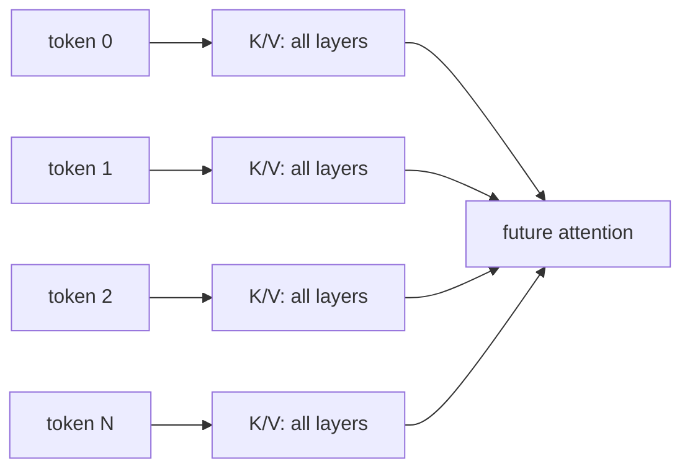
```mermaid
flowchart LR
    T0[token 0] --> L0K[K/V: all layers]
    T1[token 1] --> L1K[K/V: all layers]
    T2[token 2] --> L2K[K/V: all layers]
    TN[token N] --> LNK[K/V: all layers]
    L0K --> FUT[future attention]
    L1K --> FUT
    L2K --> FUT
    LNK --> FUT
```

> **读图方法：** 阅读“KV Cache 为什么成为容量瓶颈”这张流程图时，先把方框看成对象或状态，把箭头看成数据或控制的移动。第一遍从左向右建立顺序，第二遍再核对分支发生的条件。

如果不缓存历史 K/V，生成第 `t` 个 token 时就要重新计算前 `t-1` 个 token 的投影。KV
Cache 把重复计算换成了持续占用的显存。服务吞吐因此受两个上限共同约束：

```text
计算上限：一轮能处理多少 token
容量上限：当前能保存多少仍可能被读取的历史状态
```

Continuous Batching 只能提高计算资源的利用率，不能凭空增加 KV 容量。Scheduler 即使还
有 token budget，只要 `allocate_slots()` 返回 `None`，本轮也不能让该请求继续增长。

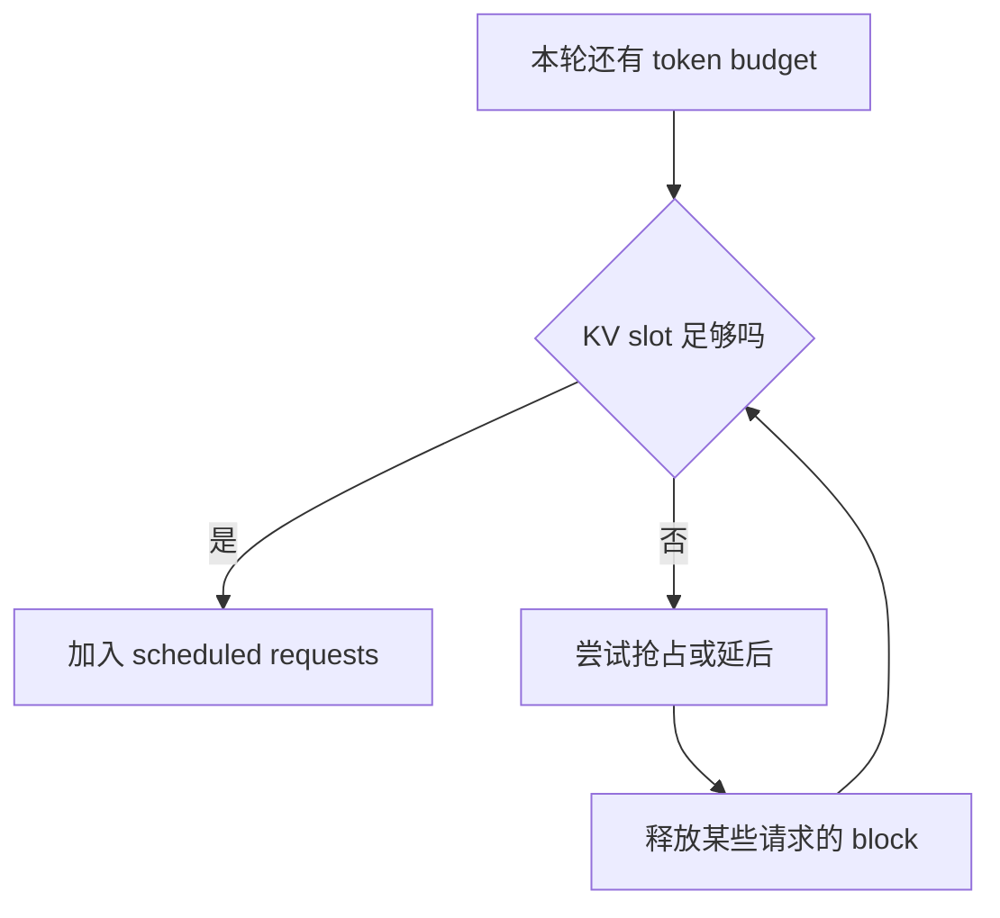
```mermaid
flowchart TD
    B[本轮还有 token budget] --> A{KV slot 足够吗}
    A -->|是| RUN[加入 scheduled requests]
    A -->|否| P[尝试抢占或延后]
    P --> R[释放某些请求的 block]
    R --> A
```

> **读图方法：** 这张图用于压缩“KV Cache 为什么成为容量瓶颈”的整体关系。先从上向下找到起点、关键转换和终点，再问每条跨层箭头是否意味着函数调用、消息传递、内存访问或状态更新。

### 5.1.1 权重显存与 KV 显存的差异

> **本节先看：** 下面先用表格整理“权重显存与 KV 显存的差异”。先横向比较每一列解决的问题和适用边界，再把具体名称映射到源码。

| 属性 | 模型权重 | KV Cache |
|---|---|---|
| 生命周期 | 通常贯穿服务进程 | 随请求进入、增长、完成而变化 |
| 主要决定因素 | 参数量、权重量化 | 活跃 token、缓存规格、dtype、并行方式 |
| 是否共享 | 所有请求读取同一份 | 可通过相同 prefix 共享部分 block |
| 管理难点 | 加载与分片 | 动态分配、回收、碎片、命中、淘汰 |

KV Cache 的动态性正是分页管理存在的原因。

## 5.2 普通 Attention 的容量公式

先从最常见的 dense decoder-only Attention 开始。忽略 padding、量化元数据和复制时，一台
TP rank 上每个 token 的 KV 字节数可写为：

$$
B_{token}=2\times L\times H_{kv,local}\times D_{head}\times B_{dtype}
$$

其中：

- `2` 表示 K 和 V；
- `L` 是本 rank 保存 KV 的 attention layer 数；
- `H_kv,local` 是该 rank 上的 KV head 数；
- `D_head` 是每个 head 的维度；
- `B_dtype` 是每个元素的字节数。

一个含 `S` 个 token、block size 为 `T` 的请求近似占用：

$$
B_{sequence}=S\times B_{token}
$$

$$
B_{block}=T\times B_{token}
$$

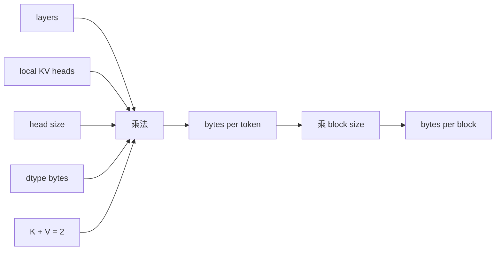
```mermaid
flowchart LR
    L[layers] --> MUL[乘法]
    H[local KV heads] --> MUL
    D[head size] --> MUL
    DT[dtype bytes] --> MUL
    KV[K + V = 2] --> MUL
    MUL --> BT[bytes per token]
    BT --> BS[乘 block size]
    BS --> BB[bytes per block]
```

> **读图方法：** 这是“普通 Attention 的容量公式”的流程图。先从左向右只追一条主路径，确认输入经过哪些关键阶段到达输出；第二遍再看虚线、回边和旁路，它们通常表示反馈、复用或可选分支。

### 5.2.1 一个 Llama 3 8B 风格的计算

采用一组典型参数演示，不把它当成对任意模型配置的承诺：

| 参数 | 值 |
|---|---:|
| layer 数 | 32 |
| KV head 数 | 8 |
| head size | 128 |
| KV dtype | BF16，2 bytes |
| TP | 1 |
| block size | 16 tokens |

每 token：

```text
2 * 32 * 8 * 128 * 2
= 131072 bytes
= 128 KiB
```

每 block：

```text
128 KiB/token * 16 tokens = 2 MiB
```

8192-token 序列：

```text
128 KiB/token * 8192 tokens = 1 GiB
```

随书函数可复算这个结果：

```python
from examples.ch05_kv_cache_blocks import block_bytes, kv_bytes_per_token

per_token = kv_bytes_per_token(
    num_layers=32,
    num_kv_heads=8,
    head_size=128,
    dtype_bytes=2,
)
assert per_token == 128 * 1024
assert block_bytes(per_token, 16) == 2 * 1024 * 1024
assert per_token * 8192 == 1024**3
```

### 5.2.2 TP 不能总按 `1 / TP` 生搬硬套

当 KV heads 能均匀分到 TP ranks 时，教学公式可令：

```text
H_kv,local = H_kv / TP
```

但真实 backend 可能在 KV heads 少于 TP 数时复制 head；DCP/PCP 还会改变 token 或上下文
维度上的分片。量化 KV 可能加入 scale 或 zero-point，某些布局还会 padding。因此正确做法
是：

1. 用简单公式形成数量级直觉；
2. 用实际 `KVCacheSpec.page_size_bytes` 得到当前 backend 的物理页大小；
3. 用启动日志和最终 `KVCacheConfig` 核对可用 block 数。

### 5.2.3 当前源码里的通用 page 公式

`AttentionSpec` 不直接写死“K 和 V 各一个 dense tensor”，而是抽象为：

```text
page_size_bytes
= num_heads
* num_states
* state_content_size_bytes
```

默认 dense K/V 时：

```text
state_content_size_bytes
= (head_size + head_size_v) * dtype_size
```

`tokens_per_state` 允许一个 state 覆盖多个 token，或一个 token 对应多个 state；
`page_size_padded` 允许 backend 对物理页做对齐。这个抽象使 MLA、稀疏状态和池化状态不必
伪装成普通 K/V。

## 5.3 从连续预留到分页 block

最直接的实现是为每个请求按 `max_model_len` 预留连续 KV 空间。它的地址计算简单，但服务
场景通常不知道请求最终长度。

假设最大长度为 16，三个请求实际只使用 5、9、3 个 token：

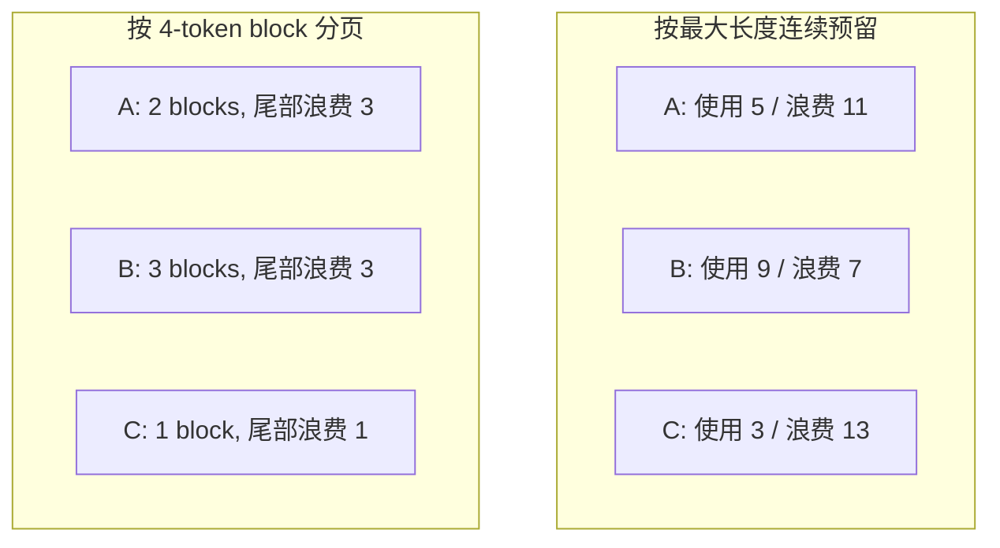
```mermaid
flowchart TB
    subgraph C[按最大长度连续预留]
        A["A: 使用 5 / 浪费 11"]
        B["B: 使用 9 / 浪费 7"]
        D["C: 使用 3 / 浪费 13"]
    end
    subgraph P[按 4-token block 分页]
        P1[A: 2 blocks, 尾部浪费 3]
        P2[B: 3 blocks, 尾部浪费 3]
        P3[C: 1 block, 尾部浪费 1]
    end
```

> **读图方法：** 阅读“从连续预留到分页 block”这张流程图时，先把方框看成对象或状态，把箭头看成数据或控制的移动。第一遍从上向下建立顺序，第二遍再核对分支发生的条件。

分页方案把物理显存切成固定 page，请求只在增长越过 block 边界时申请新 page。请求的逻辑
token 可以连续，但对应物理 block ID 不必连续。

```text
请求逻辑 block:    0    1    2    3
物理 block ID:    17    3   91   42
```

分页主要解决：

- **外部碎片**：不要求为单请求寻找一大段连续空闲区；
- **过度预留**：只为已经需要的 token 分配 block；
- **前缀共享**：不同请求的 block table 可以引用同一物理 block；
- **逐步回收**：请求完成或窗口滑过后，以 block 为单位归还。

它没有消除所有浪费。最后一个未填满 block 仍有内部碎片：

$$
W_{tail}=\left(T-(S\bmod T)\right)\bmod T
$$

block 越小，尾部浪费通常越少，但 block table 更长、元数据更多，kernel 支持和对齐约束也
更复杂，所以“越小越好”是错误结论。

## 5.4 四层对象：不要把 `KVCacheBlock` 当成 K/V

> **本节先看：** 这一小节先用图建立“四层对象：不要把 `KVCacheBlock` 当成 K/V”的整体路径。先找输入、关键状态和输出，再阅读图后的源码解释，不必一开始记住全部节点。

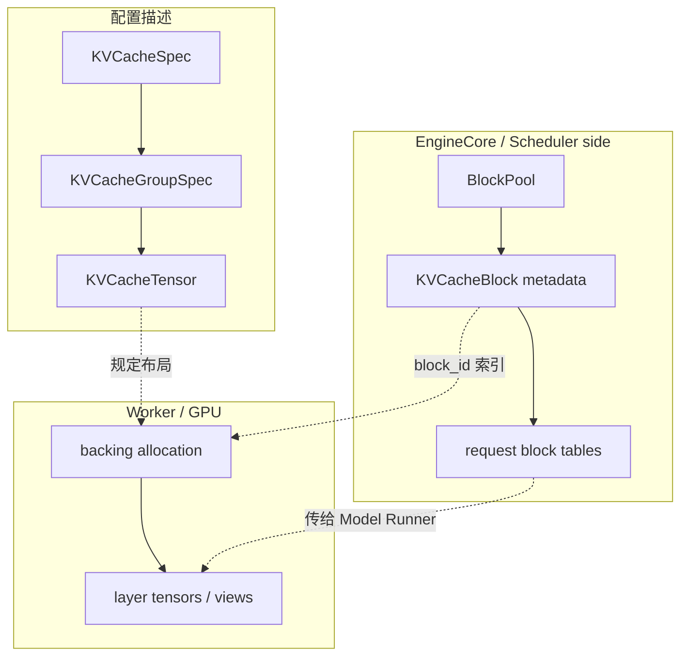
```mermaid
flowchart TB
    subgraph Worker[Worker / GPU]
        MEM[backing allocation]
        T0[layer tensors / views]
        MEM --> T0
    end
    subgraph Config[配置描述]
        SPEC[KVCacheSpec]
        GROUP[KVCacheGroupSpec]
        TENSOR[KVCacheTensor]
        SPEC --> GROUP --> TENSOR
    end
    subgraph Core[EngineCore / Scheduler side]
        POOL[BlockPool]
        META[KVCacheBlock metadata]
        REQ[request block tables]
        POOL --> META --> REQ
    end
    TENSOR -. 规定布局 .-> MEM
    META -. block_id 索引 .-> MEM
    REQ -. 传给 Model Runner .-> T0
```

> **读图方法：** 这张图用于压缩“四层对象：不要把 `KVCacheBlock` 当成 K/V”的整体关系。先从上向下找到起点、关键转换和终点，再问每条跨层箭头是否意味着函数调用、消息传递、内存访问或状态更新。

### 5.4.1 `KVCacheTensor`：物理 allocation 的视图说明

`KVCacheTensor` 记录：

- backing allocation 总 `size`；
- 哪些 `layers` 放在其中；
- `layer_stride`、`block_stride`；
- 起始 `offset`。

它描述 layer `l` 的 block `b` 在 backing memory 中的位置：

```text
offset + l * layer_stride + b * block_stride
```

同一 allocation 可以采用 layer-outer 或 block-outer 布局。不同 cache group 还可从同一偏移
开始发生 alias，因为一个物理 block ID 在同一时刻由一个 group 的逻辑位置占用。

### 5.4.2 `KVCacheBlock`：Scheduler 侧的小元数据对象

当前 `KVCacheBlock` 的关键字段包括：

- `block_id`：物理页编号；
- `ref_cnt`：当前有多少引用持有该页；
- primary `block_hash` 与对应 token 数；
- free queue 的前后指针；
- `is_null`：是否为空洞占位 block。

它不包含 K tensor 或 V tensor。真正的数值在 Worker 的设备 allocation 中，EngineCore 只用
`block_id` 协调所有权和寻址元数据。

### 5.4.3 request block table：逻辑位置到物理页

`KVCacheBlocks.blocks[i][j]` 的外层 `i` 是 cache group，内层 `j` 是该组第 `j` 个逻辑
block。源码特意不把 token block 放外层，因为未来不同 group 的 block size 和 block 数可能
不同。

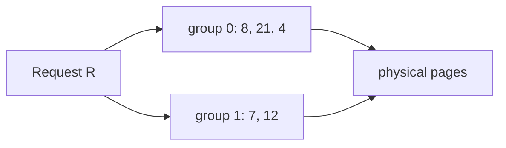
```mermaid
flowchart LR
    R[Request R]
    R --> G0[group 0: 8, 21, 4]
    R --> G1[group 1: 7, 12]
    G0 --> P0[physical pages]
    G1 --> P0
```

> **读图方法：** 这是“request block table：逻辑位置到物理页”的流程图。先从左向右只追一条主路径，确认输入经过哪些关键阶段到达输出；第二遍再看虚线、回边和旁路，它们通常表示反馈、复用或可选分支。

这也是第 06 章的入口：本章解释 block ID 如何产生和存活，下一章解释 attention backend
怎样消费 block table 完成地址转换。

## 5.5 `KVCacheSpec` 与 cache group

> **本节先看：** 本节要回答：**`KVCacheSpec` 与 cache group**。下面的小节会逐层拆开概念、运行过程和源码落点；第一次阅读先抓对象之间的关系，第二次再记类名、字段和分支。

### 5.5.1 为什么不能只有一种规格

当前 `KVCacheSpecKind` 包括 Full Attention、MLA、Sliding Window、Sliding-Window MLA、
Mamba、Chunked Local Attention、Sink Full Attention、Encoder-only、Cross Attention 和
Unknown。不同规格回答的不是同一个问题：

| 规格 | 保存什么 | 生命周期特点 |
|---|---|---|
| Full Attention | 所有可见历史 K/V | 通常随序列持续增长 |
| Sliding Window | 最近窗口相关 K/V | 窗口滑过后可置空旧位置 |
| Chunked Local | 当前 local chunk 所需 K/V | 持有量受 chunk 与 in-flight 限制 |
| MLA | 压缩 latent state | V 维可为 0，布局和对齐不同 |
| Mamba | recurrent state / checkpoint | 不等价于逐 token K/V |
| Cross Attention | encoder states | 通常按 encoder 长度一次性分配 |
| Encoder-only | 不需要 decoder KV | 最大 KV 使用量为 0 |

因此不能只用“层数乘 K/V heads”描述所有模型。

### 5.5.2 group 是共享 block table 的层集合

`KVCacheGroupSpec` 表示一组共享同一 block table 的模型层。对于全是同类 attention 的普通
模型，所有层可形成一个 group；混合模型会按重复结构拆成多个 group。

源码注释给出的典型例子是 10 层 full attention 加 20 层 sliding window：可视为重复十次
`1 full + 2 sliding`，于是形成三个 group，每个 group 各含十层。

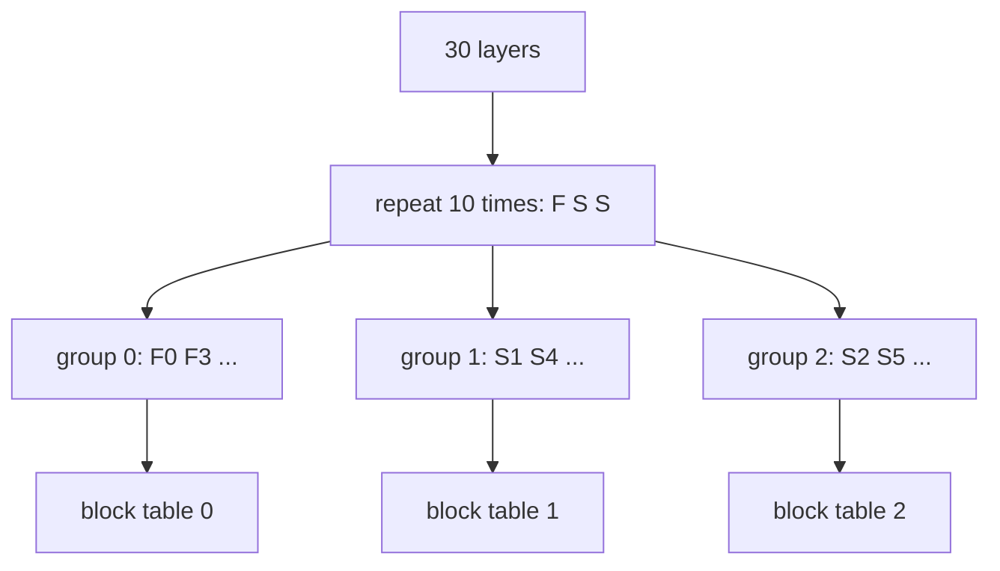
```mermaid
flowchart TB
    MODEL[30 layers]
    MODEL --> PATTERN[repeat 10 times: F S S]
    PATTERN --> G0[group 0: F0 F3 ...]
    PATTERN --> G1[group 1: S1 S4 ...]
    PATTERN --> G2[group 2: S2 S5 ...]
    G0 --> BT0[block table 0]
    G1 --> BT1[block table 1]
    G2 --> BT2[block table 2]
```

> **读图方法：** 阅读“group 是共享 block table 的层集合”这张流程图时，先把方框看成对象或状态，把箭头看成数据或控制的移动。第一遍从上向下建立顺序，第二遍再核对分支发生的条件。

### 5.5.3 多个 group 共享一个 block ID pool

配置生成时，一个 pool block 的字节宽度取最宽 cache group 的每-block 字节数；
`num_blocks = available_memory // bytes_per_block`。不同 group 的 tensor 视图按选定 layout
映射到 backing allocation。

这带来一个容易误解的结论：`num_blocks` 不是“每层各有这么多 block”，而是统一控制器
能够分配的 block ID 数量。一个请求可能在多个 group 中各占若干 block，因此最大并发要按
所有 group 的每请求 block 消耗求和。

### 5.5.4 混合协调不是简单取最大命中

一个 prefix 只有在相关 group 的状态都可恢复时才真正可跳过。Hybrid coordinator 对各类
manager 的候选命中长度进行固定点收敛：任一类型把长度缩短，就以更短长度重新核对。

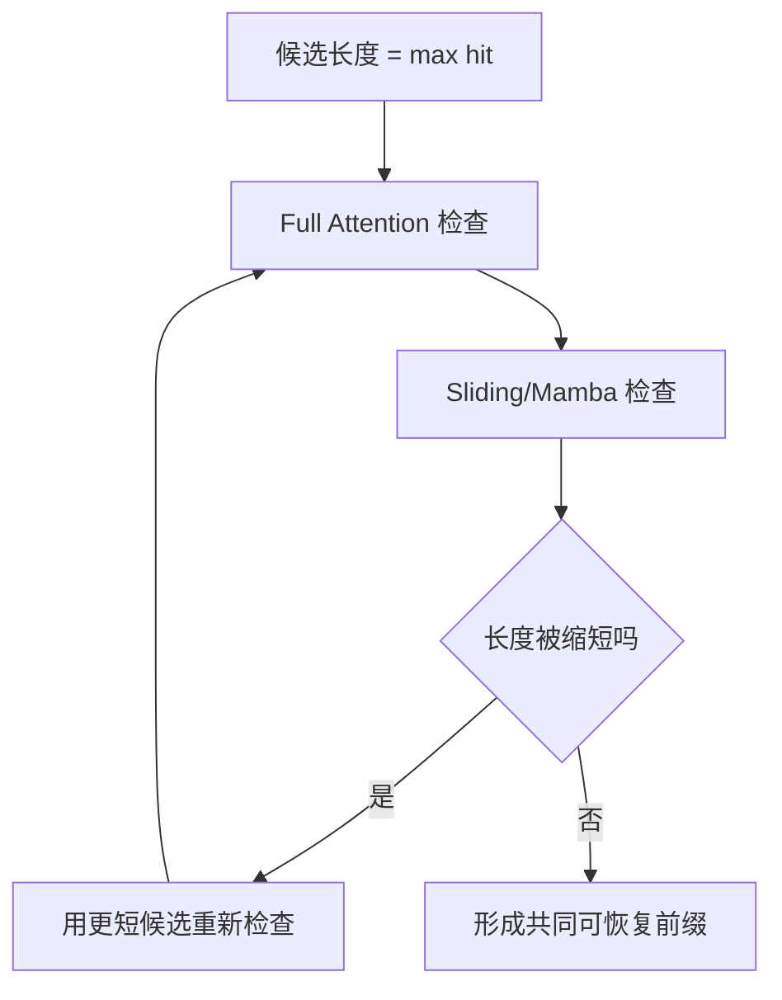
```mermaid
flowchart TD
    C[候选长度 = max hit] --> F[Full Attention 检查]
    F --> S[Sliding/Mamba 检查]
    S --> Q{长度被缩短吗}
    Q -->|是| C2[用更短候选重新检查]
    C2 --> F
    Q -->|否| H[形成共同可恢复前缀]
```

> **读图方法：** 这张图用于压缩“混合协调不是简单取最大命中”的整体关系。先从上向下找到起点、关键转换和终点，再问每条跨层箭头是否意味着函数调用、消息传递、内存访问或状态更新。

源码当前也明确记录了适用限制：多数结构可处理任意 cache type 数量，但联合
`find_longest_cache_hit` 对复杂多类型组合仍有限制。写文档时不能把混合管理描述成已经对
任意组合完全泛化。

## 5.6 启动时怎样决定 KV 容量

> **本节先看：** 本节要回答：**启动时怎样决定 KV 容量**。下面的小节会逐层拆开概念、运行过程和源码落点；第一次阅读先抓对象之间的关系，第二次再记类名、字段和分支。

### 5.6.1 先确定“可给 KV 的字节数”

`GPUWorker.determine_available_memory()` 的主路径是：

1. 记录初始显存快照和请求使用上限；
2. 运行 dummy forward，profile 权重之外的非 KV 和瞬时峰值；
3. 如果启用并支持 CUDA Graph，估算 graph 占用；
4. 用请求显存减去非 KV 占用和应用的 graph 估算；
5. 返回可用于 KV allocation 的字节数。

```text
requested_memory
= total_memory * gpu_memory_utilization

available_kv_memory
= requested_memory
 - non_kv_cache_memory
 - applied_cudagraph_memory_estimate
```

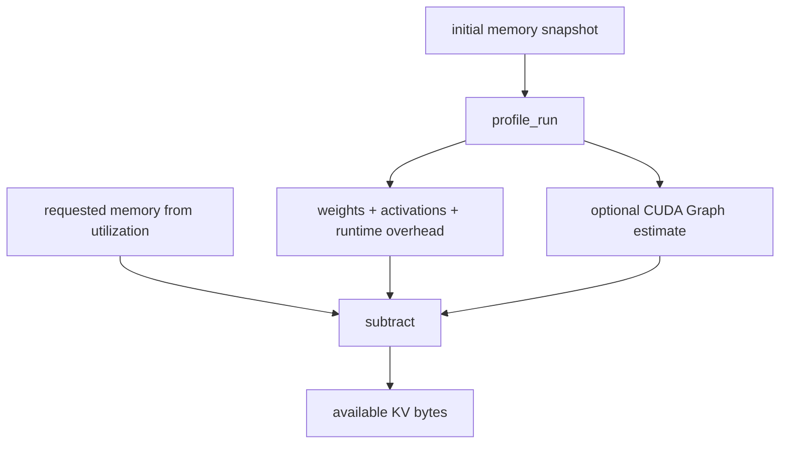
```mermaid
flowchart TD
    SNAP[initial memory snapshot] --> PROF[profile_run]
    PROF --> NONKV[weights + activations + runtime overhead]
    PROF --> CG[optional CUDA Graph estimate]
    LIMIT[requested memory from utilization] --> SUB[subtract]
    NONKV --> SUB
    CG --> SUB
    SUB --> AVAIL[available KV bytes]
```

> **读图方法：** 这是“先确定可给 KV 的字节数”的流程图。先从上向下只追一条主路径，确认输入经过哪些关键阶段到达输出；第二遍再看虚线、回边和旁路，它们通常表示反馈、复用或可选分支。

这不是简单读取“当前 free memory”。profile 期间其他共享进程如果释放显存，源码会发现
初始 free 小于 profile 后 free 的异常关系并报错，因为该变化破坏了测量假设。

### 5.6.2 手动字节数是另一条路径

如果配置了 `kv_cache_memory_bytes`，Worker 仍执行 `profile_run()` 以完成最大 batch token
相关编译，但直接返回手工指定的 KV 字节数；该设置不遵守
`gpu_memory_utilization`。它适合明确控制容量，不适合把旧机器上的数值无条件复制到显存
环境不同的进程。

### 5.6.3 从字节数到 block 数

EngineCore 汇总各 Worker 的 `KVCacheSpec`，建立 groups，然后计算：

```text
bytes_per_pool_block = widest group's packed page bytes
num_blocks = available_memory // bytes_per_pool_block
```

当前启动流程还会：

- 为 `BlockPool` 永久保留的 null block 预留一个 block 的容量；
- 检查至少一个 `max_model_len` 请求能否被接纳；
- `max_model_len=-1` 时按可用内存自动搜索可容纳长度；
- pipeline workers 容量不同时，把所有 rank 收敛到最小 `num_blocks`；
- `num_gpu_blocks_override` 存在时让检查和最终 allocation 对同一有效容量建模。

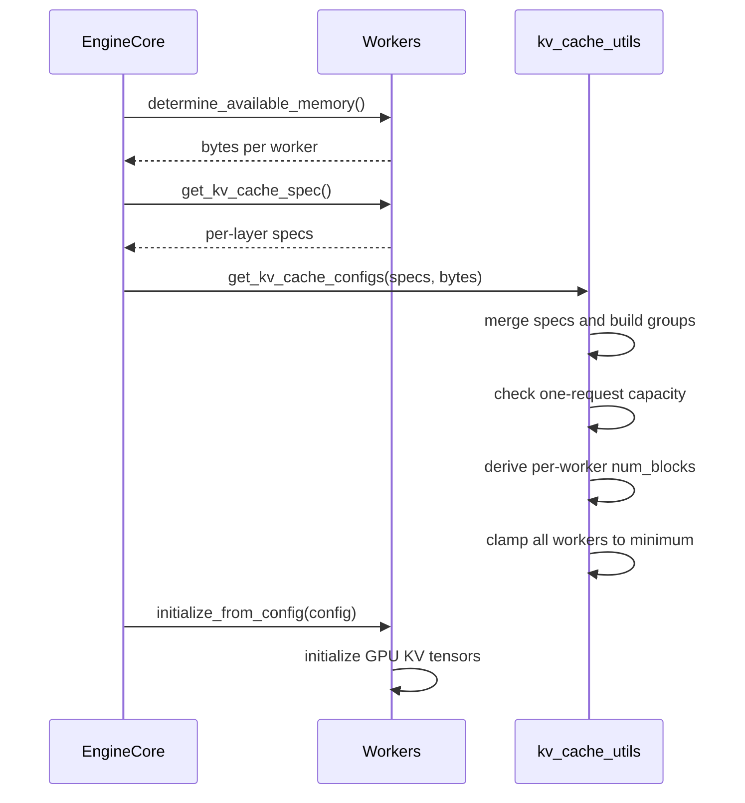
```mermaid
sequenceDiagram
    participant EC as EngineCore
    participant W as Workers
    participant U as kv_cache_utils
    EC->>W: determine_available_memory()
    W-->>EC: bytes per worker
    EC->>W: get_kv_cache_spec()
    W-->>EC: per-layer specs
    EC->>U: get_kv_cache_configs(specs, bytes)
    U->>U: merge specs and build groups
    U->>U: check one-request capacity
    U->>U: derive per-worker num_blocks
    U->>U: clamp all workers to minimum
    EC->>W: initialize_from_config(config)
    W->>W: initialize GPU KV tensors
```

> **读图方法：** 这是“从字节数到 block 数”的时序图。先从左到右确认参与者分别负责什么，再从上到下追踪消息；第一遍只看正常路径，第二遍再看返回、异步消息和失败分支。

### 5.6.4 `num_blocks` 与有效并发

粗略并发不能只算 `num_blocks / ceil(max_len / block_size)`，因为每个请求可能同时占用多个
group。源码按每个 group 最大内存折算为页数后求和，再用 pool 的 `num_blocks` 相除。

另外，prefix sharing、Sliding Window 回收和真实长度分布会使运行时并发高于或低于一个
“所有请求都达到 max length”的静态估算。这个数字是容量边界，不是吞吐承诺。

## 5.7 管理栈的职责拆分

> **本节先看：** 这一小节先用图建立“管理栈的职责拆分”的整体路径。先找输入、关键状态和输出，再阅读图后的源码解释，不必一开始记住全部节点。

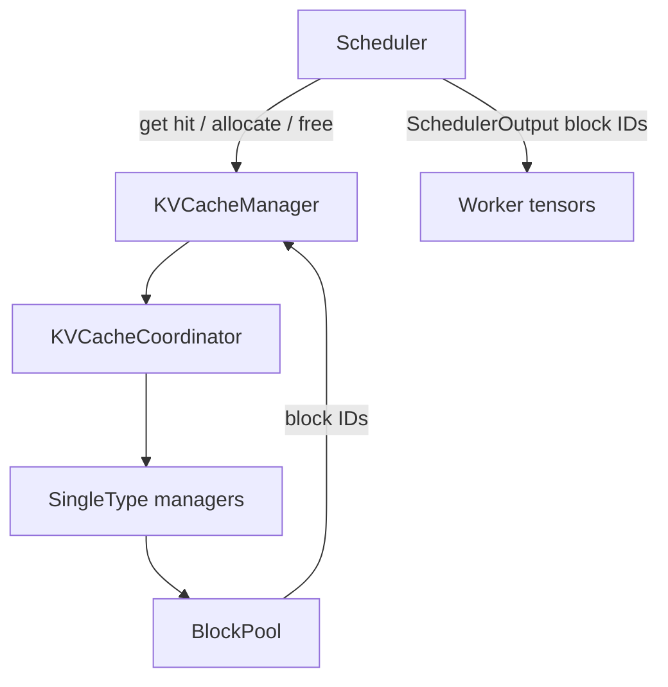
```mermaid
flowchart TB
    S[Scheduler]
    KVM[KVCacheManager]
    CO[KVCacheCoordinator]
    STM[SingleType managers]
    BP[BlockPool]
    W[Worker tensors]
    S -->|get hit / allocate / free| KVM
    KVM --> CO
    CO --> STM
    STM --> BP
    BP -->|block IDs| KVM
    S -->|SchedulerOutput block IDs| W
```

> **读图方法：** 这张图用于压缩“管理栈的职责拆分”的整体关系。先从上向下找到起点、关键转换和终点，再问每条跨层箭头是否意味着函数调用、消息传递、内存访问或状态更新。

| 组件 | 核心责任 |
|---|---|
| `KVCacheManager` | Scheduler 门面、准入、slot 分配、统计和 event 注解 |
| coordinator | 协调一个或多个 cache group 的共同命中与分配 |
| single-type manager | 实现 Full、Sliding、Mamba、Cross 等类型特有策略 |
| `BlockPool` | 统一 block 元数据、ref count、free queue、hash lookup |
| Worker | 按 `KVCacheConfig` 建立真实 tensor，执行 copy 和 attention |

这个分层解释了为什么 Scheduler 不应直接操作 `BlockPool`，也解释了为什么
`BlockPool` 不理解 sliding window 的语义：pool 只管理“页”，类型 manager 决定哪些逻辑
位置应申请、保留或用 null block 替换。

## 5.8 `BlockPool` 的三个核心结构

> **本节先看：** 本节要回答：**`BlockPool` 的三个核心结构**。下面的小节会逐层拆开概念、运行过程和源码落点；第一次阅读先抓对象之间的关系，第二次再记类名、字段和分支。

### 5.8.1 全体 block 数组

初始化时创建 `num_gpu_blocks` 个 `KVCacheBlock`。block ID 即数组下标，避免反复创建小对象。

### 5.8.2 free queue

`FreeKVCacheBlockQueue` 是侵入式双向链表。block 自己保存前后指针，因此 cache hit 时可以
O(1) 从链表中间移除，而不是在线性容器中搜索。

队头是下一次分配、必要时也就是下一次 eviction 的候选。它同时编码两类优先级：

- 未缓存 block 放到前部，优先快速复用；
- 已缓存且 `ref_cnt=0` 的 block 放到尾部，形成 LRU 风格淘汰顺序。

### 5.8.3 hash 到 block 的映射

`BlockHashToBlockMap` 允许同一个 hash 指向多个物理 block。当前实现不会在“刚填满一个
block”时发现已有相同 hash 就替换请求的 block ID，因为 block table 需要保持 append-only。

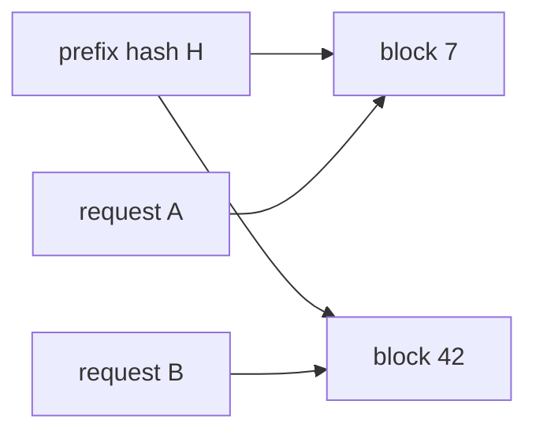
```mermaid
flowchart LR
    H[prefix hash H]
    H --> B7[block 7]
    H --> B42[block 42]
    R1[request A] --> B7
    R2[request B] --> B42
```

> **读图方法：** 这是“hash 到 block 的映射”的流程图。先从左向右只追一条主路径，确认输入经过哪些关键阶段到达输出；第二遍再看虚线、回边和旁路，它们通常表示反馈、复用或可选分支。

这是“可查找重复内容”而非“写入时物理去重”。后来的请求命中时可选择其中一个 block
共享，但已经分配的请求不会因此改写历史 block table。

## 5.9 null block：空洞也要有合法 ID

pool 初始化后立即从 free queue 取出 block 0，标记为 `is_null`。它不保存有效可读取 KV，
而是为 Sliding Window、Mamba 或稀疏布局中已经跳过的位置提供占位符。

```text
逻辑 block table: [12, 19, null, null, 8, 31]
```

保持表的位置结构比删除中间元素更重要：后续位置仍需与 token/block 索引对应。

null block 有三个特殊点：

- 永久不回到普通 free queue；
- `ref_cnt` 不按普通 block 维护；
- 容量检查和 usage 计算要减去它。

attention-free 模型即使没有 KV group，配置也返回 `num_blocks=1`，正是为了满足 pool 需要
一个 null block 的结构契约。

## 5.10 block 生命周期与引用计数

> **本节先看：** 这一小节先用图建立“block 生命周期与引用计数”的整体路径。先找输入、关键状态和输出，再阅读图后的源码解释，不必一开始记住全部节点。

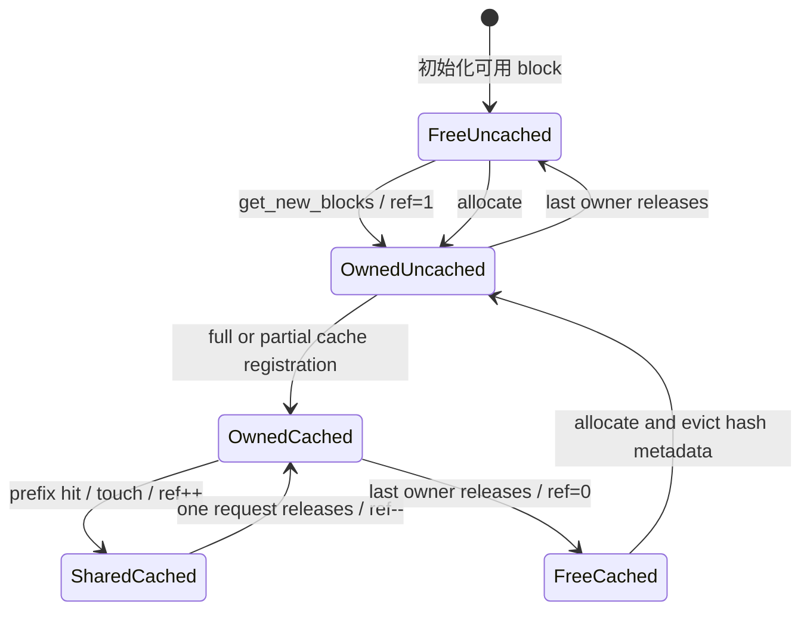
```mermaid
stateDiagram-v2
    [*] --> FreeUncached: 初始化可用 block
    FreeUncached --> OwnedUncached: get_new_blocks / ref=1
    OwnedUncached --> OwnedCached: full or partial cache registration
    OwnedCached --> SharedCached: prefix hit / touch / ref++
    SharedCached --> OwnedCached: one request releases / ref--
    OwnedCached --> FreeCached: last owner releases / ref=0
    OwnedUncached --> FreeUncached: last owner releases
    FreeCached --> OwnedUncached: allocate and evict hash metadata
    FreeUncached --> OwnedUncached: allocate
```

> **读图方法：** 这是“block 生命周期与引用计数”的状态图。先找初始状态，再沿箭头观察触发条件和状态变化；重点不是背状态名，而是弄清谁触发转换、转换后哪些资源需要更新。

### 5.10.1 分配

`get_new_blocks(n)` 从 free queue 头取 n 个 block。如果候选仍带缓存 hash，它会先移除所有
指向该物理 block 的 hash 元数据，再将 `ref_cnt` 从 0 增到 1。

### 5.10.2 命中与 `touch`

prefix hit 找到的 block 可能仍被运行请求引用，也可能已经 `ref_cnt=0`、正躺在 free queue
等待淘汰：

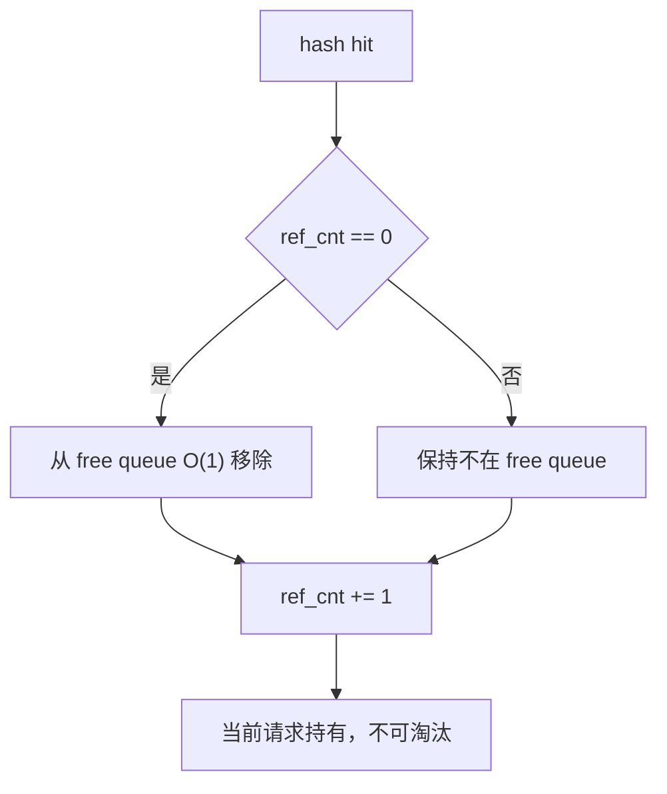
```mermaid
flowchart TD
    H[hash hit] --> R{ref_cnt == 0}
    R -->|是| Q["从 free queue O(1) 移除"]
    R -->|否| K[保持不在 free queue]
    Q --> I[ref_cnt += 1]
    K --> I
    I --> PIN[当前请求持有，不可淘汰]
```

> **读图方法：** 这张图用于压缩“命中与 `touch`”的整体关系。先从上向下找到起点、关键转换和终点，再问每条跨层箭头是否意味着函数调用、消息传递、内存访问或状态更新。

命中必须先 `touch`，否则同一轮后续分配可能把刚命中的 eviction candidate 当成新页复用。

### 5.10.3 写权限

当前 pool 的 `is_block_writable()` 要求：

```text
not null
and ref_cnt == 1
and block_hash is None
```

即使只有一个请求引用，只要该 block 已登记成 prefix cache，它也不能直接覆写，否则缓存键
仍声称旧前缀存在。partial-tail 的 CoW 正是这个约束的结果。

## 5.11 `allocate_slots()`：从预测到提交

`KVCacheManager.allocate_slots()` 是本章最重要的入口。它同时处理已有进度、本地 prefix
hit、外部 KV、当前要计算的 token 和 speculative lookahead。

源码用如下布局说明 token 区间：

```text
| comp | new_comp | ext_comp | new | lookahead |
|       已由本地或远端计算       | 本轮需计算   |
|              已有/待附着       |   待分配     |
```

其中：

- `comp`：请求原有 `num_computed_tokens`；
- `new_comp`：本地 prefix cache 新命中的 token；
- `ext_comp`：connector 声称远端已有 KV 的 token；
- `new`：本轮主模型要处理的 token，可能含未验证 draft；
- `lookahead`：为 speculative proposer 预留的额外 slot。

### 5.11.1 总流程

> **本节先看：** 这一小节先用图建立“总流程”的整体路径。先找输入、关键状态和输出，再阅读图后的源码解释，不必一开始记住全部节点。

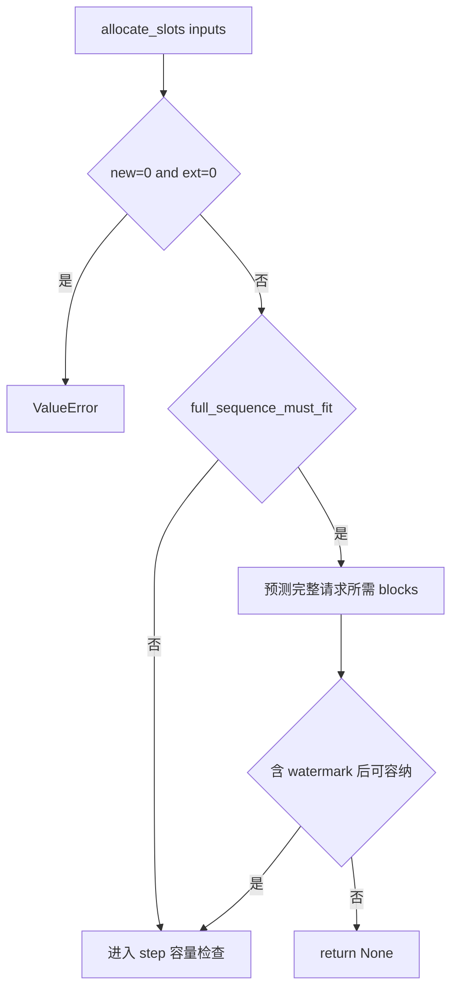
```mermaid
flowchart TD
    IN[allocate_slots inputs] --> ZERO{new=0 and ext=0}
    ZERO -->|是| ERR[ValueError]
    ZERO -->|否| ADM{full_sequence_must_fit}
    ADM -->|否| READY[进入 step 容量检查]
    ADM -->|是| FULL[预测完整请求所需 blocks]
    FULL --> FIT0{含 watermark 后可容纳}
    FIT0 -->|否| NONE0[return None]
    FIT0 -->|是| READY
```

> **读图方法：** 这是“总流程”的流程图。先从上向下只追一条主路径，确认输入经过哪些关键阶段到达输出；第二遍再看虚线、回边和旁路，它们通常表示反馈、复用或可选分支。

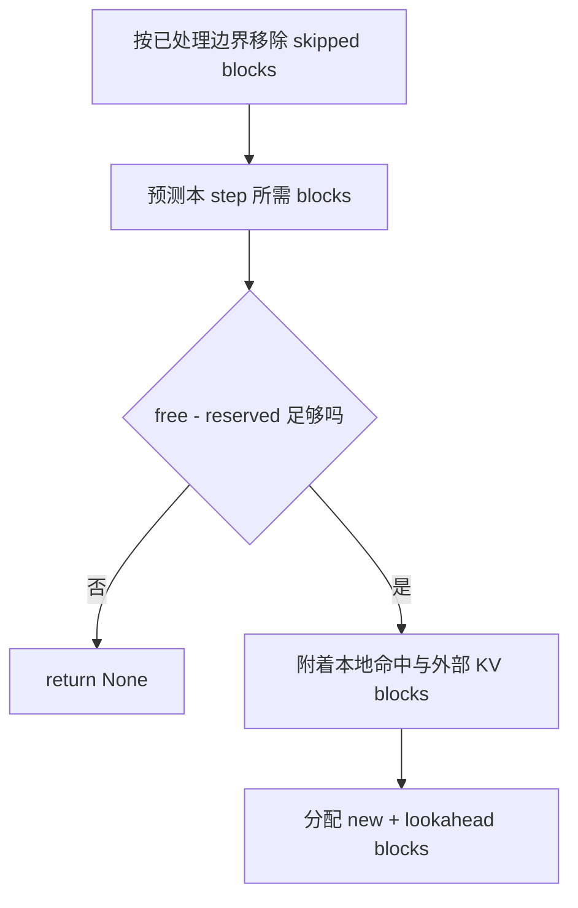
```mermaid
flowchart TD
    SKIP[按已处理边界移除 skipped blocks] --> NEED[预测本 step 所需 blocks]
    NEED --> FIT{free - reserved 足够吗}
    FIT -->|否| NONE[return None]
    FIT -->|是| ATTACH[附着本地命中与外部 KV blocks]
    ATTACH --> NEWB[分配 new + lookahead blocks]
```

> **读图方法：** 阅读“总流程”这张流程图时，先把方框看成对象或状态，把箭头看成数据或控制的移动。第一遍从上向下建立顺序，第二遍再核对分支发生的条件。

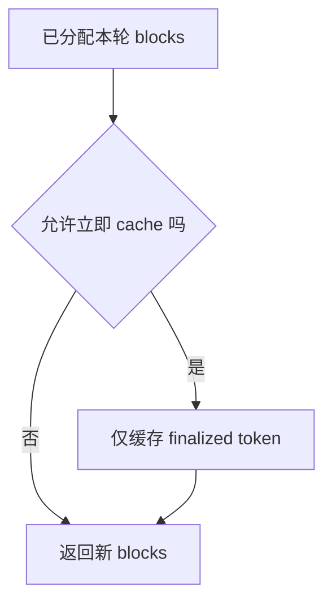
```mermaid
flowchart TD
    NEWB[已分配本轮 blocks] --> CACHE{允许立即 cache 吗}
    CACHE -->|否| RET[返回新 blocks]
    CACHE -->|是| COMMIT[仅缓存 finalized token]
    COMMIT --> RET
```

> **读图方法：** 这张图用于压缩“总流程”的整体关系。先从上向下找到起点、关键转换和终点，再问每条跨层箭头是否意味着函数调用、消息传递、内存访问或状态更新。

### 5.11.2 为什么先预测再修改

当容量不足时，Scheduler 需要一个干净的失败信号来决定抢占谁。若函数已经 touch 了一半
命中 block、又分配了一部分新 block 才失败，回滚会非常复杂。

因此主路径先调用各 manager 的 `get_num_blocks_to_allocate()`，比较：

```text
required = predicted_new_blocks + watermark
available = free_blocks - reserved_blocks
```

只有确认可容纳后，才附着新命中 block 并分配新页。随书模型用测试固定“失败不创建请求、
free 数量不变”这一教学契约。

注意一个边界：`remove_skipped_blocks()` 可以在容量检查前执行。对 Sliding Window 来说，
旧位置已不再需要，先释放它们能减少无谓 eviction；这是一种明确允许的状态改变，不等同于
半完成新分配。

### 5.11.3 完整序列准入门

chunked prefill 若只检查第一小块，很容易接纳一个最终无法继续增长的长请求。
`full_sequence_must_fit` 会按完整 prompt、最大模型长度和各类型 manager 的回收上限预测
容量。

Sliding Window 和 Chunked Local 不需要按整个序列长度永久保留所有页。它们的
`max_admission_blocks_per_request()` 将窗口或 chunk、in-flight token 和 block 对齐共同纳入
上限，保证启动容量检查与运行时准入使用一致模型。

### 5.11.4 watermark 与 reserved blocks 不同

> **本节先看：** 下面先用表格整理“watermark 与 reserved blocks 不同”。先横向比较每一列解决的问题和适用边界，再把具体名称映射到源码。

| 机制 | 目的 | 何时使用 |
|---|---|---|
| watermark | 给 waiting/preempted 新准入留出缓冲，减少频繁抢占 | 已有 scheduled 请求时 |
| reserved blocks | 为其他已经 in-flight 的序列保留必须容量 | 例如异步 KV load 准入 |

watermark 只应用于 `WAITING` 或 `PREEMPTED` 请求，而且只有当前 step 已经调度了其他请求
时才生效；不能把它描述成所有 allocation 都永久不可使用的固定保留区。

### 5.11.5 只提交 finalized KV

speculative decoding 的 `new` 可能包含之后会被拒绝的 draft token。源码最终缓存长度为：

```text
min(total_computed_tokens + num_new_tokens, request.num_tokens)
```

这个 `request.num_tokens` 上限防止把尚未确认属于请求的 KV 注册到 prefix cache。

## 5.12 Prefix Caching 的哈希链

仅用“当前 block 的 token”做 hash 不够。两个 block 的局部 token 相同，前面的上下文不同，
其 K/V 也不同。vLLM 为每个 hash block 建立链式 hash：

$$
H_i=hash(H_{i-1}, tokens_i, extra\_keys_i)
$$

`extra_keys` 可纳入 multimodal 内容、LoRA、cache salt 等会改变计算语义的信息。

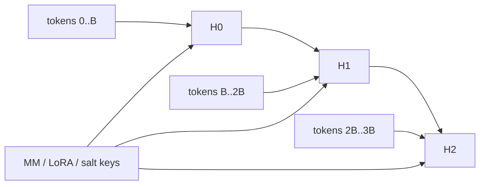
```mermaid
flowchart LR
    T0[tokens 0..B] --> H0[H0]
    H0 --> H1[H1]
    T1[tokens B..2B] --> H1
    H1 --> H2[H2]
    T2[tokens 2B..3B] --> H2
    E[MM / LoRA / salt keys] --> H0
    E --> H1
    E --> H2
```

> **读图方法：** 这是“Prefix Caching 的哈希链”的流程图。先从左向右只追一条主路径，确认输入经过哪些关键阶段到达输出；第二遍再看虚线、回边和旁路，它们通常表示反馈、复用或可选分支。

因此 `H2` 指纹化的是“到第三个边界为止的整个前缀”，而不是三个独立 hash 的拼接。

### 5.12.1 查找最长连续前缀

常规 Full Attention lookup 从第一个 block 开始依次查询。中间一处 miss 后，后面即使偶然
存在 hash 也不能跳跃命中，因为请求需要一段从 token 0 开始的连续可恢复状态。

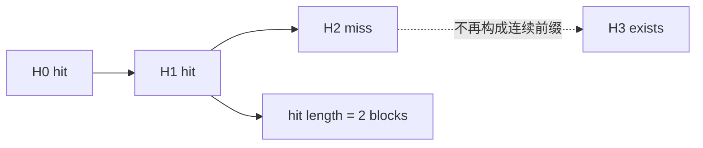
```mermaid
flowchart LR
    H0[H0 hit] --> H1[H1 hit]
    H1 --> H2[H2 miss]
    H2 -. 不再构成连续前缀 .-> H3[H3 exists]
    H1 --> RESULT[hit length = 2 blocks]
```

> **读图方法：** 阅读“查找最长连续前缀”这张流程图时，先把方框看成对象或状态，把箭头看成数据或控制的移动。第一遍从左向右建立顺序，第二遍再核对分支发生的条件。

### 5.12.2 为什么全 prompt 命中仍重算最后 token

`get_computed_blocks()` 把最大命中长度设为：

```text
request.num_tokens - 1
```

因为模型仍需对最后一个 prompt token 执行计算以得到下一 token 的 logits。当前
`allocate_slots()` 又要求常规 computed token 边界满足 block 对齐，所以一个 8-token prompt、
block size 4，即使两个 block 都缓存，实际常规命中可能只取前 4 token，重算最后一整个
block，而不只是 token 7。

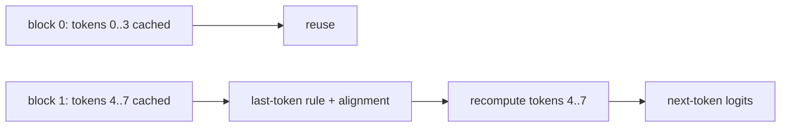
```mermaid
flowchart LR
    B0[block 0: tokens 0..3 cached] --> USE[reuse]
    B1[block 1: tokens 4..7 cached] --> DROP[last-token rule + alignment]
    DROP --> RE[recompute tokens 4..7]
    RE --> LOGITS[next-token logits]
```

> **读图方法：** 这张图用于压缩“为什么全 prompt 命中仍重算最后 token”的整体关系。先从左向右找到起点、关键转换和终点，再问每条跨层箭头是否意味着函数调用、消息传递、内存访问或状态更新。

这是一项当前实现边界，不是“理论上 KV Cache 必须如此”。源码注释也说明未来解除对齐
限制后可能略微改善。

### 5.12.3 命中后的共享

请求 A 已完成 prefix `[P0, P1]`，请求 B 命中后不复制两页 KV，而是 `touch` 同一 block：

```mermaid
flowchart TB
    P0[physical block 10, ref=2]
    P1[physical block 11, ref=2]
    A[request A table] --> P0
    A --> P1
    B[request B table] --> P0
    B --> P1
    A --> A2[private tail 20]
    B --> B2[private tail 37]
```

> **读图方法：** 这是“命中后的共享”的流程图。先从上向下只追一条主路径，确认输入经过哪些关键阶段到达输出；第二遍再看虚线、回边和旁路，它们通常表示反馈、复用或可选分支。

当 A 完成时，P0/P1 的 `ref_cnt` 从 2 降到 1，仍由 B 使用；只有最后一个 owner 释放后才
进入 free queue。

## 5.13 完整 block 注册与重复项

`cache_full_blocks()` 使用 Request 已预计算的 hash chain，为“已完整且可提交”的 block
登记 hash。它会跳过：

- null block；
- 类型 manager 标记为不可用于命中的 masked block；
- 已经缓存到目标长度的部分。

如果一个先前登记 partial hash 的物理 block 后来被填满，完整 block promotion 会先移除旧
hash，再登记完整边界 hash。这样 hash 元数据不会声称同一页仍保存旧的短边界内容。

```mermaid
stateDiagram-v2
    [*] --> Partial: computed reaches fine boundary
    Partial --> Full: same page later filled
    Full --> Evictable: request releases
    Evictable --> Reused: allocation selects page
    Reused --> [*]: old hashes removed
```

> **读图方法：** 这是“完整 block 注册与重复项”的状态图。先找初始状态，再沿箭头观察触发条件和状态变化；重点不是背状态名，而是弄清谁触发转换、转换后哪些资源需要更新。

同 hash 可以有多个 block，但同一个 block 也可能拥有多个 hash key。当前
`cached_block_hashes_by_block` 反向记录附加 key，确保 reset、eviction、移动和 promotion
能移除所有指向该页的入口。

## 5.14 Free 不等于 Eviction

这是理解 Prefix Caching 最关键的区别之一。

### 5.14.1 请求 free

`KVCacheManager.free(request)` 让 coordinator 删除请求的 block table，并按逆序释放 block。
释放只减少 `ref_cnt`。如果 cached block 的最后一个 owner 离开：

- `ref_cnt` 变为 0；
- block 进入 free queue 尾部；
- hash 仍保留，因此之后仍可命中；
- 该 block 同时成为必要时可 eviction 的候选。

### 5.14.2 cache eviction

当 `get_new_blocks()` 从队头拿到一个 cached block，或 connector 显式报告要 evict 某些
block ID 时，pool 删除 hash 元数据。对仍 `ref_cnt>0` 的 block，显式 `evict_blocks()` 只让
它“不再可被新请求命中”，不会把它归还 free queue。

```mermaid
flowchart TD
    OWN[ref > 0, cached] --> FREE[request releases]
    FREE --> EVICTABLE[ref = 0, hash remains, in free queue]
    EVICTABLE --> HIT[new request hits]
    HIT --> OWN
    EVICTABLE --> ALLOC[selected for new allocation]
    ALLOC --> RM[remove hashes]
    RM --> NEW[ref = 1, uncached new owner]
    OWN --> EXPLICIT[explicit cache eviction]
    EXPLICIT --> LIVE[ref > 0 but hash removed]
```

> **读图方法：** 这张图用于压缩“cache eviction”的整体关系。先从上向下找到起点、关键转换和终点，再问每条跨层箭头是否意味着函数调用、消息传递、内存访问或状态更新。

### 5.14.3 为什么请求 block 逆序释放

同一请求的尾部 block 通常比前缀更不可能被其他请求复用。manager 将请求 block 逆序传给
`free_blocks()`，让尾部在相同访问时序下更早成为 eviction 候选。

`free_blocks()` 又把两类 block 分流：

- 无 hash：prepend，LIFO 复用，提高近期 GPU 地址局部性；
- 有 hash：append，FIFO 复用，近似 LRU 淘汰。

```text
free queue head                                      tail
[uncached recent] ... [older cached] ... [recently released cached]
 ^ next allocation / eviction candidate
```

### 5.14.4 reset 的安全条件

`reset_prefix_cache()` 只有在已用 block 数恰好为 1 时成功；这 1 个就是 null block。存在
活跃请求时清掉 hash 虽然不一定立即损坏其 K/V，但会破坏整个 cache 生命周期和事件语义，
所以源码拒绝重置。

## 5.15 Partial-tail 与 Copy-on-Write

> **本节先看：** 本节要回答：**Partial-tail 与 Copy-on-Write**。下面的小节会逐层拆开概念、运行过程和源码落点；第一次阅读先抓对象之间的关系，第二次再记类名、字段和分支。

### 5.15.1 先修正一个过时的绝对说法

`KVCacheManager.get_computed_blocks()` 的 docstring 仍写着 computed blocks 必须完整，这对
常规单一 Full Attention 路径仍是正确主线。但当前 revision 已在特定混合 KV、Mamba、
EAGLE、DCP 等路径中加入细粒度 partial hash hit。因而以下表述不再准确：

```text
错误：partial block 永远不能进入 prefix cache，也永远不能复用。
```

更准确的说法是：

```text
常规命中以完整 cache block 为主；当真实 group block 大于 hash block，且对应 manager 与
coordinator 明确支持细粒度查找时，可在 group block 内部的 hash 边界登记 partial entry。
```

Sliding Window group 等组合可能明确禁用这项能力，因此它不是所有模型都具备的通用保证。

### 5.15.2 注册的是查找元数据，不是另分一页

`cache_partial_block()` 接收一个已经存在的物理 block，在 `num_tokens` 对齐
`hash_block_size`、但位于实际 group block 内部时，登记该边界的链式 hash。仅为注册本身，
它不会创建新 `KVCacheBlock`，也不会复制 GPU 内容。

```mermaid
flowchart LR
    PB[physical block: tokens 6..11 capacity]
    B8[boundary at token 8]
    B10[boundary at token 10]
    B8 -->|hash key| PB
    B10 -->|later replacement/additional metadata| PB
```

> **读图方法：** 这是“注册的是查找元数据，不是另分一页”的流程图。先从左向右只追一条主路径，确认输入经过哪些关键阶段到达输出；第二遍再看虚线、回边和旁路，它们通常表示反馈、复用或可选分支。

### 5.15.3 为什么继续写必须 CoW

假设物理 block 21 已登记“前 10 token”的 partial entry。请求 C 命中到 token 10 后还要
写 token 11。若直接覆写 block 21，其他请求通过旧 hash 命中时会读到被改变的页。

```mermaid
sequenceDiagram
    participant P as Prefix cache
    participant C as Consumer request
    participant BP as BlockPool
    participant W as Worker
    C->>P: hit partial boundary at token 10, source block 21
    C->>BP: request writable continuation
    BP->>BP: source is cached/shared, not writable
    BP-->>C: allocate destination block 35
    C->>W: copy valid prefix state 21 -> 35
    W->>W: append new token into 35
    P->>P: block 21 remains valid for old prefix
```

> **读图方法：** 这是“为什么继续写必须 CoW”的时序图。先从左到右确认参与者分别负责什么，再从上到下追踪消息；第一遍只看正常路径，第二遍再看返回、异步消息和失败分支。

这就是 copy-on-write。当前 single-type manager 用 `_partial_hit_reqs` 记录待处理命中，用
`_pending_cow_copies` 交付需要执行的 `(source, destination)` copy。

值得注意的是：即使原 owner 仍是唯一引用，只要它已把 partial tail 注册到 prefix cache，
继续写也不能破坏旧缓存语义，仍可能需要 CoW 或把缓存 hash 移到保留副本。

### 5.15.4 当前测试覆盖的复杂边界

上游 `test_partial_prefix_cache_hits.py` 覆盖了：

- Full Attention + Mamba 的对齐；
- owner 继续写 partial tail；
- EAGLE 最后一段回退；
- DCP 下复制或对齐；
- connector/offload 的边界 state；
- moved entry 同 step 延迟命中；
- Sliding Window group 禁用 partial hash hits。

这组测试说明 partial-tail 不是独立的小优化，而是会穿过调度、spec decode、并行和远端
KV 生命周期的条件化能力。初学者先掌握完整 block 主线，再读这些测试更稳妥。

## 5.16 Sliding Window：回收旧位置但保持表结构

Full Attention 的未来 token 可能读取所有历史 K/V；Sliding Window 只需要最近一段。类型
manager 可以在 `allocate_slots()` 前调用的 `remove_skipped_blocks()` 中，将已经安全滑出窗口
的页释放，并在对应逻辑位置放 null block。

```mermaid
flowchart LR
    O0[old block 0] --> N0[null]
    O1[old block 1] --> N1[null]
    K2[kept block 2] --> T[request table]
    K3[kept block 3] --> T
    K4[current block 4] --> T
```

> **读图方法：** 这张图用于压缩“Sliding Window：回收旧位置但保持表结构”的整体关系。先从左向右找到起点、关键转换和终点，再问每条跨层箭头是否意味着函数调用、消息传递、内存访问或状态更新。

释放边界按“已经处理并提交的 token”计算，而不是 Scheduler 乐观推进后的最大
`num_computed_tokens`。源码使用：

```text
total_computed_tokens - request.num_in_flight_tokens
```

原因是 in-flight attention 仍可能读取较旧窗口，speculative token 也可能回滚。过早释放会
把仍在 GPU 执行的读取指向已复用页面，这是严重正确性问题。

Sliding Window 的最大持有量还要考虑：

- `sliding_window - 1` 个已计算 token；
- 当前 in-flight token；
- speculative multi-module 需要额外保留的尾部 token；
- 窗口起点不对齐时额外一个 block。

所以不能简单写成 `ceil(window / block_size)`。

## 5.17 外部 KV、P/D 与延迟缓存

KV connector 可以告诉 Scheduler：某段 token 的 KV 不在本地 prefix map 中，但远端已经
计算，可在本地分配目标页后传输进来。`allocate_slots()` 用
`num_external_computed_tokens` 表示这段进度。

```mermaid
sequenceDiagram
    participant S as Scheduler
    participant K as KVCacheManager
    participant C as KV Connector
    participant W as Worker
    S->>C: query external prefix
    C-->>S: N external computed tokens
    S->>K: allocate_slots(new=0 or more, ext=N, delay_cache=true)
    K-->>S: destination block IDs
    S->>W: receive/copy remote KV into blocks
    W-->>S: transfer complete
    S->>K: cache only after contents are valid
```

> **读图方法：** 这是“外部 KV、P/D 与延迟缓存”的时序图。先从左到右确认参与者分别负责什么，再从上到下追踪消息；第一遍只看正常路径，第二遍再看返回、异步消息和失败分支。

两个细节很重要：

1. 异步 load 时，即使 `num_new_tokens=0` 也允许分配，但必须有 external computed tokens；
2. `delay_cache_blocks=True` 时不能立即把目标页注册为可命中，因为 transfer 尚未完成。

`reserved_blocks` 可防止异步 load 的初始分配吃掉已有 in-flight 请求完成当前步骤依赖的
容量。

本章只解释本地 block 生命周期与 connector 的接口。具体 P/D 架构、传输协议和跨节点
拓扑属于第 09 章。

## 5.18 分配失败与 Scheduler 抢占的边界

`KVCacheManager` 只回答“当前条件下是否能分配”。当返回 `None` 时，谁应该被牺牲、怎样
调整 waiting/running 队列，是 Scheduler 的策略职责。

```mermaid
flowchart LR
    K[allocate_slots] -->|blocks| OK[继续调度]
    K -->|None| S[Scheduler]
    S --> V[选择 victim]
    V --> F[free victim blocks]
    F --> K
```

> **读图方法：** 阅读“分配失败与 Scheduler 抢占的边界”这张流程图时，先把方框看成对象或状态，把箭头看成数据或控制的移动。第一遍从左向右建立顺序，第二遍再核对分支发生的条件。

当前重算式抢占会释放 victim 的 KV，并让它之后从较早进度恢复。KV 管理器不决定 FCFS、
priority 或 victim 顺序，也不负责回收 token budget；这些已在第 04 章展开。

相反，Scheduler 不应猜测某种 attention 类型需要多少页。它把请求进度和 lookahead 交给
KV manager，由各 single-type manager 统一预测和真实分配，避免策略层复制内存公式。

## 5.19 随书教学模型

文件 `examples/ch05_kv_cache_blocks.py` 是一个只用 Python 标准库的模型。它实现：

- block 0 作为 null block；
- 请求 block table；
- 完整 prefix hash lookup；
- 同 hash 多物理 block；
- `ref_count` 共享；
- free queue 与 cached eviction；
- allocation failure 前的容量预测；
- 可选 partial-tail lookup 与 CoW；
- cache reset 的活跃请求保护。

运行：

```bash
python3 examples/ch05_kv_cache_blocks.py
```

示例输出中的 block ID 变化可读为：

```text
after A: (3, 4, 5, 6, 2, 1)
B hit: 6 blocks: (1, 3)
B CoW: (source 2 -> destination 3)
```

解释：

1. A 的第一个完整 block 和第二个 partial block 在释放后位于 cached queue 尾部；
2. B 命中 6 token；
3. B 需要在 partial tail 后继续写，因此不能直接复用 source block 2；
4. pool 分配 block 3，形成 CoW destination；
5. 完整前缀 block 1 仍通过引用计数共享。

### 5.19.1 教学模型刻意省略了什么

它没有实现：

- GPU tensor 与异步 copy；
- 多 cache group 的固定点收敛；
- Sliding Window null holes；
- Mamba checkpoint 与 EAGLE；
- connector event 与 retention；
- DCP/PCP/TP 的真实分片；
- 并发 EngineCore 线程或进程。

因此它适合验证状态机，不适合做 vLLM 性能结论。

## 5.20 测试怎样固定核心契约

运行本章测试：

```bash
python3 -m unittest tests.test_ch05_kv_cache_blocks -v
```

十个测试分别验证：

| 测试主题 | 防止的错误理解 |
|---|---|
| 8B 风格容量 | 忘记 K/V 的 2 倍或 layer 维 |
| TP 简化分片 | 把总 KV heads 当成本 rank heads |
| 共享引用计数 | 命中后错误复制或提前回收 |
| cached release | 把 free 等同于删除 prefix entry |
| uncached tail 优先 | 忽略 free queue 的两类顺序 |
| 最后 token 重算 | 误以为全 prompt hit 就零计算 |
| 原子失败 | 容量不足留下半个请求 |
| partial hit CoW | 继续写污染共享 prefix |
| owner continuation CoW | 误以为唯一 owner 可覆写已缓存页 |
| reset guard | 活跃请求期间清空 cache metadata |

上游测试应优先作为真实实现证据：

- `tests/v1/core/test_single_type_kv_cache_manager.py` 检查类型 manager 的预测与分配一致；
- `tests/v1/core/prefix_cache/test_partial_prefix_cache_primitives.py` 检查 partial entry 的
  event、替换、eviction、reset 和 promotion；
- `tests/v1/core/prefix_cache/test_partial_prefix_cache_hits.py` 检查混合模型 CoW；
- `tests/v1/core/test_reset_prefix_cache_e2e.py` 检查 EngineCore 到 pool 的 reset 行为。

## 5.21 可复现实验

详细步骤见 `experiments/ch05-kv-cache-blocks.md`。建议按以下顺序做：

### 实验 A：先用公式，再看配置

> **本节先看：** 下面先给出“实验 A：先用公式，再看配置”的结论清单。先理解每一项为什么存在，再记参数名或实现细节。

1. 从模型 config 读取 layer、KV heads、head size；
2. 用教学公式估算 BF16 bytes/token；
3. 启动 vLLM，记录 Available KV cache memory 与 GPU KV cache size；
4. 若差异明显，检查 TP head replication、KV dtype、MLA、padding 和 group packing。

### 实验 B：观察 prefix sharing

发送两个长公共 prefix、短私有 suffix 的请求，比较第二个请求的 cached token 数和 TTFT。
必须固定采样参数、prompt tokenization 和并发，不能只比较肉眼 wall time。

### 实验 C：制造 block 压力

逐步增加长上下文并发，记录：

- KV cache usage；
- prefix cache hit rate；
- preemption 次数；
- TTFT、ITL 和吞吐；
- 是否出现远端 KV load 或 eviction event。

### 实验 D：改变 block size

只在 backend 支持范围内比较。block size 改变会同时影响尾部碎片、block table 长度、hash
粒度和 kernel 条件，不能把结果只归因于一个因素。

## 5.22 容量与性能调优清单

遇到 KV 不足时，按因果关系排查：

1. **确认真实 workload**：prompt、output、并发和 cache reuse 分布。
2. **确认实际 cache spec**：普通 Attention、MLA、Mamba、Sliding Window 是否混合。
3. **确认 KV dtype 与并行布局**：不要只根据权重 dtype 推断。
4. **检查 `max_model_len`**：过高上限会影响准入检查和 block table 尺寸。
5. **检查非 KV 峰值**：大 batch、CUDA Graph、compile workspace 会压缩 KV 预算。
6. **观察 preemption**：高 usage 不一定有问题，反复抢占和重算才是明确成本。
7. **观察 prefix 命中质量**：共享前缀是否真的 token 完全一致，LoRA/salt/MM key 是否相同。
8. **再调整 utilization 或显式 bytes**：保留 OOM 安全余量，并在同一环境复测。

```mermaid
flowchart TD
    OOM[KV 容量或 OOM 问题] --> W[核对 workload]
    W --> S[核对 spec/layout/dtype]
    S --> N[核对 non-KV peak]
    N --> M[观察 usage/preemption/hit]
    M --> C[修改一个配置]
    C --> R[同 workload 重测正确性与性能]
```

> **读图方法：** 这张图用于压缩“容量与性能调优清单”的整体关系。先从上向下找到起点、关键转换和终点，再问每条跨层箭头是否意味着函数调用、消息传递、内存访问或状态更新。

不要只追求 `gpu_memory_utilization` 越高越好。它扩大 requested memory，但实际运行还受到
driver、通信、临时 workspace、其他进程和 graph capture 波动影响。

## 5.23 常见误解修正

> **本节先看：** 本节要回答：**常见误解修正**。下面的小节会逐层拆开概念、运行过程和源码落点；第一次阅读先抓对象之间的关系，第二次再记类名、字段和分支。

### 误解 1：`KVCacheBlock` 就是一块 K/V tensor

不对。它是 EngineCore 侧的元数据对象；真正数据在 Worker 设备 allocation 中。

### 误解 2：PagedAttention 等于整个 KV Cache 管理器

不对。PagedAttention 消费 block table 做寻址和 attention；分配、引用、hash、free 与
eviction 属于本章管理层。

### 误解 3：请求结束后，其 KV 立刻消失

不一定。引用归零的 cached block 仍保留 hash，可被后续请求命中，直到成为分配候选并被
淘汰。

### 误解 4：cache hit 的 block 不算 free capacity

`ref_cnt=0` 的 cached block 位于 free queue，既能命中，也能在必要时 eviction 后重新分配。
预测时必须避免把“将要 touch 的 evictable hit”和“可用于新分配的页”重复计算。

### 误解 5：全 prompt 命中就不执行模型

当前实现至少需要最后 token 的 logits，且 block 对齐可能让最后整个 block 重算。

### 误解 6：Prefix cache 只看 token IDs

不对。链式 hash 还可纳入前序 hash、multimodal、LoRA、salt 等语义 key。

### 误解 7：所有 partial block 永远不可复用

过时且过于绝对。当前特定混合路径支持 hash 边界 partial entry 和 CoW，但能力受 manager、
group 组合与对齐条件限制。

### 误解 8：free 和 evict 是同一操作

free 减引用并可能进入 free queue；evict 删除 prefix lookup 元数据。两者可以在不同时间发生。

### 误解 9：`num_blocks` 是每层独立数量

不对。它是共享 pool 的 block ID 容量，group 的物理 page 通过统一配置映射到 allocation。

### 误解 10：block size 越小总是越省显存

小 block 减少尾部内部碎片，但增加 block table、hash 和管理开销，也可能不被 kernel 支持。

## 5.24 源码追踪练习

> **本节先看：** 本节要回答：**源码追踪练习**。下面的小节会逐层拆开概念、运行过程和源码落点；第一次阅读先抓对象之间的关系，第二次再记类名、字段和分支。

### 练习 1：从启动日志追到 tensor

从 `GPUWorker.determine_available_memory()` 开始，追踪：

```text
available bytes
-> get_kv_cache_configs
-> get_kv_cache_config_from_groups
-> KVCacheConfig
-> GPUWorker.initialize_from_config
-> model_runner.initialize_kv_cache
```

回答：哪个阶段决定 block 数，哪个阶段真正分配设备内存？

### 练习 2：证明 free 不删除 hash

从 `KVCacheManager.free()` 进入 coordinator，再到 `BlockPool.free_blocks()`。找到 cached
block 被 append 到 free queue、但未调用 `_remove_cached_block_hashes()` 的路径。

### 练习 3：追踪一次 cache hit

从 `get_computed_blocks()` 追到 coordinator、single-type manager、
`BlockPool.get_cached_block()`，再追到 `touch()`。回答为什么 `ref_cnt=0` 的命中 block 要先
从 free queue 中移除。

### 练习 4：找到 allocation failure 的最后无副作用边界

逐行标出 `allocate_slots()` 中：

- 完整序列 admission check；
- skipped block 回收；
- step allocation check；
- 第一次附着 computed blocks；
- 第一次实际申请 new blocks。

解释为什么 skipped block 回收可在失败前发生。

### 练习 5：partial promotion

阅读 `test_partial_block_promotes_to_direct_full_block_hash`，画出一个物理 block 从 partial key
到 full key 的元数据变化，并解释旧 key 为什么必须删除。

## 5.25 设计题

> **本节先看：** 下面先给出“设计题”的结论清单。先理解每一项为什么存在，再记参数名或实现细节。

1. 若把 prefix cache 改为写入时物理去重，如何在不修改已提交 block table 的前提下实现？
2. 若 cache group 拥有不同 block size，SchedulerOutput 应如何表达每组不同长度的 block table？
3. 若要真正实现 LFU 而非 LRU，`KVCacheBlock` 需要增加什么元数据，更新成本在哪里？
4. 异步 KV transfer 失败时，已经分配但尚未 cache 的目标 blocks 应怎样回收？
5. 若允许最后一个 token 的部分 block 命中，logits 计算和 block table 对齐契约要怎样改变？

## 5.26 本章源码索引

> **本节先看：** 本节要回答：**本章源码索引**。下面的小节会逐层拆开概念、运行过程和源码落点；第一次阅读先抓对象之间的关系，第二次再记类名、字段和分支。

### 规格与物理配置

> **本节先看：** 下面先给出“规格与物理配置”的结论清单。先理解每一项为什么存在，再记参数名或实现细节。

- `vllm/v1/kv_cache_interface.py`
  - `KVCacheSpec`
  - `AttentionSpec`
  - `FullAttentionSpec`
  - `SlidingWindowSpec`
  - `MLAAttentionSpec`
  - `MambaSpec`
  - `KVCacheTensor`
  - `KVCacheGroupSpec`
  - `KVCacheConfig`

### 启动容量与分组

> **本节先看：** 下面先给出“启动容量与分组”的结论清单。先理解每一项为什么存在，再记参数名或实现细节。

- `vllm/v1/worker/gpu_worker.py`
  - `GPUWorker.determine_available_memory`
  - `GPUWorker.initialize_from_config`
- `vllm/v1/core/kv_cache_utils.py`
  - `get_kv_cache_groups`
  - `check_enough_kv_cache_memory`
  - `get_kv_cache_config_from_groups`
  - `get_kv_cache_configs`
  - `get_request_block_hasher`

### 运行时管理

> **本节先看：** 下面先给出“运行时管理”的结论清单。先理解每一项为什么存在，再记参数名或实现细节。

- `vllm/v1/core/kv_cache_manager.py`
  - `KVCacheBlocks`
  - `KVCacheManager.get_computed_blocks`
  - `KVCacheManager.allocate_slots`
  - `KVCacheManager.free`
- `vllm/v1/core/kv_cache_coordinator.py`
  - `KVCacheCoordinator`
  - `UnitaryKVCacheCoordinator`
  - `HybridKVCacheCoordinator`
- `vllm/v1/core/single_type_kv_cache_manager.py`
  - `SingleTypeKVCacheManager`
  - type-specific `find_longest_cache_hit`
  - partial-tail 与 CoW 路径
- `vllm/v1/core/block_pool.py`
  - `BlockHashToBlockMap`
  - `BlockPool.cache_full_blocks`
  - `BlockPool.cache_partial_block`
  - `BlockPool.get_new_blocks`
  - `BlockPool.touch`
  - `BlockPool.free_blocks`
  - `BlockPool.evict_blocks`
  - `BlockPool.reset_prefix_cache`

## 5.27 与下一章的接口

到这里，我们已经拥有：

```text
request
-> per-group logical block table
-> physical block IDs
-> Worker-side KV tensor allocation
```

但还没有回答 GPU kernel 如何把：

```text
sequence position -> logical block -> block ID -> byte/token offset
```

转成真实 K/V 读取，也没有解释当前 attention backend 如何选择 PagedAttention、FlashAttention
或其他实现。第 06 章将沿着 `Attention`、backend selector、metadata builder、Model Runner
block table 和 paged attention op 继续这条链。

## 本章小结

KV Cache 管理的核心不是“保存一个 tensor”，而是维护动态服务中的一组所有权与一致性
约束：

1. `KVCacheSpec` 决定一页保存多少状态、占多少字节；
2. cache groups 把共享 block table 的层组织起来；
3. 启动 profiling 从显存预算推导统一 `num_blocks`；
4. `KVCacheManager` 将 Scheduler 的 token 进度转成 slot 申请；
5. type manager 处理 Full、Sliding、Mamba 等不同生命周期；
6. `BlockPool` 用 block ID、ref count、free queue 和 hash map 管理物理页；
7. prefix hit 通过共享引用减少重复计算和内存复制；
8. 请求 free 后 cached block 仍可命中，真正复用页面时才 eviction；
9. partial-tail 是条件化的细粒度能力，继续写必须维护 CoW 一致性；
10. Scheduler 负责抢占策略，PagedAttention 负责消费 block table，它们都不等于本层。

本章正文、图示、教学模型和 CPU 测试已经完成，`content_complete=true`。当前机器没有可用
的 vLLM NVIDIA GPU runtime，无法核对真实显存 profiling、GPU copy 和 attention 执行，
因此 `runtime_verified=false`，状态保持 `draft`。
