# 第06章 PagedAttention 与 Attention Backend

> KV block 可以散落在设备内存的不同位置，attention kernel 为什么仍能把它们看成一条按
> token 顺序排列的历史序列？

## 本章定位

第 05 章停在 request 的 block table：Scheduler 已经决定一个请求拥有哪些物理 block，
但 GPU 还需要把逻辑 token 位置翻译成真实缓存地址。本章完成这段连接，并继续追踪模型里的
`Attention.forward()` 如何进入当前 revision 实际选择的 backend。

这里必须先纠正一个常见但会妨碍源码阅读的简化：**PagedAttention 不是当前 vLLM 中唯一的
某个 Python 类或某个固定 CUDA kernel。**它首先是一套“逻辑序列连续、物理 KV 分页”的
寻址与执行契约。FlashAttention、FlashInfer、Triton 和平台专用实现都可能消费分页 KV；
仓库中的 `vllm/v1/attention/ops/paged_attn.py` 也不是所有当前 GPU 路径的统一入口。

本章绑定源码 revision `5893426b88f7b3cd21101d194eb1c6f0a6f0e27b`，继续使用三种证据标签：

- **源码事实**：能在固定 revision 的实现或测试中直接定位。
- **设计含义**：由多个源码事实共同推出的系统解释。
- **教学模型**：随书的纯 Python 实现，只验证契约和数值，不模拟 GPU 性能。

## 阅读目标

读完本章后，你应该能够：

1. 区分逻辑 token、逻辑 block、物理 KV block、allocation block、kernel block 和 CUDA
   thread block。
2. 手算 `position -> block_table -> physical slot`。
3. 解释为什么读历史 KV 使用 block table，而写本轮 KV 使用 slot mapping。
4. 用 `query_start_loc` 和 `seq_lens` 还原 ragged batch 中每个请求的 query 与 context。
5. 追踪 SchedulerOutput 如何进入 Model Runner，再成为 backend-specific metadata。
6. 解释 `AttentionBackend`、metadata builder 和 implementation 的职责边界。
7. 说明自动 backend 选择为什么是“候选排序 + 能力过滤”，而不是按名字写死。
8. 精读当前 FlashAttention 路径中的独立 KV 写入和分页读取。
9. 识别历史 PagedAttention 文档与当前实现之间的版本边界。
10. 用 shape、地址、加载、归约和输出五层方法阅读 Triton/CUDA kernel。

## 如何阅读本章

PagedAttention 最适合借用操作系统虚拟内存的直觉：请求看到的是连续 token 位置，实际
K/V 可以散落在不同物理 block；block table 负责把逻辑位置翻译成物理位置。它不是说
attention 数学变了，而是 attention 读取历史 K/V 的寻址方式变了。

阅读地址公式时，把除法和取模分别翻译成两个问题：这个 token 属于哪个 block，以及它
位于 block 内第几个 slot。再把逻辑 block ID 通过 block table 换成物理 block ID，就能
理解 slot mapping，而不需要先掌握 CUDA thread block 的细节。

第一次阅读停在“元数据如何到达 backend”；第二次再进入 prefill/decode kernel 路径；
第三次才比较 FlashAttention、FlashInfer 等 backend。backend 名称会变，但逻辑位置、
物理位置和元数据契约这三层长期更稳定。

**先用数组理解地址。** `//` 是整除，`%` 是余数；stride 是索引增加 1 时在存储中
跨过多少元素。gather 是按索引收集，scatter 是按索引分散写入。backend 是实现同一
attention 接口的一套具体代码，metadata 是解释请求边界、长度和地址的数据。

**第一遍走法：** 读 6.1–6.8、6.10–6.13、6.16，并运行 6.20；6.19 的 kernel 分析
留到第二遍。**停下来算：** block size=4，表为 `[2,5,3]`，位置 5 写到哪里？
逻辑块 `5//4=1`，物理块 5，页内偏移 1，所以 slot=`5*4+1=21`，不是字节地址 21。

## 6.1 从一个不可能的连续数组开始

假设为请求 A 配置的最大总长度为 8192 个 token，包含 prompt 和生成结果。一种朴素方案是在请求进入时为它预留一块能容纳
8192 个 token 的连续 KV 内存：

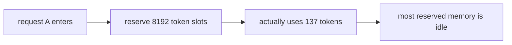

> **读图方法：** 阅读“从一个不可能的连续数组开始”这张流程图时，先把方框看成对象或状态，把箭头看成数据或控制的移动。第一遍从左向右建立顺序，第二遍再核对分支发生的条件。

在线服务无法预先知道输出长度。若按最大长度预留，短请求浪费大量空间；若按当前长度分配并
不断扩容，又需要寻找更大的连续区域或搬移已有 KV。多请求到达、完成和抢占后，物理空闲区还
会变得零散。

第 05 章的 block pool 解决了所有权问题：请求按需领取固定大小页面。代价是一个逻辑连续的
序列在物理上不再连续：

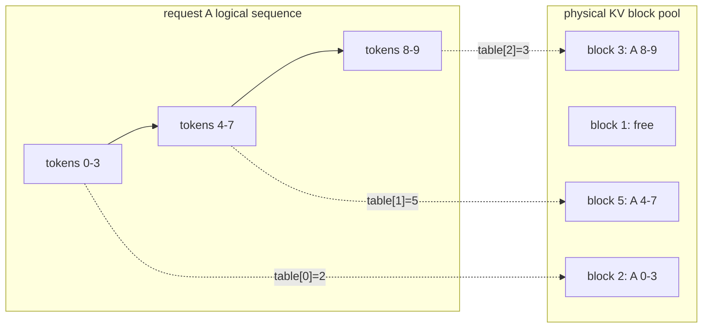

> **读图方法：** 这张图用于压缩“从一个不可能的连续数组开始”的整体关系。先从左向右找到起点、关键转换和终点，再问每条跨层箭头是否意味着函数调用、消息传递、内存访问或状态更新。

例子使用 block 2、5、3 存真实数据，避开第 05 章保留的 null block 0。

于是 attention 面临本章核心问题：它必须保持**逻辑顺序**，但不要求**物理连续**。

## 6.2 操作系统分页类比：哪里像，哪里不像

操作系统虚拟内存提供了很好的第一层直觉：

| 操作系统概念 | vLLM 教学类比 |
|---|---|
| 虚拟地址 | 请求内的逻辑 token 位置 |
| 虚拟页号 | 逻辑 block index |
| 页表 | request block table |
| 物理页框 | 物理 KV block |
| 页内偏移 | token 在 block 内的 offset |

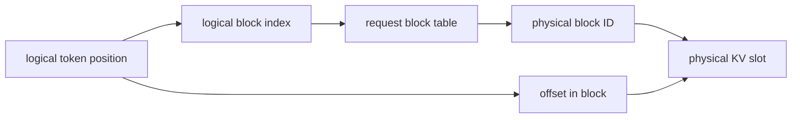

> **读图方法：** 这是“操作系统分页类比：哪里像，哪里不像”的流程图。先从左向右只追一条主路径，确认输入经过哪些关键阶段到达输出；第二遍再看虚线、回边和旁路，它们通常表示反馈、复用或可选分支。

这个类比准确解释了“间接寻址”和“外部碎片不要求搬移序列”，但不能继续机械套用：

- vLLM 没有依赖 CPU/GPU 硬件页表做这次翻译；kernel 显式读取 block table。
- 没有普通意义上的 TLB、缺页异常和透明换页。
- Scheduler 和 KV Cache Manager 在软件中决定页的所有权、复用与回收。
- KV page 的尺寸和布局由模型、backend、cache spec 与设备条件共同约束。
- prefix sharing 让两个请求的表项可引用同一物理 block，这更像显式共享页。

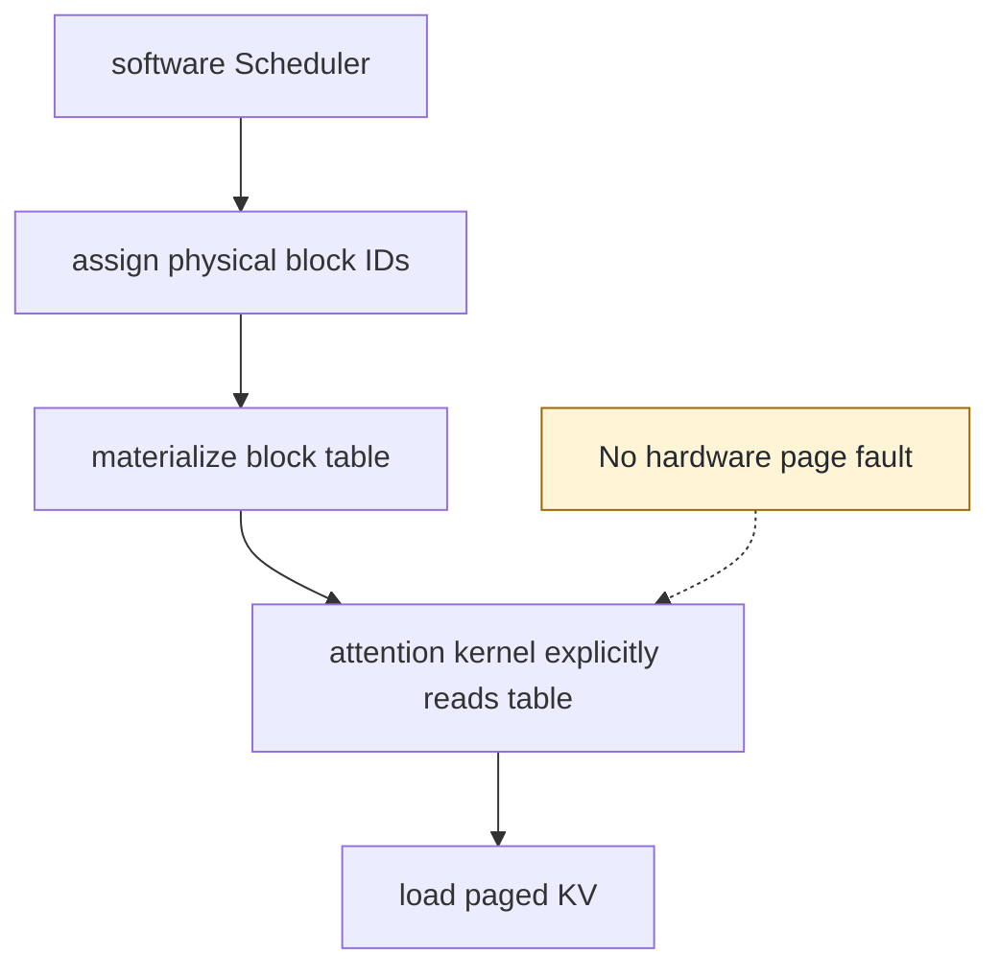

> **读图方法：** 阅读“操作系统分页类比：哪里像，哪里不像”这张流程图时，先把方框看成对象或状态，把箭头看成数据或控制的移动。第一遍从上向下建立顺序，第二遍再核对分支发生的条件。

**设计含义：**“像虚拟内存”只用于建立地址翻译直觉。调试时仍应回到 vLLM 自己的对象、
tensor shape 和 kernel 参数。

## 6.3 六种容易混淆的 block

> **本节先看：** 本节要回答：**六种容易混淆的 block**。下面的小节会逐层拆开概念、运行过程和源码落点；第一次阅读先抓对象之间的关系，第二次再记类名、字段和分支。

### 6.3.1 逻辑 token block

把请求 token 序列按固定 token 数切片。若 block size 为 4：

```text
logical block 0 = positions 0,1,2,3
logical block 1 = positions 4,5,6,7
logical block 2 = positions 8,9,10,11
```

它表达顺序，不表达物理地址。

### 6.3.2 Scheduler 侧物理 block 元数据

第 05 章的 `KVCacheBlock` 包含 block ID、引用计数、hash 与 free queue 链接。它代表所有权
和生命周期，不是实际 K/V 数值。

### 6.3.3 KV cache allocation block

这是 cache manager 分配的页粒度，一页可同时对应许多层的同一个 block ID。当前源码在
`BlockTable` 中称其尺寸为 `kv_cache_block_size`，MRV2 构造参数称为 `block_sizes`。

### 6.3.4 kernel block

attention kernel 消费的分页粒度。多数普通情况与 allocation block 相同；hybrid blocks
允许 allocation block 更大，再在表中虚拟拆成多个 kernel block。

### 6.3.5 block table

二维 tensor 的一行描述一个请求：第 `i` 项是该请求逻辑 block `i` 对应的物理 kernel block
ID。它是地址目录，不保存 K/V。

### 6.3.6 CUDA thread block

它是 CUDA 的执行组织单位，与 KV page 不是同一概念。两者可能在某个 kernel 中建立映射，
但名字相同不代表一对一。

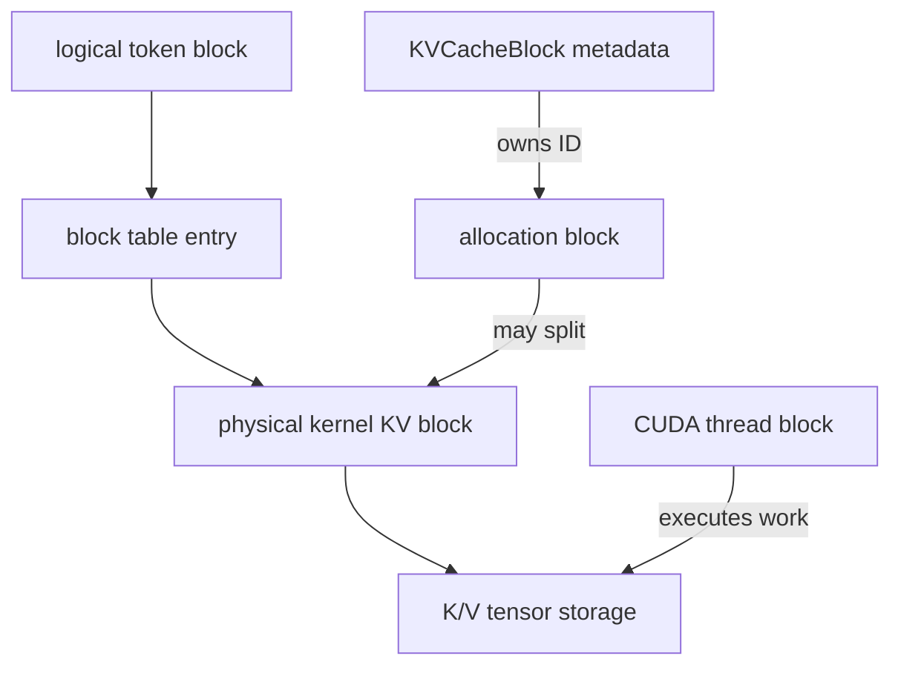

> **读图方法：** 这张图用于压缩“CUDA thread block”的整体关系。先从上向下找到起点、关键转换和终点，再问每条跨层箭头是否意味着函数调用、消息传递、内存访问或状态更新。

阅读日志或变量名时，必须问清三个问题：它的单位是 token、byte 还是执行线程？它属于控制面
还是数据面？它的 block size 是 manager 粒度还是 kernel 粒度？

## 6.4 Block Table 的地址公式

先忽略 context parallelism。对请求内位置 `p` 和 kernel block size `B`：

$$
i = \left\lfloor \frac{p}{B} \right\rfloor
$$

$$
o = p \bmod B
$$

$$
b = \mathtt{block\_table}[\mathrm{request},i]
$$

$$
\mathrm{slot} = bB+o
$$

其中：

- `i` 是逻辑 block index；
- `o` 是页内 token offset；
- `b` 是物理 kernel block ID；
- `slot` 是把物理 block 与页内位置展平后的 token slot。

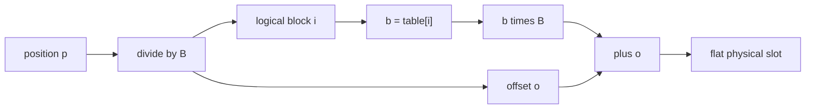

> **读图方法：** 这是“Block Table 的地址公式”的流程图。先从左向右只追一条主路径，确认输入经过哪些关键阶段到达输出；第二遍再看虚线、回边和旁路，它们通常表示反馈、复用或可选分支。

### 6.4.1 手算一个非连续例子

设 `B=4`，请求块表为 `[2, 5, 3]`：

| position `p` | logical block `i` | offset `o` | physical block `b` | slot |
|---:|---:|---:|---:|---:|
| 0 | 0 | 0 | 2 | 8 |
| 1 | 0 | 1 | 2 | 9 |
| 2 | 0 | 2 | 2 | 10 |
| 3 | 0 | 3 | 2 | 11 |
| 4 | 1 | 0 | 5 | 20 |
| 5 | 1 | 1 | 5 | 21 |
| 6 | 1 | 2 | 5 | 22 |
| 7 | 1 | 3 | 5 | 23 |
| 8 | 2 | 0 | 3 | 12 |
| 9 | 2 | 1 | 3 | 13 |

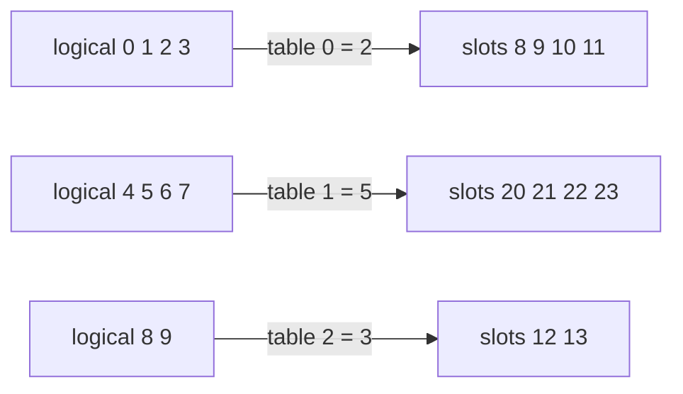

> **读图方法：** 阅读“手算一个非连续例子”这张流程图时，先把方框看成对象或状态，把箭头看成数据或控制的移动。第一遍从左向右建立顺序，第二遍再核对分支发生的条件。

物理读取顺序是 `8,9,10,11,20,21,22,23,12,13`，但 attention 看见的逻辑 K/V 顺序仍是
位置 `0..9`。随书 `slot_for_position()` 和对应测试固定了这个例子。

## 6.5 Allocation Block 与 Kernel Block 不一定相等

当前 V1 同时保留 manager block size 和 kernel block size。若 allocation block 为 32 token，
kernel 只接受 16 token page，一个 manager block 必须展开成两个连续的 kernel block ID：

```text
manager block 0 -> kernel blocks 0,1
manager block 1 -> kernel blocks 2,3
manager block 2 -> kernel blocks 4,5
```

一般地，若 `A` 是 allocation block size，`K` 是 kernel block size：

$$
r = \frac{A}{K}
$$

manager block ID `m` 展开为：

$$
m \times r, m \times r + 1, \ldots, m \times r + r - 1
$$

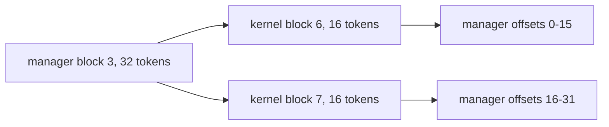

> **读图方法：** 这张图用于压缩“Allocation Block 与 Kernel Block 不一定相等”的整体关系。先从左向右找到起点、关键转换和终点，再问每条跨层箭头是否意味着函数调用、消息传递、内存访问或状态更新。

**源码事实：**MRV1 `BlockTable.map_to_kernel_blocks()` 与 MRV2
`BlockTables.append_block_ids()` 都执行这种展开；上游测试验证 manager ID `10,11` 在
`32 -> 16` 时变成 `20,21,22,23`。

这里 `A`、`K` 的单位均为 token/block，`r` 是无单位整数；必须满足 `A % K == 0`。这也解释了 `AttentionBackend.supports_block_size()` 为什么允许框架
block size 是 kernel 要求的整数倍，而不一定完全相等。

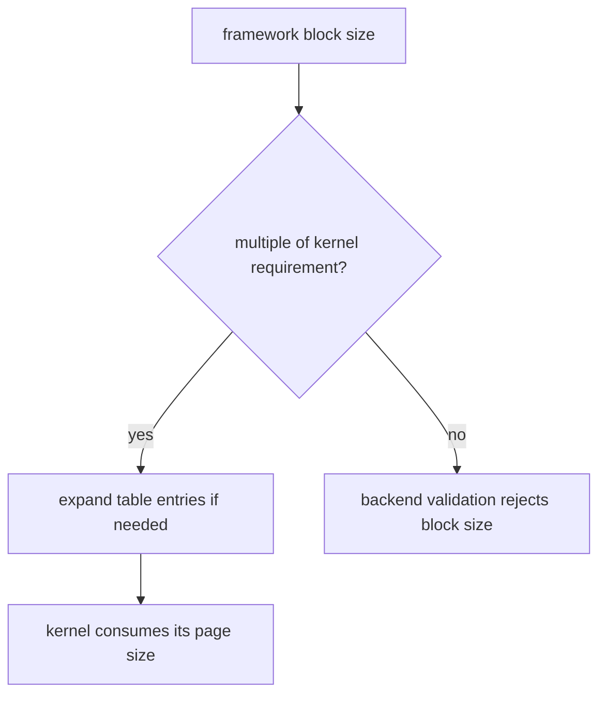

> **读图方法：** 这是“Allocation Block 与 Kernel Block 不一定相等”的流程图。先从上向下只追一条主路径，确认输入经过哪些关键阶段到达输出；第二遍再看虚线、回边和旁路，它们通常表示反馈、复用或可选分支。

这不是把物理 allocation 切成多个独立所有权对象。Scheduler 仍管理原 manager block，
Worker 只为 kernel 构造更细的地址视图。

## 6.6 Block Table 怎样从 Scheduler 到达 GPU

> **本节先看：** 本节要回答：**Block Table 怎样从 Scheduler 到达 GPU**。下面的小节会逐层拆开概念、运行过程和源码落点；第一次阅读先抓对象之间的关系，第二次再记类名、字段和分支。

### 6.6.1 SchedulerOutput 携带增量 block ID

第 04、05 章已经看到，Scheduler 在分配成功后把每个请求新得到的 block ID 放入输出。Model
Runner 维护 request index 与持久 block table，将新增 ID 追加或覆盖到对应行。

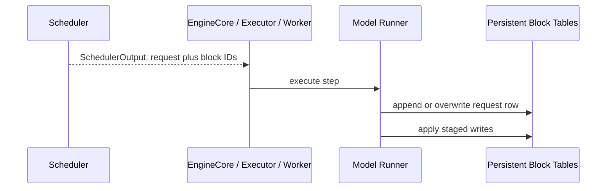

> **读图方法：** 这是“SchedulerOutput 携带增量 block ID”的时序图。先从左到右确认参与者分别负责什么，再从上到下追踪消息；第一遍只看正常路径，第二遍再看返回、异步消息和失败分支。

MRV2 的 `StagedWriteTensor` 允许先记录写入，再一次提交；多个 KV cache group 时可使用 fused
writer，减少逐 group 写表的调度开销。

### 6.6.2 从状态行 gather 成本轮批次行

持久表按 request state index 存储，但本轮 batch 的请求顺序可能变化。`idx_mapping` 说明
batch row 对应哪个持久 request row，`gather_block_tables()` 将所需行收集到模型 forward 使用
的持久输出 tensor，并把 padding row 清零。

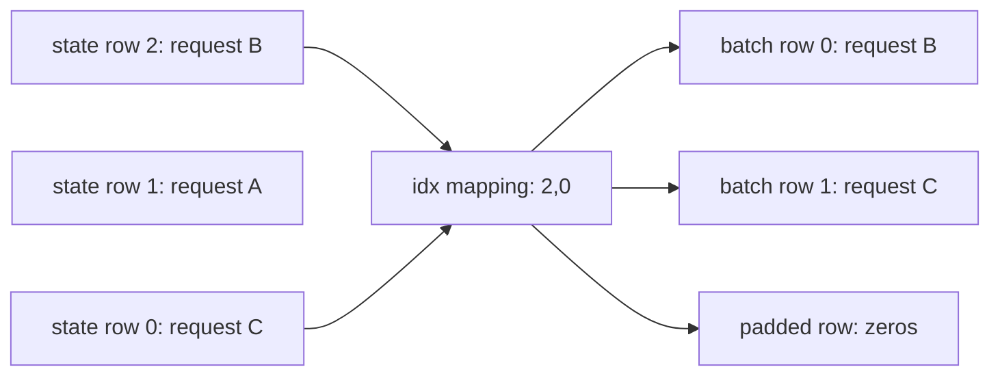

> **读图方法：** 这张图用于压缩“从状态行 gather 成本轮批次行”的整体关系。先从左向右找到起点、关键转换和终点，再问每条跨层箭头是否意味着函数调用、消息传递、内存访问或状态更新。

MRV1 路径使用 `commit_block_table()` 把 CPU buffer 的有效请求行复制到设备；MRV2 则维护
UVA/staged write 和 GPU gather。两条路径对象名相近，但不要把实现细节混写。

### 6.6.3 为什么 dummy 行必须清零

CUDA Graph 希望 replay 使用同一批持久 tensor 地址，因此 dummy run 不能随意新建表。当前
MRV2 直接把持久 input block table 的 dummy 行清零，使其指向保留的 null block；slot
mapping 则填充 `PAD_SLOT_ID=-1`。

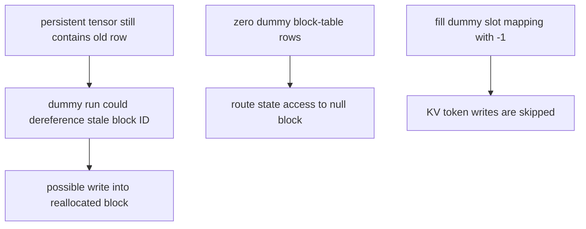

> **读图方法：** 这是“为什么 dummy 行必须清零”的流程图。先从上向下只追一条主路径，确认输入经过哪些关键阶段到达输出；第二遍再看虚线、回边和旁路，它们通常表示反馈、复用或可选分支。

上游测试专门检查返回的 dummy table 与真实 forward table 拥有相同 `data_ptr()`，同时内容被
清零。这一细节同时服务 CUDA Graph 地址稳定性和内存安全。

## 6.7 Slot Mapping：本轮 K/V 写到哪里

Block table 回答的是“请求的逻辑历史在哪里”。本轮模型新算出的 K/V 是按 batch token
连续排列的，例如：

```text
flat key tensor:
[A-pos4, A-pos5, B-pos9, C-pos2, C-pos3, C-pos4]
```

为了把每个元素写到各自请求的物理 KV 页，需要一个同长度的 `slot_mapping`：

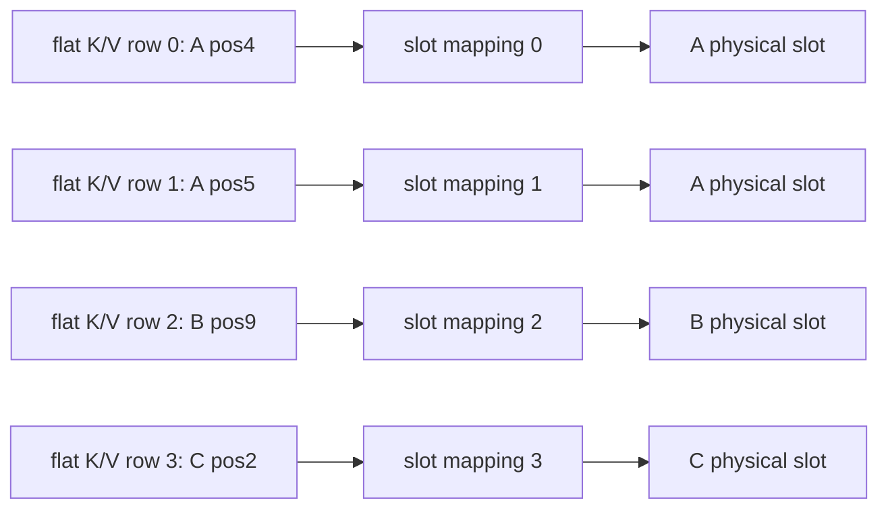

> **读图方法：** 阅读“Slot Mapping：本轮 K/V 写到哪里”这张流程图时，先把方框看成对象或状态，把箭头看成数据或控制的移动。第一遍从左向右建立顺序，第二遍再核对分支发生的条件。

在普通非 CP 情况下，它对每个 scheduled position 使用 6.4 节同一个公式。区别在于输出形态：

- block table 是每请求一行，供 attention 按整个逻辑序列读取；
- slot mapping 是每个本轮 token 一个扁平 slot，供 KV update 做 scatter write。

**读写地址的直觉：投递快件与按目录查书。** 对某个 cache group，slot mapping
可以看作本轮 token 的投递地址表；block table 则是读取历史时使用的目录。

- **写入**：扁平的是 token 这一维；K/V 本身还包含 head 与向量维度，不是只有
  一个数的一维数组。第 i 行 K/V 按 `slot_mapping[i]` 写入对应物理槽。
- **读取**：整个 batch 的 block table 通常是二维的，一个请求使用其中一行。
  kernel 按该行寻找所需 K/V；它可边读 tile 边计算，不必先重建完整连续 K/V 数组。

[源码] `vllm/v1/attention/backends/flash_attn.py` - `FlashAttentionImpl.do_kv_cache_update`、`forward`

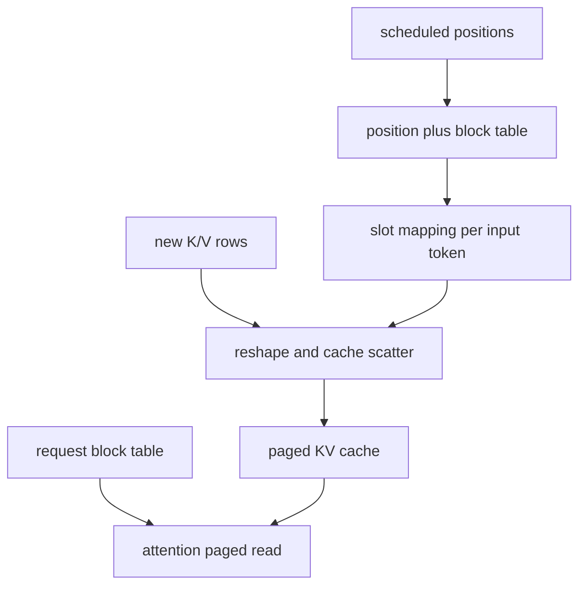

> **读图方法：** 这张图用于压缩“Slot Mapping：本轮 K/V 写到哪里”的整体关系。先从上向下找到起点、关键转换和终点，再问每条跨层箭头是否意味着函数调用、消息传递、内存访问或状态更新。

### 6.7.1 `PAD_SLOT_ID` 不是物理 block 0

`PAD_SLOT_ID=-1` 表示该 token 不应写缓存，例如 graph padding 或 context parallelism 中非本
rank 所属的位置。物理 block 0 则通常是保留的合法 null block ID，两者语义不同：

| 值 | 层次 | 含义 |
|---|---|---|
| `slot=-1` | token 写入 | 跳过这次写入 |
| `block_id=0` | block table | 指向保留 null block |

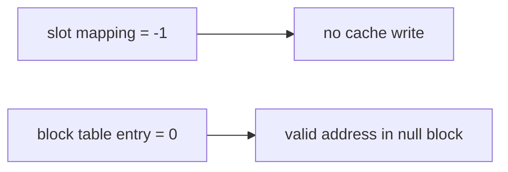

> **读图方法：** 这是“`PAD_SLOT_ID` 不是物理 block 0”的流程图。先从左向右只追一条主路径，确认输入经过哪些关键阶段到达输出；第二遍再看虚线、回边和旁路，它们通常表示反馈、复用或可选分支。

对不使用 token-to-KV-slot 语义的 Mamba/GDN 状态 group，当前代码还能整体关闭 slot mapping，
返回全 `-1`，而 block table 仍可被当作 recurrent state block index 使用。

### 6.7.2 Context Parallelism 会先改成 local position

启用 DCP 时，不是每个逻辑 token 都属于当前 rank。kernel 先根据 virtual block、interleave、
rank 判断位置是否本地，再把 global position 压缩成 local position；非本地位置得到 `-1`。

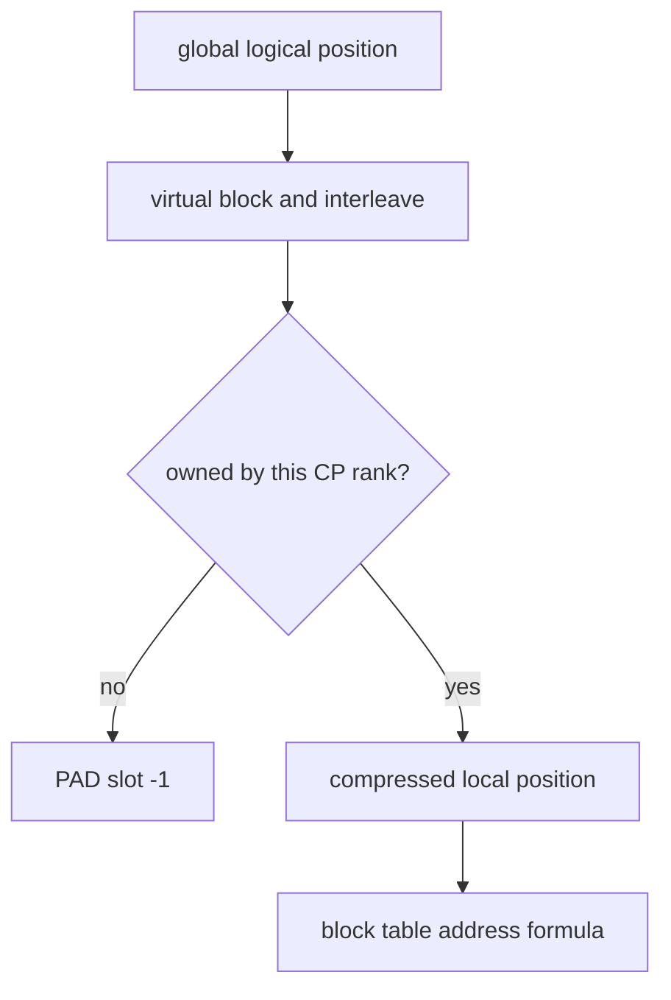

> **读图方法：** 阅读“Context Parallelism 会先改成 local position”这张流程图时，先把方框看成对象或状态，把箭头看成数据或控制的移动。第一遍从上向下建立顺序，第二遍再核对分支发生的条件。

本章不展开 DCP 的通信和局部序列布局；第 09 章会回到这条路径。这里先记住：普通公式仍是
核心，但 position 在进入公式前可能先被映射到本 rank 的局部坐标。

## 6.8 Ragged Batch：两个边界数组胜过 padding 矩阵

Continuous Batching 的同一轮可以包含不同 query length：

```text
A: scheduled 3 tokens
B: scheduled 1 token
C: scheduled 2 tokens
```

模型输入可直接扁平为 6 个 token，用累计边界：

```text
query_start_loc = [0, 3, 4, 6]
```

于是请求 `r` 的 query 区间是：

$$
[q_r, q_{r+1})
$$

query length 是：

$$
L^Q_r = q_{r+1} - q_r
$$

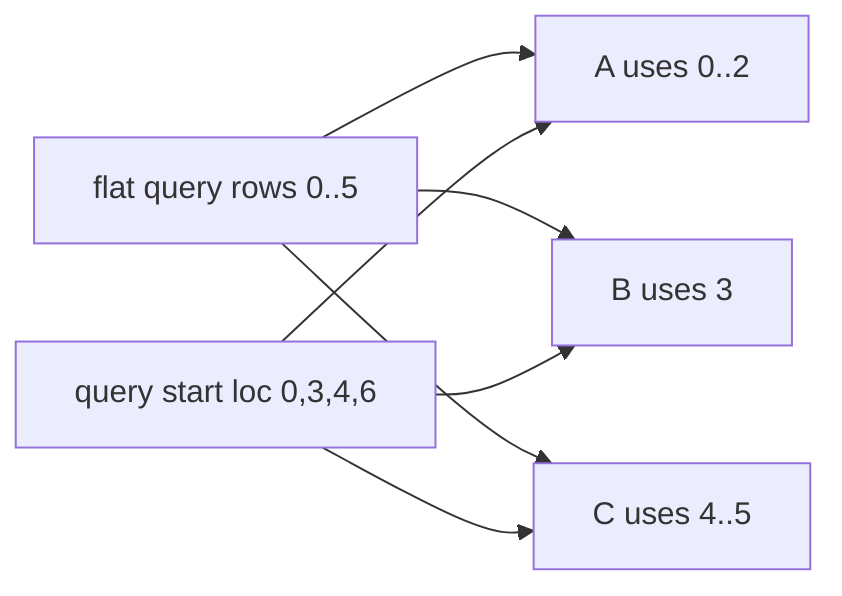

> **读图方法：** 这张图用于压缩“Ragged Batch：两个边界数组胜过 padding 矩阵”的整体关系。先从左向右找到起点、关键转换和终点，再问每条跨层箭头是否意味着函数调用、消息传递、内存访问或状态更新。

`seq_lens[r]` 是本轮执行后请求可见的总序列长度。已计算 context 长度可以在设备上得到：

$$
L^{\mathrm{context}}_r = L^{\mathrm{seq}}_r - L^{Q}_r
$$

例如：

| request | query interval | query len | seq len | prior context |
|---|---|---:|---:|---:|
| A | `[0,3)` | 3 | 11 | 8 |
| B | `[3,4)` | 1 | 25 | 24 |
| C | `[4,6)` | 2 | 6 | 4 |

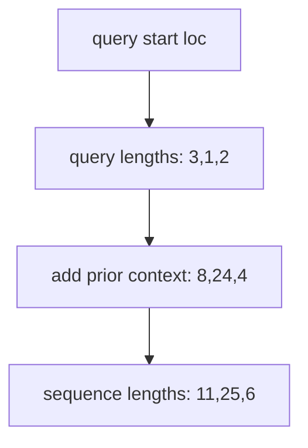

> **读图方法：** 这是“Ragged Batch：两个边界数组胜过 padding 矩阵”的流程图。先从上向下只追一条主路径，确认输入经过哪些关键阶段到达输出；第二遍再看虚线、回边和旁路，它们通常表示反馈、复用或可选分支。

**源码事实：**`CommonAttentionMetadata.naive_query_lens()` 计算 start location 的相邻差；
`compute_num_computed_tokens()` 在 device 上执行 `seq_lens - query_lens`。源码还弃用了隐式生成
CPU `seq_lens` 的便捷路径，因为 H-D 同步会破坏全异步调度。

## 6.9 Prefill、Decode 与 Mixed Batch

“prefill kernel”和“decode kernel”是有用的性能直觉，但当前统一接口更接近 ragged attention：
metadata 描述每个请求的 query 长度和可见 KV 长度，具体 backend 再选择内部算法。

### 6.9.1 Prefill

首次处理长 prompt 时，query length 通常大于 1；同一批新 K/V 既要写 cache，也参与本轮因果
attention。

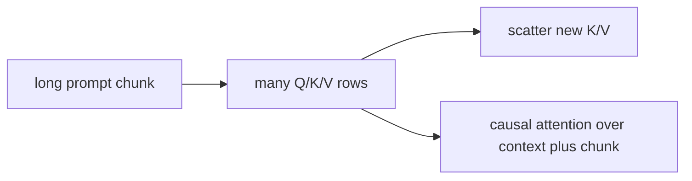

> **读图方法：** 阅读“Prefill”这张流程图时，先把方框看成对象或状态，把箭头看成数据或控制的移动。第一遍从左向右建立顺序，第二遍再核对分支发生的条件。

### 6.9.2 Decode

普通自回归 decode 每个请求本轮通常只有一个 query，但它要读取越来越长的 KV 历史：

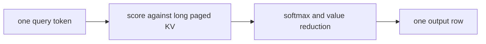

> **读图方法：** 这张图用于压缩“Decode”的整体关系。先从左向右找到起点、关键转换和终点，再问每条跨层箭头是否意味着函数调用、消息传递、内存访问或状态更新。

这通常是 memory-bandwidth-sensitive workload：query 很少，历史 K/V 读取很多。但不能只凭这句
话判断某个真实配置的瓶颈，还要考虑 head layout、quantization、batch、split-K、graph 和设备。

### 6.9.3 Mixed batch

Continuous Batching 可让一个长 prompt chunk 与多个 decode 请求同轮执行：

```mermaid
flowchart TB
    A["A prefill query len 128"] --> FLAT["one flat query tensor"]
    B["B decode query len 1"] --> FLAT
    C["C decode query len 1"] --> FLAT
    D["D short extend query len 4"] --> FLAT
    FLAT --> META["ragged metadata preserves boundaries"]
    META --> BACKEND["backend handles supported mixture"]
```

> **读图方法：** 这是“Mixed batch”的流程图。先从上向下只追一条主路径，确认输入经过哪些关键阶段到达输出；第二遍再看虚线、回边和旁路，它们通常表示反馈、复用或可选分支。

不能因为 backend 支持 prefill 和 decode，就自动推断它支持任意 mixed batch、spec decode、
CUDA Graph 或所有 attention feature。能力验证和 metadata builder 正是为这些组合边界存在。

## 6.10 `CommonAttentionMetadata`：跨后端的最小公共语言

当前 dataclass 的核心字段可按四组理解：

| 类别 | 字段 | 用途 |
|---|---|---|
| ragged query | `query_start_loc`、CPU 对应项 | 请求在扁平 query 中的边界 |
| sequence | `seq_lens`、`max_query_len`、`max_seq_len` | 每请求和批次上界 |
| paged KV | `block_table_tensor`、`slot_mapping` | 读地址目录与写地址 |
| batch control | `num_reqs`、`num_actual_tokens`、`causal` | 有效规模和 mask 语义 |

其余字段支持 encoder/cross attention、DCP、multimodal prefix、R-SWA、ReplaySSM 等功能。

```mermaid
flowchart TD
    INPUT["prepared input batch"] --> COMMON["CommonAttentionMetadata"]
    COMMON --> Q["ragged query boundaries"]
    COMMON --> L["sequence lengths"]
    COMMON --> P["block table and slot mapping"]
    COMMON --> F["feature-specific optional fields"]
```

> **读图方法：** 阅读“`CommonAttentionMetadata`：跨后端的最小公共语言”这张流程图时，先把方框看成对象或状态，把箭头看成数据或控制的移动。第一遍从上向下建立顺序，第二遍再核对分支发生的条件。

注意源码中的 `num_actual_tokens` 有一个 TODO：它可能包含 padding，命名并不总是字面上的
“actual”。阅读 backend 时要看它如何 slice output、query 和 metadata，不能只相信字段名。

### 6.10.1 Common 不等于最终 kernel 参数

每个 backend 的 metadata builder 把公共字段转换为自己的 metadata，可能增加 scheduler
metadata、cascade attention 切分、DCP 长度、graph 持久 buffer 或专用 mask：

```mermaid
flowchart LR
    C["CommonAttentionMetadata"] --> B1["FlashAttention builder"]
    C --> B2["FlashInfer builder"]
    C --> B3["Triton builder"]
    B1 --> M1["FlashAttentionMetadata"]
    B2 --> M2["backend-specific metadata"]
    B3 --> M3["backend-specific metadata"]
```

> **读图方法：** 这张图用于压缩“Common 不等于最终 kernel 参数”的整体关系。先从左向右找到起点、关键转换和终点，再问每条跨层箭头是否意味着函数调用、消息传递、内存访问或状态更新。

这层转换隔离了 Model Runner 与具体 kernel。Model Runner 不应为每种 backend 拼一套完全不同
的输入；backend 也不应重新推断 Scheduler 已经明确给出的请求边界和地址。

## 6.11 Model Runner 构造 metadata 的真实顺序

把前面各节连起来，当前执行准备大致按以下顺序发生：

```mermaid
sequenceDiagram
    participant S as SchedulerOutput
    participant R as Model Runner
    participant T as BlockTables
    participant C as Common Metadata
    participant B as Backend Builder
    participant F as Forward Context
    S->>R: request order, token counts, block IDs
    R->>T: update persistent request rows
    T-->>R: gathered batch block tables
    T-->>R: per-token slot mappings
    R->>C: build ragged and paged fields
    C->>B: build backend metadata
    B-->>F: metadata shared by layer names
```

> **读图方法：** 这是“Model Runner 构造 metadata 的真实顺序”的时序图。先从左到右确认参与者分别负责什么，再从上到下追踪消息；第一遍只看正常路径，第二遍再看返回、异步消息和失败分支。

MRV2 `prepare_attn()` 先用 `idx_mapping` gather block tables，再以
`query_start_loc` 和 `positions` 计算所有 cache group 的 slot mappings。MRV1 则在 input
preparation 中让 `input_batch.block_table.compute_slot_mapping()` 更新对应 buffer。

随后 Model Runner 创建 `CommonAttentionMetadata`，核心赋值关系是：

```text
query_start_loc   <- prepared ragged batch boundaries
seq_lens          <- computed tokens + scheduled tokens
block_table       <- current cache group's gathered block table
slot_mapping      <- current cache group's token write destinations
max_query_len     <- batch query upper bound
max_seq_len       <- batch context upper bound
```

每个 KV cache group 可能拥有不同 block table、slot mapping 或 attention group。Model Runner
会为 group 浅拷贝 common metadata，再调用其 builder。若多个 group 的 spec 与 builder 类型相同，
且 builder 支持 `update_block_table()`，当前代码可以复用已构造 metadata，只替换块表和 slot
mapping。

```mermaid
flowchart TD
    C["common metadata base"] --> G0["copy for KV group 0"]
    C --> G1["copy for KV group 1"]
    G0 --> BUILD["builder builds metadata"]
    G1 --> SAME{"same spec and builder?"}
    SAME -->|"yes and update supported"| UPDATE["reuse metadata, update table"]
    SAME -->|"no"| BUILD2["build independently"]
```

> **读图方法：** 阅读“Model Runner 构造 metadata 的真实顺序”这张流程图时，先把方框看成对象或状态，把箭头看成数据或控制的移动。第一遍从上向下建立顺序，第二遍再核对分支发生的条件。

**设计含义：**metadata build 位于每轮热路径。任何隐式 CPU-GPU 同步、临时 tensor 分配或过多
Python 分支都可能影响 decode 延迟。因此源码中的持久 buffer、device-side 长度和 update 快速
路径不是“工程杂项”，而是 attention 性能接口的一部分。

## 6.12 `Attention` 层：模型代码与 backend 的稳定边界

模型定义通常只需要构造统一的 `Attention` 层，而不直接依赖某个 kernel。这个类的公开职责在
docstring 中写得很直接：

1. 保存输入 K/V 到 KV cache；
2. 执行 MHA、MQA 或 GQA attention；
3. 返回输出 tensor。

### 6.12.1 初始化时选择，而不是每个 token 重选

若模型没有注入 `attn_backend`，`Attention.__init__()` 调用 `get_attn_backend()`，传入 head
size、默认 activation dtype、KV dtype、sink、multimodal prefix、per-head quant scale、
attention type 和 sliding-window 信号。得到的是 backend class，再通过 `get_impl_cls()` 创建
具体 implementation。

```mermaid
flowchart LR
    MODEL["model constructs Attention"] --> FEATURES["head size, dtype, KV dtype, features"]
    FEATURES --> SELECT["get attn backend"]
    SELECT --> BACKEND["AttentionBackend class"]
    BACKEND --> IMPLCLS["get impl class"]
    IMPLCLS --> IMPL["layer-specific implementation instance"]
```

> **读图方法：** 这张图用于压缩“初始化时选择，而不是每个 token 重选”的整体关系。先从左向右找到起点、关键转换和终点，再问每条跨层箭头是否意味着函数调用、消息传递、内存访问或状态更新。

这发生在模型初始化阶段，不是在每个 decode token 上重新跑候选选择。随后层按 `prefix` 注册到
`compilation_config.static_forward_context`，KV cache 先放一个 placeholder，实际设备缓存由
后续 bind 流程接入。

### 6.12.2 Forward 为什么没有 `attn_metadata` 参数

模型层的 `forward(query,key,value)` 接口保持接近普通神经网络层；attention metadata 由
Model Runner 在 `execute_model` 的 forward context 中设置。统一 custom op 根据 layer name
找到：

```text
backend-specific attention metadata
Attention layer instance
bound KV cache tensor
layer/group slot mapping
```

```mermaid
flowchart TD
    FC["forward context"] --> M["metadata by layer name"]
    FC --> L["no-compile layer registry"]
    FC --> S["slot mapping by layer name"]
    L --> K["bound KV cache"]
    M --> OP["unified attention op"]
    S --> OP
    K --> OP
```

> **读图方法：** 这是“Forward 为什么没有 `attn_metadata` 参数”的流程图。先从上向下只追一条主路径，确认输入经过哪些关键阶段到达输出；第二遍再看虚线、回边和旁路，它们通常表示反馈、复用或可选分支。

这种设计让模型签名不必携带大量服务状态，也让编译器看到一个稳定的 attention 边界。代价是
阅读调用链时不能只跟 Python 形参，必须同时跟 forward context。

### 6.12.3 Q/K/V 形状在 custom op 外完成

`Attention.forward()` 把扁平投影结果 reshape 为：

```text
Q: [num_tokens, num_query_heads, head_size]
K: [num_tokens, num_kv_heads, head_size]
V: [num_tokens, num_kv_heads, head_size_v]
```

输出预先分配为 `[num_tokens, num_query_heads, head_size_v]`。源码注释说明 reshape 放在 custom
op 外，是为了减少非 CUDA Graph 区域的 CPU overhead。

## 6.13 两类 backend：KV 写入是否包含在 forward 中

`AttentionBackend.forward_includes_kv_cache_update` 默认是 `True`。若 backend 自己的 forward
同时写新 K/V 和做 attention，统一层只调用 attention op。若值为 `False`，统一层先调用
`unified_kv_cache_update()`，再调用 `unified_attention_with_output()`。

```mermaid
flowchart TD
    F["Attention forward"] --> INC{"backend forward includes KV update?"}
    INC -->|"yes"| A["one backend attention call"]
    INC -->|"no"| W["unified KV cache update"]
    W --> D["dummy tensor dependency"]
    D --> A2["unified attention with output"]
```

> **读图方法：** 阅读“两类 backend：KV 写入是否包含在 forward 中”这张流程图时，先把方框看成对象或状态，把箭头看成数据或控制的移动。第一遍从上向下建立顺序，第二遍再核对分支发生的条件。

这两个 op 之间传递一个零元素 dummy tensor。它不承载业务数据，而是显式表达副作用顺序，防止
`torch.compile` 把“读 cache”重排到“写新 K/V”之前。

```mermaid
flowchart LR
    W["scatter new K/V"] --> DEP["data dependency token"]
    DEP --> R["read paged K/V for attention"]
    BAD["compiler reorder"]:::warn -. "prevented" .-> DEP
    classDef warn fill:#fff4d6,stroke:#9a6700,color:#24292f
```

> **读图方法：** 这张图用于压缩“两类 backend：KV 写入是否包含在 forward 中”的整体关系。先从左向右找到起点、关键转换和终点，再问每条跨层箭头是否意味着函数调用、消息传递、内存访问或状态更新。

若 layer 共享前面某层的 KV cache，或 K/V 不存在，则跳过重复写入。具体更新调用
implementation 的 `do_kv_cache_update()`，并传入当前 layer、K、V、KV tensor 与 layer slot
mapping。

## 6.14 Backend 契约：四个对象各做什么

> **本节先看：** 本节要回答：**Backend 契约：四个对象各做什么**。下面的小节会逐层拆开概念、运行过程和源码落点；第一次阅读先抓对象之间的关系，第二次再记类名、字段和分支。

### 6.14.1 `AttentionBackend`

这是类级能力描述与工厂入口：

- backend 名称；
- implementation class；
- metadata builder class；
- 支持的 dtype、KV dtype、head size、kernel block size；
- sliding window、non-causal、sink、MLA、sparse、PCP/DCP 等能力；
- cache spec/layout 偏好与组合校验。

### 6.14.2 `AttentionMetadataBuilder`

builder 绑定一个 KV cache spec、若干 layer name、vLLM config 和 device。它把 common metadata
变成 backend metadata，并声明：

- CUDA Graph 支持等级；
- 是否需要重排 batch；
- 是否支持只更新 block table；
- 是否能在 draft decode 中原地更新 metadata；
- 是否需要 block table width。

### 6.14.3 `AttentionMetadata`

它是具体 backend forward 的每批控制数据。不同 backend 字段不同，不应假定都叫同样的名字或
拥有同样的 CPU/GPU 表示。

### 6.14.4 `AttentionImpl`

它是每层实例，保存 head 数、head size、scale、window、KV dtype、quant scale 等层级参数，
并实现实际 forward。backend class 描述“这个家族能否运行”，impl 描述“这个层怎样运行”。

```mermaid
flowchart TB
    BE["AttentionBackend: capabilities and factories"] --> BU["MetadataBuilder: per-batch translation"]
    BE --> IM["AttentionImpl: per-layer execution"]
    BU --> MD["AttentionMetadata: current batch"]
    MD --> IM
    LAYER["Attention layer parameters"] --> IM
```

> **读图方法：** 这是“`AttentionImpl`”的流程图。先从上向下只追一条主路径，确认输入经过哪些关键阶段到达输出；第二遍再看虚线、回边和旁路，它们通常表示反馈、复用或可选分支。

把这四者分开后，新增 backend 的问题会清晰很多：它不是只写一个 kernel，还要定义能力校验、
cache layout、metadata 构造、graph 行为和统一层接入。

## 6.15 Backend 自动选择：排序后逐个证明可用

> **本节先看：** 本节要回答：**Backend 自动选择：排序后逐个证明可用**。下面的小节会逐层拆开概念、运行过程和源码落点；第一次阅读先抓对象之间的关系，第二次再记类名、字段和分支。

### 6.15.1 选择配置从哪里来

`AttentionSelectorConfig` 汇总：

```text
head_size, dtype, kv_cache_dtype, user-specified block_size
use_mla, has_sink, use_sparse, use_mm_prefix
use_per_head_quant_scales, attention_type, sliding_window
use_non_causal, batch_invariant, KV connector
PCP, DCP, adaptive verification
```

只有用户显式指定 block size 时，selector 才把它作为硬约束传入；自动 block size 不应过早
排除一个本可选择并给出 preferred size 的 backend。

### 6.15.2 Per-kind override 优先于全局 backend

当前 attention config 可按 `KVCacheSpecKind` 设置 backend，例如 full attention 与 sliding
window group 使用不同实现。选择顺序是：

```mermaid
flowchart TD
    KIND["derive cache kind from MLA, window, attention type"] --> MAP{"backend per kind contains it?"}
    MAP -->|"yes"| PK["use per-kind backend"]
    MAP -->|"no"| GLOBAL["fall back to global backend"]
    PK --> PLATFORM["platform validation"]
    GLOBAL --> PLATFORM
```

> **读图方法：** 阅读“Per-kind override 优先于全局 backend”这张流程图时，先把方框看成对象或状态，把箭头看成数据或控制的移动。第一遍从上向下建立顺序，第二遍再核对分支发生的条件。

这比“整个模型只有一个 backend”更准确，也解释了 hybrid KV 模型为什么会出现多个 attention
group 和 builder。

### 6.15.3 显式选择是严格校验

若用户显式选择 backend，CUDA platform 只验证这个候选。导入失败或任何能力不兼容都会抛出
错误，不会静默换成另一个实现。这使部署配置具有可预测性。

### 6.15.4 自动选择是有序候选过滤

未显式选择时，platform 先生成按设备和 attention 类型排序的候选，再逐个调用
`validate_configuration()`。每个无效 backend 都保留 rejection reasons，最后选择 priority
数字最小的有效候选；全部无效则把原因汇总到异常。

```mermaid
flowchart TD
    LIST["platform ordered candidates"] --> C0["candidate priority 0"]
    C0 --> V0{"validate configuration"}
    V0 -->|"valid"| KEEP0["keep candidate"]
    V0 -->|"invalid"| REASON0["record reasons"]
    LIST --> C1["candidate priority 1"]
    C1 --> V1{"validate configuration"}
    V1 -->|"valid"| KEEP1["keep candidate"]
    V1 -->|"invalid"| REASON1["record reasons"]
    KEEP0 --> MIN["choose best valid priority"]
    KEEP1 --> MIN
```

> **读图方法：** 这张图用于压缩“自动选择是有序候选过滤”的整体关系。先从上向下找到起点、关键转换和终点，再问每条跨层箭头是否意味着函数调用、消息传递、内存访问或状态更新。

当前普通非 MLA CUDA 候选并非永远同序：在特定 major 10 且 causal 场景中，源码优先
FlashInfer，再尝试 FlashAttention、Triton、Flex 和 TurboQuant；其他普通路径优先
FlashAttention，再尝试 FlashInfer 等。MLA 又有按架构、KV dtype、head 数和 head size
变化的更长候选表。

因此“CUDA 上 vLLM 默认就是 FlashAttention”不是稳定结论。正确说法是：**当前平台为当前
配置排序候选，并选择最高优先级的有效 backend。**

### 6.15.5 通用校验并不只看三项

`AttentionBackend.validate_configuration()` 依次检查 head size、activation dtype、KV dtype、
block size、multimodal prefix、MLA/非 MLA、sink、sparse、per-head scales、compute capability、
attention type、sliding window、non-causal、batch invariance、KV connector、PCP、adaptive
verification、DCP 组合以及 backend 自定义组合条件。

```mermaid
flowchart LR
    SHAPE["shape"] --> VALID["validation"]
    DT["dtype and KV dtype"] --> VALID
    GPU["device capability"] --> VALID
    PAGE["block size"] --> VALID
    FEAT["attention features"] --> VALID
    DIST["connector and parallel modes"] --> VALID
    VALID --> OK["valid or reason list"]
```

> **读图方法：** 这是“通用校验并不只看三项”的流程图。先从左向右只追一条主路径，确认输入经过哪些关键阶段到达输出；第二遍再看虚线、回边和旁路，它们通常表示反馈、复用或可选分支。

随书 `BackendCandidate.rejection_reasons()` 是这个机制的简化模型，测试覆盖高优先级候选被过滤
后回退，以及所有候选都不满足 feature 时失败。

## 6.16 精读当前 FlashAttention 路径

本节选择 FlashAttention 作为一个**当前可达 backend 示例**，不是宣称所有机器都使用它。

### 6.16.1 Backend 能力摘要

当前 `FlashAttentionBackend`：

- activation dtype 支持 FP16/BF16；
- KV dtype 列表包含 auto、FP16、BF16 和若干 FP8 表示，最终仍受版本/设备组合校验；
- 常规 kernel block size 要求为 16 的倍数，特定 FA4 head-size-256 路径有专用 page size；
- head size 要求为 8 的倍数，常规上限 256，满足 FA4 条件时可到 512；
- 支持 sliding window、non-causal 和多种 attention type；
- 声明 `forward_includes_kv_cache_update=False`。

### 6.16.2 Builder 复制公共分页字段

`FlashAttentionMetadataBuilder.build()` 直接取得 common metadata 中的：

```text
num_reqs, num_actual_tokens
max_query_len, max_seq_len
query_start_loc, seq_lens
block_table_tensor, slot_mapping, causal
```

然后按 FA 版本、CUDA Graph、cascade、DCP、sliding window 和 scheduler AOT metadata 等条件
补充字段。FA3 与 FA2 的 graph 支持并不相同，源码将其编码为不同
`AttentionCGSupport` 等级。

### 6.16.3 第一步：按 slot mapping 写新 K/V

因为 forward 不包含 KV update，统一层先调用 `FlashAttentionImpl.do_kv_cache_update()`。它将
combined KV tensor 转成 key/value cache view，再调用 `reshape_and_cache_flash()`，以
`slot_mapping` 做 scatter write。

```mermaid
flowchart LR
    K["new key rows"] --> RC["reshape and cache flash"]
    V["new value rows"] --> RC
    SM["slot mapping"] --> RC
    RC --> KC["paged key cache"]
    RC --> VC["paged value cache"]
```

> **读图方法：** 阅读“第一步：按 slot mapping 写新 K/V”这张流程图时，先把方框看成对象或状态，把箭头看成数据或控制的移动。第一遍从左向右建立顺序，第二遍再核对分支发生的条件。

源码特别说明，K/V 可能包含 graph padding，而 slot mapping 的长度决定实际参与更新的 token
数，因此不必先对 K/V 做 Python slice。

### 6.16.4 第二步：把 combined cache 解释成 K/V view

普通 decoder 路径在 `forward()` 中执行：

```text
combined cache: [num_blocks, num_kv_heads, block_size, 2 * head_size]
transpose and split
key/value view: [num_blocks, block_size, num_kv_heads, head_size]
```

具体 stride 还会针对 size-1 dimension 做 canonicalization，以满足较新 FA/TMA 路径的对齐要求。
这提醒我们：只看 shape 不够，kernel correctness/performance 还可能依赖 stride 和 layout。

### 6.16.5 第三步：FlashAttention 直接消费 block table

非 cascade、非 DCP 的普通路径从 metadata 取：

```text
cu_seqlens_q = query_start_loc
seqused_k    = seq_lens
block_table  = block_table
```

然后调用 `flash_attn_varlen_func()`，把 paged K/V cache 作为 `k`、`v`，并显式传入
`block_table=block_table`：

```mermaid
flowchart TB
    Q["ragged Q"] --> FA["flash attn varlen"]
    KC["paged key cache"] --> FA
    VC["paged value cache"] --> FA
    QS["query start locations"] --> FA
    SL["sequence lengths"] --> FA
    BT["block table"] --> FA
    MASK["causal, window, optional mask"] --> FA
    FA --> O["attention output"]
```

> **读图方法：** 这张图用于压缩“第三步：FlashAttention 直接消费 block table”的整体关系。先从上向下找到起点、关键转换和终点，再问每条跨层箭头是否意味着函数调用、消息传递、内存访问或状态更新。

这正是“FlashAttention 与分页 KV 不冲突”的源码证据。FlashAttention 描述的是一类高效
attention 算法/实现；block table 描述 K/V 的地址组织。当前 API 可以同时使用两者。

### 6.16.6 Cascade 和 DCP 是分支，不是另一套基本地址观

存在公共 prefix 时，builder 可能选择 cascade attention，把公共前缀与各请求 suffix 分别计算
再合并状态。DCP 路径还可能对 context attention 分片，并通过 log-sum-exp 合并不同 rank 的
输出。这些分支仍传递 block table，只是 query、KV 范围和归约方式更复杂。

```mermaid
flowchart TD
    META["FlashAttention metadata"] --> CAS{"use cascade?"}
    CAS -->|"no"| DIRECT["varlen paged attention"]
    CAS -->|"yes"| PREFIX["common prefix attention"]
    CAS -->|"yes"| SUFFIX["per-request suffix attention"]
    PREFIX --> MERGE["merge attention states"]
    SUFFIX --> MERGE
```

> **读图方法：** 这是“Cascade 和 DCP 是分支，不是另一套基本地址观”的流程图。先从上向下只追一条主路径，确认输入经过哪些关键阶段到达输出；第二遍再看虚线、回边和旁路，它们通常表示反馈、复用或可选分支。

本章先建立单 rank 基本路径；第 09 章讨论跨 rank softmax 状态为什么不能直接平均。

## 6.17 `vllm/v1/attention/ops/paged_attn.py` 在当前代码中的真实位置

文件 `vllm/v1/attention/ops/paged_attn.py` 只有一个很薄的 `PagedAttention` helper，主要做两件事：

1. 按特定 layout 将 combined cache 拆成 key/value view；
2. 调用 `reshape_and_cache()` 通过 slot mapping 写入分页 cache。

在本章固定 revision 中，对 `PagedAttention.split_kv_cache()` 和
`write_to_paged_cache()` 的 Python 引用出现在 ROCm attention backend。前一节的 NVIDIA
FlashAttention 路径直接使用自己的 cache view、`reshape_and_cache_flash()` 和
`flash_attn_varlen_func(block_table=...)`。

```mermaid
flowchart TD
    IDEA["paged KV addressing contract"] --> FA["FlashAttention paged path"]
    IDEA --> FI["FlashInfer paged path"]
    IDEA --> TR["Triton paged path"]
    IDEA --> ROCM["ROCm path using PagedAttention helper"]
    HELPER["ops PagedAttention class"] --> ROCM
```

> **读图方法：** 阅读“`vllm/v1/attention/ops/paged_attn.py` 在当前代码中的真实位置”这张流程图时，先把方框看成对象或状态，把箭头看成数据或控制的移动。第一遍从上向下建立顺序，第二遍再核对分支发生的条件。

所以不能用“有没有调用 `class PagedAttention`”判断当前执行是否采用分页 KV。应检查所选
backend 的 cache layout、metadata 和 kernel 调用是否消费 block table。

## 6.18 分页只改变地址，不应改变数学结果

对一个 query 向量 `q` 和逻辑顺序 K/V：

$$
s_j = \frac{q \cdot k_j}{\sqrt{d}}
$$

$$
p_j = \frac{e^{s_j}}{\sum_t e^{s_t}}
$$

$$
o = \sum_j p_j v_j
$$

分页实现改变的是取得 `k_j`、`v_j` 的方式：

$$
(k_j,v_j)=\mathrm{KV}\bigl[\mathtt{block\_table}[\lfloor j/B\rfloor],\;j\bmod B\bigr]
$$

只要地址翻译保持逻辑次序、mask 和数值精度相同，分页与连续布局的参考输出应一致。

```mermaid
flowchart LR
    LOGIC["logical K/V sequence"] --> CONTIG["contiguous storage reference"]
    LOGIC --> PAGED["paged physical storage"]
    PAGED --> GATHER["block-table address translation"]
    CONTIG --> MATH["same attention math"]
    GATHER --> MATH
    MATH --> SAME["same reference output"]
```

> **读图方法：** 这张图用于压缩“分页只改变地址，不应改变数学结果”的整体关系。先从左向右找到起点、关键转换和终点，再问每条跨层箭头是否意味着函数调用、消息传递、内存访问或状态更新。

随书 `paged_attention()` 先按块表 gather，再调用同一 `contiguous_attention()`；测试使用非连续
块表验证逐元素近似相等。它证明的是**地址语义**，不证明浮点 kernel bitwise 一致或性能相同。

## 6.19 怎样读一个真实 Paged Attention Kernel

仓库中的 `docs/design/paged_attention.md` 讲解的是历史 CUDA kernel。它仍适合学习底层阅读
方法，但必须把历史符号重新映射到当前可达 backend，不能把文档中的函数名直接当成当前统一
执行路径。

### 6.19.1 第一层：先写出输入输出 shape

不要从 thread index 开始。先记录：

```text
Q shape and dtype
K/V cache shape, layout and stride
block table shape and block size
sequence lengths and query boundaries
output shape
mask, scale and quantization metadata
```

若这些还不清楚，任何 warp-level 解释都缺少坐标系。

### 6.19.2 第二层：找 grid 中每一维代表什么

常见映射可能涉及 sequence、query head、KV head、token tile、partition 或 split-K，但不要凭经验
猜。找到 launch site 和 `program_id`/`blockIdx` 的实际使用：

```mermaid
flowchart LR
    LAUNCH["launch grid"] --> G0["grid dimension 0 meaning"]
    LAUNCH --> G1["grid dimension 1 meaning"]
    LAUNCH --> G2["grid dimension 2 meaning"]
    G0 --> WORK["one program work set"]
    G1 --> WORK
    G2 --> WORK
```

> **读图方法：** 这是“第二层：找 grid 中每一维代表什么”的流程图。先从左向右只追一条主路径，确认输入经过哪些关键阶段到达输出；第二遍再看虚线、回边和旁路，它们通常表示反馈、复用或可选分支。

### 6.19.3 第三层：单独标出分页地址翻译

在所有 pointer arithmetic 中，先圈出：

```text
logical token/block index
block-table load
physical block ID
in-block offset
layout stride
final K/V pointer
```

然后再看 vector width、coalescing、TMA 或 shared-memory staging。这样可以把“地址是否正确”和
“地址是否高效”分开验证。

### 6.19.4 第四层：追踪 online softmax 状态

这里的 online 是“分块到来、边读边累计”，不是在线 HTTP 服务。先想象统计两组
候选：第一组总权重为 9，第二组为 1，合并输出应按 9:1 加权，不能取两个局部
输出的简单平均。为了不保存完整分数矩阵，kernel 只保留能继续累计的摘要。

长 KV 往往按 tile/partition 处理。tile 是本轮处理的一小片 K/V。对一个 Query，
`s_j` 为第 `j` 个候选的无单位分数；稳定 softmax 通常维护局部最大值 $m$、归一化分母 $\ell$ 和
加权输出状态。新 tile 到来时旧状态需要按新的最大值重标定：

$$
m' = \max(m, m_{\mathrm{tile}})
$$

$$
\ell' = e^{m-m'}\ell + \sum_{j\in\mathrm{tile}}e^{s_j-m'}
$$

`m_tile` 是新片段的最大分数；变量 $m$、$\ell$、$m_{\mathrm{tile}}$ 都是标量。分母 $\ell$ 保存的是
$\sum_j \exp(s_j-m)$，换用更大的最大值 `m′` 后，要把旧分母乘 `exp(m-m′)`，
才能和新片段相加。加权输出摘要是长度为 Value 维度的向量，也必须使用相同缩放。
LSE 指 `log(sum(exp(score)))`，可由 $m+\log\ell$ 得到。DCP 或 split-K 最终合并的正是这类 `(output, LSE)` 状态，而不是
直接平均各分区输出。

```mermaid
flowchart LR
    T0["KV tile 0"] --> S0["local max, sum, output"]
    T1["KV tile 1"] --> S1["local max, sum, output"]
    S0 --> MERGE["stable softmax state merge"]
    S1 --> MERGE
    MERGE --> OUT["normalized output"]
```

> **读图方法：** 阅读“第四层：追踪 online softmax 状态”这张流程图时，先把方框看成对象或状态，把箭头看成数据或控制的移动。第一遍从左向右建立顺序，第二遍再核对分支发生的条件。

### 6.19.5 第五层：最后才分析性能

按证据检查：

- 全局内存加载是否合并；
- 同一 K/V 是否在 query heads 间复用；
- shared memory 与 register 是否成为 occupancy 限制；
- page 边界是否增加不规则加载；
- partition 是否增加中间 buffer 和第二次归约；
- decode batch 是否足够填满设备；
- graph replay 是否消除了 launch overhead。

性能判断必须绑定真实 shape 和 profiler。代码里“看起来多一次 load”不等于端到端一定更慢。

## 6.20 随书教学模型

文件 `examples/ch06_paged_addressing.py` 只依赖 Python 标准库，包含：

| 函数 | 观察目标 |
|---|---|
| `expand_manager_blocks()` | allocation block 到 kernel block 展开 |
| `slot_for_position()` | 单 token 地址公式 |
| `build_query_start_loc()` | ragged query 累计边界 |
| `build_slot_mapping()` | per-token scatter 地址与 padding |
| `scatter_cache()` | 通过 slot mapping 写分页 cache |
| `gather_sequence()` | 通过 block table 恢复逻辑顺序 |
| `paged_attention()` | 分页与连续 attention 数值等价 |
| `select_backend()` | 候选能力过滤与优先级选择 |

运行：

```bash
# 在 vllm_reader 仓库根目录运行
python3 examples/ch06_paged_addressing.py
python3 -m unittest tests.test_ch06_paged_addressing -v
```

教学模型刻意省略：多 head/GQA 布局、真实 cache stride、量化 scale、mask、sliding window、
prefix cache 生命周期、CUDA 并行、online softmax、DCP、graph capture 和异步 copy。它不能用于
估算 vLLM kernel latency。

## 6.21 测试怎样固定核心契约

本章 13 个测试分为三组：

### 地址测试

> **本节先看：** 下面先给出“地址测试”的结论清单。先理解每一项为什么存在，再记参数名或实现细节。

- manager 32-token block 展开为 16-token kernel blocks；
- 不可整除时拒绝；
- 非连续块表的手算 slot；
- ragged query boundaries；
- slot mapping 扁平化与 padding；
- group 禁用 slot mapping。

### Cache 与数值测试

> **本节先看：** 下面先给出“Cache 与数值测试”的结论清单。先理解每一项为什么存在，再记参数名或实现细节。

- scatter 后按块表 gather 恢复逻辑次序；
- `PAD_SLOT_ID` 无副作用；
- paged attention 与连续 reference 等价；
- 两请求可共享相同 prefix physical block。

### Backend 测试

> **本节先看：** 下面先给出“Backend 测试”的结论清单。先理解每一项为什么存在，再记参数名或实现细节。

- 最高优先级有效候选胜出；
- 更高优先级候选被拒后回退并保留原因；
- feature 约束可让所有候选无效。

上游 `tests/v1/worker/test_gpu_block_table.py` 还固定了 fused multi-group writes、hybrid block
展开、DCP local slot、vacated row 清零和 dummy table 地址稳定性。这些是 GPU 测试，本地无
CUDA 环境没有执行。

## 6.22 可复现实验

完整步骤见 `experiments/ch06-paged-attention.md`。

### 实验 A：打印真实 backend，而不是猜

记录 GPU、compute capability、模型、dtype、KV dtype、block size、attention features、启动
命令和完整日志。找到 `Using ... attention backend`，若是 FlashAttention 还记录版本。

### 实验 B：单变量改变选择条件

固定模型和 GPU，分别改变 KV dtype、显式 block size、sliding window 或 non-causal 需求。记录
选中的 backend 与 rejection reason。显式 backend 无效应失败；自动模式才允许选下一候选。

### 实验 C：对照三种 batch composition

分别构造 prefill-heavy、decode-heavy 和 mixed workload，同时记录 `query_start_loc`、
`seq_lens`、tokens/step、backend 和 graph mode。不要把不同 workload 的 kernel 时间直接比较
成一个无条件排名。

### 实验 D：只打印一个小批次的地址

在调试分支输出 request order、positions、manager IDs、kernel block table 和 slot mapping，
逐 token 手算。禁止在正式热路径长期保留 `.cpu()`、`.tolist()` 或大表日志。

### 实验 E：Profiler 观察写与读

在稳态 step 中区分 KV cache update kernel 与 attention kernel，确认顺序和 shape。至少重复三次，
报告中位数，并把 scheduler、其他模型层和采样时间从 attention 结论中分离。

## 6.23 常见误解修正

> **本节先看：** 本节要回答：**常见误解修正**。下面的小节会逐层拆开概念、运行过程和源码落点；第一次阅读先抓对象之间的关系，第二次再记类名、字段和分支。

### 误解 1：PagedAttention 就是 `class PagedAttention`

不对。当前 NVIDIA FlashAttention 路径不经过这个 helper，也能通过 block table 使用分页 KV。

### 误解 2：PagedAttention 与 FlashAttention 二选一

不对。一个描述分页地址组织，一个描述 attention 实现；当前 FlashAttention 调用可直接接收
paged K/V 与 block table。

### 误解 3：Block table 决定谁获得 block

不对。所有权和分配由 Scheduler/KV Cache Manager 决定；Worker block table 物化并消费结果。

### 误解 4：Slot mapping 和 block table 是同一个 tensor

不对。前者按本轮 flat token 给写地址，后者按请求逻辑 block 给读地址目录。

### 误解 5：物理 block 不连续会打乱 token 顺序

不会。逻辑 block index 决定访问顺序，物理 ID 只改变每段数据的位置。

### 误解 6：Block ID 0 与 slot -1 都表示跳过

不对。0 是保留 null block 的合法 block ID，-1 是不执行 token cache write 的 sentinel。

### 误解 7：Manager block size 必须等于 kernel block size

不一定。当前 hybrid blocks 允许 manager page 是 kernel page 的整数倍，并展开表项。

### 误解 8：同一轮只能全是 prefill 或全是 decode

不对。Continuous Batching 可以形成 ragged mixed batch，backend 能力和 graph 模式决定哪些组合
可高效或可合法执行。

### 误解 9：安装了 FlashAttention 就一定会选它

不对。平台优先级和全部能力条件共同决定选择，导入成功只是一个必要条件。

### 误解 10：显式 backend 不支持时会自动回退

当前 CUDA 选择器对显式候选严格校验并抛错。想允许选择器挑选其他 backend，应使用 auto。

### 误解 11：`query_start_loc` 就是每个请求的 sequence length

不对。它是扁平 query 的累计边界；总 KV 可见长度由 `seq_lens` 描述。

### 误解 12：历史 PagedAttention 文档等于当前所有 kernel

不对。历史文档用于理解算法与 CUDA 组织，当前可达路径必须从 selector 和 backend 实现重新
确认。

## 6.24 源码追踪练习

> **本节先看：** 本节要回答：**源码追踪练习**。下面的小节会逐层拆开概念、运行过程和源码落点；第一次阅读先抓对象之间的关系，第二次再记类名、字段和分支。

### 练习 1：手算完整写入路径

设 manager block size 32、kernel block size 16、请求 manager IDs 为 `[5,9]`，scheduled
positions 为 `[30,31,32,33]`。先展开 kernel block table，再计算四个 slot。最后在 MRV2
`_compute_slot_mappings_kernel` 中逐项对应公式。

### 练习 2：证明 batch row 与 request state row 不同

从 MRV2 `gather_block_tables()` 追踪 `idx_mapping`，解释为什么 scheduler 或 runner 改变 batch
顺序时不能直接把持久表前 `num_reqs` 行交给模型。

### 练习 3：追踪 metadata 的共享

从 `CommonAttentionMetadata(...)` 开始，进入 `_build_attn_group_metadata()`，找出 metadata cache
key、`supports_update_block_table` 快速路径和 layer name 映射。

### 练习 4：从模型层追到 FlashAttention kernel API

依次定位：

```text
Attention.forward
-> unified_kv_cache_update
-> FlashAttentionImpl.do_kv_cache_update
-> unified_attention_with_output
-> FlashAttentionImpl.forward
-> flash_attn_varlen_func
```

在每一层记录 Q/K/V、KV cache、slot mapping、block table 和 metadata 从哪里取得。

### 练习 5：构造 backend rejection 表

任选当前机器的模型配置，列出 CUDA platform 前五个候选。对每个候选调用或人工核对
`validate_configuration()`，不要只写最终选中项，要保存所有拒绝原因。

### 练习 6：判断材料是否过时

阅读 `docs/design/paged_attention.md`，找出它讲解的 kernel symbol，再用 `rg` 搜索当前调用点。
将结论分成“算法仍成立”“接口已变化”“当前默认可达性需按配置判断”三类。

## 6.25 设计题

> **本节先看：** 下面先给出“设计题”的结论清单。先理解每一项为什么存在，再记参数名或实现细节。

1. 如果 block table 每轮都重新分配 tensor，会怎样影响 CUDA Graph capture/replay？
2. 若允许 allocation block 小于 kernel block，地址映射和所有权模型会遇到什么问题？
3. 若两个 cache group 使用不同 kernel block size，怎样保持同一 flat token batch 的多组 slot
   mapping 对齐？
4. 若 backend 在 forward 内完成 KV update，怎样向编译器表达写后读副作用？
5. 若将 block table 压缩为变长结构，能省多少 metadata，又会怎样改变 kernel 索引成本？
6. 当 prefix sharing 让多请求引用同一 block 时，为什么 attention 读是安全的，而尾部继续写需要
   第 05 章的写权限或 CoW 约束？

## 6.26 调试清单

发现 attention 输出错误或非法访存时，按以下顺序缩小范围：

1. 固定 source commit、模型、backend 与启动参数。
2. 验证 request order、`idx_mapping` 和 block table row 对齐。
3. 验证 manager block 到 kernel block 的展开倍数。
4. 对少量 positions 手算 slot mapping。
5. 检查 padding token 是否为 `PAD_SLOT_ID`。
6. 检查 `query_start_loc[-1]`、实际 token 数和 tensor slice 是否一致。
7. 检查 `seq_lens` 是否包含本轮 scheduled tokens。
8. 检查 KV cache shape、layout、stride、dtype 和 quant scales。
9. 确认所读源码就是日志中实际选择的 backend。
10. 最后再进入 kernel 的 thread/warp 级索引。

```mermaid
flowchart TD
    WRONG["wrong output or illegal access"] --> ROW["request row mapping"]
    ROW --> EXP["manager to kernel block expansion"]
    EXP --> SLOT["slot mapping hand calculation"]
    SLOT --> RAG["ragged lengths and padding"]
    RAG --> LAYOUT["cache shape, stride, dtype"]
    LAYOUT --> ACTUAL["actual selected backend"]
    ACTUAL --> KERNEL["kernel-level debugging"]
```

> **读图方法：** 这张图用于压缩“调试清单”的整体关系。先从上向下找到起点、关键转换和终点，再问每条跨层箭头是否意味着函数调用、消息传递、内存访问或状态更新。

这个顺序先验证跨模块契约，再验证微观并行索引，通常比直接在 CUDA 源码中猜原因更有效。

## 6.27 本章源码索引

> **本节先看：** 本节要回答：**本章源码索引**。下面的小节会逐层拆开概念、运行过程和源码落点；第一次阅读先抓对象之间的关系，第二次再记类名、字段和分支。

### 模型层与统一 op

> **本节先看：** 下面先给出“模型层与统一 op”的结论清单。先理解每一项为什么存在，再记参数名或实现细节。

- `vllm/model_executor/layers/attention/attention.py`
  - `Attention.__init__`
  - `Attention.forward`
  - `get_attention_context`
  - `unified_kv_cache_update`
  - `unified_attention_with_output`

### Backend 接口与选择

> **本节先看：** 下面先给出“Backend 接口与选择”的结论清单。先理解每一项为什么存在，再记参数名或实现细节。

- `vllm/v1/attention/backend.py`
  - `AttentionBackend`
  - `CommonAttentionMetadata`
  - `AttentionCGSupport`
  - `AttentionMetadataBuilder`
  - `AttentionImplBase`
  - `AttentionImpl`
- `vllm/v1/attention/selector.py`
  - `AttentionSelectorConfig`
  - `get_attn_spec_kind`
  - `get_attn_backend`
  - `_cached_get_attn_backend`
- `vllm/v1/attention/backends/registry.py`
  - `AttentionBackendEnum`
  - backend override/registration machinery
- `vllm/platforms/cuda.py`
  - `_get_backend_priorities`
  - `CudaPlatform.get_valid_backends`
  - `CudaPlatform.get_attn_backend_cls`

### Block table 与 slot mapping

> **本节先看：** 下面先给出“Block table 与 slot mapping”的结论清单。先理解每一项为什么存在，再记参数名或实现细节。

- `vllm/v1/worker/block_table.py`
  - `get_block_table_width`
  - `BlockTable`
  - `BlockTable.map_to_kernel_blocks`
  - `ComputeSlotMappingKernel`
  - `MultiGroupBlockTable`
- `vllm/v1/worker/gpu/block_table.py`
  - `BlockTables.append_block_ids`
  - `BlockTables.apply_staged_writes`
  - `BlockTables.gather_block_tables`
  - `BlockTables.compute_slot_mappings`
  - `_gather_block_tables_kernel`
  - `_compute_slot_mappings_kernel`

### Model Runner metadata

> **本节先看：** 下面先给出“Model Runner metadata”的结论清单。先理解每一项为什么存在，再记参数名或实现细节。

- `vllm/v1/worker/gpu_model_runner.py`
  - MRV1 input preparation、slot mapping 与 `CommonAttentionMetadata`
  - `_build_attn_group_metadata`
- `vllm/v1/worker/gpu/model_runner.py`
  - MRV2 `prepare_attn`
  - MRV2 block table gather 与 slot mappings

### 当前 FlashAttention 示例

> **本节先看：** 下面先给出“当前 FlashAttention 示例”的结论清单。先理解每一项为什么存在，再记参数名或实现细节。

- `vllm/v1/attention/backends/flash_attn.py`
  - `FlashAttentionBackend`
  - `FlashAttentionMetadata`
  - `FlashAttentionMetadataBuilder`
  - `FlashAttentionImpl.forward`
  - `FlashAttentionImpl.do_kv_cache_update`
  - `cascade_attention`

### 历史与特定路径

> **本节先看：** 下面先给出“历史与特定路径”的结论清单。先理解每一项为什么存在，再记参数名或实现细节。

- `vllm/v1/attention/ops/paged_attn.py`
  - `PagedAttention.split_kv_cache`
  - `PagedAttention.write_to_paged_cache`
- `vllm/v1/attention/backends/rocm_attn.py`
  - 当前 Python helper 调用点
- `docs/design/paged_attention.md`
  - 历史 CUDA kernel 教程，必须带版本边界阅读
- `docs/design/attention_backends.md`
  - backend 设计说明

### 关键测试

> **本节先看：** 下面先给出“关键测试”的结论清单。先理解每一项为什么存在，再记参数名或实现细节。

- `tests/v1/worker/test_gpu_block_table.py`
- `tests/kernels/attention/test_attention_selector.py`
- `tests/v1/attention/test_backend_per_kind.py`
- `tests/v1/e2e/general/test_attention_backend_per_kind.py`
- `tests/v1/attention/test_cuda_backend_probe_errors.py`

## 6.28 与前后章节的接口

第 05 章交给本章的是：

```text
request -> manager block IDs -> ownership and lifetime
```

本章增加：

```text
manager IDs
-> kernel block table
-> per-token slot mapping
-> backend metadata
-> paged KV write and attention read
```

```mermaid
flowchart LR
    C5["Chapter 5: allocate and own pages"] --> C6["Chapter 6: address and consume pages"]
    C6 --> C7["Chapter 7: execute the whole model step"]
    C7 --> C8["Chapter 8: compile and replay execution"]
    C6 --> C9["Chapter 9: distribute context and attention"]
```

> **读图方法：** 这是“与前后章节的接口”的流程图。先从左向右只追一条主路径，确认输入经过哪些关键阶段到达输出；第二遍再看虚线、回边和旁路，它们通常表示反馈、复用或可选分支。

第 07 章将把 attention 放回完整 Model Runner：输入准备、模型 forward、logits、采样和输出如何
形成一次 worker step。第 08 章解释持久 buffer、opaque op 和 CUDA Graph；第 09 章解释 TP、
PP、DCP/PCP 下 block table、Q/K/V 与 softmax 状态怎样分布。

## 本章小结

PagedAttention 的核心不是某个固定函数名，而是保持以下契约：

1. 请求的 token 顺序是逻辑连续的，物理 KV pages 可以不连续；
2. block table 将逻辑 block index 映射为物理 kernel block ID；
3. 页内 offset 与物理 block ID 共同形成 flat cache slot；
4. allocation block 可按整数倍展开成更小的 kernel blocks；
5. block table 服务历史读取，slot mapping 服务本轮 K/V scatter write；
6. `query_start_loc` 与 `seq_lens` 描述 Continuous Batching 的 ragged query/context；
7. Model Runner 先生成 common metadata，再由 backend builder 转换；
8. `Attention` 层通过 forward context 和统一 custom op 隔离模型代码与 backend；
9. backend 选择是平台候选排序与完整能力过滤，且可按 cache kind 覆盖；
10. 当前 FlashAttention 路径先按 slot mapping 写缓存，再把 block table 传给 varlen attention；
11. `vllm/v1/attention/ops/paged_attn.py` 是特定 helper，不是判断是否分页的唯一标准；
12. 分页改变地址，不应改变逻辑 attention 数学结果。

本章正文、30 余幅源码流程/地址图、教学模型、实验说明和 13 个 CPU 测试已经完成，
`content_complete=true`。当前机器没有可用的 vLLM NVIDIA GPU runtime，无法执行上游 CUDA
block-table tests、真实 backend probe、kernel trace 和数值对照，因此
`runtime_verified=false`，状态保持 `draft`。

## 第一遍自检

先用自己的话回答下面三个问题，再展开线索。前面的源码追踪题和设计题留作第二遍
阅读；不需要第一次就掌握所有硬件与功能分支。

1. 块大小为 4、块表为 `[2,5,3]`，逻辑位置 5 对应哪个物理 slot？为什么它还不是字节地址？
2. 两个请求本轮分别算 1 和 3 个 token，query_start_loc 应是什么？交换请求顺序时还要同步哪些数据？
3. slot mapping 中的 -1 与 block table 中的 0 能当作同一种“空值”吗？

<details>
<summary>答题线索</summary>

1. 位置 5 在逻辑块 1，查到物理块 5，偏移为 1，因此 slot 为 21；字节寻址还需要布局、stride 和元素大小。
2. 边界是 `[0,1,4]`。请求顺序、positions、sequence lengths、块表行和采样状态的映射都必须一致。
3. -1 表示跳过该 token 的缓存写入；0 是保留 null block 的合法块 ID，仍用于占位或特定状态寻址。

</details>
