# 第07章 Executor、Worker 与 Model Runner

> Scheduler 已经决定本 step 计算哪些 token。谁把这个决定广播到 GPU，谁维护请求状态，
> 谁真正调用模型，谁又把 logits 变成下一个 token？

## 本章定位

第 04 章得到 `SchedulerOutput`，第 05 章为请求分配 KV blocks，第 06 章解释 block table 与
attention backend。本章把这些局部机制装回一次完整的模型执行：

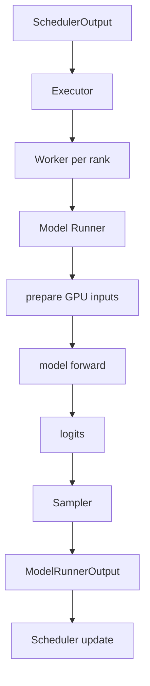

> **读图方法：** 阅读“本章定位”这张流程图时，先把方框看成对象或状态，把箭头看成数据或控制的移动。第一遍从上向下建立顺序，第二遍再核对分支发生的条件。

这一段调用链看起来只是“跑模型”，实际上同时跨越五类边界：编排、进程、设备、并行和状态。
本章绑定源码 revision `5893426b88f7b3cd21101d194eb1c6f0a6f0e27b`，继续使用以下标签：

- **源码事实**：当前 revision 可直接定位的行为。
- **设计意图**：源码注释或同 revision 设计文档表达的目标。
- **设计含义**：由多处源码共同推出的解释。
- **教学模型**：随书纯 Python 程序，只验证契约，不模拟 CUDA 性能。

## 阅读目标

读完本章后，你应该能够：

1. 区分 Executor、Worker、Model Runner、Model、Attention backend 与 Sampler。
2. 追踪 `SchedulerOutput` 怎样到达所有 rank，并解释为什么通常只取一个 rank 的回复。
3. 说明 `rank`、`local_rank`、`rpc_rank` 与 driver worker 的差异。
4. 解释 Worker 启动时设备、分布式通信、随机种子、显存快照和 Runner 的先后顺序。
5. 从 Hugging Face `architectures` 追到 vLLM model class、loader 和 `load_weights()`。
6. 写出可用于 KV Cache 的显存预算公式，并指出它的假设。
7. 将 request-local token 切片还原成 flat `input_ids`、`positions` 与 ragged boundaries。
8. 追踪模型 forward、PP intermediate tensors、logits 与 sampling。
9. 区分 V1 Engine、Model Runner V1（MRV1）和 Model Runner V2（MRV2）。
10. 理解 `execute_model()` 与 `sample_tokens()` 为什么通过临时状态分成两步。

## 如何阅读本章

执行栈可以类比为一条生产线：Executor 决定调用哪些工作站，Worker 管理一个设备环境，
Model Runner 把调度结果装配成 tensor，模型执行数值计算，Sampler 选出 token。名字都
带“执行”，但它们拥有的资源和状态完全不同。

阅读本章时先给每个对象贴三个标签：运行在哪个进程、拥有哪个设备、输入输出是什么。
只要这三个问题能回答，就不会把 Executor 的分布式编排、Worker 的设备生命周期和
Runner 的 batch 构造混在一起。

第一次阅读追单 GPU、普通文本生成的完整 step；第二次加入 TP/PP 广播和返回值规则；
第三次再看 MRV1/MRV2、warmup、CUDA Graph 与异步输出。模型内部算子已经在第 01 和
第 06 章建立基础，本章重点是它们怎样被系统正确地调用。

**先分清数据搬运。** H2D 是 CPU 主机内存到 GPU 设备内存，D2H 是反向拷贝；
rank 是通信参与进程的编号，shard 是它负责的数据分片。persistent row 是给请求长期
保留的状态行，本轮 batch row 则会随请求排序变化，二者用索引表连接。

**第一遍走法：** 读 7.1–7.3、7.6、7.11–7.14、7.16–7.18 和 7.23，先跑单卡教学链；
通信与 Runner 自动选择第二遍细读。**停下来追：** 请求 B 存在状态行 3，本轮排第 0，
模型该读哪行？通过 `idx_mapping[0]=3` 收集状态，不能直接把状态行 0 当作 B。

## 7.1 五层执行栈：先把名字放对位置

> **本节先看：** 本节要回答：**五层执行栈：先把名字放对位置**。下面的小节会逐层拆开概念、运行过程和源码落点；第一次阅读先抓对象之间的关系，第二次再记类名、字段和分支。

### 7.1.1 Executor：编排 Worker

`Executor` 决定 Worker 在哪里、如何启动、如何接收控制消息、如何汇总返回值。它不实现
Transformer layer，也不直接做 QK matmul。

[源码] `vllm/v1/executor/abstract.py` - `Executor`

### 7.1.2 Worker：拥有一个设备执行环境

`WorkerBase` 是硬件执行接口。GPU `Worker` 负责设备映射、分布式初始化、构造 Runner、加载模型、
profile 显存、初始化 KV Cache、warmup/capture，以及把每个 step 交给 Runner。

[源码] `vllm/v1/worker/worker_base.py` - `WorkerBase`

[源码] `vllm/v1/worker/gpu_worker.py` - `Worker`

### 7.1.3 Model Runner：把调度语义翻译为模型输入

Runner 持有模型和执行期状态，把“请求 A 本轮算 3 个 token”翻译为：

```text
input_ids, positions, query_start_loc, seq_lens,
block_tables, slot_mappings, attention metadata, sampling state ...
```

### 7.1.4 Model 与 Sampler

模型类组织 embedding、Transformer layers、norm、LM head 和 logits；Sampler 执行约束、惩罚、
temperature、top-k/top-p、随机采样与 logprobs。Scheduler 决定**算哪些位置**，Sampler 决定
**这些位置生成什么 token**。

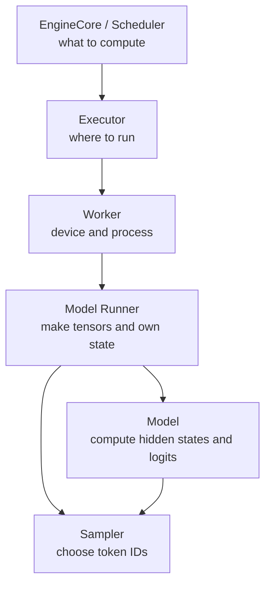

> **读图方法：** 这张图用于压缩“Model 与 Sampler”的整体关系。先从上向下找到起点、关键转换和终点，再问每条跨层箭头是否意味着函数调用、消息传递、内存访问或状态更新。

**设计含义：**所有 rank 没收到 step 是 Executor/RPC 问题；device 选错是 Worker 问题；position 或
block table 错是 Runner 问题；层数值错是 Model/backend 问题；token 分布错才进入 Sampler。

### 执行栈所有权与职责矩阵

先区分 Python 对象所在的进程与数值运算发生的设备。以下采用 GPU 文本生成路径，
Model 和 Sampler 对象由 Worker 侧 CPU 代码持有，具体 tensor 运算才提交给 GPU。

| 组件 | 对象所在进程 | 主要持有状态 | 输入与输出 | 职责 |
|---|---|---|---|---|
| Executor | EngineCore 所在进程 | Worker 句柄、通信与结果收集状态 | SchedulerOutput → Future、None 或模型输出，视方法/模式而定 | 派发执行与采样 |
| Worker | 由 executor 决定；uni 可与 core 同进程 | 设备环境、Runner | 执行指令 → 同步/异步输出或阶段结果 | 设备初始化、加载与执行入口 |
| Model Runner | Worker 所在进程 | 模型、采样器、请求状态、输入缓冲区 | SchedulerOutput → 中间张量、待采样状态或 ModelRunnerOutput | 准备输入、调用模型并组织采样，不只生成 input_ids |
| Model | Worker 所在进程；tensor 计算在设备上 | 权重和层对象 | 模型输入 → hidden states；LM head 另算 logits | 模型数值计算 |
| Sampler | Worker 所在进程；主要采样运算在设备上 | 采样参数和请求状态 | 未归一化 logits → token IDs、可选 logprobs 等 | 约束、过滤与选择 token |

Logits 是分数，不是概率分布；单卡也不必然对应 uni executor，进程归属仍要看配置。

[源码] `vllm/v1/worker/gpu_worker.py` - `Worker.init_device`

[源码] `vllm/v1/worker/gpu/model_runner.py` - `GPUModelRunner.execute_model`、`sample_tokens`

[源码] `vllm/v1/worker/gpu/sample/sampler.py` - `Sampler.forward`

## 7.2 两个“V1”不是同一个版本维度

当前主线叫 **vLLM V1 Engine**，其内部同时存在两套 GPU Model Runner：

| 维度 | 名称 | 当前源码位置 |
|---|---|---|
| Engine 代际 | V1 Engine | `vllm/v1/engine/`、`vllm/v1/core/` |
| Runner 实现 | MRV1 | `vllm/v1/worker/gpu_model_runner.py` |
| Runner 实现 | MRV2 | `vllm/v1/worker/gpu/model_runner.py` |

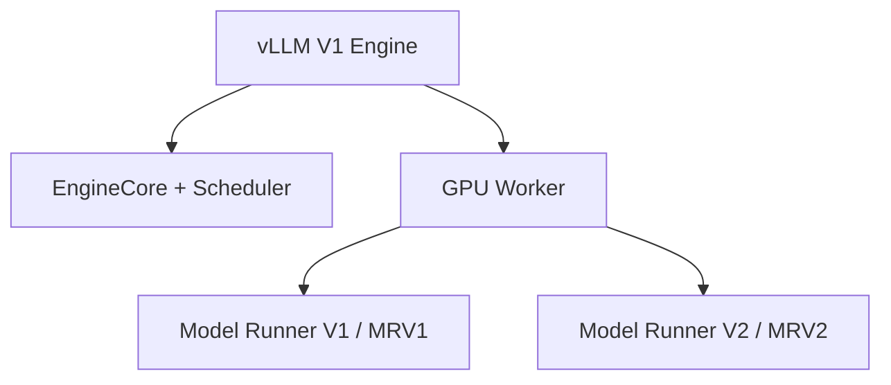

> **读图方法：** 这是“两个V1不是同一个版本维度”的流程图。先从上向下只追一条主路径，确认输入经过哪些关键阶段到达输出；第二遍再看虚线、回边和旁路，它们通常表示反馈、复用或可选分支。

所以“用了 V1 Engine，因此一定使用 `gpu_model_runner.py`”是错误的。GPU Worker 根据
`VllmConfig.use_v2_model_runner` 选择 MRV1 或 MRV2。两者实现同一上层协议，但内部状态布局、
输入准备、采样和 CUDA Graph 管理不同。

## 7.3 Executor 如何选择

`Executor.get_class()` 读取 `parallel_config.distributed_executor_backend`：

| backend | 实现 | 典型边界 |
|---|---|---|
| `uni` | `UniProcExecutor` | Worker 与 Executor 同一进程 |
| `mp` | `MultiprocExecutor` | multiprocessing Worker |
| `ray` | `RayDistributedExecutor` 或 `RayExecutorV2` | Ray actor 编排 |
| `external_launcher` | `ExecutorWithExternalLauncher` | `torchrun` 等外部启动器 |
| Python 类/限定名 | 自定义 `Executor` 子类 | out-of-tree 扩展 |

[源码] `vllm/v1/executor/abstract.py` - `Executor.get_class`

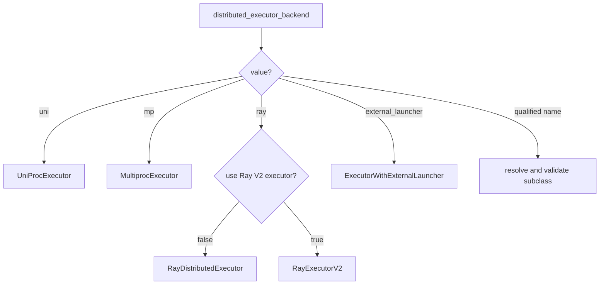

> **读图方法：** 阅读“Executor 如何选择”这张流程图时，先把方框看成对象或状态，把箭头看成数据或控制的移动。第一遍从上向下建立顺序，第二遍再核对分支发生的条件。

共同初始化先保存配置分区，再调用具体 `_init_executor()`。EngineCore 之后仍使用统一接口执行显存
探测、KV 初始化、warmup、`execute_model()` 和 `sample_tokens()`。

### 7.3.1 UniProc 并不等于没有 Worker

`UniProcExecutor` 仍创建 wrapper 和真实 Worker，只是调用不经过跨进程消息队列：

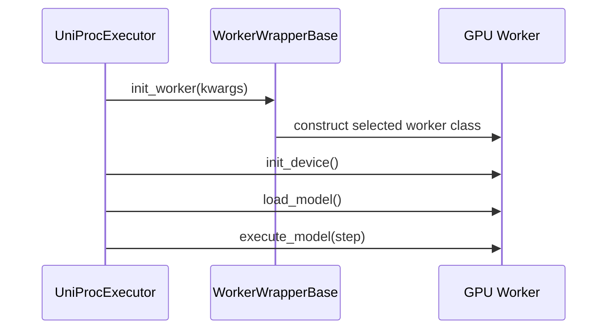

> **读图方法：** 这是“UniProc 并不等于没有 Worker”的时序图。先从左到右确认参与者分别负责什么，再从上到下追踪消息；第一遍只看正常路径，第二遍再看返回、异步消息和失败分支。

[源码] `vllm/v1/executor/uniproc_executor.py` - `UniProcExecutor._init_executor`

若 Worker 返回 `AsyncModelRunnerOutput`，同步路径调用 `get_output()`；non-blocking 路径用
`AsyncOutputFuture` 延迟完成。

### 7.3.2 External launcher 的特殊假设

`ExecutorWithExternalLauncher` 每个 Executor 只创建一个 Worker，rank 与 `local_rank` 来自
`env://`。多个外部启动的 Engine 依赖确定性调度处理相同 prompts，而不是由一个 Executor 拥有
全部 Worker。配置解析会把 `VLLM_ENABLE_V1_MULTIPROCESSING` 设为 `0`，Executor 初始化时也会
再次断言 multiprocessing 已关闭；这不是可选调优，而是该执行方式保持各 Engine 调度一致的
运行条件。源码测试通过 `torchrun` 检查各 rank 的 KV 配置与生成结果一致。

[测试] `tests/distributed/test_torchrun_example.py` - external launcher offline inference

这解释了 `rpc_rank` 与 global `rank` 为何不能永远视为同一值。还要区分 Runner 能力边界：
external launcher 的纯 TP 路径可以使用 MRV2；只有与 `PP>1` 组合时，当前自动选择才把它列为
MRV2 unsupported feature 并回退到 MRV1。

## 7.4 MultiprocExecutor：广播命令，只收需要的回复

`Executor.collective_rpc()` 的接口注释建议它用于控制消息，大量数据应建立专门数据面。
Multiprocessing 实现把方法名、参数和 output rank 放入 broadcast message queue。

[源码] `vllm/v1/executor/multiproc_executor.py` - `MultiprocExecutor.collective_rpc`

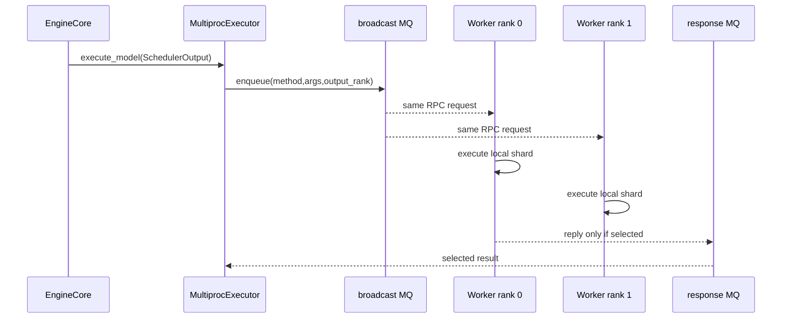

> **读图方法：** 这是“MultiprocExecutor：广播命令，只收需要的回复”的时序图。先从左到右确认参与者分别负责什么，再从上到下追踪消息；第一遍只看正常路径，第二遍再看返回、异步消息和失败分支。

### 7.4.1 所有 rank 都执行，通常只返回一个 rank

TP/PP 中每个 rank 都必须参与计算和 collectives，但 Scheduler 不需要 N 份等价 token 输出。
`execute_model()` 与 `sample_tokens()` 因而广播到所有 Worker，同时设置
`unique_reply_rank=self.output_rank`。

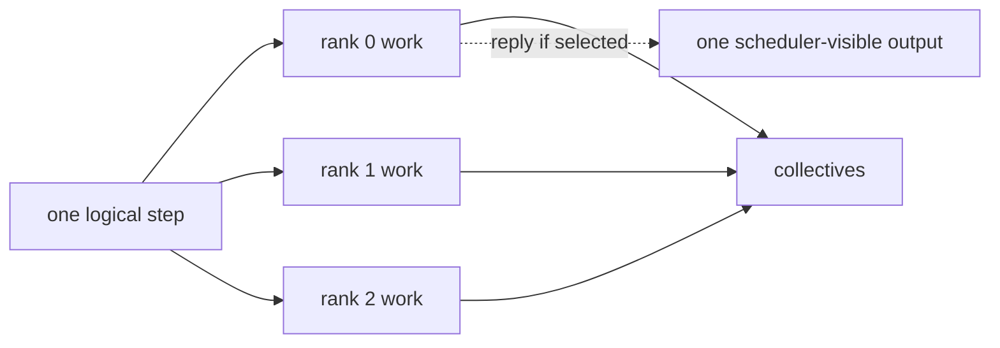

> **读图方法：** 阅读“所有 rank 都执行，通常只返回一个 rank”这张流程图时，先把方框看成对象或状态，把箭头看成数据或控制的移动。第一遍从左向右建立顺序，第二遍再核对分支发生的条件。

“只回复”不等于“只有一个 rank 运行”。让非输出 rank 跳过 forward 会令 collective 永久等待。

这张图限定为没有 KV/encoder connector 输出聚合器的普通路径。有聚合器时，
`collective_rpc` 会把发给 Worker 的 `output_rank` 置为 `None`，收集所有 rank 回复，
再合并 connector 元数据并选出面向 Scheduler 的输出。“最后只得到一份输出”不等于
“通信时永远只收一个 rank”。

[源码] `vllm/v1/executor/multiproc_executor.py` - `MultiprocExecutor.collective_rpc`

### 7.4.2 WorkerProc 的 busy loop 与错误路径

每个 `WorkerProc` 初始化 Worker、设备和模型，报告 `READY`，再持续 dequeue RPC、调用方法并按条件
enqueue output。异常会转成 failure status；Executor 读取后抛出，Worker monitor 还会在进程死亡时
关闭 Executor 并触发 failure callback。

[源码] `vllm/v1/executor/multiproc_executor.py` - `WorkerProc.worker_main`

[源码] `vllm/v1/executor/multiproc_executor.py` - `WorkerProc._execute_worker_rpc`

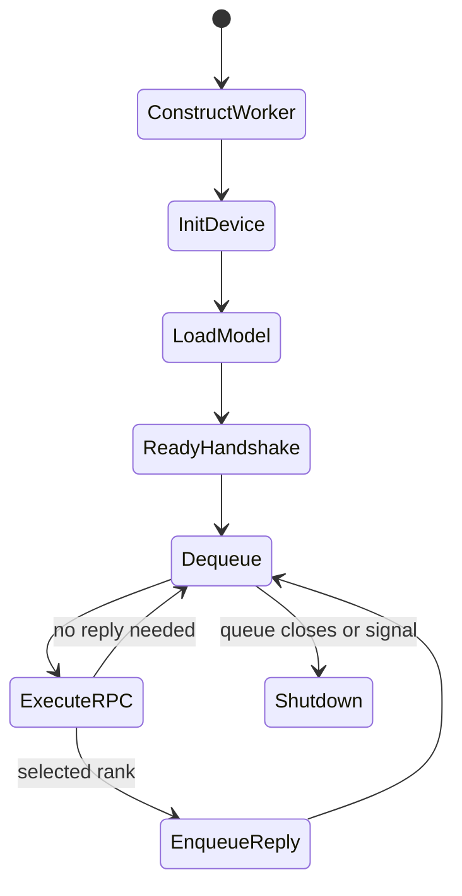

> **读图方法：** 这是“WorkerProc 的 busy loop 与错误路径”的状态图。先找初始状态，再沿箭头观察触发条件和状态变化；重点不是背状态名，而是弄清谁触发转换、转换后哪些资源需要更新。

[测试] `tests/distributed/test_multiproc_executor.py` - 初始化、RPC、rank reply 与 PP 覆盖

## 7.5 WorkerWrapper 与三种 rank

`WorkerWrapperBase` 先保存 `rpc_rank`/`global_rank`，等每进程环境和插件就绪后才在
`init_worker()` 中解析 `worker_cls` 并构造真实 Worker。

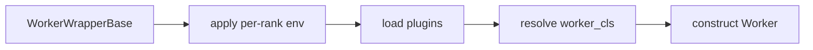

> **读图方法：** 这是“WorkerWrapper 与三种 rank”的流程图。先从左向右只追一条主路径，确认输入经过哪些关键阶段到达输出；第二遍再看虚线、回边和旁路，它们通常表示反馈、复用或可选分支。

[源码] `vllm/v1/worker/worker_base.py` - `WorkerWrapperBase.init_worker`

| 名称 | 含义 |
|---|---|
| `rpc_rank` | Worker 在当前 Executor RPC 列表中的索引 |
| global `rank` | 分布式 world 中的全局 rank |
| `local_rank` | 当前节点上选择设备的局部索引 |

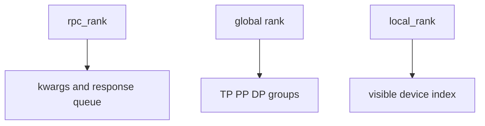

> **读图方法：** 阅读“WorkerWrapper 与三种 rank”这张流程图时，先把方框看成对象或状态，把箭头看成数据或控制的移动。第一遍从上向下建立顺序，第二遍再核对分支发生的条件。

简单布局中三者可能相同，external launcher、多 Executor 或复杂 DP 下不能依赖这种巧合。

## 7.6 GPU Worker 启动顺序

> **本节先看：** 这一小节先用图建立“GPU Worker 启动顺序”的整体路径。先找输入、关键状态和输出，再阅读图后的源码解释，不必一开始记住全部节点。

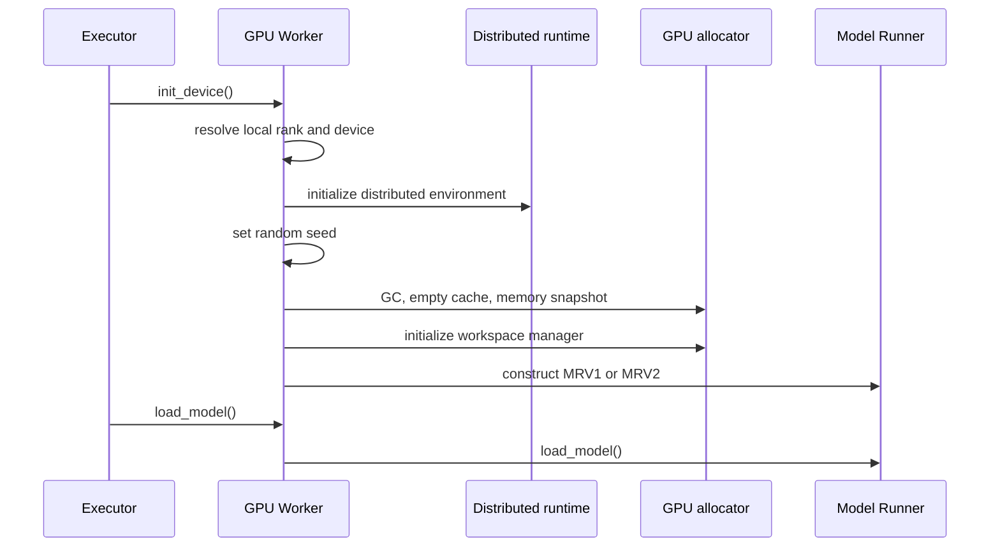

> **读图方法：** 这是“GPU Worker 启动顺序”的时序图。先从左到右确认参与者分别负责什么，再从上到下追踪消息；第一遍只看正常路径，第二遍再看返回、异步消息和失败分支。

[源码] `vllm/v1/worker/gpu_worker.py` - `Worker.init_device`

### 7.6.1 NCCL 为什么早于显存快照

源码明确在 `MemorySnapshot` 前初始化 distributed environment，使 NCCL 等通信缓冲区已占用显存。
否则会高估 KV Cache 空间：

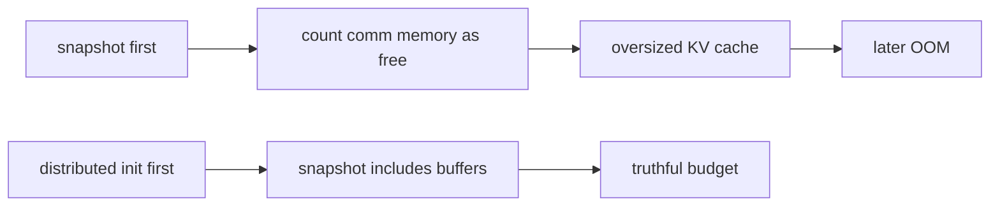

> **读图方法：** 这是“NCCL 为什么早于显存快照”的流程图。先从左向右只追一条主路径，确认输入经过哪些关键阶段到达输出；第二遍再看虚线、回边和旁路，它们通常表示反馈、复用或可选分支。

### 7.6.2 Runner 在什么时候选择

Worker 缓存 `vllm_config.use_v2_model_runner`。workspace 初始化后，true 导入
`gpu/model_runner.py`，false 导入 `gpu_model_runner.py`。Runner 构造只建立配置和缓冲区结构，随后
`Worker.load_model()` 才在权重 allocator context 中调用 Runner 的 `load_model()`。

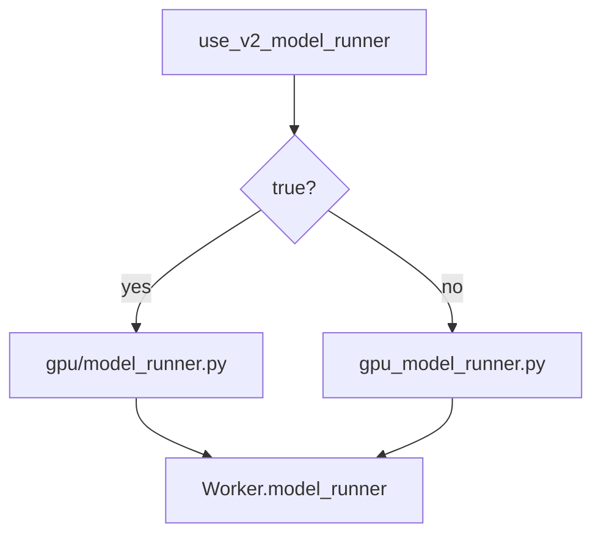

> **读图方法：** 阅读“Runner 在什么时候选择”这张流程图时，先把方框看成对象或状态，把箭头看成数据或控制的移动。第一遍从上向下建立顺序，第二遍再核对分支发生的条件。

## 7.7 从 architecture 到模型实例

以 `architectures=["LlamaForCausalLM"]` 为例，路径不是简单调用 Transformers AutoModel：

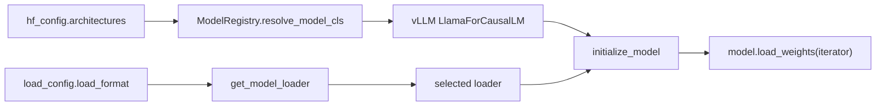

> **读图方法：** 这张图用于压缩“从 architecture 到模型实例”的整体关系。先从左向右找到起点、关键转换和终点，再问每条跨层箭头是否意味着函数调用、消息传递、内存访问或状态更新。

Registry 解决“用哪个 Python 类”；load format 解决“权重从哪里、以什么格式读取”。二者正交。

[源码] `vllm/model_executor/model_loader/utils.py` - `get_model_architecture`

[源码] `vllm/model_executor/models/registry.py` - `_ModelRegistry.resolve_model_cls`

[源码] `vllm/model_executor/model_loader/__init__.py` - `get_model_loader`

`initialize_model()` 构造模块；默认 loader 生成 `(name, tensor)` iterator，调用模型自身
`load_weights()`，再执行量化处理、weight tying 和 attention post-load 初始化。

[源码] `vllm/model_executor/model_loader/utils.py` - `initialize_model`

[源码] `vllm/model_executor/model_loader/default_loader.py` - `DefaultModelLoader.load_weights`

[源码] `vllm/model_executor/models/llama.py` - `LlamaForCausalLM.load_weights`

## 7.8 TP 权重为何不会先完整复制再切

参数对象和 layer weight loader 知道 TP rank、分片维度和 packed mapping。checkpoint iterator 交付
权重时，本地参数接收属于当前 rank 的 shard。

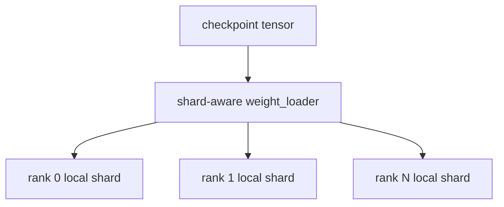

> **读图方法：** 这是“TP 权重为何不会先完整复制再切”的流程图。先从上向下只追一条主路径，确认输入经过哪些关键阶段到达输出；第二遍再看虚线、回边和旁路，它们通常表示反馈、复用或可选分支。

这也允许 packed QKV、gate/up projection 与量化格式使用专门映射。不同 load format、量化或 CPU
offload 会改变 I/O 和搬运方式；可靠结论是**最终本地参数由分片感知 loader 填充**，不能无条件
断言所有格式只从磁盘读取精确 shard 字节。

## 7.9 显存 Profiling：KV Cache 只能拿剩下的

用户未显式指定 `kv_cache_memory_bytes` 时，Worker profile 非 KV 峰值并计算：

$$
M_{\mathrm{KV}}=M_{\mathrm{requested}}-M_{\mathrm{nonKV}}-M_{\mathrm{graph,applied}}
$$

- 所有 `M` 的单位都是 byte（换成 GiB 时所有项一起换）；
- `M_requested = total_memory * gpu_memory_utilization`，不是 free memory 乘利用率；
  启动还会检查 free memory 是否足以满足 requested；
- `M_nonKV` 包含权重及 profile 期间非 KV 消耗；
- `M_graph,applied` 是启用相应估算时预留的 CUDA Graph memory。

[源码] `vllm/v1/worker/gpu_worker.py` - `Worker.determine_available_memory`

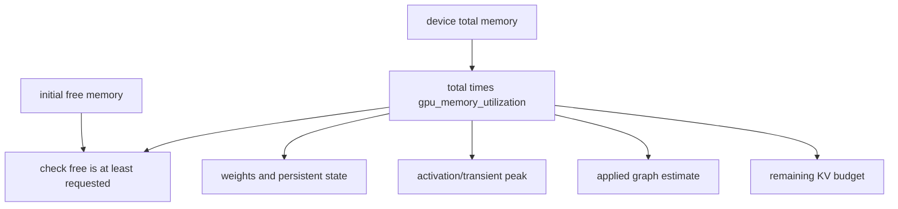

> **读图方法：** 阅读“显存 Profiling：KV Cache 只能拿剩下的”这张流程图时，先把方框看成对象或状态，把箭头看成数据或控制的移动。第一遍从上向下建立顺序，第二遍再核对分支发生的条件。

`profile_run()` 用于容量规划和触发编译，不是线上性能 benchmark。若显式给出 KV bytes，源码仍执行
profile run 以编译最大 batch，但跳过自动 memory profiling，且该容量不再服从
`gpu_memory_utilization` 的自动预算。

[测试] `tests/v1/worker/test_gpu_worker.py` - profile 与 graph 显存会计

[测试] `tests/v1/worker/test_worker_memory_snapshot.py` - Worker 启动快照

## 7.10 KV Cache 初始化与 warmup

> **本节先看：** 这一小节先用图建立“KV Cache 初始化与 warmup”的整体路径。先找输入、关键状态和输出，再阅读图后的源码解释，不必一开始记住全部节点。

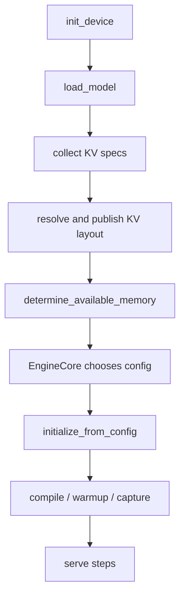

> **读图方法：** 这张图用于压缩“KV Cache 初始化与 warmup”的整体关系。先从上向下找到起点、关键转换和终点，再问每条跨层箭头是否意味着函数调用、消息传递、内存访问或状态更新。

先加载模型并收集 KV specs，才能确定 layout；先 profile，才能确定最终池容量。某些
profiling 路径已经会创建最小临时 KV 并估算 graph，不能把图理解成 profile 时绝无
KV 或 capture。最终缓存初始化后，服务前的 warmup/capture 再使用正式布局。`initialize_from_config()` 先记录 block 数/layout，再初始化 KV
connector，然后调用 Runner `initialize_kv_cache()`。warmup 覆盖 compile sizes、kernel warmup、MRV2
额外 warmup 和非 eager 下的 graph capture。

[源码] `vllm/v1/engine/core.py` - `EngineCore._initialize_kv_caches`

[源码] `vllm/v1/worker/gpu_worker.py` - `Worker.initialize_from_config`

[源码] `vllm/v1/worker/gpu_worker.py` - `Worker.compile_or_warm_up_model`

## 7.11 SchedulerOutput 到长期请求状态

`SchedulerOutput` 是本 step 增量指令，不是完整请求数据库。Runner 将完成/抢占、新请求、增量 blocks
和每请求 scheduled-token count 应用到自己维护的状态。

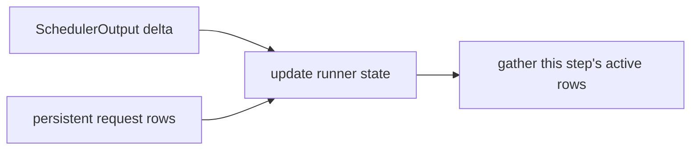

> **读图方法：** 这是“SchedulerOutput 到长期请求状态”的流程图。先从左向右只追一条主路径，确认输入经过哪些关键阶段到达输出；第二遍再看虚线、回边和旁路，它们通常表示反馈、复用或可选分支。

| 状态 | 生命周期 | 示例 |
|---|---|---|
| persistent request state | 请求 active 期间 | token IDs、computed count、block table、sampling params |
| per-step input batch | 当前 step | request order、flat inputs、query boundaries |
| execute-model state | execute 到 sample | hidden/logits、metadata、connector output |
| weights/KV tensors | Worker 或 cache 生命周期 | parameters、KV cache buffers |

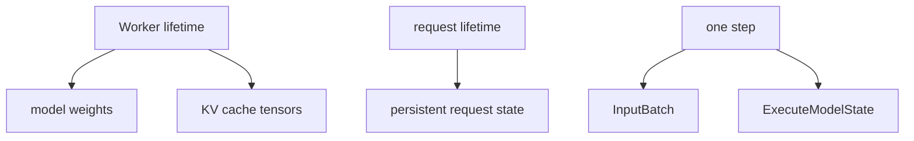

> **读图方法：** 阅读“SchedulerOutput 到长期请求状态”这张流程图时，先把方框看成对象或状态，把箭头看成数据或控制的移动。第一遍从上向下建立顺序，第二遍再核对分支发生的条件。

## 7.12 MRV1 与 MRV2 的 persistent batch

MRV1 为减少 CPU 开销采用 persistent batch，但持久 state tensor 与执行输入布局耦合较重；请求加入、
结束、重排和 async scheduling 需要复杂 bookkeeping。

[源码] `vllm/v1/worker/gpu_model_runner.py` - `GPUModelRunner`

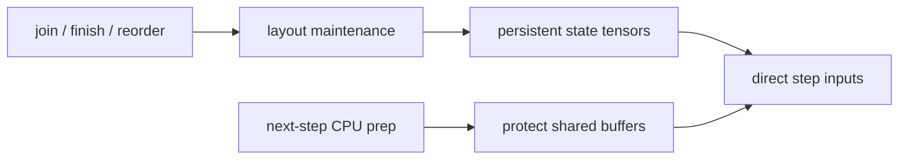

> **读图方法：** 这张图用于压缩“MRV1 与 MRV2 的 persistent batch”的整体关系。先从左向右找到起点、关键转换和终点，再问每条跨层箭头是否意味着函数调用、消息传递、内存访问或状态更新。

MRV2 给每个 active request 一个固定 row，直到完成或抢占；每 step 按执行顺序 gather。抢占按完成处理，
恢复时重新 add。

[源码] `vllm/v1/worker/gpu/model_runner.py` - `GPUModelRunner`

[设计] `docs/design/model_runner_v2.md` - “Persistent Batch”

```mermaid
flowchart TB
    subgraph Persistent["permanent rows"]
        R0["row 0: C"]
        R1["row 1: free"]
        R2["row 2: A"]
        R3["row 3: B"]
    end
    ORDER["step order: B, A"] --> IDX["idx_mapping: 3, 2"]
    IDX --> G["GPU gather"]
    R3 --> G
    R2 --> G
    G --> INPUT["contiguous step inputs"]
```

> **读图方法：** 这是“MRV1 与 MRV2 的 persistent batch”的流程图。先从上向下只追一条主路径，确认输入经过哪些关键阶段到达输出；第二遍再看虚线、回边和旁路，它们通常表示反馈、复用或可选分支。

### 7.12.1 StagedWriteTensor 与 async-first

MRV2 对 block table 等大状态保留 GPU base，CPU 只记录 ragged diffs，打包后 non-blocking H2D，再由
一个 kernel 应用。对于必须复制的 CPU 状态，则使用本轮独立 pinned copy，避免 CPU 修改持久 state
时与 GPU 异步读取同一 buffer 竞争。

```mermaid
flowchart LR
    BASE["GPU base"] --> APPLY["apply-write kernel"]
    DIFF["CPU diffs"] --> PACK["packed buffers"]
    PACK --> COPY["non-blocking H2D"]
    COPY --> APPLY
    APPLY --> NEW["updated GPU state"]
```

> **读图方法：** 阅读“StagedWriteTensor 与 async-first”这张流程图时，先把方框看成对象或状态，把箭头看成数据或控制的移动。第一遍从左向右建立顺序，第二遍再核对分支发生的条件。

**边界：**设计文档明确保留 feature-complete 与开放设计警告。运行事实仍需看当前配置与源码选择。

## 7.13 输入准备：request slices 变成 flat batch

假设本轮：A 的 positions 4,5,6 对应 token 21,22,23；B 的 position 9 对应 token 31。Runner 形成：

```text
input_ids       = [21,22,23,31]
positions       = [4,5,6,9]
query_start_loc = [0,3,4]
```

```mermaid
flowchart TB
    A["A: 3 tokens"] --> FLAT["flat token dimension"]
    B["B: 1 token"] --> FLAT
    FLAT --> IDS["input_ids: 21 22 23 31"]
    FLAT --> POS["positions: 4 5 6 9"]
    FLAT --> QSL["query_start_loc: 0 3 4"]
```

> **读图方法：** 这张图用于压缩“输入准备：request slices 变成 flat batch”的整体关系。先从上向下找到起点、关键转换和终点，再问每条跨层箭头是否意味着函数调用、消息传递、内存访问或状态更新。

`query_start_loc[i]:query_start_loc[i+1]` 是请求 i 的 query 区间。block tables、slot mappings、seq
lengths 与 backend metadata 必须使用同一请求顺序。Flat ragged representation 避免大面积 padding，
也允许 prefill/decode 混合。

MRV2 主干顺序是 update requests、处理 zero-work、gather state、决定 graph/DP padding、准备 inputs、
gather block tables/slot mappings、构建 attention metadata、forward。

```mermaid
flowchart TD
    U["update requests"] --> Z{"zero tokens?"}
    Z -->|yes| EMPTY["no-forward / connector path"]
    Z -->|no| G["gather request state"]
    G --> D["graph and DP dispatch"]
    D --> P["input IDs and positions"]
    P --> B["block tables and slots"]
    B --> A["attention metadata"]
    A --> F["model forward"]
```

> **读图方法：** 这是“输入准备：request slices 变成 flat batch”的流程图。先从上向下只追一条主路径，确认输入经过哪些关键阶段到达输出；第二遍再看虚线、回边和旁路，它们通常表示反馈、复用或可选分支。

[源码] `vllm/v1/worker/gpu/model_runner.py` - `GPUModelRunner.execute_model`

## 7.14 Model forward 与 forward context

模型调用表面常见为 `model(input_ids, positions, intermediate_tensors=...)`，但 attention metadata 等
step context 通过 `set_forward_context(...)` 建立，Attention layer 再从 context 获取。

```mermaid
sequenceDiagram
    participant MR as Model Runner
    participant FC as forward context
    participant M as Model
    participant A as Attention
    MR->>FC: set metadata and batch descriptor
    MR->>M: forward(inputs)
    M->>A: layer forward(q,k,v)
    A->>FC: read step metadata
    A->>A: backend KV update and attention
```

> **读图方法：** 这是“Model forward 与 forward context”的时序图。先从左到右确认参与者分别负责什么，再从上到下追踪消息；第一遍只看正常路径，第二遍再看返回、异步消息和失败分支。

所以阅读模型函数签名不足以看全输入，必须同步追踪 forward context。

## 7.15 Pipeline Parallelism：中间 rank 不采样

非首 stage 在 forward 前异步接收上一 stage 的 `IntermediateTensors`；非末 stage forward 后发送到下一
stage；只有末 stage 得到最终 hidden states、logits 和采样职责。

```mermaid
sequenceDiagram
    participant P0 as PP rank 0
    participant P1 as PP rank 1
    participant P2 as PP last rank
    P0->>P0: early layers
    P0-->>P1: IntermediateTensors
    P1->>P1: middle layers
    P1-->>P2: IntermediateTensors
    P2->>P2: final layers and logits
    P2->>P2: sample tokens
```

> **读图方法：** 这是“Pipeline Parallelism：中间 rank 不采样”的时序图。先从左到右确认参与者分别负责什么，再从上到下追踪消息；第一遍只看正常路径，第二遍再看返回、异步消息和失败分支。

Worker 在新 forward 前等待上一 step 尚未完成的 PP send handle，避免覆写发送方仍在读取的 buffer。
非首 rank 用 `irecv_tensor_dict()`，Runner 返回 intermediates 后再 non-blocking send。

[源码] `vllm/v1/worker/gpu_worker.py` - `Worker.execute_model`

[源码] `vllm/sequence.py` - `IntermediateTensors`

## 7.16 为什么 execute 与 sample 分成两个方法

`WorkerBase` 规定：若 `execute_model()` 返回 `None`，应立即调用 `sample_tokens()`。MRV1/MRV2 都用
`execute_model_state` 保存两次调用间的临时结果。

```mermaid
stateDiagram-v2
    [*] --> Ready
    Ready --> ForwardDone: execute_model
    ForwardDone --> Ready: sample_tokens consumes state
    ForwardDone --> Error: execute_model called again
```

> **读图方法：** 这是“为什么 execute 与 sample 分成两个方法”的状态图。先找初始状态，再沿箭头观察触发条件和状态变化；重点不是背状态名，而是弄清谁触发转换、转换后哪些资源需要更新。

[源码] `vllm/v1/worker/worker_base.py` - `WorkerBase.execute_model`

直接背景包括 structured-output grammar 可在 forward 与 sample 之间交付，以及异步流水重叠。源码注释
说明未来该设计可能变化，所以它是当前 revision 契约，不是永恒 API。

MRV2 保存 input batch、attention metadata、slot mappings、hidden states、DP sync、finished IDs、connector
output、routed experts 和 graph stats；MRV1 保存 scheduler output、logits、spec metadata、hidden/aux
states、connector output 与 slot mappings。`sample_tokens()` 取出后立即清空临时 state。

```mermaid
flowchart LR
    EXEC["execute_model"] --> TEMP["ExecuteModelState"]
    TEMP --> GRAM["GrammarOutput may arrive"]
    GRAM --> SAMPLE["sample_tokens"]
    SAMPLE --> CLEAR["clear state"]
    CLEAR --> OUT["ModelRunnerOutput"]
```

> **读图方法：** 阅读“为什么 execute 与 sample 分成两个方法”这张流程图时，先把方框看成对象或状态，把箭头看成数据或控制的移动。第一遍从左向右建立顺序，第二遍再核对分支发生的条件。

## 7.17 Hidden states、logits 与首维

仅 PP 最后 rank 将最终 hidden states 送入 logits processor/LM head。普通 decode 常为每请求一个 logits
position；spec decode 可为一个请求产生多个 positions。

```mermaid
flowchart LR
    H["hidden states for flat tokens"] --> SEL["select logits positions"]
    SEL --> HEAD["LM head / compute_logits"]
    HEAD --> LOG["positions x vocab"]
    LOG --> SAMP["Sampler"]
```

> **读图方法：** 这张图用于压缩“Hidden states、logits 与首维”的整体关系。先从左向右找到起点、关键转换和终点，再问每条跨层箭头是否意味着函数调用、消息传递、内存访问或状态更新。

request count、scheduled token count、logits position count 与 generated token count 是四个不同维度，
不能都笼统叫 `batch_size`。

## 7.18 Sampling 的准确处理顺序

MRV1 主干是：保存配置要求的 raw logits/logprobs、转 float32、allowed tokens/bad words/会影响 argmax
的 processors、penalties、greedy candidate、temperature、argmax-invariant processors、top-k/top-p、
随机 candidate，最后按请求选择 greedy/random 并提取 logprobs。

[源码] `vllm/v1/sample/sampler.py` - `Sampler.forward`

[源码] `vllm/v1/sample/sampler.py` - `Sampler.sample`

```mermaid
flowchart TD
    L["raw logits"] --> MASK["constraints and bias"]
    MASK --> PEN["penalties"]
    PEN --> GREEDY["greedy candidate"]
    PEN --> TEMP["temperature"]
    TEMP --> MINP["min-p / invariant processors"]
    MINP --> KP["top-k / top-p"]
    KP --> RAND["random candidate"]
    GREEDY --> MIX["per-request choose"]
    RAND --> MIX
```

> **读图方法：** 这是“Sampling 的准确处理顺序”的流程图。先从上向下只追一条主路径，确认输入经过哪些关键阶段到达输出；第二遍再看虚线、回边和旁路，它们通常表示反馈、复用或可选分支。

MRV2 的 modular sampler 顺序是 logit bias、penalties、bad words、thinking budget、temperature、min-p、
top-k/top-p，随后选择 FlashInfer 或 Triton Gumbel sampling。

[源码] `vllm/v1/worker/gpu/sample/sampler.py` - `Sampler.apply_sampling_params`

[源码] `vllm/v1/worker/gpu/sample/sampler.py` - `Sampler.sample`

```mermaid
flowchart TD
    L2["logits"] --> BI["logit bias"]
    BI --> PE["penalties"]
    PE --> BW["bad words"]
    BW --> TB["thinking budget"]
    TB --> TE["temperature"]
    TE --> MP["min-p"]
    MP --> TK["top-k / top-p"]
    TK --> GS["FlashInfer or Gumbel"]
```

> **读图方法：** 阅读“Sampling 的准确处理顺序”这张流程图时，先把方框看成对象或状态，把箭头看成数据或控制的移动。第一遍从上向下建立顺序，第二遍再核对分支发生的条件。

随机路径常把 logits 除以温度：

$$
p_i=\frac{\exp(z_i/T)}{\sum_j\exp(z_j/T)}
$$

本式只适用于 `T>0`，`z`、`p` 的 shape 都是 `[vocab_size]`，概率无单位；`T=0`
走 greedy 语义，不做除零。MRV1 全 greedy 时提前返回，混合 batch 才按行合并结果。

Top-k 保留固定数量最高分 token；top-p 保留累计概率达到 p 的最小集合。即使 temperature 为零，
grammar、allowed tokens、bad words、bias 和 penalties 也可能先改变 argmax。

## 7.19 Grammar mask 的汇合点

MRV1 在 `sample_tokens()` 内采样前应用 grammar bitmask；MRV2 的 sample path 同样接收
`grammar_output`。这允许 grammar 计算与模型 forward 并行，并在选 token 前汇合。

```mermaid
sequenceDiagram
    participant GPU as model forward
    participant G as grammar worker
    participant S as sampler
    GPU->>GPU: produce hidden/logits
    G->>G: compute allowed-token mask
    GPU-->>S: ExecuteModelState
    G-->>S: GrammarOutput
    S->>S: mask then sample
```

> **读图方法：** 这是“Grammar mask 的汇合点”的时序图。先从左到右确认参与者分别负责什么，再从上到下追踪消息；第一遍只看正常路径，第二遍再看返回、异步消息和失败分支。

## 7.20 MRV2 sample_tokens 时间线

MRV2 先取出并清空 state。非末 PP rank 接收末 rank 广播并更新本地状态；末 rank 执行 sampling、prompt
logprobs、异步输出 copy、请求状态更新和可选 speculator proposal。

```mermaid
flowchart TD
    TAKE["take and clear state"] --> LAST{"last PP rank?"}
    LAST -->|no| RECV["receive sampled-token broadcast"]
    RECV --> LOCAL["update local state"]
    LOCAL --> CONN["connector-only output"]
    LAST -->|yes| SAMPLE["sample target tokens"]
    SAMPLE --> BC["broadcast tokens"]
    SAMPLE --> LP["prompt logprobs"]
    LP --> ASYNC["start async D2H"]
    ASYNC --> POST["postprocess request state"]
    POST --> DRAFT["optional draft proposal"]
```

> **读图方法：** 这是“MRV2 sample_tokens 时间线”的流程图。先从上向下只追一条主路径，确认输入经过哪些关键阶段到达输出；第二遍再看虚线、回边和旁路，它们通常表示反馈、复用或可选分支。

[源码] `vllm/v1/worker/gpu/model_runner.py` - `GPUModelRunner.sample_tokens`

`AsyncOutput` 在 state postprocess 前创建并记录 copy event，使 D2H 可与后续工作重叠。“返回 async
wrapper”通常表示 CPU 可消费结构尚在复制，不表示 model forward 尚未发生。

## 7.21 ModelRunnerOutput 与异步输出

`ModelRunnerOutput` 会序列化送回 Scheduler，因此源码建议避免放昂贵 `torch.Tensor`，优先 list 或
NumPy-backed structures。

[源码] `vllm/v1/outputs.py` - `ModelRunnerOutput`

| 字段 | 含义 |
|---|---|
| `req_ids` / `req_id_to_index` | 输出请求顺序及索引 |
| `sampled_token_ids` | 每请求本 step 生成 token，数量可变 |
| `logprobs` / `prompt_logprobs_dict` | 可选概率信息 |
| `kv_connector_output` / `ec_connector_output` | connector 状态 |
| `cudagraph_stats` | graph 执行统计 |
| `routed_experts` | 可选 MoE 路由数据 |

```mermaid
flowchart LR
    GPU["device sample tensors"] --> COPY["D2H / to lists"]
    COPY --> MRO["ModelRunnerOutput"]
    MRO --> IPC["Executor response"]
    IPC --> SCH["Scheduler.update_from_output"]
```

> **读图方法：** 阅读“ModelRunnerOutput 与异步输出”这张流程图时，先把方框看成对象或状态，把箭头看成数据或控制的移动。第一遍从左向右建立顺序，第二遍再核对分支发生的条件。

`sampled_token_ids` 是二维变长结构，因为 speculative/jump decoding 可让不同请求本轮生成不同数量。
zero-work、非末 PP rank 或 connector-only 路径可合法为空；异常由独立 failure 通道传播。

`AsyncModelRunnerOutput.get_output()` 阻塞到结果可用，可能包括 D2H，且只能调用一次。Multiproc async
路径将 wrapper 交给专门 output thread，使 Worker 主循环更早处理后续工作。

```mermaid
sequenceDiagram
    participant Main as Worker main thread
    participant CUDA as main stream
    participant Copy as copy stream
    participant Out as output thread
    Main->>CUDA: enqueue forward/sample
    CUDA-->>Copy: event dependency
    Copy->>Copy: non-blocking D2H
    Main-->>Out: AsyncModelRunnerOutput
    Out->>Out: get_output when needed
    Out-->>Executor: CPU-visible output
```

> **读图方法：** 这是“ModelRunnerOutput 与异步输出”的时序图。先从左到右确认参与者分别负责什么，再从上到下追踪消息；第一遍只看正常路径，第二遍再看返回、异步消息和失败分支。

[源码] `vllm/v1/outputs.py` - `AsyncModelRunnerOutput`

[源码] `vllm/v1/executor/multiproc_executor.py` - `WorkerProc.async_output_busy_loop`

## 7.22 MRV1/MRV2 当前选择规则

> **本节先看：** 这一小节先用图建立“MRV1/MRV2 当前选择规则”的整体路径。先找输入、关键状态和输出，再阅读图后的源码解释，不必一开始记住全部节点。

```mermaid
flowchart TD
    ENV{"VLLM_USE_V2_MODEL_RUNNER set?"}
    ENV -->|yes| RET["return explicit boolean"]
    ENV -->|no| ROCM{"ROCm arch defaults MRV1?"}
    ROCM -->|yes| F1["MRV1"]
    ROCM -->|no| TRI{"Triton available?"}
    TRI -->|no| F2["MRV1"]
    TRI -->|yes| UNS{"unsupported V2 features?"}
    UNS -->|yes| F3["MRV1 with warning"]
    UNS -->|no| T["MRV2"]
```

> **读图方法：** 这是“MRV1/MRV2 当前选择规则”的流程图。先从上向下只追一条主路径，确认输入经过哪些关键阶段到达输出；第二遍再看虚线、回边和旁路，它们通常表示反馈、复用或可选分支。

[源码] `vllm/config/vllm.py` - `VllmConfig.use_v2_model_runner`

自动 fallback 检查包括 stock `torch.compile`、TP sequence parallelism、external launcher + PP、部分
spec decoding/u-batching、elastic EP、custom logits processors、KV sharing fast prefill 和特定 Mamba
cache mode。

[源码] `vllm/config/vllm.py` - `_get_v2_model_runner_unsupported_features`

环境变量显式设置时 property 直接返回，所以“MRV2 不支持时总会自动回退”不严谨：默认自动选择会
回退；显式强制可能在后续 validation 或运行时报错。

MRV2 目标是 permanent rows、async-first、GPU-native input metadata、Triton sampler、模块化和显式
graph manager；MRV1 仍覆盖部分 V2 尚不支持组合。共存是能力迁移边界。

| 维度 | MRV1 | MRV2 |
|---|---|---|
| 文件组织 | 大型 `gpu_model_runner.py` | `gpu/` 下模块化 |
| persistent batch | state 与输入布局耦合 | permanent row + per-step gather |
| async | 后续适配 | async-first |
| metadata | 持久输入与 CPU bookkeeping 较多 | 更多 GPU-native preparation |
| sampler | PyTorch-oriented | Triton-oriented modular sampler |
| graph 管理 | 相对隐式 | explicit graph manager |
| 功能覆盖 | 某些组合仍必须使用 | 支持条件满足时默认 |

## 7.23 一次完整 step

> **本节先看：** 这一小节先用图建立“一次完整 step”的整体路径。先找输入、关键状态和输出，再阅读图后的源码解释，不必一开始记住全部节点。

```mermaid
sequenceDiagram
    participant EC as EngineCore
    participant S as Scheduler
    participant E as Executor
    participant W as Worker ranks
    participant R as Model Runner
    participant M as Model
    participant P as Sampler
    EC->>S: schedule()
    S-->>EC: SchedulerOutput
    EC->>E: execute_model(SchedulerOutput, non_block=True)
    E->>W: broadcast same step
    E-->>EC: Future
    EC->>S: get_grammar_bitmask
    S-->>EC: GrammarOutput
    W->>R: execute_model(step, PP input)
    R->>R: update state and prepare tensors
    R->>M: forward under context
    M-->>R: hidden / intermediates
    R-->>EC: 经 Worker / Executor 返回 None
    EC->>E: sample_tokens(GrammarOutput)
    E->>W: broadcast sampling call
    W->>R: sample_tokens(grammar)
    R->>P: process logits and sample
    P-->>R: tokens and logprobs
    R-->>W: async or sync output
    W-->>E: selected rank reply
    E-->>EC: ModelRunnerOutput
    EC->>S: update_from_output
    S->>S: append, finish, free, reschedule
```

> **读图方法：** 这是“一次完整 step”的时序图。先从左到右确认参与者分别负责什么，再从上到下追踪消息；第一遍只看正常路径，第二遍再看返回、异步消息和失败分支。

本图展开需要单独 `sample_tokens` 的普通文本生成路径；若 execute 已返回完整输出，
EngineCore 不重复采样。箭头上的派发者是 EngineCore，Scheduler 只生成工作和结算状态。

五次语义转换是：

```text
request policy
-> SchedulerOutput delta
-> per-rank execution command
-> flat GPU tensors and runtime context
-> per-request sampled outputs
```

## 7.24 随书教学模型

> **本节先看：** 下面的代码或调用链只保留“随书教学模型”的主干。阅读时依次寻找输入、状态变化和输出，暂时忽略辅助分支。

```bash
python3 examples/ch07_execution_pipeline.py
python3 -m unittest tests.test_ch07_execution_pipeline -v
```

`examples/ch07_execution_pipeline.py` 保留 Executor/loader/registry 选择、全 Worker 广播、unique output
rank、permanent request row、preemption/re-add、ragged inputs、execute/sample state、PP intermediate、
sampling pipeline 和二维输出。

```mermaid
flowchart LR
    REAL["real contracts"] --> MINI["teaching model"]
    MINI --> TEST["14 CPU tests"]
    TEST --> PROOF["shape/state/order invariants"]
    REAL -. "CUDA performance omitted" .-> LIMIT["runtime boundary"]
```

> **读图方法：** 这张图用于压缩“随书教学模型”的整体关系。先从左向右找到起点、关键转换和终点，再问每条跨层箭头是否意味着函数调用、消息传递、内存访问或状态更新。

它省略真实 Transformer、KV tensor、CUDA stream、collectives、量化、LoRA、spec decode 和 connector
数据面。测试通过不能证明 GPU kernel 正确或性能达标。

## 7.25 测试与实验

`tests/test_ch07_execution_pipeline.py` 的 14 个测试覆盖：

- Executor、registry、loader 选择；
- ragged flatten、zero-work、preemption/re-add；
- execute state 必须消费与 PP intermediate；
- greedy、penalties、top-k、seeded sampling；
- 全 Worker 同 step 与 selected-rank output。

上游证据包括 `tests/distributed/test_multiproc_executor.py`、
`tests/v1/worker/test_gpu_worker.py`、`tests/v1/worker/test_gpu_model_runner.py`、
`tests/basic_correctness/test_basic_correctness.py` 与 `tests/test_config.py`。

完整 GPU 实验协议见 `experiments/ch07-execution-pipeline.md`，按以下顺序逐步增加成本：

```mermaid
flowchart LR
    CPU["CPU contract tests"] --> CFG["config probes"]
    CFG --> SG["single-GPU trace"]
    SG --> CMP["MRV1/V2 differential"]
    CMP --> DIST["distributed trace"]
    DIST --> PROF["performance attribution"]
```

> **读图方法：** 这是“测试与实验”的流程图。先从左向右只追一条主路径，确认输入经过哪些关键阶段到达输出；第二遍再看虚线、回边和旁路，它们通常表示反馈、复用或可选分支。

关键原则是分离 request update、input prepare、forward、sampling、D2H、RPC 与 Scheduler update，
不能把端到端 step latency 命名为 kernel time。

## 7.26 常见误解修正

> **本节先看：** 下面先给出“常见误解修正”的结论清单。先理解每一项为什么存在，再记参数名或实现细节。

1. **Executor 就是模型执行。** Executor 编排 Worker；Runner/Model 才组织设备计算。
2. **UniProc 没有 Worker。** 它有 Worker，只是无跨进程队列。
3. **只有 output rank 执行。** 所有 rank 执行，selected rank 只控制回复。
4. **三种 rank 永远相等。** 它们分别属于 RPC、distributed world 和本地设备坐标。
5. **Worker 就是模型。** Worker 持有 Runner，Runner 再持有 model、sampler 和状态。
6. **模型类就是 loader。** Registry 选 class，load format 选 loader。
7. **TP 每卡先加载完整模型。** 本地参数由 shard-aware loader 填充；I/O 路径因格式而异。
8. **利用率预算全部给 KV。** 必须扣除非 KV 峰值和应用后的 graph 预留。
9. **Profile run 是 benchmark。** 它用于容量和编译准备。
10. **每请求每轮一个 token。** Prefill、chunking、spec decode 都可打破。
11. **一个 batch_size 描述所有首维。** request/token/logits/generated counts 不同。
12. **全部模型输入都在签名中。** Runtime metadata 还通过 forward context。
13. **非末 PP rank 也采样。** 它传 intermediates，末 rank 采样。
14. **execute 返回 None 是失败。** 正常两阶段路径就是如此。
15. **Sampling 只是 argmax。** 约束、惩罚、过滤和随机数都会改变结果。
16. **Async output 表示尚未 forward。** 常见是主机可见结果仍在 D2H。
17. **V1 Engine 必然 MRV1。** 两者是不同版本维度。
18. **V2 不支持总会自动回退。** 显式环境覆盖可能后续报错。
19. **MRV2 已完全替代 MRV1。** 当前仍有明确能力边界。
20. **空 output 一定错误。** Zero-work、connector-only、非末 PP 都可合法为空。

## 7.27 源码追踪练习

> **本节先看：** 下面先给出“源码追踪练习”的结论清单。先理解每一项为什么存在，再记参数名或实现细节。

1. 从 `MultiprocExecutor.execute_model()` 追到 WorkerProc，证明广播与唯一回复是两件事。
2. 从 UniProc 或 WorkerProc 画出 wrapper、device、distributed、Runner、model load 启动顺序。
3. 从 Llama architecture 追到 registry、initialize、default loader 和 `load_weights()`。
4. 假设 requested=70 GiB、non-KV=18 GiB、graph=3 GiB，计算 KV budget，并说明为何不等于 token 数。
5. 对 3 个请求调度 4、1、2 个 token，写 flat inputs、positions、`query_start_loc`。
6. 追踪 PP 的上一轮 send wait、receive、forward、send 和 last-rank sample。
7. 比较 MRV1/MRV2 temperature 前处理顺序，定位 grammar 汇合点。
8. 从 unsupported-feature 列表构造两个默认 fallback，再解释显式强制的差异。

## 7.28 设计题

> **本节先看：** 下面先给出“设计题”的结论清单。先理解每一项为什么存在，再记参数名或实现细节。

1. 每个 TP Worker 都回传完整输出会增加哪些无效成本？
2. Distributed init 在 snapshot 后发生时，怎样稳定复现 KV 预算 OOM？
3. Permanent rows 简化增量写，但预分配最大 rows 有何容量权衡？
4. 若 execute state 跨两个 step，怎样标记 tensor 所属 step 防止串数据？
5. Grammar mask 全 GPU 化能否消除两阶段 API？还依赖哪些 CPU 状态？
6. D2H 与下一 step 共用 pinned buffer 时，应选双缓冲、版本号还是 event？
7. 自定义 loader 的“全部权重加载”校验如何处理量化生成参数和 tied weights？
8. 如何设计 MRV1/MRV2 differential test，避免随机采样差异造成误判？

## 7.29 调试清单

> **本节先看：** 下面先给出“调试清单”的结论清单。先理解每一项为什么存在，再记参数名或实现细节。

1. 固定 commit、Executor backend、Runner 选择和启动参数。
2. 记录 rpc/global/local rank、device 与并行 groups。
3. 确认所有参与 rank 收到同一 logical step。
4. 区分 output rank 与 PP last rank。
5. 验证 snapshot 在 distributed init 之后。
6. 分开权重、activation peak、graph pool 和 KV 显存。
7. 检查 persistent row 与 per-step row mapping。
8. 手算 inputs、positions、boundaries、block table、slot mapping。
9. 验证 forward context 与模型调用属于同一 step。
10. PP 下检查 tensor keys、shape、dtype 和 handle wait。
11. 确认旧 execute state 已被 sample 清空。
12. 用 greedy、关闭 spec/grammar 缩小采样分支。
13. 对比 raw logits、processed logits、mask 和最终 token。
14. 分开 GPU compute 与 D2H/output processing。
15. 最后进入 kernel 或 collective 微观 trace。

```mermaid
flowchart TD
    BAD["hang, OOM, wrong token"] --> CFG["config and runner"]
    CFG --> RANK["rank and device"]
    RANK --> RPC["same step on ranks"]
    RPC --> MEM["memory accounting"]
    MEM --> STATE["persistent/step rows"]
    STATE --> INPUT["inputs and metadata"]
    INPUT --> PP["PP and collectives"]
    PP --> SAMPLE["sampling"]
    SAMPLE --> COPY["D2H and output"]
    COPY --> KERNEL["kernel trace"]
```

> **读图方法：** 阅读“调试清单”这张流程图时，先把方框看成对象或状态，把箭头看成数据或控制的移动。第一遍从上向下建立顺序，第二遍再核对分支发生的条件。

## 7.30 本章源码索引

> **本节先看：** 本节要回答：**本章源码索引**。下面的小节会逐层拆开概念、运行过程和源码落点；第一次阅读先抓对象之间的关系，第二次再记类名、字段和分支。

### Executor 与 Worker

> **本节先看：** 下面先给出“Executor 与 Worker”的结论清单。先理解每一项为什么存在，再记参数名或实现细节。

- `vllm/v1/executor/abstract.py`：`Executor`、`get_class`、RPC、execute/sample。
- `vllm/v1/executor/uniproc_executor.py`：`UniProcExecutor`、`AsyncOutputFuture`、external launcher。
- `vllm/v1/executor/multiproc_executor.py`：`MultiprocExecutor`、`collective_rpc`、`WorkerProc`。
- `vllm/v1/worker/worker_base.py`：`WorkerBase`、`WorkerWrapperBase`。
- `vllm/v1/worker/gpu_worker.py`：device、load、profile、KV init、warmup、execute/sample。

### Model 与权重

> **本节先看：** 下面先给出“Model 与权重”的结论清单。先理解每一项为什么存在，再记参数名或实现细节。

- `vllm/model_executor/model_loader/__init__.py`：loader registry 与 `get_model_loader`。
- `vllm/model_executor/model_loader/utils.py`：architecture、initialize、post-load processing。
- `vllm/model_executor/model_loader/default_loader.py`：weight iterator 与 load。
- `vllm/model_executor/models/registry.py`：`_ModelRegistry.resolve_model_cls`。
- `vllm/model_executor/models/llama.py`：`LlamaForCausalLM.load_weights`。

### Runner、Sampling 与输出

> **本节先看：** 下面先给出“Runner、Sampling 与输出”的结论清单。先理解每一项为什么存在，再记参数名或实现细节。

- `vllm/v1/worker/gpu_model_runner.py`：MRV1 execute/sample。
- `vllm/v1/worker/gpu/model_runner.py`：MRV2 execute/sample 与 `ExecuteModelState`。
- `vllm/v1/worker/gpu/input_batch.py`、`gpu/states.py`：MRV2 inputs/state。
- `vllm/v1/sample/sampler.py`：MRV1 Sampler。
- `vllm/v1/worker/gpu/sample/sampler.py`：MRV2 Sampler。
- `vllm/v1/outputs.py`：`ModelRunnerOutput`、`AsyncModelRunnerOutput`。
- `vllm/sequence.py`：`IntermediateTensors`。
- `vllm/config/vllm.py`：MRV2 选择与 unsupported features。
- `docs/design/model_runner_v2.md`：MRV2 设计意图与边界。

## 7.31 与前后章节的接口

> **本节先看：** 这一小节先用图建立“与前后章节的接口”的整体路径。先找输入、关键状态和输出，再阅读图后的源码解释，不必一开始记住全部节点。

```mermaid
flowchart LR
    C4["Chapter 4: schedule"] --> C7["Chapter 7: execute"]
    C5["Chapter 5: own KV"] --> C7
    C6["Chapter 6: address KV"] --> C7
    C7 --> C8["Chapter 8: compile and graph"]
    C7 --> C9["Chapter 9: distributed"]
    C8 --> C10["Chapter 10: optimize"]
    C9 --> C10
```

> **读图方法：** 这张图用于压缩“与前后章节的接口”的整体关系。先从左向右找到起点、关键转换和终点，再问每条跨层箭头是否意味着函数调用、消息传递、内存访问或状态更新。

第 08 章深入 dispatch、stable buffers、compile ranges、CUDA Graph 与 async scheduling；第 09 章展开
TP/PP/DP/EP/PCP/DCP groups 和 collectives；第 10 章将 prepare、forward、sample、communication 与
D2H 分开测量。

## 本章小结

一次模型 step 的稳定心智模型是：

1. Scheduler 形成增量 `SchedulerOutput`；
2. Executor 向所有参与 Worker 广播；unique rank 只控制回复；
3. Worker 拥有设备/分布式环境，并在通信初始化后做显存快照；
4. Registry 选 model class，loader 选 checkpoint 路径，模型 loader 填本地参数；
5. KV 显存是 requested budget 扣除非 KV 峰值和 graph 预留后的余量；
6. Runner 维护长期请求状态，并 gather 成本轮 flat GPU inputs；
7. MRV1/MRV2 是 V1 Engine 内的两套 Runner；MRV2 使用 permanent row + per-step gather；
8. Forward context 把 runtime metadata 送入模型层；
9. 非末 PP rank 传 intermediates，末 rank 形成 logits 和 tokens；
10. execute/sample 通过临时 state 交接；
11. Sampling 是约束、惩罚、温度、过滤和随机选择的流水线；
12. Async output 延迟主机可见结果，最终 `ModelRunnerOutput` 回到 Scheduler。

本章正文、30 余幅流程/状态图、教学模型、实验方案和 14 个 CPU 测试已经完成，
`content_complete=true`。当前机器没有可用的 vLLM NVIDIA GPU runtime，未执行真实模型加载、
NCCL/PP、CUDA memory profiling、MRV1/MRV2 differential inference 和异步 D2H trace，因此
`runtime_verified=false`，状态保持 `draft`。
