# 第08章 异步执行、torch.compile 与 CUDA Graph

> 当一次模型 forward 已经缩短到几毫秒，性能问题往往不再只是“GPU 算得够不够快”，
> 而是 CPU 能否及时准备下一批输入、Python 能否少做重复工作，以及成百上千个 kernel
> 能否少交一次启动指令。

## 本章定位

第 07 章已经走通 `SchedulerOutput -> Worker -> Model Runner -> Model -> Sampler`。本章不再
改变模型数学，而是研究这条路径怎样减少等待和重复开销。

首先要拆开三个经常被混为一谈的优化轴：

| 优化轴 | 主要对象 | 要减少的成本 | 不直接解决什么 |
|---|---|---|---|
| 调度与输出异步化 | `AsyncScheduler`、batch queue、copy stream | CPU/GPU 相互等待、D2H 阻塞 | 不减少 Transformer FLOPs |
| `torch.compile` | Dynamo、FX、vLLM backend、Inductor、passes | Python 图解释、算子边界、内核与中间开销 | 不自动等于 CUDA Graph replay |
| CUDA Graph | dispatcher、static buffer、capture/replay | kernel launch 与框架提交开销 | 不减少 kernel 内部计算量 |

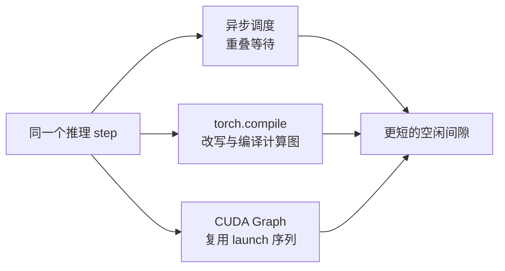

> **读图方法：** 阅读“本章定位”这张流程图时，先把方框看成对象或状态，把箭头看成数据或控制的移动。第一遍从左向右建立顺序，第二遍再核对分支发生的条件。

**核心结论：**三者可以协同，但它们不是同一个开关，也不是严格的先后版本。定位性能
问题时，必须先确认收益来自哪一层。

本章绑定源码 revision `5893426b88f7b3cd21101d194eb1c6f0a6f0e27b`，沿用以下标签：

- **源码事实**：该 revision 下可直接定位的行为。
- **设计意图**：源码注释或同 revision 设计文档给出的目标。
- **设计含义**：由多处源码共同推出的解释。
- **教学模型**：随书纯 Python 实现，只验证契约，不模拟 CUDA 性能。

## 阅读目标

读完本章后，你应该能够：

1. 把一个 step 的 CPU preparation、H2D、GPU forward、sampling、D2H 和 scheduler update 分开。
2. 解释 batch queue 与 `AsyncScheduler` 各自解决什么问题。
3. 解释 `num_output_placeholders` 为什么是“未确认进度”，以及 stale output 为什么不能再次扣减。
4. 区分 `CompilationMode` 与 `CUDAGraphMode`。
5. 从 `@support_torch_compile` 追到 Dynamo、vLLM backend、graph split、Inductor 和 cache。
6. 解释 piecewise graph 为什么常以 attention 等不易捕获操作为边界。
7. 说明 CUDA Graph 对 shape、地址、控制流和 workspace 生命周期的要求。
8. 解释配置模式与运行时模式的区别。
9. 从 batch shape 追踪到 MRV1 `CudagraphDispatcher` 或 MRV2 `CudaGraphManager` 的选择结果。
10. 解释 warmup、capture 顺序、显存预留与 fallback。
11. 设计同时报告冷启动、稳定态、graph hit、padding 和显存的实验。

## 如何阅读本章

这一章包含三个容易混淆但彼此独立的问题：CPU 与 GPU 工作能否重叠、PyTorch 图能否
编译优化、CUDA kernel 启动序列能否捕获后 replay。先分别理解三者解决的开销，再看
vLLM 如何把它们组合起来。

不需要预先掌握编译器理论。遇到 graph、guard、dynamic shape 和 capture size 时，先
用“录制一条固定条件下可重复执行的流水线”理解：条件变化可能重新编译，地址变化可能
无法 replay，shape 不匹配则需要 padding、换图或回退 eager。

第一次阅读只比较 eager、compile、CUDA Graph 三条路径；第二次研究 async scheduler
的 placeholder 和确认边界；第三次再进入 MRV1/MRV2 dispatcher。性能图必须同时看
冷启动、稳定态、显存和正确性，不能只比较一个平均延迟数字。

**先翻译编译器名词。** 计算图是运算与数据依赖的关系图；Dynamo 从 Python 执行中
捕获它，FX 是图的表示，Inductor 把图转成可运行代码。pass 是一次图改写；guard 是
复用图之前的条件检查；eager 是直接执行模型运算。CUDA Graph 另外记录 GPU 工作的
提交关系，与“用编译器改写运算”是两件事。

**第一遍走法：** 读 8.1–8.2、8.6、8.9–8.10、8.11.3 和 8.20，再补 8.3–8.5 的异步
账本；dispatcher 内部第二遍追。**停下来算：** 实际 3 token 使用 4-token graph，
多算 1 个 padding 位置，地址仍要稳定；graph 命中不等于没有额外计算。

## 8.1 先建立正确的时间成本模型

> **本节先看：** 本节要回答：**先建立正确的时间成本模型**。下面的小节会逐层拆开概念、运行过程和源码落点；第一次阅读先抓对象之间的关系，第二次再记类名、字段和分支。

### 8.1.1 “GPU utilization 低”不只说明算子慢

一次 decode step 可以粗略拆成：

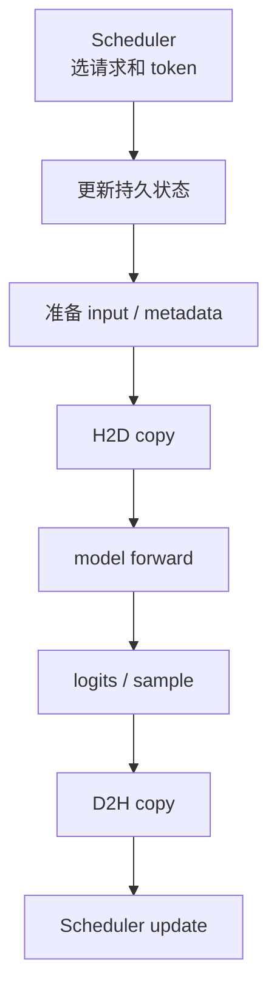

> **读图方法：** 这张图用于压缩“GPU utilization 低不只说明算子慢”的整体关系。先从上向下找到起点、关键转换和终点，再问每条跨层箭头是否意味着函数调用、消息传递、内存访问或状态更新。

先构造完全串行、不重叠的教学模型。以下所有 `T` 都是耗时，单位统一为毫秒，
下标分别代表调度、准备、主机到设备拷贝、前向、采样、设备到主机拷贝和结算：

```math
T_{step}=T_{sched}+T_{prepare}+T_{H2D}+T_{forward}+T_{sample}+T_{D2H}+T_{update}
```

只有阶段互不重叠时才能直接相加；实际 trace 中不能把重叠区间重复计入墙钟耗时。
异步执行的目标不是把右侧每一项都变为零，而是在依赖允许时让它们重叠。

### 8.1.2 为什么 decode 更容易暴露 launch 开销

Prefill 一次处理许多 token，矩阵通常更大；普通 decode 每个请求只推进少量 token。模型越小、
batch 越小、每次算子越短，Python 调用和 kernel launch 在总时间中的占比越明显。

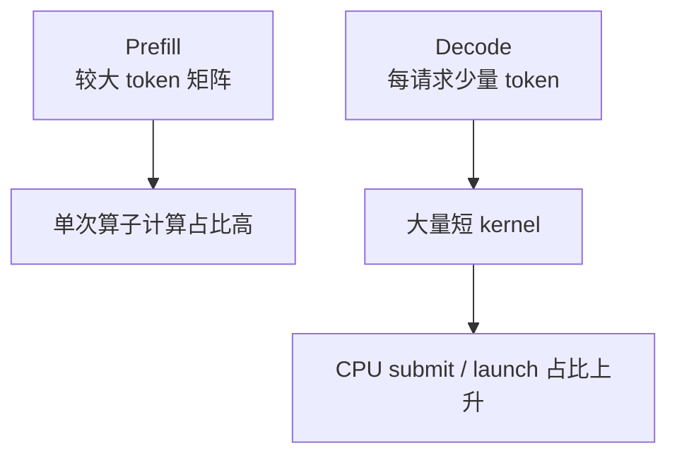

> **读图方法：** 这是“为什么 decode 更容易暴露 launch 开销”的流程图。先从上向下只追一条主路径，确认输入经过哪些关键阶段到达输出；第二遍再看虚线、回边和旁路，它们通常表示反馈、复用或可选分支。

**设计含义：**CUDA Graph 对短小、重复、shape 可覆盖的 decode batch 往往更有吸引力；但这不是
“decode 一定更快”的无条件结论。实际收益仍取决于模型、硬件、batch、attention backend 和命中率。

### 8.1.3 延迟、吞吐和冷启动是三张账

> **本节先看：** 这一小节先用图建立“延迟、吞吐和冷启动是三张账”的整体路径。先找输入、关键状态和输出，再阅读图后的源码解释，不必一开始记住全部节点。

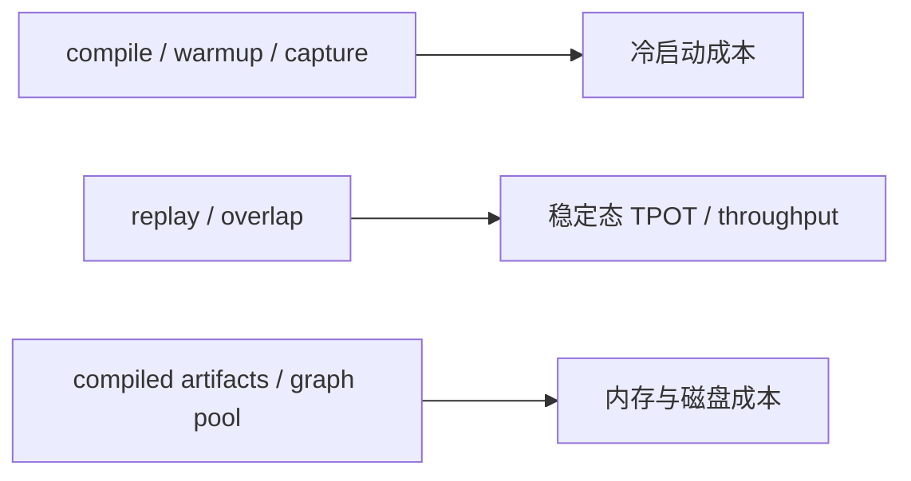

> **读图方法：** 阅读“延迟、吞吐和冷启动是三张账”这张流程图时，先把方框看成对象或状态，把箭头看成数据或控制的移动。第一遍从左向右建立顺序，第二遍再核对分支发生的条件。

只看稳定态 token/s 会漏掉：

- 第一次编译与 profiling 的时间。
- CUDA Graph capture 的时间。
- graph pool、静态输入输出和编译产物占用。
- 未命中 shape 的 eager fallback。
- padding 带来的额外计算。

## 8.2 同步 step 与 batch queue

> **本节先看：** 本节要回答：**同步 step 与 batch queue**。下面的小节会逐层拆开概念、运行过程和源码落点；第一次阅读先抓对象之间的关系，第二次再记类名、字段和分支。

### 8.2.1 普通 `EngineCore.step`

普通路径先 schedule，再以 `non_block=True` 发起 `execute_model()`，同时计算 grammar bitmask，随后
`future.result()` 等 Worker 结果；如果 execute 阶段只留下待采样状态，再调用 `sample_tokens()`。

[源码] `vllm/v1/engine/core.py` - `EngineCore.step`

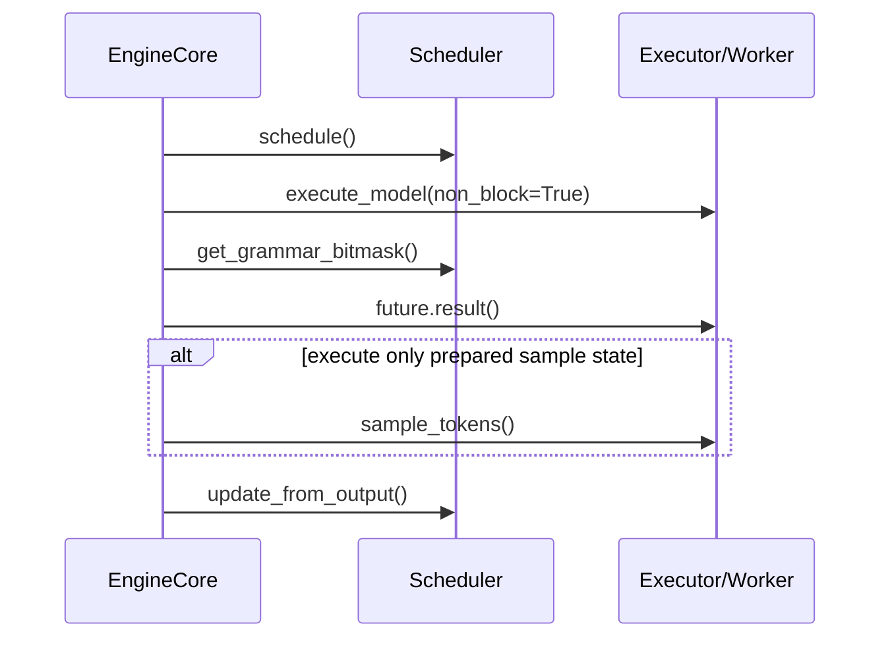

> **读图方法：** 这是“普通 `EngineCore.step`”的时序图。先从左到右确认参与者分别负责什么，再从上到下追踪消息；第一遍只看正常路径，第二遍再看返回、异步消息和失败分支。

这里已经有局部并行：Worker 执行时，EngineCore 可以准备 grammar。但普通 `step()` 仍要在本 step
末尾拿到结果，才能进入下一次完整调度。

### 8.2.2 batch queue 先填队列，再取最老结果

当 `vllm_config.max_concurrent_batches > 1` 时，EngineCore 使用
`step_with_batch_queue()`。它优先在队列未满时调度和提交新 batch，只有队列已满或没有更多可调度
工作时，才等待最老 future。

[源码] `vllm/v1/engine/core.py` - `EngineCore.__init__`、`EngineCore.step_with_batch_queue`

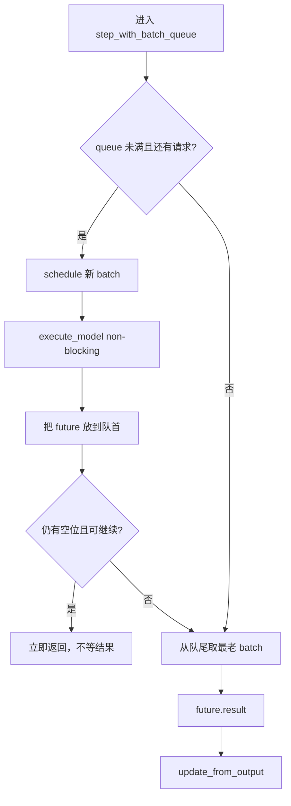

> **读图方法：** 这是“batch queue 先填队列，再取最老结果”的流程图。先从上向下只追一条主路径，确认输入经过哪些关键阶段到达输出；第二遍再看虚线、回边和旁路，它们通常表示反馈、复用或可选分支。

队列使用 `appendleft()` 和 `pop()`，因此等待的是最早提交的 batch，而不是最新 batch。

### 8.2.3 `max_concurrent_batches` 从哪里来

当前实现中：

- Pipeline Parallelism 需要 `pp_size` 个并发 batch 填充 pipeline。
- async scheduling 需要额外的并发窗口。
- MRV2 的 async scheduling 返回 `pp_size + 1`。
- MRV1 仅在 `pp_size <= 1` 时把 async 窗口设为 2；源码明确说明它未完整支持 async + PP。

[源码] `vllm/config/vllm.py` - `VllmConfig.max_concurrent_batches`

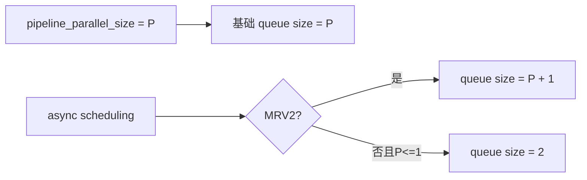

> **读图方法：** 阅读“`max_concurrent_batches` 从哪里来”这张流程图时，先把方框看成对象或状态，把箭头看成数据或控制的移动。第一遍从左向右建立顺序，第二遍再核对分支发生的条件。

**纠正：**batch queue 不等于 `AsyncScheduler`。PP 即使不启用 async scheduler，也可能因为填充
pipeline 而拥有并发 batch 队列；`AsyncScheduler` 进一步改变 request progress 的表示，使同一请求在
输出尚未回到 CPU 时仍可继续被调度。

### 8.2.4 一个两级流水教学模型

若 CPU prepare 为 2 ms，GPU execute 为 5 ms，4 个同步 step 需要：

```math
4\times(2+5)=28\text{ ms}
```

若 CPU 能准备下一步并与上一轮 GPU 重叠，则教学模型得到 22 ms：

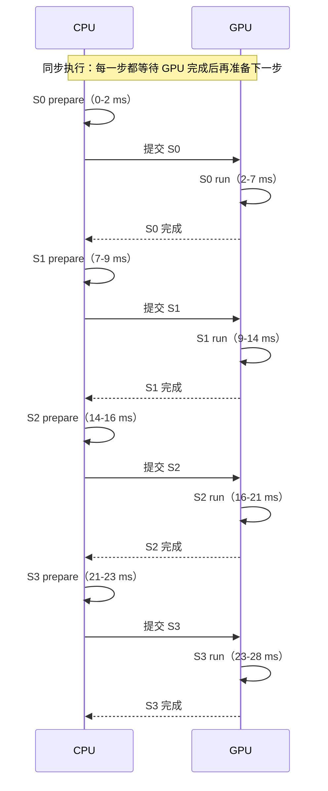

> **读图方法：** 这是“一个两级流水教学模型”的时序图。先从左到右确认参与者分别负责什么，再从上到下追踪消息；第一遍只看正常路径，第二遍再看返回、异步消息和失败分支。

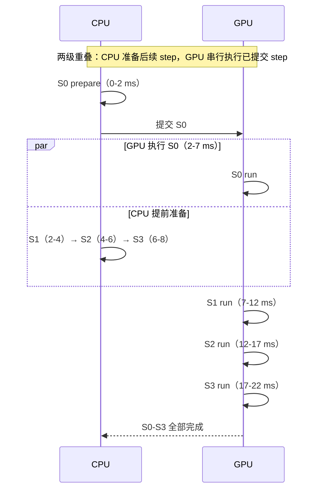

> **读图方法：** 这是“一个两级流水教学模型”的时序图。先从左到右确认参与者分别负责什么，再从上到下追踪消息；第一遍只看正常路径，第二遍再看返回、异步消息和失败分支。

这只是说明重叠的上限直觉。真实 vLLM 还有 scheduler state、H2D/D2H stream、PP、DP 同步和 sampling
依赖，不能直接用该公式预测生产收益。

## 8.3 `AsyncScheduler`：用 placeholder 表示尚未知的 token

> **本节先看：** 本节要回答：**`AsyncScheduler`：用 placeholder 表示尚未知的 token**。下面的小节会逐层拆开概念、运行过程和源码落点；第一次阅读先抓对象之间的关系，第二次再记类名、字段和分支。

### 8.3.1 同一请求为何能提前进入下一步

同步 scheduler 在输出到达后才知道新 token。异步调度希望在结果仍在 Worker/GPU 时继续安排工作，
于是必须区分：

- **乐观进度**：已经安排计算，但输出尚未确认。
- **确认进度**：即使所有在途 speculative token 被拒绝，也不会回退的位置。

当前源码用 `request.num_output_placeholders` 表示未确认 token 数。

[源码] `vllm/v1/core/sched/async_scheduler.py` - `AsyncScheduler._update_after_schedule`

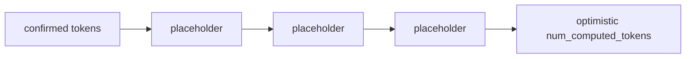

> **读图方法：** 阅读“同一请求为何能提前进入下一步”这张流程图时，先把方框看成对象或状态，把箭头看成数据或控制的移动。第一遍从左向右建立顺序，第二遍再核对分支发生的条件。

用于本节缓存记账的保守边界为：

```math
N_{confirmed}=N_{computed}-N_{placeholders}
```

所有 `N` 都以 token 计数。这个差值是源码用于限制缓存/释放的边界，不能当作 GPU
完成事件。例如最后一段 prefill 刚提交时，computed 已增加，GPU 可能还没算完；
第 05 章的本地 hash 登记也可能先于 forward。需释放在途 block 时，还要看
`num_in_flight_tokens` 和适用的 step fence，不能只减 placeholder。

### 8.3.2 schedule 后 placeholder 如何增加

对于非 prefill chunk，请求本轮预计产生：

```math
N_{new\ placeholders}=N_{sampled\ per\ step}+N_{scheduled\ spec}
```

随后：

- `num_output_placeholders` 增加该数量。
- `spec_token_ids` 暂时设为 `-1` 列表。
- 真正 draft/spec token ID 由 Worker 后续更新。
- MRV2 + PP 时，下一次 decode eligible step 设为 `current_step + pp_size`。

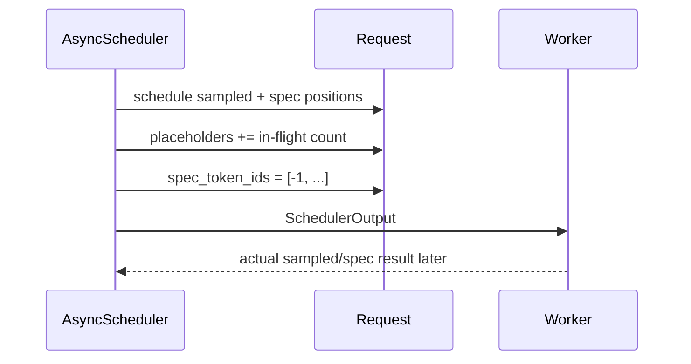

> **读图方法：** 这是“schedule 后 placeholder 如何增加”的时序图。先从左到右确认参与者分别负责什么，再从上到下追踪消息；第一遍只看正常路径，第二遍再看返回、异步消息和失败分支。

### 8.3.3 placeholder 不是 token ID

`-1` 是暂时代替尚未获得的 spec token ID；`num_output_placeholders` 是请求级计数。两者相关但不是
同一个字段，也不能把 placeholder 当作合法 token 送入模型。

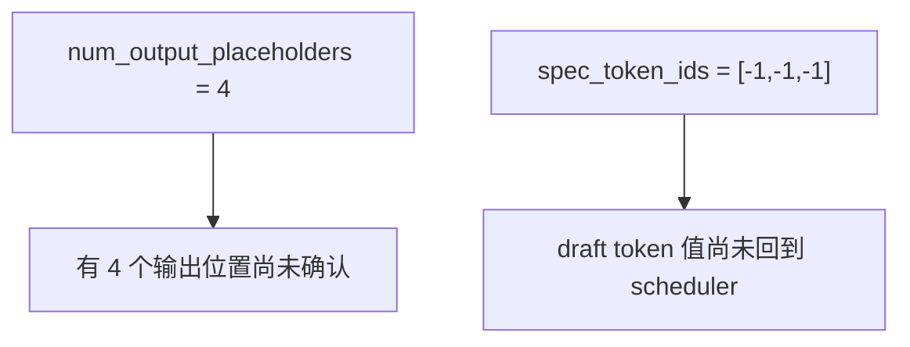

> **读图方法：** 这是“placeholder 不是 token ID”的流程图。先从上向下只追一条主路径，确认输入经过哪些关键阶段到达输出；第二遍再看虚线、回边和旁路，它们通常表示反馈、复用或可选分支。

### 8.3.4 structured output 为什么可能延迟 sampling

结构化输出 grammar 可能依赖上一轮真实 token。若请求已有未确认 placeholder，新的 grammar bitmask
不能假设这些 token 已知。`SchedulerOutput.pending_structured_output_tokens` 会标记该依赖，batch queue
将当前 sampling 延迟到先前输出被处理之后。

[源码] `vllm/v1/core/sched/async_scheduler.py` - `AsyncScheduler._update_after_schedule`

[源码] `vllm/v1/engine/core.py` - `EngineCore.step_with_batch_queue`

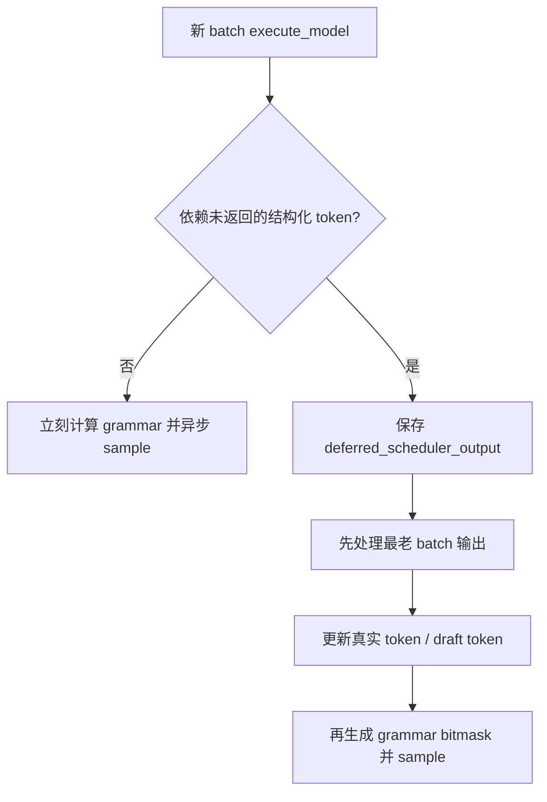

> **读图方法：** 阅读“structured output 为什么可能延迟 sampling”这张流程图时，先把方框看成对象或状态，把箭头看成数据或控制的移动。第一遍从上向下建立顺序，第二遍再核对分支发生的条件。

这说明异步不是“无视依赖”。它把没有依赖的工作提前，把有依赖的工作明确延迟。

## 8.4 stale output、抢占与确认边界

> **本节先看：** 本节要回答：**stale output、抢占与确认边界**。下面的小节会逐层拆开概念、运行过程和源码落点；第一次阅读先抓对象之间的关系，第二次再记类名、字段和分支。

### 8.4.1 为什么会有 stale output

batch queue 中可以有多个在途 step。若请求因 KV 压力被抢占，scheduler 会回滚它的乐观状态；但
更早提交给 Worker 的计算不会凭空消失，它的结果仍可能稍后返回。相对于已经回滚或重新加入的请求
状态，这就是 stale output。

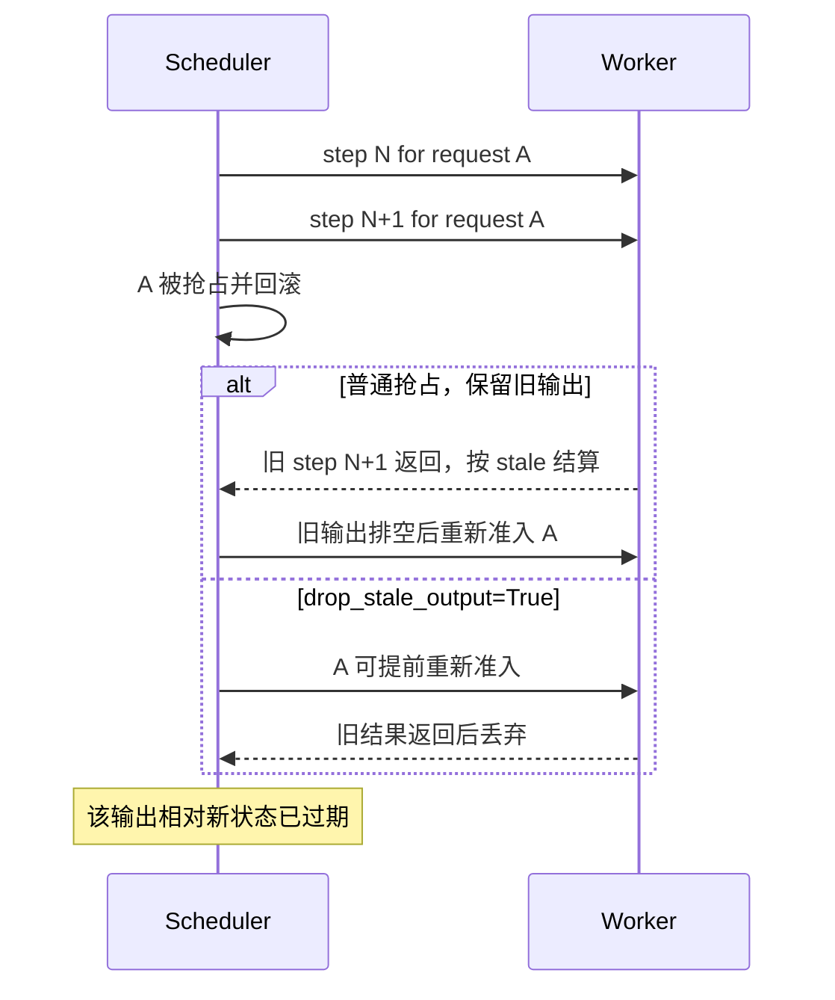

> **读图方法：** 这是“为什么会有 stale output”的时序图。先从左到右确认参与者分别负责什么，再从上到下追踪消息；第一遍只看正常路径，第二遍再看返回、异步消息和失败分支。

### 8.4.2 stale output 为什么不能扣 placeholder

抢占时 placeholder 已被清零。若旧结果返回后再执行普通的
`num_output_placeholders -= len(new_token_ids)`，计数会下溢。

当前实现先调用父类更新 token，再检查 `is_stale`：

- 非 stale：按实际新 token 数减少 placeholder，并断言不小于零。
- stale：不再减少，因为抢占已经清零。

[源码] `vllm/v1/core/sched/async_scheduler.py` - `AsyncScheduler._update_request_with_output`

[测试] `tests/v1/core/test_async_scheduler.py` - `test_kv_pressure_preemption_with_inflight_output`

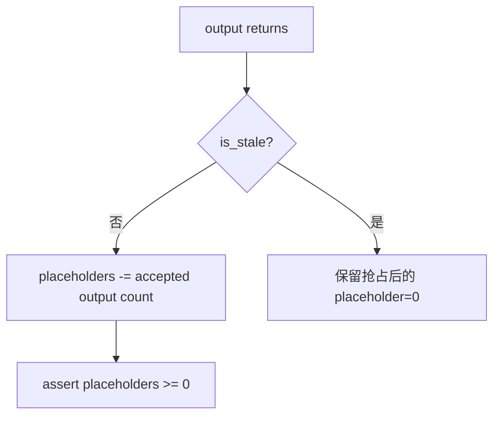

> **读图方法：** 这是“stale output 为什么不能扣 placeholder”的流程图。先从上向下只追一条主路径，确认输入经过哪些关键阶段到达输出；第二遍再看虚线、回边和旁路，它们通常表示反馈、复用或可选分支。

### 8.4.3 KV cache 只能推进到确认边界

对于输出到达前仍是 `RUNNING` 的请求，异步 scheduler 调用：

```text
cache_blocks(request, request.num_computed_tokens
                      - request.num_output_placeholders)
```

也就是只把确认区间纳入可缓存边界。

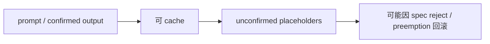

> **读图方法：** 阅读“KV cache 只能推进到确认边界”这张流程图时，先把方框看成对象或状态，把箭头看成数据或控制的移动。第一遍从左向右建立顺序，第二遍再核对分支发生的条件。

同样的确认边界还用于保护多模态 encoder input：乐观进度虽然可能越过 placeholder range，但如果
回滚仍可能重新进入该范围，就不能提前释放 encoder cache。

[测试] `tests/v1/core/test_scheduler.py` - `test_free_encoder_inputs_respects_unconfirmed_placeholders`

### 8.4.4 异步正确性的本质

> **本节先看：** 这一小节先用图建立“异步正确性的本质”的整体路径。先找输入、关键状态和输出，再阅读图后的源码解释，不必一开始记住全部节点。

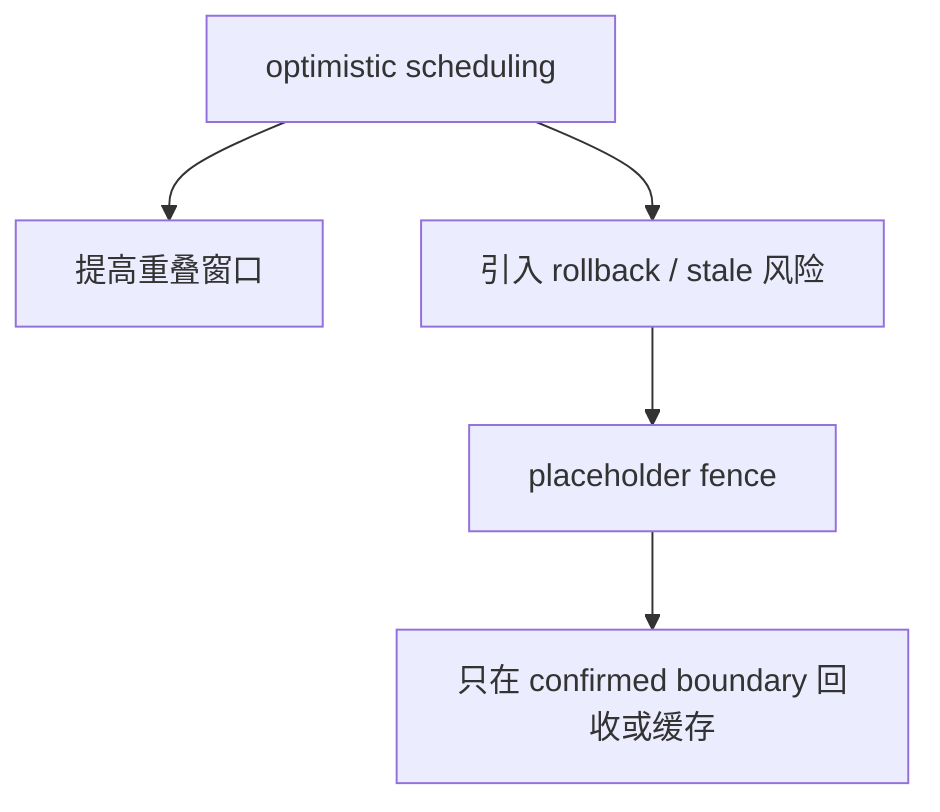

> **读图方法：** 这张图用于压缩“异步正确性的本质”的整体关系。先从上向下找到起点、关键转换和终点，再问每条跨层箭头是否意味着函数调用、消息传递、内存访问或状态更新。

**设计含义：**异步优化不是单纯把 `future.result()` 移走，而是把状态机从“只有已知进度”升级为
“可提交内容的边界 + 在途工作”。若没有这个双边界模型，吞吐提升会直接变成状态一致性问题。

## 8.5 输出异步拷贝：另一个重叠层

> **本节先看：** 本节要回答：**输出异步拷贝：另一个重叠层**。下面的小节会逐层拆开概念、运行过程和源码落点；第一次阅读先抓对象之间的关系，第二次再记类名、字段和分支。

### 8.5.1 MRV2 的 `AsyncOutput`

MRV2 sampler 输出仍在 GPU。`AsyncOutput` 在独立 copy stream 上等待 main stream，然后把 sampled
token、logprobs、NaN 计数、sampling mask、routed experts 等异步搬到 CPU，并记录一个 blocking event。

[源码] `vllm/v1/worker/gpu/async_utils.py` - `AsyncOutput.__init__`、`AsyncOutput.get_output`

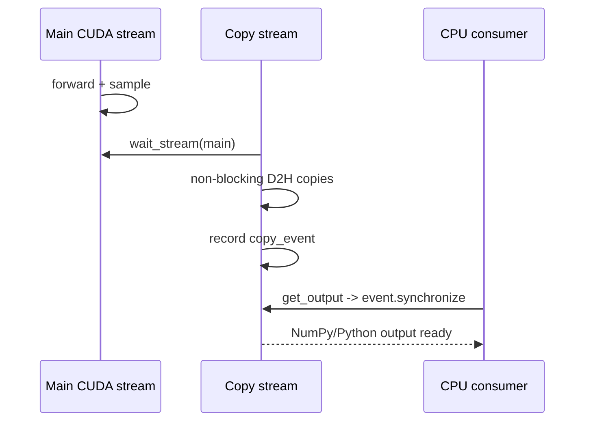

> **读图方法：** 这是“MRV2 的 `AsyncOutput`”的时序图。先从左到右确认参与者分别负责什么，再从上到下追踪消息；第一遍只看正常路径，第二遍再看返回、异步消息和失败分支。

`AsyncOutput` 必须保留 GPU tensor 引用，因为 copy stream 还在读取这些 storage；若对象过早释放，
caching allocator 可能复用内存。

### 8.5.2 `non_blocking=True` 不是自动异步

真正的异步传输还依赖：

- 合适的 host memory，例如 pinned memory。
- 正确的 stream wait 关系。
- 源 tensor 生命周期覆盖 copy。
- 消费端在读取前等待 event。

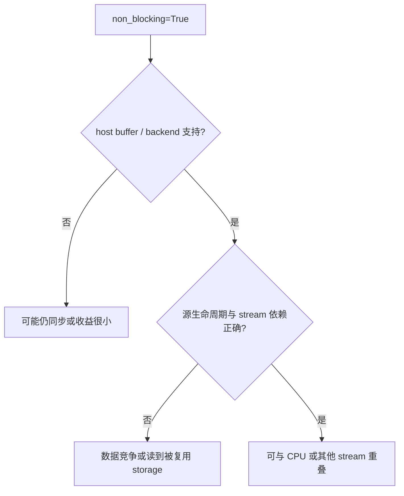

> **读图方法：** 阅读“`non_blocking=True` 不是自动异步”这张流程图时，先把方框看成对象或状态，把箭头看成数据或控制的移动。第一遍从上向下建立顺序，第二遍再核对分支发生的条件。

### 8.5.3 staged write 与 async scheduling 的关系

MRV2 使用持久 GPU/CPU state 和 staged writes，把多个状态变更先记录，再在安全位置统一应用。它是
降低 Python/拷贝开销和规避写后读竞争的基础设施，但不能等同于 `AsyncScheduler`。

[源码] `vllm/v1/worker/gpu/buffer_utils.py` - `StagedWriteTensor`

[源码] `vllm/v1/worker/gpu/states.py` - `apply_staged_writes`


> **读图方法：** 这张图用于压缩“staged write 与 async scheduling 的关系”的整体关系。先从左向右找到起点、关键转换和终点，再问每条跨层箭头是否意味着函数调用、消息传递、内存访问或状态更新。

## 8.6 `torch.compile` 到底编译什么

> **本节先看：** 本节要回答：**`torch.compile` 到底编译什么**。下面的小节会逐层拆开概念、运行过程和源码落点；第一次阅读先抓对象之间的关系，第二次再记类名、字段和分支。

### 8.6.1 从 Python `forward` 到 compiled callable

简化后的路径是：

```mermaid
flowchart TD
    P["Python model.forward"] --> D["TorchDynamo trace"]
    D --> FX["FX graph"]
    FX --> VB["VllmBackend"]
    VB --> Pass["custom passes / split"]
    Pass --> I["Inductor or configured backend"]
    I --> K["compiled runnable"]
```

> **读图方法：** 这是“从 Python `forward` 到 compiled callable”的流程图。先从上向下只追一条主路径，确认输入经过哪些关键阶段到达输出；第二遍再看虚线、回边和旁路，它们通常表示反馈、复用或可选分支。

Dynamo 捕获 Python 级运算图，FX 表示图结构，vLLM backend 决定如何切分与增加 passes，Inductor
生成和调度具体内核。真实路径还包括 fake tensor、AOTAutograd、cache、动态 shape 和平台后端。

### 8.6.2 四种 `CompilationMode`

当前 `CompilationMode` 是独立枚举：

| 模式 | 含义 |
|---|---|
| `NONE` | 不应用 `torch.compile`；是否 replay 另由 CUDA Graph 配置决定 |
| `STOCK_TORCH_COMPILE` | 标准 `torch.compile` pipeline |
| `DYNAMO_TRACE_ONCE` | 单次 Dynamo trace，移除 guard，要求控制流适配动态 shape |
| `VLLM_COMPILE` | vLLM 自定义 backend，支持 cache、piecewise、shape specialization 和 passes |

[源码] `vllm/config/compilation.py` - `CompilationMode`、`CompilationConfig.mode`

```mermaid
flowchart TB
    M["CompilationMode"] --> N["NONE"]
    M --> S["STOCK_TORCH_COMPILE"]
    M --> D["DYNAMO_TRACE_ONCE"]
    M --> V["VLLM_COMPILE"]
    V --> C["cache"]
    V --> P["piecewise"]
    V --> R["compile ranges / sizes"]
    V --> F["custom fusion passes"]
```

> **读图方法：** 阅读“四种 `CompilationMode`”这张流程图时，先把方框看成对象或状态，把箭头看成数据或控制的移动。第一遍从上向下建立顺序，第二遍再核对分支发生的条件。

### 8.6.3 当前默认不是固定写死在 `CompilationConfig` 中

`CompilationConfig.mode` 和 `cudagraph_mode` 初始可以为 `None`，随后由 `VllmConfig` 的 optimization
level 填默认值。当前 `VllmConfig.optimization_level` 默认是 `O2`：

- `O0`：`CompilationMode.NONE` + `CUDAGraphMode.NONE`。
- `O1`：编译开启，CUDA Graph 默认 `PIECEWISE`。
- `O2`：编译开启，CUDA Graph 默认 `FULL_AND_PIECEWISE`。
- `O3`：当前同样默认 `FULL_AND_PIECEWISE`，并使用对应 passes 配置。

[源码] `vllm/config/vllm.py` - `OPTIMIZATION_LEVEL_TO_CONFIG`、`VllmConfig.__post_init__`

```mermaid
flowchart LR
    O["optimization_level"] --> C["CompilationConfig defaults"]
    C --> M["mode"]
    C --> G["cudagraph_mode"]
    C --> P["pass_config"]
    C --> K["kernel_config"]
```

> **读图方法：** 这张图用于压缩“当前默认不是固定写死在 `CompilationConfig` 中”的整体关系。先从左向右找到起点、关键转换和终点，再问每条跨层箭头是否意味着函数调用、消息传递、内存访问或状态更新。

用户显式设置的字段不会被 optimization-level 默认值覆盖。因此记录实验配置时不能只写“O2”，还要
记录最终解析后的 `CompilationConfig`。

## 8.7 `@support_torch_compile` 与一次 trace

> **本节先看：** 本节要回答：**`@support_torch_compile` 与一次 trace**。下面的小节会逐层拆开概念、运行过程和源码落点；第一次阅读先抓对象之间的关系，第二次再记类名、字段和分支。

### 8.7.1 装饰器怎样改变模型类

许多模型类使用 `@support_torch_compile`。装饰器把
`TorchCompileWithNoGuardsWrapper` 加入类的基类，并包装 `__init__` 和 `__call__`。

[源码] `vllm/compilation/decorators.py` - `support_torch_compile`、`_support_torch_compile`

```mermaid
classDiagram
    class ModelClass {
      +forward()
    }
    class TorchCompileWithNoGuardsWrapper {
      +_compiled_callable
      +__call__()
    }
    ModelClass --|> TorchCompileWithNoGuardsWrapper : decorator injects base
```

> **读图方法：** 这是“装饰器怎样改变模型类”的类型关系图。先分清接口、实现和持有关系，再结合正文确认运行时真正实例化的是哪个类；类图说明结构，不等同于调用先后。

当 mode 为 `NONE` 或 `STOCK_TORCH_COMPILE`，或模型明确不支持时，装饰器内部路径可设置
`do_not_compile`；stock mode 由更高层 Runner 处理，不能据此误判为完全未编译。

### 8.7.2 为什么强调 trace once 与 guard

普通 Dynamo 会依据 Python 值、shape、类型等建立 guards；guard 失败可能触发重新 trace/compile。
vLLM 的 wrapper 在非 stock mode 下尽量移除 guards，第一次调用触发一次编译，之后直接复用。

[源码] `vllm/compilation/wrapper.py` - `TorchCompileWithNoGuardsWrapper`

```mermaid
flowchart TD
    F["first call"] --> T["mark dynamic dims"]
    T --> D["Dynamo trace"]
    D --> C["compile"]
    C --> R["compiled callable"]
    N["next call"] --> G{"guard strategy accepts?"}
    G -- 是 --> R
    G -- 否 --> X["fail/recompile depending mode"]
```

> **读图方法：** 阅读“为什么强调 trace once 与 guard”这张流程图时，先把方框看成对象或状态，把箭头看成数据或控制的移动。第一遍从上向下建立顺序，第二遍再核对分支发生的条件。

移除 guard 是一个带前提的性能选择：模型 forward 不能依赖未被正确表达的动态 shape 控制流，否则
可能把只适用于第一次输入的路径错误地复用。

### 8.7.3 dynamic shape 不等于任意 shape

`DynamicShapesConfig` 支持 backed、unbacked 等策略。动态维度让同一 compiled graph 覆盖一组 shape，
但 compiled range、kernel 约束、CUDA Graph capture size 仍会限制可复用范围。

```mermaid
flowchart LR
    DS["dynamic dimension"] --> CR["compiled range can cover many sizes"]
    CG["CUDA Graph"] --> CS["captured padded size / descriptor"]
    CR --> Both["两套 shape 规则同时存在"]
    CS --> Both
```

> **读图方法：** 这张图用于压缩“dynamic shape 不等于任意 shape”的整体关系。先从左向右找到起点、关键转换和终点，再问每条跨层箭头是否意味着函数调用、消息传递、内存访问或状态更新。

## 8.8 vLLM compile：切图、compile ranges 与 cache

> **本节先看：** 本节要回答：**vLLM compile：切图、compile ranges 与 cache**。下面的小节会逐层拆开概念、运行过程和源码落点；第一次阅读先抓对象之间的关系，第二次再记类名、字段和分支。

### 8.8.1 为什么需要 splitting ops

attention、KV update、Mamba mixer 等操作可能具有动态 metadata、外部状态修改或 backend-specific
capture 约束。默认配置可把这些操作作为边界，将完整 FX graph 切成：

```mermaid
flowchart LR
    G0["embedding / norm / linear"] --> A0["attention breakpoint"]
    A0 --> G1["MLP / residual"]
    G1 --> A1["attention breakpoint"]
    A1 --> G2["remaining graph"]
```

> **读图方法：** 这是“为什么需要 splitting ops”的流程图。先从左向右只追一条主路径，确认输入经过哪些关键阶段到达输出；第二遍再看虚线、回边和旁路，它们通常表示反馈、复用或可选分支。

[源码] `vllm/config/compilation.py` - `CompilationConfig._attention_ops`、
`CompilationConfig.set_splitting_ops_for_v1`

[源码] `vllm/compilation/backends.py` - `split_graph`

`split_graph()` 特别保留原始 node 顺序，因为带 mutation 的图若被重排，语义可能改变。

### 8.8.2 piecewise compilation 不是“attention 不编译”的唯一含义

默认 Dynamo-level split 会把 splitting op 放在独立 subgraph，把其他 subgraph 交给
`PiecewiseBackend`。如果启用 Inductor graph partition，切分发生在 Inductor codegen 阶段，passes 和
fusion 可以先看到完整图，再把标记为 cudagraph-unsafe 的部分留在 graph 外。

```mermaid
flowchart TB
    FX["FX graph"] --> A{"use_inductor_graph_partition?"}
    A -- 否 --> D["Dynamo/FX level split"]
    D --> I1["compile each safe subgraph"]
    A -- 是 --> I2["whole graph passes/fusions"]
    I2 --> P["Inductor-time partitions"]
```

> **读图方法：** 阅读“piecewise compilation 不是attention 不编译的唯一含义”这张流程图时，先把方框看成对象或状态，把箭头看成数据或控制的移动。第一遍从上向下建立顺序，第二遍再核对分支发生的条件。

### 8.8.3 compile size 与 capture size 不是一回事

`compile_sizes` 用于为某些具体 shape 生成 specialization；`compile_ranges_endpoints` 定义可覆盖的
动态范围。CUDA Graph 的 `cudagraph_capture_sizes` 则决定实际 capture 的 padded token 数。

[源码] `vllm/config/compilation.py` - `CompilationConfig.compile_sizes`、
`CompilationConfig.compile_ranges_endpoints`、`CompilationConfig.cudagraph_capture_sizes`

```mermaid
flowchart LR
    Runtime["runtime tokens = 13"] --> CR["compiled range 9..16"]
    Runtime --> Pad["CUDA Graph pad to 16"]
    CR --> Kernel["选择 compiled runnable"]
    Pad --> Replay["选择 captured graph"]
```

> **读图方法：** 这张图用于压缩“compile size 与 capture size 不是一回事”的整体关系。先从左向右找到起点、关键转换和终点，再问每条跨层箭头是否意味着函数调用、消息传递、内存访问或状态更新。

MRV1 dispatcher 会验证具体 `compile_sizes` 不会被 CUDA Graph padding 改成另一个 size，否则抛错。

### 8.8.4 `PiecewiseBackend` 在启动期编译全部范围

每个可编译 subgraph 构造 `PiecewiseBackend`，为 general ranges 和显式 compile sizes 建立
`RangeEntry`，并在有 FX graph 时执行 `compile_all_ranges()`；从缓存恢复、没有 graph 时则走
`load_all_ranges()`。运行时按 shape 查找已经准备好的 callable。

[源码] `vllm/compilation/piecewise_backend.py` - `PiecewiseBackend`

```mermaid
flowchart TD
    P["PiecewiseBackend init"] --> E["build RangeEntry set"]
    E --> C["compile_all_ranges"]
    C --> R["runtime shape arrives"]
    R --> S["specific size first"]
    S --> F["otherwise containing range"]
    F --> Call["call precompiled runnable"]
```

> **读图方法：** 这是“`PiecewiseBackend` 在启动期编译全部范围”的流程图。先从上向下只追一条主路径，确认输入经过哪些关键阶段到达输出；第二遍再看虚线、回边和旁路，它们通常表示反馈、复用或可选分支。

这体现了“服务请求到达前完成主要编译”的设计方向，避免随机请求在稳定态突然承担完整编译成本。

### 8.8.5 编译缓存为什么必须包含源码因素

`CompilationConfig.compute_hash()` 包含会影响 input-to-hidden graph 的配置和 nested config hash，忽略
debug path、运行时统计等不改变图结构的字段。装饰器还收集 Dynamo trace 涉及的文件，用于在源码
变化时使 cache 失效。

[源码] `vllm/config/compilation.py` - `CompilationConfig.compute_hash`

[源码] `vllm/compilation/decorators.py` - `_support_torch_compile` 包装后的 `__call__`

```mermaid
flowchart LR
    CFG["graph-affecting config"] --> H["cache hash"]
    SRC["traced source files"] --> H
    ENV["compile-related environment"] --> H
    MODEL["model forward identity"] --> H
    H --> Cache["compiled artifact directory"]
```

> **读图方法：** 阅读“编译缓存为什么必须包含源码因素”这张流程图时，先把方框看成对象或状态，把箭头看成数据或控制的移动。第一遍从左向右建立顺序，第二遍再核对分支发生的条件。

`VLLM_DISABLE_COMPILE_CACHE` 可禁用读取/保存缓存。冷启动比较必须区分 cold cache 与 warm cache。

## 8.9 CUDA Graph：复用的是 launch 序列

> **本节先看：** 本节要回答：**CUDA Graph：复用的是 launch 序列**。下面的小节会逐层拆开概念、运行过程和源码落点；第一次阅读先抓对象之间的关系，第二次再记类名、字段和分支。

### 8.9.1 eager launch 的重复成本

Eager 模式每轮由 CPU 逐个提交 kernel：

```mermaid
sequenceDiagram
    participant CPU
    participant GPU
    CPU->>GPU: launch kernel 1
    CPU->>GPU: launch kernel 2
    CPU->>GPU: launch kernel 3
    CPU->>GPU: launch kernel ...
    CPU->>GPU: launch kernel N
```

> **读图方法：** 这是“eager launch 的重复成本”的时序图。先从左到右确认参与者分别负责什么，再从上到下追踪消息；第一遍只看正常路径，第二遍再看返回、异步消息和失败分支。

CUDA Graph capture 记录一段可重放工作，稳定态由一次 `replay()` 提交：

```mermaid
sequenceDiagram
    participant CPU
    participant GPU
    CPU->>GPU: graph.replay()
    GPU->>GPU: kernel 1 -> 2 -> 3 -> ... -> N
```

> **读图方法：** 这是“eager launch 的重复成本”的时序图。先从左到右确认参与者分别负责什么，再从上到下追踪消息；第一遍只看正常路径，第二遍再看返回、异步消息和失败分支。

它减少的是 CPU 提交与框架调度开销，不改变每个 kernel 内部的 FLOPs。

### 8.9.2 capture、warmup、replay

> **本节先看：** 这一小节先用图建立“capture、warmup、replay”的整体路径。先找输入、关键状态和输出，再阅读图后的源码解释，不必一开始记住全部节点。

```mermaid
stateDiagram-v2
    [*] --> Warmup
    Warmup --> Capture
    Capture --> Stored
    Stored --> Replay
    Replay --> Replay
    Stored --> Fallback: descriptor not matched
```

> **读图方法：** 这是“capture、warmup、replay”的状态图。先找初始状态，再沿箭头观察触发条件和状态变化；重点不是背状态名，而是弄清谁触发转换、转换后哪些资源需要更新。

Warmup 用来触发 lazy initialization、编译、autotune 和 attention metadata 初始化；capture 才记录
正式图。把第一次运行直接当 capture，容易把初始化动作放进不可捕获区间或获得不稳定 workspace。

### 8.9.3 为什么地址必须稳定

捕获的 kernel 参数包含 tensor 指针。下一次 replay 若传入全新 tensor，即使 shape 相同，data pointer
也可能不同。

```mermaid
flowchart LR
    C["capture"] --> P["input pointer = 0xAAA"]
    R1["replay with same buffer"] --> P2["pointer = 0xAAA"]
    R2["new tensor same shape"] --> P3["pointer = 0xBBB"]
    P2 --> OK["合法"]
    P3 --> Bad["不满足 captured pointer contract"]
```

> **读图方法：** 这张图用于压缩“为什么地址必须稳定”的整体关系。先从左向右找到起点、关键转换和终点，再问每条跨层箭头是否意味着函数调用、消息传递、内存访问或状态更新。

因此常见模式不是每轮重建输入 tensor，而是：

1. 预分配固定容量的持久 buffer。
2. 把本轮真实数据 copy 到该 buffer 的前缀。
3. 用 padding 填满 captured shape。
4. replay 使用同一个地址。

```mermaid
flowchart LR
    A["request A data"] --> Copy["copy into static buffer"]
    B["request B data"] --> Copy
    Copy --> Buf["same storage / stable address"]
    Buf --> G["captured graph replay"]
```

> **读图方法：** 这是“为什么地址必须稳定”的流程图。先从左向右只追一条主路径，确认输入经过哪些关键阶段到达输出；第二遍再看虚线、回边和旁路，它们通常表示反馈、复用或可选分支。

### 8.9.4 固定地址还不够

CUDA Graph 路径还要约束：

- kernel 拓扑与控制流。
- 输入/输出 shape 或可接受的 padded descriptor。
- stream 与 event 依赖。
- collective 和 attention backend 的 graph 支持。
- workspace 不能在 capture 后 resize/free。
- 被捕获的 module buffer 不能在 forward 中以不安全方式替换。

MRV2 capture 完成后会 `lock_workspace()`，防止 resize 释放静态 graph buffer。

[源码] `vllm/v1/worker/gpu/model_runner.py` - `GPUModelRunner.capture_model`

## 8.10 配置模式与运行时模式

> **本节先看：** 本节要回答：**配置模式与运行时模式**。下面的小节会逐层拆开概念、运行过程和源码落点；第一次阅读先抓对象之间的关系，第二次再记类名、字段和分支。

### 8.10.1 `CUDAGraphMode` 的五个配置值

> **本节先看：** 下面先用表格整理“`CUDAGraphMode` 的五个配置值”。先横向比较每一列解决的问题和适用边界，再把具体名称映射到源码。

| 配置值 | decode 路径 | mixed/prefill 路径 |
|---|---|---|
| `NONE` | NONE | NONE |
| `PIECEWISE` | PIECEWISE | PIECEWISE |
| `FULL` | FULL | FULL |
| `FULL_DECODE_ONLY` | FULL | NONE |
| `FULL_AND_PIECEWISE` | FULL | PIECEWISE |

[源码] `vllm/config/compilation.py` - `CUDAGraphMode`

```mermaid
flowchart TB
    C["configured CUDAGraphMode"] --> D["decode_mode()"]
    C --> M["mixed_mode()"]
    D --> R["runtime FULL / PW / NONE"]
    M --> R
```

> **读图方法：** 阅读“`CUDAGraphMode` 的五个配置值”这张流程图时，先把方框看成对象或状态，把箭头看成数据或控制的移动。第一遍从上向下建立顺序，第二遍再核对分支发生的条件。

### 8.10.2 只有三个合法运行时值

`FULL_DECODE_ONLY` 和 `FULL_AND_PIECEWISE` 是由两个具体模式组成的配置策略，不会作为
`ForwardContext.cudagraph_runtime_mode` 直接执行。合法 runtime modes 只有：

```text
NONE, PIECEWISE, FULL
```

`ForwardContext.__post_init__()` 会断言这一点。

[源码] `vllm/forward_context.py` - `ForwardContext`、`set_forward_context`

**纠正：**日志显示配置为 `FULL_AND_PIECEWISE`，不代表某个 batch 的 runtime mode 也叫
`FULL_AND_PIECEWISE`。必须看该 batch 最终 dispatch 的 `FULL`、`PIECEWISE` 或 `NONE`。

### 8.10.3 四种执行层级

> **本节先看：** 这一小节先用图建立“四种执行层级”的整体路径。先找输入、关键状态和输出，再阅读图后的源码解释，不必一开始记住全部节点。

```mermaid
flowchart TB
    E["compile NONE + CG NONE"] --> E1["原始模型调用，不编译也不 replay"]
    P["PIECEWISE"] --> P1["safe partitions replay"]
    P1 --> P2["breakpoint ops eager"]
    F["FULL"] --> F1["entire selected forward captured/replayed"]
    C["Compiled but CG NONE"] --> C1["compiled kernels, normal launches"]
```

> **读图方法：** 这张图用于压缩“四种执行层级”的整体关系。先从上向下找到起点、关键转换和终点，再问每条跨层箭头是否意味着函数调用、消息传递、内存访问或状态更新。

“compiled but no CUDA Graph”是合法组合；“FULL CUDA Graph but no torch.compile”也可以成立。默认
piecewise 路径通常依赖 vLLM compile，当前还有 breakable CUDA Graph 的替代路径。

## 8.11 MRV1 `CudagraphDispatcher`

> **本节先看：** 本节要回答：**MRV1 `CudagraphDispatcher`**。下面的小节会逐层拆开概念、运行过程和源码落点；第一次阅读先抓对象之间的关系，第二次再记类名、字段和分支。

### 8.11.1 dispatcher 是合法 key 的真相源

MRV1 dispatcher 持有两套 key：`FULL` 和 `PIECEWISE`。attention backend 完成初始化并解析支持等级
后，Runner 调用 `initialize_cudagraph_keys()`。

[源码] `vllm/v1/cudagraph_dispatcher.py` - `CudagraphDispatcher`

```mermaid
flowchart LR
    Config["resolved config mode"] --> Init["initialize_cudagraph_keys"]
    Sizes["capture sizes"] --> Init
    LoRA["LoRA capture cases"] --> Init
    Decode["uniform decode query len"] --> Init
    Init --> Full["FULL key set"]
    Init --> PW["PIECEWISE key set"]
```

> **读图方法：** 这是“dispatcher 是合法 key 的真相源”的流程图。先从左向右只追一条主路径，确认输入经过哪些关键阶段到达输出；第二遍再看虚线、回边和旁路，它们通常表示反馈、复用或可选分支。

### 8.11.2 `BatchDescriptor` 为什么要保持最小

MRV1 key 包含：

- `num_tokens`
- `num_reqs`，piecewise 可为 `None`
- `uniform`
- `has_lora`
- `num_active_loras`

[源码] `vllm/forward_context.py` - `BatchDescriptor`

```mermaid
classDiagram
    class BatchDescriptor {
      int num_tokens
      int_or_none num_reqs
      bool uniform
      bool has_lora
      int num_active_loras
    }
```

> **读图方法：** 这是“`BatchDescriptor` 为什么要保持最小”的类型关系图。先分清接口、实现和持有关系，再结合正文确认运行时真正实例化的是哪个类；类图说明结构，不等同于调用先后。

key 太少会把不兼容 batch 误配给同一图；key 太多会造成 graph 数量爆炸。这里是正确性、启动成本和
命中率之间的显式折中。

### 8.11.3 padding 到最小可容纳 capture size

若 capture sizes 为 `[1, 2, 4, 8]`：

```mermaid
flowchart LR
    T1["1 token"] --> C1["graph 1"]
    T2["2 tokens"] --> C2["graph 2"]
    T3["3 tokens"] --> C4["pad -> graph 4"]
    T5["5..8 tokens"] --> C8["pad -> graph 8"]
    T9["9 tokens"] --> None["超过最大 capture -> NONE"]
```

> **读图方法：** 这张图用于压缩“padding 到最小可容纳 capture size”的整体关系。先从左向右找到起点、关键转换和终点，再问每条跨层箭头是否意味着函数调用、消息传递、内存访问或状态更新。

Padding 减少需要捕获的 shape 数量，但会执行额外 padded rows。更多 capture sizes 降低 padding，
同时增加启动时间和 graph memory。

### 8.11.4 dispatch 优先级

运行时流程可概括为：

```mermaid
flowchart TD
    A["runtime batch"] --> B{"keys initialized and size <= max?"}
    B -- 否 --> N["NONE"]
    B -- 是 --> P["pad descriptor"]
    P --> F{"FULL key exists and allowed?"}
    F -- 是 --> RF["FULL"]
    F -- 否 --> W{"relaxed PIECEWISE key exists?"}
    W -- 是 --> RW["PIECEWISE"]
    W -- 否 --> N
```

> **读图方法：** 这是“dispatch 优先级”的流程图。先从上向下只追一条主路径，确认输入经过哪些关键阶段到达输出；第二遍再看虚线、回边和旁路，它们通常表示反馈、复用或可选分支。

FULL 比 PIECEWISE 优先；但 cascade attention、encoder output、用户 force eager、DP 协调等条件可通过
`valid_modes` / `invalid_modes` 禁止 FULL 或只允许 NONE。

[源码] `vllm/v1/cudagraph_dispatcher.py` - `CudagraphDispatcher.dispatch`

[测试] `tests/v1/cudagraph/test_cudagraph_dispatch.py` - `TestCudagraphDispatcher.test_dispatcher`

### 8.11.5 FULL 和 PIECEWISE 对 `num_reqs` 的要求不同

Mixed FULL key 需要精确的 padded request count，因为某些 attention metadata 计算依赖它；PIECEWISE
key 把 `num_reqs` 放宽为 `None`，同 token capacity 可服务不同请求数。

```mermaid
flowchart LR
    F["FULL descriptor"] --> FR["num_tokens + padded num_reqs"]
    P["PIECEWISE descriptor"] --> PR["num_tokens + num_reqs=None"]
```

> **读图方法：** 阅读“FULL 和 PIECEWISE 对 `num_reqs` 的要求不同”这张流程图时，先把方框看成对象或状态，把箭头看成数据或控制的移动。第一遍从左向右建立顺序，第二遍再核对分支发生的条件。

这就是为什么仅按“batch size”描述 graph key 不够准确。

## 8.12 `CUDAGraphWrapper`：捕获与 replay 的通用契约

> **本节先看：** 本节要回答：**`CUDAGraphWrapper`：捕获与 replay 的通用契约**。下面的小节会逐层拆开概念、运行过程和源码落点；第一次阅读先抓对象之间的关系，第二次再记类名、字段和分支。

### 8.12.1 wrapper 信任 dispatcher

`CUDAGraphWrapper` 自身不重新判断 shape 合法性。它从 `ForwardContext` 读取 runtime mode 与
`BatchDescriptor`：

- 没有 forward context：直接调用 runnable。
- runtime mode 为 NONE 或与 wrapper mode 不匹配：直接调用 runnable。
- mode 匹配且 key 未见过：capture。
- mode 匹配且 key 已存在：replay。

[源码] `vllm/compilation/cuda_graph.py` - `CUDAGraphWrapper.__call__`

```mermaid
flowchart TD
    Call["wrapper call"] --> FC{"forward context exists?"}
    FC -- 否 --> Direct["runnable"]
    FC -- 是 --> Match{"runtime mode == wrapper mode?"}
    Match -- 否 --> Direct
    Match -- 是 --> Key{"descriptor already captured?"}
    Key -- 否 --> Cap["capture and store output refs"]
    Key -- 是 --> Rep["graph.replay"]
```

> **读图方法：** 这张图用于压缩“wrapper 信任 dispatcher”的整体关系。先从上向下找到起点、关键转换和终点，再问每条跨层箭头是否意味着函数调用、消息传递、内存访问或状态更新。

### 8.12.2 wrapper 不拥有持久输入 buffer

源码 docstring 明确指出，它不会存储 persistent buffers，也不会把 runtime input 自动 copy 到这些
buffer。稳定输入地址由 wrapper 外部保证。DEBUG 模式会记录并检查 tensor `data_ptr()`，帮助发现地址
变化。

```mermaid
flowchart LR
    Caller["Runner / persistent buffers"] --> Stable["guarantee stable addresses"]
    Dispatcher["valid descriptor"] --> Wrapper["CUDAGraphWrapper"]
    Stable --> Wrapper
    Wrapper --> CaptureReplay["capture or replay"]
```

> **读图方法：** 这是“wrapper 不拥有持久输入 buffer”的流程图。先从左向右只追一条主路径，确认输入经过哪些关键阶段到达输出；第二遍再看虚线、回边和旁路，它们通常表示反馈、复用或可选分支。

**纠正：**把 `CUDAGraphWrapper` 看成“自动静态化任意 Python 函数”的容器是错误的。它只负责在
已经满足输入、shape 和 context 契约后执行 capture/replay。

### 8.12.3 nested wrappers 如何共存

Full wrapper 可以包住整个模型，piecewise wrappers 位于内部 compiled partitions。runtime mode 决定
哪一层工作：

```mermaid
flowchart TB
    Full["FULL wrapper outside model"] --> Model["compiled model"]
    Model --> PW1["PIECEWISE wrapper 1"]
    Model --> Attn["attention breakpoint"]
    Model --> PW2["PIECEWISE wrapper 2"]
    RF["runtime FULL"] --> Full
    RP["runtime PIECEWISE"] --> PW1
    RP --> PW2
```

> **读图方法：** 阅读“nested wrappers 如何共存”这张流程图时，先把方框看成对象或状态，把箭头看成数据或控制的移动。第一遍从上向下建立顺序，第二遍再核对分支发生的条件。

FULL runtime 时内部 PIECEWISE wrapper 因 mode 不匹配而直通，外层捕获整个调用；PIECEWISE runtime
时外层直通，内部 wrappers capture/replay safe pieces。

## 8.13 capture 顺序与显存

> **本节先看：** 本节要回答：**capture 顺序与显存**。下面的小节会逐层拆开概念、运行过程和源码落点；第一次阅读先抓对象之间的关系，第二次再记类名、字段和分支。

### 8.13.1 为什么 piecewise 先于 full

MRV1 `get_capture_descs()` 和 MRV2 manager 都按 PIECEWISE 再 FULL、每类从大 size 到小 size 捕获。
源码注释给出的原因是 piecewise activations 较大，先建立 graph pool 后，full activations 更可能复用
已有 buffer。

[源码] `vllm/v1/cudagraph_dispatcher.py` - `CudagraphDispatcher.get_capture_descs`

[源码] `vllm/v1/worker/gpu/cudagraph_utils.py` - `CudaGraphManager.capture`

```mermaid
flowchart LR
    PBig["PIECEWISE largest"] --> PSmall["PIECEWISE smaller"]
    PSmall --> FBig["FULL largest"]
    FBig --> FSmall["FULL smaller"]
    PBig --> Pool["establish reusable graph pool buffers"]
```

> **读图方法：** 这张图用于压缩“为什么 piecewise 先于 full”的整体关系。先从左向右找到起点、关键转换和终点，再问每条跨层箭头是否意味着函数调用、消息传递、内存访问或状态更新。

### 8.13.2 每个 descriptor 都先 warmup

MRV2 manager 对每个 descriptor：

1. `create_forward_fn(desc, warmup=True)` 准备输入。
2. 用 `CUDAGraphMode.NONE` 跑 warmup。
3. piecewise compiled 路径以 PIECEWISE mode 触发内部 wrappers。
4. full 或 breakable piecewise 使用 fresh attention state 再 capture。

```mermaid
sequenceDiagram
    participant M as CudaGraphManager
    participant R as Runner factory
    participant F as forward_fn
    M->>R: create(desc, warmup=True)
    M->>F: run(NONE)
    alt compiled PIECEWISE
        M->>F: run(PIECEWISE)
    else FULL or breakable PIECEWISE
        M->>R: create(desc, warmup=False)
        M->>F: capture run
    end
```

> **读图方法：** 这是“每个 descriptor 都先 warmup”的时序图。先从左到右确认参与者分别负责什么，再从上到下追踪消息；第一遍只看正常路径，第二遍再看返回、异步消息和失败分支。

### 8.13.3 capture size 数量为什么会消耗显存

每个 descriptor 可能因以下维度扩张：

```mermaid
flowchart LR
    S["token capture sizes"] --> Product["descriptor combinations"]
    L["LoRA cases"] --> Product
    Q["decode query lengths"] --> Product
    U["microbatch counts"] --> Product
    M["FULL / PIECEWISE"] --> Product
    Product --> Time["capture time"]
    Product --> Mem["graph metadata / pool / outputs"]
```

> **读图方法：** 阅读“capture size 数量为什么会消耗显存”这张流程图时，先把方框看成对象或状态，把箭头看成数据或控制的移动。第一遍从左向右建立顺序，第二遍再核对分支发生的条件。

因此“多捕获 shape 总会更快”不成立。合理配置要看实际 batch 分布，而不是追求零 padding。

## 8.14 MRV2 `CudaGraphManager`

> **本节先看：** 本节要回答：**MRV2 `CudaGraphManager`**。下面的小节会逐层拆开概念、运行过程和源码落点；第一次阅读先抓对象之间的关系，第二次再记类名、字段和分支。

### 8.14.1 MRV2 descriptor 更细

MRV2 使用 `BatchExecutionDescriptor`：

- `cg_mode`
- `num_tokens`
- `num_reqs`
- `uniform_token_count`
- `max_query_len`
- `num_active_loras`
- `num_ubatches`

[源码] `vllm/v1/worker/gpu/cudagraph_utils.py` - `BatchExecutionDescriptor`

```mermaid
classDiagram
    class BatchExecutionDescriptor {
      CUDAGraphMode cg_mode
      int num_tokens
      int_or_none num_reqs
      int_or_none uniform_token_count
      int_or_none max_query_len
      int num_active_loras
      int num_ubatches
    }
```

> **读图方法：** 这是“MRV2 descriptor 更细”的类型关系图。先分清接口、实现和持有关系，再结合正文确认运行时真正实例化的是哪个类；类图说明结构，不等同于调用先后。

这比 MRV1 `BatchDescriptor` 显式表达了 dynamic speculative decode、varlen decode 与 DBO microbatch 的
兼容条件。

### 8.14.2 compatibility 不是简单相等

一个 captured descriptor 可以覆盖较小实际 batch，但必须满足：

- uniform token count 相同，或 captured descriptor 未约束。
- captured `max_query_len` 足够大。
- captured request/token capacity 不小于实际值。
- LoRA case 完全匹配映射后的 capture case。
- microbatch 数完全相同。

```mermaid
flowchart TD
    C["candidate descriptor"] --> T{"token capacity enough?"}
    T -- 否 --> X["reject"]
    T -- 是 --> R{"request capacity enough?"}
    R -- 否 --> X
    R -- 是 --> Q{"uniform/max query compatible?"}
    Q -- 否 --> X
    Q -- 是 --> L{"LoRA and ubatches match?"}
    L -- 否 --> X
    L -- 是 --> Hit["graph hit"]
```

> **读图方法：** 这是“compatibility 不是简单相等”的流程图。先从上向下只追一条主路径，确认输入经过哪些关键阶段到达输出；第二遍再看虚线、回边和旁路，它们通常表示反馈、复用或可选分支。

[源码] `vllm/v1/worker/gpu/cudagraph_utils.py` - `_is_compatible`

### 8.14.3 candidate table 把 dispatch 变成热路径查找

初始化时 manager 为 `(actual_num_tokens, effective_lora_case)` 预展开优先候选列表。运行时先 dict lookup，
再依次验证 compatibility，而不是遍历所有 captured graphs。

```mermaid
flowchart LR
    Init["capture descriptors"] --> Table["candidate table by token count + LoRA"]
    Runtime["actual batch"] --> Key["lookup key"]
    Key --> Table
    Table --> Check["priority compatibility scan"]
    Check --> Desc["selected descriptor or NONE"]
```

> **读图方法：** 阅读“candidate table 把 dispatch 变成热路径查找”这张流程图时，先把方框看成对象或状态，把箭头看成数据或控制的移动。第一遍从左向右建立顺序，第二遍再核对分支发生的条件。

### 8.14.4 MRV2 的三条执行分支

Runner 完成 dispatch、padding、input/attention preparation 后：

- FULL：输入已经 copy 到持久 graph buffers，直接 `run_fullgraph(desc)`。
- PIECEWISE：建立 `ForwardContext`，调用 `run_pw_graph()`。
- NONE：直接调用模型。

[源码] `vllm/v1/worker/gpu/model_runner.py` - `GPUModelRunner.execute_model`

```mermaid
flowchart TD
    D["BatchExecutionDescriptor"] --> M{"cg_mode"}
    M -- FULL --> F["kv_connector.pre_forward\nrun_fullgraph"]
    M -- PIECEWISE --> P["set_forward_context\nrun_pw_graph"]
    M -- NONE --> E["set_forward_context\nmodel(**inputs)"]
```

> **读图方法：** 这张图用于压缩“MRV2 的三条执行分支”的整体关系。先从上向下找到起点、关键转换和终点，再问每条跨层箭头是否意味着函数调用、消息传递、内存访问或状态更新。

FULL 分支不再传入普通 model arguments，因为输入已经放入 capture 时绑定的 buffers。

### 8.14.5 full graph 的输出也要持久化

`ModelCudaGraphManager.capture()` 把 full graph 产生的 hidden states 或 PP intermediate tensors copy 到
manager 持有的持久输出 buffer；replay 后按 descriptor size 返回相应切片。

```mermaid
flowchart LR
    Graph["captured full forward"] --> Temp["captured output storage"]
    Temp --> Persistent["manager hidden/intermediate buffer"]
    Replay["replay"] --> Persistent
    Persistent --> Slice["return [:desc.num_tokens]"]
```

> **读图方法：** 这是“full graph 的输出也要持久化”的流程图。先从左向右只追一条主路径，确认输入经过哪些关键阶段到达输出；第二遍再看虚线、回边和旁路，它们通常表示反馈、复用或可选分支。

### 8.14.6 piecewise 有两种实现来源

默认 `run_pw_graph()` 调用模型，让 compiled submodules 内部的 PIECEWISE wrappers 工作；若启用
breakable CUDA Graph，则使用 `BreakableCUDAGraphWrapper`。如果请求 piecewise，但既没有 active compiled
submodule，也未启用 breakable graph，capture 会抛错。

[源码] `vllm/v1/worker/gpu/cudagraph_utils.py` - `has_compiled_submodule`、
`ModelCudaGraphManager.capture`、`CudaGraphManager.run_pw_graph`

## 8.15 attention backend 决定 full graph 能走多远

> **本节先看：** 本节要回答：**attention backend 决定 full graph 能走多远**。下面的小节会逐层拆开概念、运行过程和源码落点；第一次阅读先抓对象之间的关系，第二次再记类名、字段和分支。

### 8.15.1 四级支持能力

`AttentionCGSupport` 定义：

| 等级 | 能力 |
|---|---|
| `ALWAYS` | 支持 mixed prefill/decode full graph |
| `UNIFORM_BATCH` | 支持相同 query length 的 uniform batch，包括合适的 spec decode |
| `UNIFORM_SINGLE_TOKEN_DECODE` | 只支持 query length 1 的 uniform decode |
| `NEVER` | 不支持 full CUDA Graph attention |

[源码] `vllm/v1/attention/backend.py` - `AttentionCGSupport`

```mermaid
flowchart LR
    N["NEVER"] --> S1["single-token decode"]
    S1 --> U["uniform batch"]
    U --> A["ALWAYS / mixed batch"]
```

> **读图方法：** 阅读“四级支持能力”这张流程图时，先把方框看成对象或状态，把箭头看成数据或控制的移动。第一遍从左向右建立顺序，第二遍再核对分支发生的条件。

多个 attention group/backend 共存时，Runner 取最弱支持等级，再解析最终 graph mode。

### 8.15.2 自动降级的方向

主要规则包括：

- mixed FULL 但支持低于 `ALWAYS`：降为 `FULL_AND_PIECEWISE` 或 `FULL_DECODE_ONLY`。
- decode FULL 但支持为 `NEVER`：若 piecewise 可用则降为 PIECEWISE，否则 NONE。
- spec decode query length 大于 1，但支持低于 `UNIFORM_BATCH`：同样降为 PIECEWISE 或 NONE。

[源码] `vllm/config/compilation.py` - `CompilationConfig.resolve_cudagraph_mode_and_sizes`

```mermaid
flowchart TD
    Req["requested graph mode"] --> Min["minimum attention support"]
    Min --> Mixed{"mixed FULL legal?"}
    Mixed -- 否 --> Hybrid["FULL decode + PW/NONE mixed"]
    Mixed -- 是 --> Decode{"decode FULL legal?"}
    Decode -- 否 --> PW["PIECEWISE or NONE"]
    Decode -- 是 --> Keep["keep resolved mode"]
```

> **读图方法：** 这张图用于压缩“自动降级的方向”的整体关系。先从上向下找到起点、关键转换和终点，再问每条跨层箭头是否意味着函数调用、消息传递、内存访问或状态更新。

### 8.15.3 其他会触发 NONE 或降级的条件

当前配置和 Runner 还会考虑：

- `enforce_eager`。
- 平台是否支持 static graph。
- pooling model。
- encoder-decoder 的 encoder input step。
- 某些 KV connector 的 layerwise async 操作。
- cascade attention。
- dynamic speculative decode 与 MRV1。
- DeepEP high-throughput 等特定组合。
- sequence parallelism、splitting ops 和 graph partition 的兼容关系。

```mermaid
flowchart LR
    User["user config"] --> Resolve["config resolution"]
    Platform["platform"] --> Resolve
    Model["model type"] --> Resolve
    Attn["attention backend"] --> Resolve
    Feature["connector/spec/cascade/SP"] --> Resolve
    Resolve --> Final["resolved mode + runtime fallback"]
```

> **读图方法：** 这是“其他会触发 NONE 或降级的条件”的流程图。先从左向右只追一条主路径，确认输入经过哪些关键阶段到达输出；第二遍再看虚线、回边和旁路，它们通常表示反馈、复用或可选分支。

因此实验报告必须记录“请求配置”和“最终解析配置”，不能只记录命令行原值。

## 8.16 从配置到一次 replay 的完整调用链

> **本节先看：** 本节要回答：**从配置到一次 replay 的完整调用链**。下面的小节会逐层拆开概念、运行过程和源码落点；第一次阅读先抓对象之间的关系，第二次再记类名、字段和分支。

### 8.16.1 启动阶段

> **本节先看：** 这一小节先用图建立“启动阶段”的整体路径。先找输入、关键状态和输出，再阅读图后的源码解释，不必一开始记住全部节点。

```mermaid
flowchart TD
    A["EngineArgs / VllmConfig"] --> B["apply optimization defaults"]
    B --> C["resolve compile mode / splitting ops"]
    C --> D["load @support_torch_compile model"]
    D --> F["模型构造时选择 attention backend"]
    F --> KV["收集 KV specs，解析 layout，初始化 metadata 路径"]
    KV --> E["dummy/profile 调用可触发 compile"]
    E --> G["按 backend 能力解析 graph mode"]
    G --> H["build dispatch descriptors"]
    H --> I["warmup and capture"]
    I --> J["lock stable workspace"]
```

> **读图方法：** 阅读“启动阶段”这张流程图时，先把方框看成对象或状态，把箭头看成数据或控制的移动。第一遍从上向下建立顺序，第二遍再核对分支发生的条件。

Worker 的 `compile_or_warm_up_model()` 负责运行 warmup/compile，再调用 Runner `capture_model()`。

[源码] `vllm/v1/worker/gpu_worker.py` - `Worker.compile_or_warm_up_model`

### 8.16.2 稳定态 MRV1

> **本节先看：** 这一小节先用图建立“稳定态 MRV1”的整体路径。先找输入、关键状态和输出，再阅读图后的源码解释，不必一开始记住全部节点。

```mermaid
flowchart LR
    Batch["runtime batch facts"] --> Disp["CudagraphDispatcher.dispatch"]
    Disp --> Mode["mode + BatchDescriptor"]
    Mode --> FC["set_forward_context"]
    FC --> Model["model call"]
    Model --> Wrapper["matching wrapper capture/replay/pass-through"]
```

> **读图方法：** 这张图用于压缩“稳定态 MRV1”的整体关系。先从左向右找到起点、关键转换和终点，再问每条跨层箭头是否意味着函数调用、消息传递、内存访问或状态更新。

### 8.16.3 稳定态 MRV2

> **本节先看：** 这一小节先用图建立“稳定态 MRV2”的整体路径。先找输入、关键状态和输出，再阅读图后的源码解释，不必一开始记住全部节点。

```mermaid
flowchart TD
    Batch["num reqs/tokens/query/LoRA/u-batches"] --> Disp["CudaGraphManager.dispatch"]
    Disp --> Desc["BatchExecutionDescriptor"]
    Desc --> Prep["prepare persistent inputs + attention"]
    Prep --> Branch{"FULL / PW / NONE"}
    Branch --> Out["hidden/intermediate output"]
```

> **读图方法：** 这是“稳定态 MRV2”的流程图。先从上向下只追一条主路径，确认输入经过哪些关键阶段到达输出；第二遍再看虚线、回边和旁路，它们通常表示反馈、复用或可选分支。

### 8.16.4 与异步 batch queue 合起来看

> **本节先看：** 这一小节先用图建立“与异步 batch queue 合起来看”的整体路径。先找输入、关键状态和输出，再阅读图后的源码解释，不必一开始记住全部节点。

```mermaid
sequenceDiagram
    participant CPU as EngineCore/Scheduler CPU
    participant WR as Worker/Runner CPU
    participant GPU as GPU streams
    CPU->>WR: submit batch N
    WR->>GPU: dispatch + H2D + replay/forward N
    CPU->>CPU: schedule batch N+1 with placeholders
    CPU->>WR: submit batch N+1
    GPU->>GPU: sample N and async D2H
    WR-->>CPU: output N when event ready
    CPU->>CPU: confirm placeholders and update cache boundary
```

> **读图方法：** 这是“与异步 batch queue 合起来看”的时序图。先从左到右确认参与者分别负责什么，再从上到下追踪消息；第一遍只看正常路径，第二遍再看返回、异步消息和失败分支。

这里同时出现：scheduler-level optimistic state、Worker non-blocking future、GPU graph replay 与 output copy
stream。它们的边界不同，排查 race 时必须沿对象和 stream 分层。

## 8.17 显存预算与 graph profiling

> **本节先看：** 本节要回答：**显存预算与 graph profiling**。下面的小节会逐层拆开概念、运行过程和源码落点；第一次阅读先抓对象之间的关系，第二次再记类名、字段和分支。

### 8.17.1 graph capture 不能等 KV 分配后才发现 OOM

MRV2 在真实 KV cache 分配前估计 CUDA Graph 内存：建立最小 KV cache，在 throwaway graph pool 中
执行一次 profiling capture，测量后清理，再进入真实初始化。

[源码] `vllm/v1/worker/gpu/cudagraph_utils.py` - `profile_cudagraph_memory`

```mermaid
flowchart TD
    M["model weights loaded"] --> K["minimal profiling KV cache"]
    K --> T["throwaway graph pool"]
    T --> C["sample capture"]
    C --> E["estimate total graph memory"]
    E --> Clean["discard profiling graphs/KV"]
    Clean --> Real["allocate real KV cache with headroom"]
```

> **读图方法：** 这张图用于压缩“graph capture 不能等 KV 分配后才发现 OOM”的整体关系。先从上向下找到起点、关键转换和终点，再问每条跨层箭头是否意味着函数调用、消息传递、内存访问或状态更新。

FULL graph 绑定 KV pointer，profiling 只捕获最大的少数 descriptor，再外推总成本；PIECEWISE、encoder
和 speculator graph 则完整测量。profiling graph 必须丢弃，因为它们引用 throwaway state，复用会产生
悬空 storage 风险。

### 8.17.2 graph memory 与 KV cache 是竞争关系

> **本节先看：** 下面的代码或调用链只保留“graph memory 与 KV cache 是竞争关系”的主干。阅读时依次寻找输入、状态变化和输出，暂时忽略辅助分支。

```math
M_{available\ KV}\approx M_{requested}-M_{nonKV}-M_{graph\ reserve}
```

捕获更多 graph 可能减少 launch/padding，却压缩 KV block 数，进而降低并发容量或增加抢占。优化不能
只看单 step latency。

```mermaid
flowchart LR
    More["more graph descriptors"] --> Hit["higher hit / less padding"]
    More --> Mem["more startup + graph memory"]
    Mem --> KV["fewer KV blocks"]
    KV --> Preempt["possible more preemption"]
```

> **读图方法：** 这是“graph memory 与 KV cache 是竞争关系”的流程图。先从左向右只追一条主路径，确认输入经过哪些关键阶段到达输出；第二遍再看虚线、回边和旁路，它们通常表示反馈、复用或可选分支。

## 8.18 如何阅读 profile，而不是被时间线误导

> **本节先看：** 本节要回答：**如何阅读 profile，而不是被时间线误导**。下面的小节会逐层拆开概念、运行过程和源码落点；第一次阅读先抓对象之间的关系，第二次再记类名、字段和分支。

### 8.18.1 CPU wall time 与 CUDA event time

> **本节先看：** 这一小节先用图建立“CPU wall time 与 CUDA event time”的整体路径。先找输入、关键状态和输出，再阅读图后的源码解释，不必一开始记住全部节点。

```mermaid
flowchart TB
    CPU["perf_counter / tracing"] --> C1["schedule, prepare, wait, serialization"]
    CUDA["CUDA events"] --> G1["device stream intervals"]
    Sync["synchronize"] --> Both["connect async work to host observation"]
```

> **读图方法：** 阅读“CPU wall time 与 CUDA event time”这张流程图时，先把方框看成对象或状态，把箭头看成数据或控制的移动。第一遍从上向下建立顺序，第二遍再核对分支发生的条件。

CPU 调用 `graph.replay()` 很快返回，不代表 GPU 已完成；GPU event 只描述所在 stream 的设备时间，
不自动包含 scheduler、RPC 或排队。报告必须说明每个计时区间和同步点。

### 8.18.2 graph hit 统计必须与 padding 一起看

`CUDAGraphStat` 记录 unpadded tokens、padded tokens、padding 数和 runtime mode。高 FULL hit 若伴随大量
padding，未必比低 hit 更好。

[源码] `vllm/compilation/cuda_graph.py` - `CUDAGraphStat`、`CUDAGraphLogging`

```mermaid
flowchart LR
    H["graph hit rate"] --> Decision["performance interpretation"]
    P["padding ratio"] --> Decision
    K["kernel time"] --> Decision
    C["CPU submit time"] --> Decision
```

> **读图方法：** 这张图用于压缩“graph hit 统计必须与 padding 一起看”的整体关系。先从左向右找到起点、关键转换和终点，再问每条跨层箭头是否意味着函数调用、消息传递、内存访问或状态更新。

### 8.18.3 建议观察的区间

> **本节先看：** 下面的代码或调用链只保留“建议观察的区间”的主干。阅读时依次寻找输入、状态变化和输出，暂时忽略辅助分支。

```text
request arrival
  -> scheduler.schedule
  -> persistent state update / prepare inputs
  -> H2D complete
  -> forward start/end
  -> sampler start/end
  -> D2H copy issued/completed
  -> scheduler.update_from_output
  -> frontend emits output
```

不要把“从 Python 函数进入到返回”的时间直接命名为 kernel time。

## 8.19 常见故障与定位顺序

> **本节先看：** 本节要回答：**常见故障与定位顺序**。下面的小节会逐层拆开概念、运行过程和源码落点；第一次阅读先抓对象之间的关系，第二次再记类名、字段和分支。

### 8.19.1 意外 recompilation

检查：

1. dynamic dims 是否正确标记。
2. control flow 是否依赖未建模 shape/value。
3. 是否使用 stock compile 与不同 guard 策略。
4. trace 涉及的源码或配置是否改变。
5. compile range 是否覆盖 runtime shape。

```mermaid
flowchart TD
    R["unexpected compile"] --> G["guard failure?"]
    G --> D["dynamic dim/control flow"]
    R --> C["cache miss?"]
    C --> H["hash/source/env changed"]
    R --> O["shape outside precompiled ranges?"]
```

> **读图方法：** 这是“意外 recompilation”的流程图。先从上向下只追一条主路径，确认输入经过哪些关键阶段到达输出；第二遍再看虚线、回边和旁路，它们通常表示反馈、复用或可选分支。

### 8.19.2 graph mode 总是 NONE

检查：

```mermaid
flowchart TD
    N["runtime NONE"] --> I{"keys/graphs initialized?"}
    I -- 否 --> Init["startup/capture/config path"]
    I -- 是 --> Size{"tokens <= max capture?"}
    Size -- 否 --> Shape["capture sizes"]
    Size -- 是 --> Allow{"FULL/PW allowed?"}
    Allow -- 否 --> Feature["force eager/cascade/encoder/DP"]
    Allow -- 是 --> Key["descriptor mismatch: req/query/LoRA/ubatch"]
```

> **读图方法：** 阅读“graph mode 总是 NONE”这张流程图时，先把方框看成对象或状态，把箭头看成数据或控制的移动。第一遍从上向下建立顺序，第二遍再核对分支发生的条件。

### 8.19.3 replay 后结果错误

优先检查：

- 输入地址是否稳定。
- runtime data 是否在 replay 前 copy 完成。
- padding mask、slot mapping、block table 是否同步更新。
- forward 是否替换 module buffer。
- workspace 是否被 resize。
- 不同 stream 是否建立 wait/event 关系。
- profiling graph 是否被错误复用。

### 8.19.4 async 下偶发 token 重复或计数下溢

检查：

- preemption 是否发生在有 in-flight step 时。
- stale output 标记是否保留。
- placeholder 是否在抢占时清零，又被旧输出重复扣减。
- scheduler 与 Runner 的 request generation/version 是否一致。
- speculative accepted/rejected count 是否按正确 step 回写。

```mermaid
flowchart LR
    Bug["duplicate/missing token"] --> Step["tag output by step/generation"]
    Step --> Stale["identify stale delivery"]
    Stale --> Fence["verify placeholder fence"]
    Fence --> Pos["verify sampled position exactly once"]
```

> **读图方法：** 这张图用于压缩“async 下偶发 token 重复或计数下溢”的整体关系。先从左向右找到起点、关键转换和终点，再问每条跨层箭头是否意味着函数调用、消息传递、内存访问或状态更新。

## 8.20 教学实现

随书示例位于：

- `examples/ch08_async_compile_graph.py`
- `tests/test_ch08_async_compile_graph.py`

运行：

```bash
python3 examples/ch08_async_compile_graph.py
python3 -m unittest tests.test_ch08_async_compile_graph -v
```

示例包含五个互相独立的模型：

1. `synchronous_timeline()` / `overlapped_timeline()`：展示两级流水的理论重叠。
2. `AsyncRequestState`：展示 decode 的计数关系、preemption 清零和 stale 输出不重复扣减；
   不模拟完整 speculative rejection、prefill、KV 释放或 GPU 完成信号。
3. `GraphMode` / `GraphDispatcher`：展示配置模式拆成 runtime mode、padding 和 fallback。
4. `StaticBuffer` / `CapturedGraph`：展示数据可变但 storage 地址必须稳定。
5. `compile_cache_key()`：展示配置与 traced source 都应参与 cache 失效。

```mermaid
flowchart TB
    Example["ch08 teaching model"] --> T["timeline"]
    Example --> A["async state"]
    Example --> D["graph dispatch"]
    Example --> B["stable buffer"]
    Example --> C["compile cache"]
```

> **读图方法：** 这是“教学实现”的流程图。先从上向下只追一条主路径，确认输入经过哪些关键阶段到达输出；第二遍再看虚线、回边和旁路，它们通常表示反馈、复用或可选分支。

这些代码故意不导入 vLLM、PyTorch 或 CUDA，因此可在 CPU 环境验证状态契约；它不能证明真实 GPU
加速比例、backend 兼容性或 stream race 已被验证。

## 8.21 实验设计

详细协议见 `experiments/ch08-async-compile-cudagraph.md`。至少完成四组对照。

### 实验 A：分离编译与 CUDA Graph

> **本节先看：** 下面的代码或调用链只保留“实验 A：分离编译与 CUDA Graph”的主干。阅读时依次寻找输入、状态变化和输出，暂时忽略辅助分支。

```text
A0: compile NONE, cudagraph NONE
A1: compile VLLM_COMPILE, cudagraph NONE
A2: compile VLLM_COMPILE, cudagraph PIECEWISE
A3: compile VLLM_COMPILE, cudagraph FULL_AND_PIECEWISE
```

比较 cold start、warm start、steady TPOT、throughput、CPU submit、GPU time、graph memory 和 KV blocks。

### 实验 B：shape 分布与 padding

固定请求内容，改变并发和 prompt/decode 长度，记录 `(unpadded, padded, runtime_mode)` 频次。验证 capture
size 增多是否真的减少总时间，而非只提高命中率。

### 实验 C：同步与异步 scheduler

固定模型、seed、请求到达序列和其余配置，对比：

```text
async_scheduling = false
async_scheduling = true
```

同时记录 token 正确性、queue depth、in-flight tokens、preemption、stale outputs、TTFT、TPOT 和 throughput。

### 实验 D：MRV1/MRV2

在支持同一功能组合的前提下，分别记录 prepare、forward、sample、D2H 和 scheduler update。若某个组合
在一侧被自动降级，必须报告最终 resolved mode，不能继续称为同条件比较。

## 8.22 源码追踪练习

> **本节先看：** 本节要回答：**源码追踪练习**。下面的小节会逐层拆开概念、运行过程和源码落点；第一次阅读先抓对象之间的关系，第二次再记类名、字段和分支。

### 练习 1：为什么某个 batch 是 PIECEWISE

从 Runner 的 runtime batch facts 开始，记录：

```text
num_tokens
num_reqs
uniform decode?
query length
active LoRA count
microbatch count
cascade / encoder / force eager conditions
```

然后追到 dispatcher/manager 的 candidate 和最终 descriptor。

### 练习 2：确认边界

构造 request：`num_computed_tokens=100`、`num_output_placeholders=4`。回答：

- prefix cache/encoder release 的安全边界是多少？
- 收到 2 个非 stale token 后是多少？
- 真实 `_preempt_request` 把 computed 和 placeholder 都清零；收到旧输出时为什么
  不能再减 placeholder？为什么不能把“减到 96”当作保留了有效 KV？

### 练习 3：静态地址

在真实 trace 中记录 capture 与 replay 的 `data_ptr()`，并区分：

- 同一个 storage 的内容变化。
- 新建同 shape tensor。
- view/slice 是否仍指向 capture 预期偏移。
- workspace resize 是否使旧 graph 失效。

### 练习 4：冷缓存与热缓存

分别清理和保留 compile cache，至少运行两次启动；记录 traced files、最终 cache path、compile log 和
请求开始服务的时间。不要把 warm-cache 启动时间报告为通用冷启动。

## 8.23 常见误解

> **本节先看：** 下面集中修正最容易由名称或旧版本经验造成的误解。先判断自己原来的理解，再用后面的源码事实校正。

1. **误解：`torch.compile` 就是 CUDA Graph。** 不是。前者生成/优化 callable，后者捕获并 replay
   launch 序列。
2. **误解：异步调度只是把一个函数改成 async。** 不是。它引入 optimistic/confirmed 双进度和 stale
   output 状态机。
3. **误解：batch queue 只由 async scheduling 创建。** 不是。PP 也需要并发 batch 填充 pipeline。
4. **误解：配置为 `FULL_AND_PIECEWISE` 的 batch 会以该名字执行。** 不会，runtime mode 只能是
   FULL、PIECEWISE、NONE。
5. **误解：FULL 表示每个 batch 都 full replay。** descriptor 未命中、超出 size 或功能限制时会 NONE。
6. **误解：同 shape tensor 就能 replay。** 不够，还要满足捕获地址和其他 descriptor/stream 契约。
7. **误解：`CUDAGraphWrapper` 自动管理输入 buffer。** 当前通用 wrapper 明确把该责任留给调用者。
8. **误解：更多 capture sizes 一定更快。** 它可能降低 padding，也会增加 capture 时间和显存。
9. **误解：graph hit 越高性能越好。** 必须同时看 padding、GPU kernel、CPU launch、KV 容量和 workload。
10. **误解：`non_blocking=True` 保证异步。** 还需要 pinned memory、正确 stream 依赖和 tensor 生命周期。
11. **误解：设计文档中的默认值永久有效。** 当前默认由 optimization level、平台、模型和功能组合解析。
12. **误解：没有 NVIDIA GPU 也能验证 CUDA Graph 性能。** CPU 教学测试只能验证状态和选择契约。

图调度教学模型也需服从这些边界：`FULL_AND_PIECEWISE` 的 decode 若禁用 FULL，
仍能命中更宽松的 PIECEWISE key；`FULL_DECODE_ONLY` 没有这种 key 才回退 NONE。

[源码] `vllm/v1/cudagraph_dispatcher.py` - `CudagraphDispatcher.dispatch`

## 8.24 本章小结

> **本节先看：** 先用这份清单把本章压缩成一条主线。若某一项还无法用自己的话解释，应回到对应小节和图示，而不是只背结论。

```mermaid
flowchart TB
    Cost["step cost"] --> Async["overlap scheduler / worker / copies"]
    Cost --> Compile["compile graph and kernels"]
    Cost --> CG["capture and replay launches"]
    Async --> State["placeholder + stale-output correctness"]
    Compile --> Split["dynamic ranges + piecewise boundaries + cache"]
    CG --> Static["descriptor + padding + stable address"]
    State --> Runtime["correct and fast runtime"]
    Split --> Runtime
    Static --> Runtime
```

> **读图方法：** 阅读“本章小结”这张流程图时，先把方框看成对象或状态，把箭头看成数据或控制的移动。第一遍从上向下建立顺序，第二遍再核对分支发生的条件。

本章最重要的不是记住五个 mode 名称，而是建立一套可用于阅读和调试的层次：

1. Scheduler 是否允许下一批提前进入？
2. CPU/GPU/stream 之间哪段依赖仍在阻塞？
3. 模型是 eager 还是 compiled callable？
4. compiled graph 是整图还是由 breakpoint 分割？
5. 当前 batch dispatch 到 FULL、PIECEWISE 还是 NONE？
6. 该 descriptor 为什么命中或未命中？
7. static input/output/workspace 的地址和生命周期是否成立？
8. 稳定态收益是否抵消了冷启动与显存成本？

沿这八个问题追踪，才能把“打开 CUDA Graph 后更快/更慢”变成可解释、可复现、可维护的结论。

## 8.25 源码索引

> **本节先看：** 下面按主题整理本章使用的证据入口。需要复核结论时，优先按路径和符号定位，不依赖可能漂移的行号。

### 配置与模式

> **本节先看：** 下面先给出“配置与模式”的结论清单。先理解每一项为什么存在，再记参数名或实现细节。

- [源码] `vllm/config/vllm.py` - `OPTIMIZATION_LEVEL_TO_CONFIG`、
  `VllmConfig.max_concurrent_batches`、`VllmConfig.__post_init__`
- [源码] `vllm/config/scheduler.py` - `SchedulerConfig.async_scheduling`、`get_scheduler_cls`
- [源码] `vllm/config/compilation.py` - `CompilationMode`、`CUDAGraphMode`、
  `CompilationConfig`、`resolve_cudagraph_mode_and_sizes`

### 异步调度与输出

> **本节先看：** 下面先给出“异步调度与输出”的结论清单。先理解每一项为什么存在，再记参数名或实现细节。

- [源码] `vllm/v1/core/sched/async_scheduler.py` - `AsyncScheduler`
- [源码] `vllm/v1/engine/core.py` - `step`、`step_with_batch_queue`
- [源码] `vllm/v1/worker/gpu/async_utils.py` - `AsyncOutput`、`StepTimingCollector`
- [源码] `vllm/v1/worker/gpu/buffer_utils.py` - `StagedWriteTensor`
- [源码] `vllm/v1/worker/gpu/states.py` - staged request-state application

### 编译

> **本节先看：** 下面先给出“编译”的结论清单。先理解每一项为什么存在，再记参数名或实现细节。

- [源码] `vllm/compilation/decorators.py` - `support_torch_compile`
- [源码] `vllm/compilation/wrapper.py` - `TorchCompileWithNoGuardsWrapper`
- [源码] `vllm/compilation/backends.py` - `VllmBackend`、`split_graph`、
  `PiecewiseCompileInterpreter`
- [源码] `vllm/compilation/piecewise_backend.py` - `PiecewiseBackend`
- [源码] `vllm/compilation/caching.py` - compiled artifact cache

### CUDA Graph

> **本节先看：** 下面先给出“CUDA Graph”的结论清单。先理解每一项为什么存在，再记参数名或实现细节。

- [源码] `vllm/forward_context.py` - `BatchDescriptor`、`ForwardContext`
- [源码] `vllm/v1/cudagraph_dispatcher.py` - MRV1 `CudagraphDispatcher`
- [源码] `vllm/compilation/cuda_graph.py` - `CUDAGraphWrapper`
- [源码] `vllm/v1/attention/backend.py` - `AttentionCGSupport`
- [源码] `vllm/v1/worker/gpu_model_runner.py` - MRV1 dispatch/forward/capture
- [源码] `vllm/v1/worker/gpu/cudagraph_utils.py` - MRV2 `CudaGraphManager`、
  `ModelCudaGraphManager`、memory profiling
- [源码] `vllm/v1/worker/gpu/model_runner.py` - MRV2 runtime execution branches

### 关键测试

> **本节先看：** 下面先给出“关键测试”的结论清单。先理解每一项为什么存在，再记参数名或实现细节。

- [测试] `tests/v1/core/test_async_scheduler.py` - async PP、preemption、stale output
- [测试] `tests/v1/core/test_scheduler.py` - placeholder scheduling 与 confirmed boundary
- [测试] `tests/v1/cudagraph/test_cudagraph_dispatch.py` - MRV1 key/dispatch/wrapper
- [测试] `tests/compile/test_config.py` - graph mode、capture size 与 config resolution
- [测试] `tests/compile/test_decorator.py` - compile decorator 与 runtime mode
- [测试] `tests/v1/worker/test_gpu_model_runner_v2_cudagraph_profiling.py` - MRV2 graph memory profiling

本机当前无可用 vLLM NVIDIA CUDA runtime，因此本章标记为 `draft`：源码、图解和 CPU 契约测试已完成，
真实 GPU capture/replay、显存和 profiler 数据仍需按实验协议在目标硬件上复核。
