# 第09章 分布式与多 GPU 推理

> 多 GPU 推理的核心不是“把同一段 Python 复制到多张卡”，而是回答三个问题：
> **谁拥有哪部分状态，谁计算哪部分结果，结果必须怎样通信才能仍等价于单卡计算。**

## 本章定位

前八章主要沿着一个 EngineCore 和一个 Worker 的视角理解 vLLM。本章把视角拉远：
模型权重、KV Cache、请求队列和中间激活可以沿不同维度切分，而每种切法都改变进程数、
通信算子、故障边界和性能上限。

最容易混淆的地方，是把所有“多卡”都叫作 Tensor Parallel。实际上：

| 并行方式 | 主要切分对象 | 同一请求是否跨 rank | 典型通信 | 主要解决的问题 |
|---|---|---:|---|---|
| TP | 每层权重与 hidden dimension | 是 | all-reduce、all-gather | 单卡放不下层内权重 |
| PP | Transformer layers | 是 | point-to-point send/recv | 单卡放不下全部层 |
| DP | 请求与整套执行状态 | 否，普通 dense 场景 | 控制面统计或 MoE collective | 扩展总吞吐 |
| EP | MoE experts | 是 | all-to-all、combine | 分布专家权重和计算 |
| PCP | prefill token/chunk | 是 | gather、重排 | 分摊长 prompt 的 prefill |
| DCP | decode KV token/context | 是 | all-gather/reduce-scatter 或 all-to-all | 分摊长上下文 decode attention |

这里的“同一请求是否跨 rank”描述主要数据路径。即使普通 DP 中一个请求只进入一个 DP
engine，控制面仍可能汇总各 engine 的队列和 KV 使用率；启用 MoE wide EP 后，不同 DP
rank 还会进入同一专家通信域。

## 阅读目标

读完本章后，你应当能够：

1. 从 TP、PP、DP、PCP、DCP 配置推导 worker 数量、global rank 和各 process group。
2. 用矩阵公式解释 Column Parallel 与 Row Parallel 为什么分别需要 gather 或 reduce。
3. 跟踪 PP 中 layer ownership、`IntermediateTensors` 和异步 send/recv 生命周期。
4. 解释为什么 DP 通常拥有独立的 EngineCore、Scheduler 和 KV Cache。
5. 解释 EP 的 route、dispatch、local expert compute、combine 四个阶段。
6. 区分 PCP 与 DCP，尤其理解 DCP partial attention 不能直接求平均。
7. 根据部署边界选择 UniProc、Multiproc、Ray、Ray V2 或 external launcher。
8. 用拓扑表、通信量模型和分层日志定位 hang、OOM 与扩展效率下降。

---

## 如何阅读本章

学习分布式时不要从缩写表开始。先问“什么东西太大或太慢”，再决定切权重、切层、切
请求、切专家还是切上下文。每种并行方式都可以用三问描述：切分对象是什么，哪些 rank
必须通信，通信结果在哪里重新合并。

rank 公式优先画坐标而不是死记乘法。把一个 worker 看成位于 DP、PP、PCP、TP 等轴上的
一个坐标点，process group 就是在固定其他坐标后沿某一轴取出的一组点。DCP 复用 TP
worker，因此不会像新轴一样增加进程数，这是本章尤其需要避免的误区。

第一次阅读只掌握 TP、PP、DP；第二次加入 EP、PCP、DCP；第三次再看 executor、NCCL
和跨节点部署。任何“并行更快”的结论都必须同时核算计算量、通信量、显存和请求规模。

## 9.1 先问瓶颈，再选并行方式

> **本节先看：** 本节要回答：**先问瓶颈，再选并行方式**。下面的小节会逐层拆开概念、运行过程和源码落点；第一次阅读先抓对象之间的关系，第二次再记类名、字段和分支。

### 9.1.1 “模型放不下”和“吞吐不够”不是同一个问题

假设一份完整模型需要 70 GiB 权重，而单卡只有 48 GiB。增加 DP 不会解决问题，因为
每个 DP engine 仍要持有完整模型。此时应优先考虑 TP、PP，或者对 MoE 使用 EP。

反过来，如果模型已经能在一张卡上运行，但服务有大量互不相关的请求，DP 往往比 TP
更直接：每张卡运行完整副本，各自处理请求，避免每层都发生跨卡 collective。

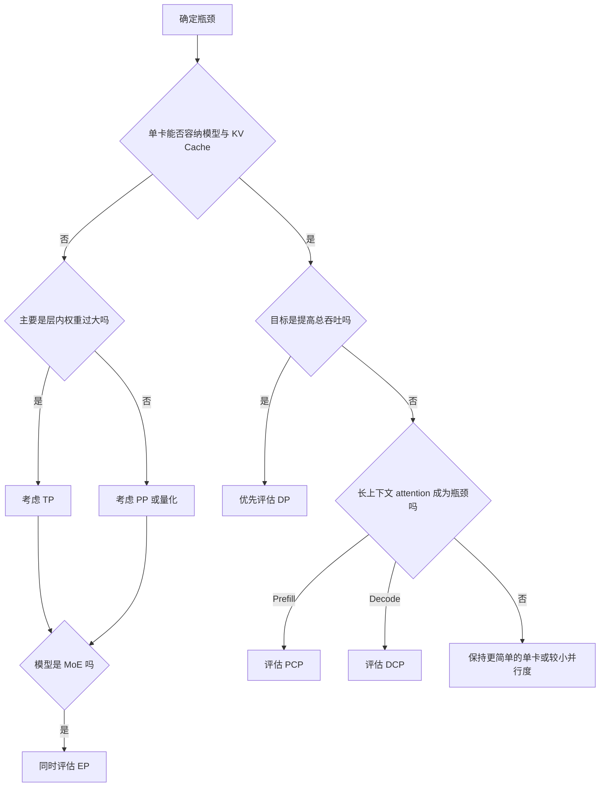

> **读图方法：** 阅读“模型放不下和吞吐不够不是同一个问题”这张流程图时，先把方框看成对象或状态，把箭头看成数据或控制的移动。第一遍从上向下建立顺序，第二遍再核对分支发生的条件。

### 9.1.2 一项配置可能同时改变容量、延迟和吞吐

并行策略没有单一收益：

- 增大 TP 通常降低每卡权重，但增加高频 collective。
- 增大 PP 降低每卡层数，但引入 stage 间传输和流水气泡。
- 增大 DP 增加模型副本与 KV Cache 副本，换取独立处理更多请求。
- 增大 EP 降低每 rank 专家数，但 token 分布不均会制造 straggler。
- PCP/DCP 针对 context 维度，约束 attention backend 和 CUDA Graph 模式。

因此，“用了 8 张卡”不是完整实验条件。至少还要写明 `TP=多少、PP=多少、DP=多少、
PCP/DCP=多少、互联是什么、请求分布是什么`。

---

## 9.2 rank、world size 与 process group

> **本节先看：** 本节要回答：**rank、world size 与 process group**。下面的小节会逐层拆开概念、运行过程和源码落点；第一次阅读先抓对象之间的关系，第二次再记类名、字段和分支。

### 9.2.1 三种 rank 不应混用

在 `vllm/distributed/parallel_state.py` 的 `GroupCoordinator` 中，至少需要区分：

| 名称 | 含义 | 常见用途 |
|---|---|---|
| global rank | 进程在全局 worker world 中的编号 | 建立全局 group、日志定位 |
| local rank | 进程在本机上的编号 | 绑定 CUDA device |
| rank in group | 进程在某个 TP/PP/DP group 内的编号 | 判断 first/last rank、切 shard |

例如 global rank 6 可能绑定本机 `cuda:2`，同时是某个 TP group 的 rank 0、某个 PP group
的 rank 1。看到日志中的 `rank=0` 时，必须先确认它属于哪个命名空间。

### 9.2.2 group 是 collective 的参与者集合

Collective 不是“向所有 GPU 广播”的模糊动作。每次 all-reduce、all-gather 或
all-to-all 都在一个明确 process group 内执行；参与者集合、调用顺序、张量 shape 或
dtype 不一致，都可能导致 hang 或结果错误。

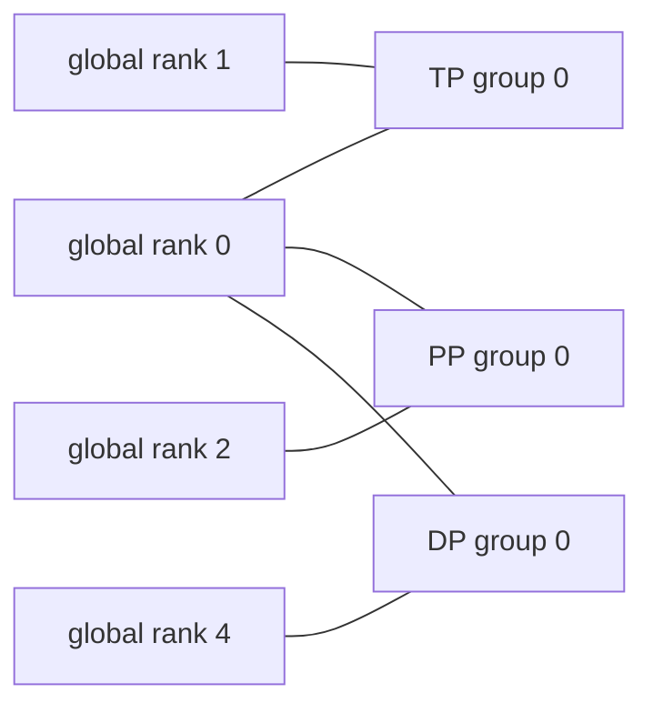

> **读图方法：** 这张图用于压缩“group 是 collective 的参与者集合”的整体关系。先从左向右找到起点、关键转换和终点，再问每条跨层箭头是否意味着函数调用、消息传递、内存访问或状态更新。

`GroupCoordinator` 同时维护：

- CPU group，通常由 Gloo 承担元数据或对象通信；
- device group，承担 GPU tensor collective；
- 可选 device communicator，例如自定义 all-reduce 路径；
- 可选 message queue broadcaster，用于执行器控制面。

这解释了为什么“Gloo 正常”不能证明 NCCL 正常，也解释了某些 PP 传输为何先在 CPU
group 交换 tensor metadata，再在 device group 发送真正的 GPU tensor。

### 9.2.3 常见通信原语

> **本节先看：** 下面先用表格整理“常见通信原语”。先横向比较每一列解决的问题和适用边界，再把具体名称映射到源码。

| 原语 | 输入与输出直觉 | 本章典型场景 |
|---|---|---|
| all-reduce | 每 rank 输入同 shape，所有 rank 得到规约结果 | Row Parallel partial sum |
| all-gather | 每 rank 提供一片，所有 rank 得到拼接结果 | Column Parallel gather、DCP |
| reduce-scatter | 先规约，再把结果切回各 rank | DCP attention 输出 |
| all-to-all | 每 rank 向每个 rank 发送不同片段 | EP token dispatch |
| broadcast | 一个 root 把相同内容发给组内成员 | Worker RPC、控制数据 |
| send/recv | 一对 rank 点对点传输 | PP activation |

---

## 9.3 从配置推导 rank 张量

> **本节先看：** 本节要回答：**从配置推导 rank 张量**。下面的小节会逐层拆开概念、运行过程和源码落点；第一次阅读先抓对象之间的关系，第二次再记类名、字段和分支。

### 9.3.1 当前源码中的 world size 公式

固定版本 `5893426...` 的 `ParallelConfig.__post_init__` 使用：

```math
W_{engine}=TP\times PP\times PCP
```

```math
W_{all\ DP}=TP\times PP\times PCP\times DP
```

源码字段附近仍有把 `world_size` 简写成 “TPxPP” 的旧说明，但真实赋值已经包含 PCP。
因此本书以执行代码为准：**PCP 会增加 worker process 数，DCP 不会。**

`external_launcher` 是特殊路径：外部系统已经启动全部进程，`ParallelConfig.__post_init__`
会把 DP 也并入字段 `world_size`。因此上面的两个公式描述的是普通内部启动路径的逻辑量；
在 external launcher 下，`world_size` 本身已经是 `TP×PP×PCP×DP`。此时若再机械读取
`world_size_across_dp = world_size×DP`，会把 DP 重复计算，不能把该 property 无条件当作
真实进程总数。读代码时必须同时确认启动方式和字段的消费位置。

### 9.3.2 rank 的逻辑布局是一个多维张量

`initialize_model_parallel` 把 ranks 解释为：

```text
ExternalDP x DP x PP x PCP x TP
```

不考虑 ExternalDP 时，TP 是最内层、变化最快的维度。设
`TP=2, PP=2, PCP=1, DP=2`，global rank 可排成：

| DP | PP | PCP | TP=0 | TP=1 |
|---:|---:|---:|---:|---:|
| 0 | 0 | 0 | 0 | 1 |
| 0 | 1 | 0 | 2 | 3 |
| 1 | 0 | 0 | 4 | 5 |
| 1 | 1 | 0 | 6 | 7 |

由此得到：

```text
TP groups = [[0,1], [2,3], [4,5], [6,7]]
PP groups = [[0,2], [1,3], [4,6], [5,7]]
DP groups = [[0,4], [1,5], [2,6], [3,7]]
EP groups = [[0,1,4,5], [2,3,6,7]]
```

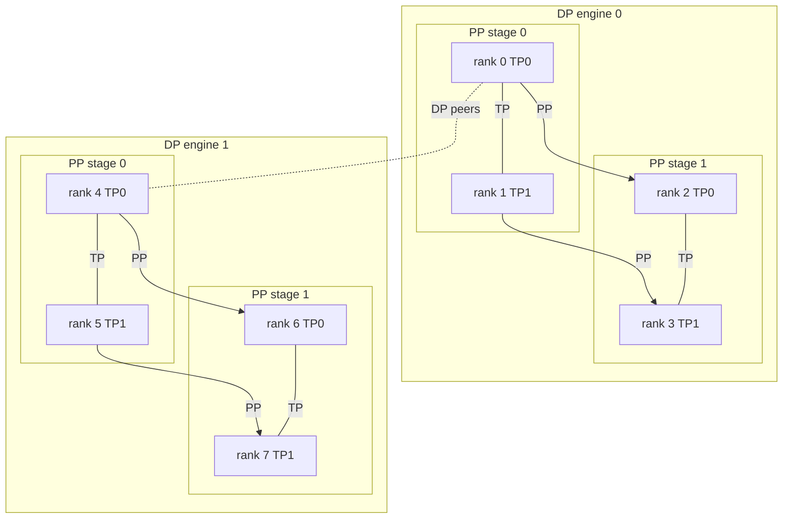

> **读图方法：** 这是“rank 的逻辑布局是一个多维张量”的流程图。先从上向下只追一条主路径，确认输入经过哪些关键阶段到达输出；第二遍再看虚线、回边和旁路，它们通常表示反馈、复用或可选分支。

### 9.3.3 各 group 是对 rank 张量做切片或转置

> **本节先看：** 下面先给出“各 group 是对 rank 张量做切片或转置”的结论清单。先理解每一项为什么存在，再记参数名或实现细节。

- TP group：固定 DP、PP、PCP，沿 TP 取一行。
- PCP group：固定 DP、PP、TP，沿 PCP 取一列。
- PP group：固定 DP、PCP、TP，沿 PP 取一列。
- DP group：固定 PP、PCP、TP，沿 DP 取一列。
- EP group：固定 PP，把 DP、PCP、TP 展平为一个专家并行维度。

这是比背 rank 列表更可靠的心智模型。只要画出 rank 张量，就能重新推导 group。

### 9.3.4 DCP 复用现有进程

当 PCP 关闭时，TP size 必须能被 DCP size 整除；DCP 在已有 TP ranks 上建立子组，不增加
worker 数。当 PCP 开启时，当前配置要求 DCP 为 `1`、`PCP` 或 `TP×PCP`，并优先跨 PCP
维度形成 context group。

这个差异直接影响容量规划：`PCP=2` 会让每个 DP engine 的 worker 数翻倍，`DCP=2`
不会自动多启动两张卡，而是重新解释既有 ranks 的 attention 工作。

---

## 9.4 V1 的进程与对象拓扑

> **本节先看：** 本节要回答：**V1 的进程与对象拓扑**。下面的小节会逐层拆开概念、运行过程和源码落点；第一次阅读先抓对象之间的关系，第二次再记类名、字段和分支。

### 9.4.1 不要把 API、EngineCore 和 Worker 算成同一层

一个常见多进程部署包含：


> **读图方法：** 阅读“不要把 API、EngineCore 和 Worker 算成同一层”这张流程图时，先把方框看成对象或状态，把箭头看成数据或控制的移动。第一遍从左向右建立顺序，第二遍再核对分支发生的条件。

- API 层负责协议、输入输出处理与流式响应。
- EngineCore 拥有 Scheduler、KVCacheManager 和 request state。
- Executor 把一次逻辑 Worker 调用分发到所有相关 ranks。
- Worker 绑定设备，持有模型 shard、KV cache tensor 和 ModelRunner。

因此“8 GPU 就是 8 个进程”并不可靠。API server、EngineCore、DP coordinator、Ray
actor 或监控进程都可能额外存在；真正 GPU worker 数才由并行拓扑推导。

### 9.4.2 TP/PP/PCP 通常扩展一个 EngineCore 下的 Worker group

这些并行方式共同完成同一个 engine 内的一批请求。Scheduler 做出一次决策后，Executor
需要让相关 ranks 以一致顺序执行，否则 collective 无法配对。

### 9.4.3 DP 通常增加完整 EngineCore

普通 DP 中，每个 DP engine 拥有独立：

- Scheduler 的 waiting/running 队列；
- KVCacheManager 和 block 生命周期；
- TP×PP×PCP Worker group；
- 请求 ID 与执行进度。

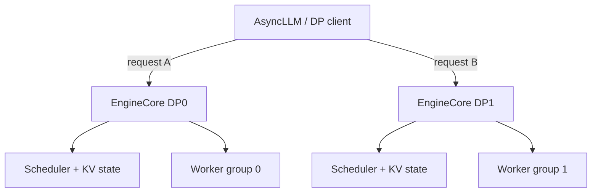

> **读图方法：** 这张图用于压缩“DP 通常增加完整 EngineCore”的整体关系。先从上向下找到起点、关键转换和终点，再问每条跨层箭头是否意味着函数调用、消息传递、内存访问或状态更新。

这就是为什么请求从 DP0 迁移到 DP1 并非“改一个路由指针”：它的 Scheduler 状态、KV
blocks 和模型执行上下文并不在那里。

### 9.4.4 dense DP 与 MoE DP 的同步边界不同

Dense 模型的 DP engines 可以大体独立推进。启用跨 DP 的 EP 后，来自不同 DP engines 的
workers 可能属于同一个 EP group。只要某些 ranks 进入 all-to-all，其他 ranks 也必须以
匹配顺序参与；空闲 engine 可能需要 dummy step 或 coordinated request wave。

---

## 9.5 Tensor Parallel：切一层，而不是切请求

> **本节先看：** 本节要回答：**Tensor Parallel：切一层，而不是切请求**。下面的小节会逐层拆开概念、运行过程和源码落点；第一次阅读先抓对象之间的关系，第二次再记类名、字段和分支。

### 9.5.1 Column Parallel Linear

对线性层 `Y = X A + b`，把权重沿输出维切成：

```math
A=[A_0,A_1,\ldots,A_{p-1}]
```

每个 TP rank 计算：

```math
Y_i=XA_i+b_i
```

本地结果已经是最终输出的一列。如果下一个算子也接受分片输出，可以继续保持分片；若
调用者要求完整 hidden states，则执行 all-gather：

```math
Y=concat(Y_0,Y_1,\ldots,Y_{p-1})
```

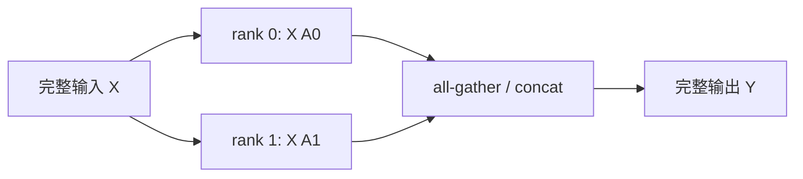

> **读图方法：** 这是“Column Parallel Linear”的流程图。先从左向右只追一条主路径，确认输入经过哪些关键阶段到达输出；第二遍再看虚线、回边和旁路，它们通常表示反馈、复用或可选分支。

`vllm/model_executor/layers/linear.py` 的 `ColumnParallelLinear` 体现了这套契约；是否 gather
由层构造参数与后续算子布局决定，不是每次都无条件通信。

### 9.5.2 Row Parallel Linear

把权重沿输入维切分：

```math
A=\begin{bmatrix}A_0\\A_1\\\vdots\\A_{p-1}\end{bmatrix},
\qquad X=[X_0,X_1,\ldots,X_{p-1}]
```

每个 rank 只能得到 partial output：

```math
P_i=X_iA_i
```

最终输出是所有 partial output 的和：

```math
Y=\sum_i P_i+b
```

所以需要 all-reduce。为避免 bias 被重复累加，当前实现只在 TP rank 0 的 partial output
上加入 bias，再一起规约。

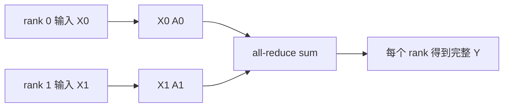

> **读图方法：** 阅读“Row Parallel Linear”这张流程图时，先把方框看成对象或状态，把箭头看成数据或控制的移动。第一遍从左向右建立顺序，第二遍再核对分支发生的条件。

### 9.5.3 MLP 中为何常把两种布局配对

一个典型 MLP 可以先用 Column Parallel 扩展 hidden dimension，让中间 activation 保持
分片；再用 Row Parallel 收缩回 hidden dimension，并在末尾 all-reduce。这样避免在两层
之间先 gather 再 split。

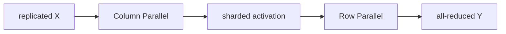

> **读图方法：** 这张图用于压缩“MLP 中为何常把两种布局配对”的整体关系。先从左向右找到起点、关键转换和终点，再问每条跨层箭头是否意味着函数调用、消息传递、内存访问或状态更新。

### 9.5.4 权重加载也必须理解 shard 语义

checkpoint 往往保存完整或按其他格式切分的 tensor。TP layer 的 `weight_loader` 根据当前
TP rank 和 shard dimension 只装载本地片段。排查 shape 错误时，应同时记录：

- checkpoint tensor shape；
- 参数对象的本地 shape；
- shard dimension 与 shard id；
- packed projection 是否把 Q/K/V 或 gate/up 放在同一 tensor；
- quantization 是否改变物理布局。

### 9.5.5 TP 为什么可能更慢

粗略地，一层的时间可以写成：

```math
T_{layer}(p)\approx T_{compute}(1)/p+T_{collective}(p)+T_{imbalance}
```

小 batch decode 的矩阵乘较小，`T_compute/p` 的收益有限，而每层 collective 的固定启动
延迟仍存在。PCIe、跨 NUMA 或跨节点 TP 会进一步放大通信成本。所以“TP=2 比单卡慢”
完全可能是合理结果，不表示 TP 实现错误。

---

## 9.6 Pipeline Parallel：按层切模型

> **本节先看：** 本节要回答：**Pipeline Parallel：按层切模型**。下面的小节会逐层拆开概念、运行过程和源码落点；第一次阅读先抓对象之间的关系，第二次再记类名、字段和分支。

### 9.6.1 layer partition 的真实规则

`vllm/distributed/utils.py:get_pp_indices` 负责默认层划分。它不仅做平均除法，还把余数
分配给靠中间的 stages，避免默认把更多层堆到最后一 stage。

例如 10 层、PP=3：

```text
stage 0: [0, 3)  -> 3 layers
stage 1: [3, 7)  -> 4 layers
stage 2: [7, 10) -> 3 layers
```

若只是用 `ceil(num_layers / pp)` 手算，会得到不同边界。

### 9.6.2 `PPMissingLayer` 表达“不归本 rank 所有”

`make_layers` 只在本 PP stage 实例化真实 Transformer layers；其他位置放置
`PPMissingLayer`。加载 checkpoint 时，`is_pp_missing_parameter` 会跳过不属于本 stage 的
参数。因此每个 rank 看见的 Python 模型骨架可以相似，但真实参数 ownership 不同。

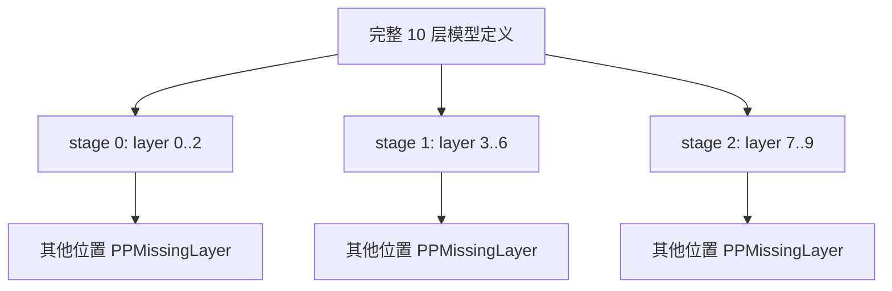

> **读图方法：** 这是“`PPMissingLayer` 表达不归本 rank 所有”的流程图。先从上向下只追一条主路径，确认输入经过哪些关键阶段到达输出；第二遍再看虚线、回边和旁路，它们通常表示反馈、复用或可选分支。

### 9.6.3 首 stage 和末 stage 承担不同职责

以 Llama 路径为例：

- PP first rank 负责 token embedding；
- 非 first rank 从 `IntermediateTensors` 取得上游 hidden states；
- 非 last rank 执行本地 layers 后返回 `IntermediateTensors`；
- PP last rank 执行最终 norm，并进入 logits 与 sampling 路径。

这不是“每张卡跑完整 forward，只忽略一部分输出”。每个 stage 的输入输出协议都不同。

### 9.6.4 Worker 如何传 intermediate tensors

`GPUWorker.execute_model` 在非 first PP rank 上先调用 `irecv_tensor_dict`，在本地执行完成后，
非 last rank 调用 `isend_tensor_dict`。元数据经 CPU group 传递，GPU tensor 经 device group
传递。

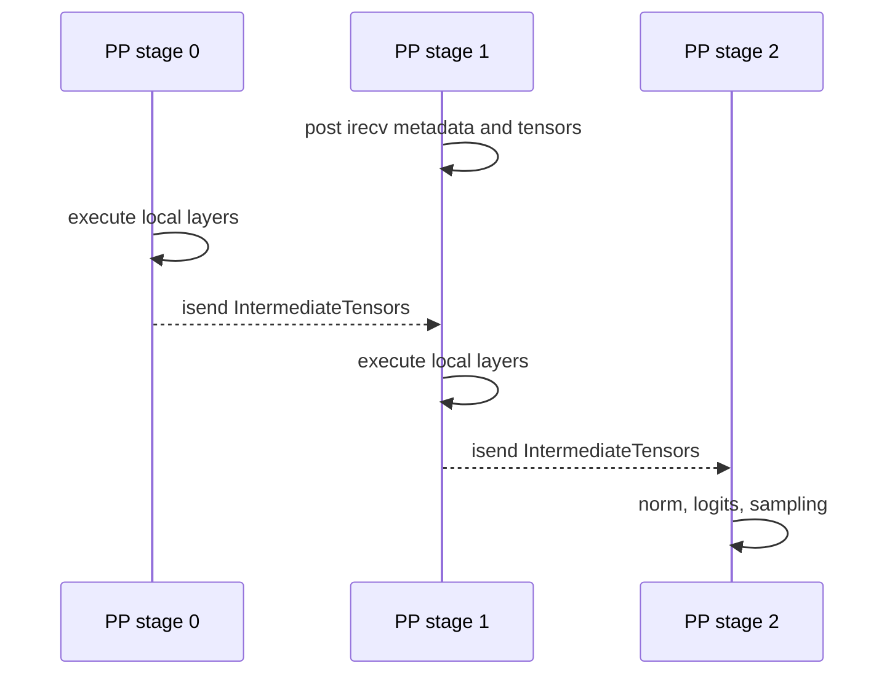

> **读图方法：** 这是“Worker 如何传 intermediate tensors”的时序图。先从左到右确认参与者分别负责什么，再从上到下追踪消息；第一遍只看正常路径，第二遍再看返回、异步消息和失败分支。

若 tensor 在 TP ranks 上只是 slice，通信实现可以先做 TP all-gather，再由对应 PP peer
发送，从而保证下游拿到协议要求的完整 tensor。

### 9.6.5 异步 send 的 buffer 生命周期

`isend` 返回并不表示远端已经消费完数据。当前 Worker 会保存前一次 send handles，并在
下一 step 覆盖或复用相关 buffer 前等待它们完成。

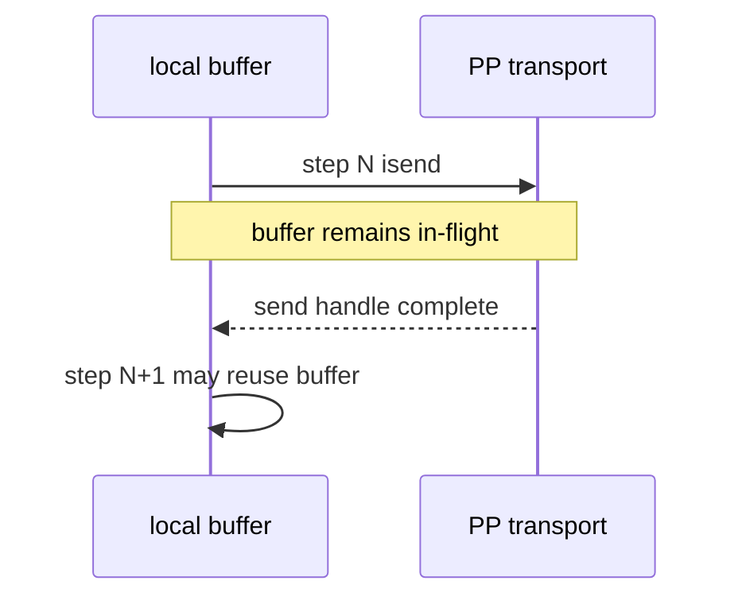

> **读图方法：** 这是“异步 send 的 buffer 生命周期”的时序图。先从左到右确认参与者分别负责什么，再从上到下追踪消息；第一遍只看正常路径，第二遍再看返回、异步消息和失败分支。

如果自定义代码在 handle 完成前改写 buffer，错误可能表现为偶发输出损坏，而不是立即
崩溃。这是异步通信中必须显式维护的 ownership 边界。

### 9.6.6 为什么所有 rank 都执行，但只有一个 rank 返回结果

一次 PP+TP forward 需要全部 ranks 参与，然而最终 sampling 结果只需从输出 rank 返回
EngineCore。MultiprocExecutor 当前计算的输出 rank 与末 PP stage、TP/PCP 布局有关，公式
为 `world_size - tensor_parallel_size * prefill_context_parallel_size`。不要把“只有一个
response”误解为“只有一个 worker 执行”。

### 9.6.7 PP 的气泡

若只有一个 microbatch，stage 1 必须等 stage 0，stage 2 又要等 stage 1：

```text
time ->   0     1     2     3     4
stage 0  [A0]  idle  idle
stage 1  idle  [A1]  idle
stage 2  idle  idle  [A2]
```

增加 pipeline batch queue 可以让不同 batch 在 stages 间重叠，但会增加在途状态、KV
确认边界和故障恢复复杂度。PP 的收益取决于 batch 流是否足以填满流水线。

---

## 9.7 Data Parallel：复制执行状态，切分请求

> **本节先看：** 本节要回答：**Data Parallel：复制执行状态，切分请求**。下面的小节会逐层拆开概念、运行过程和源码落点；第一次阅读先抓对象之间的关系，第二次再记类名、字段和分支。

### 9.7.1 DP 的 ownership

普通 DP engine 持有一份完整模型逻辑，其内部仍可使用 TP/PP/PCP。请求进入某个 DP engine
后，其 Scheduler、KV blocks 和输出进度由该 engine 管理。

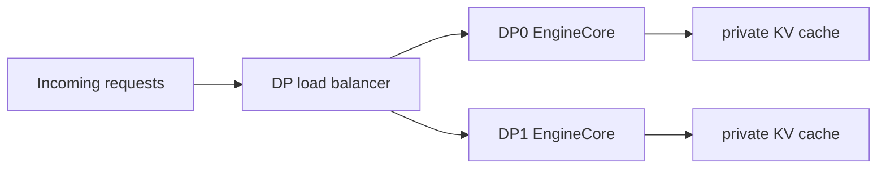

> **读图方法：** 这是“DP 的 ownership”的流程图。先从左向右只追一条主路径，确认输入经过哪些关键阶段到达输出；第二遍再看虚线、回边和旁路，它们通常表示反馈、复用或可选分支。

因此 DP 扩展更接近“多个服务副本”，而不是单次矩阵乘的切分。

### 9.7.2 三类路由方式

`EngineCoreClient.make_async_mp_client` 根据部署模式选择 client：

| 模式 | 代表路径 | 谁选择 DP engine |
|---|---|---|
| external load balancing | `DPAsyncMPClient` | 外部负载均衡器或调用者 |
| internal load balancing | `DPLBAsyncMPClient` | vLLM client 根据 engine stats |
| hybrid/local | 多节点本地 engine 集合 | 外部先选节点，本地再选 engine |

不能只看 `data_parallel_size` 判断路由行为，还要看 external/hybrid 配置。

### 9.7.3 当前内部负载分数

固定源码版本中，`DPLBAsyncMPClient` 的选择逻辑可近似写成：

```math
score_i=max(C\cdot I_i,\ W_i+R_i)
```

若存在 waiting requests，还会加入高 KV 使用率惩罚：

```math
score_i\mathrel{+}=6W_i\cdot max(0,U_i-0.5)
```

其中 `C` 是 client 数，`I` 是本 client 观察到的 in-flight 数，`W/R/U` 分别是 engine
报告的 waiting、running 和 KV usage。选择最小 score，并用轮转起点缓解平局偏置。

这不是一个普适调度定理，而是当前版本的启发式。它试图避免仅依据本地 inflight 计数，
也避免把新请求持续压到 KV 已接近紧张的 engine。

### 9.7.4 `DPCoordinator` 汇总什么

`vllm/v1/engine/coordinator.py` 中的 coordinator 接收各 engine 的：

- waiting request 数；
- running request 数；
- KV cache usage；
- engine 是否存活和可接收请求。

在需要跨 DP 同步的 MoE 场景，它还协调 request wave，使所有相关 ranks 能进入相同顺序
的 collective。

### 9.7.5 为什么 MoE DP 需要 lockstep

假设 DP0 有请求、DP1 空闲，但两者的 workers 属于同一个 EP group：

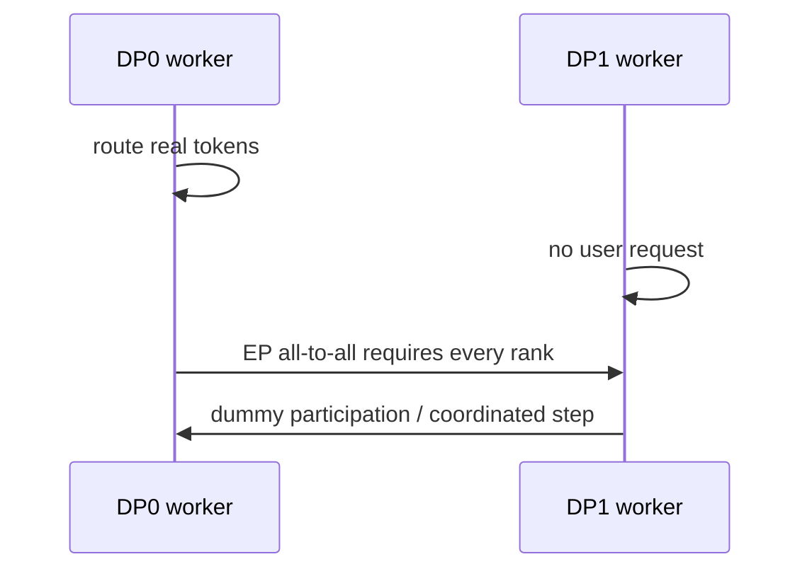

> **读图方法：** 这是“为什么 MoE DP 需要 lockstep”的时序图。先从左到右确认参与者分别负责什么，再从上到下追踪消息；第一遍只看正常路径，第二遍再看返回、异步消息和失败分支。

如果 DP1 完全不进入 all-to-all，DP0 会一直等待。于是 dense DP 中合理的“空闲就睡眠”
策略，在 wide EP 下可能变成死锁。

### 9.7.6 跨 DP batch 协调

`coordinate_batch_across_dp` 对四类事实做跨 DP 规约：原始 token 数、padding 后 token 数、
是否计划 microbatch、graph mode。当前语义包括：

- microbatch 只有所有 DP ranks 都同意时才启用；
- graph 或 microbatch 场景把各 rank padding 到最大 token 数；
- graph mode 取组内最保守的共同模式。

这是 collective shape 一致性的保障，不是普通 API 负载均衡。

---

## 9.8 Expert Parallel：切 experts，搬 tokens

> **本节先看：** 本节要回答：**Expert Parallel：切 experts，搬 tokens**。下面的小节会逐层拆开概念、运行过程和源码落点；第一次阅读先抓对象之间的关系，第二次再记类名、字段和分支。

### 9.8.1 TP 与 EP 的差别

TP 把一个 dense layer 的矩阵切到多 rank；EP 则让每个 rank 拥有一组完整 experts。当前
`FusedMoEParallelConfig.make` 在启用 EP 时把 `DP×PCP×TP` 展平为 EP size，并把 MoE-local
TP 视为 1。

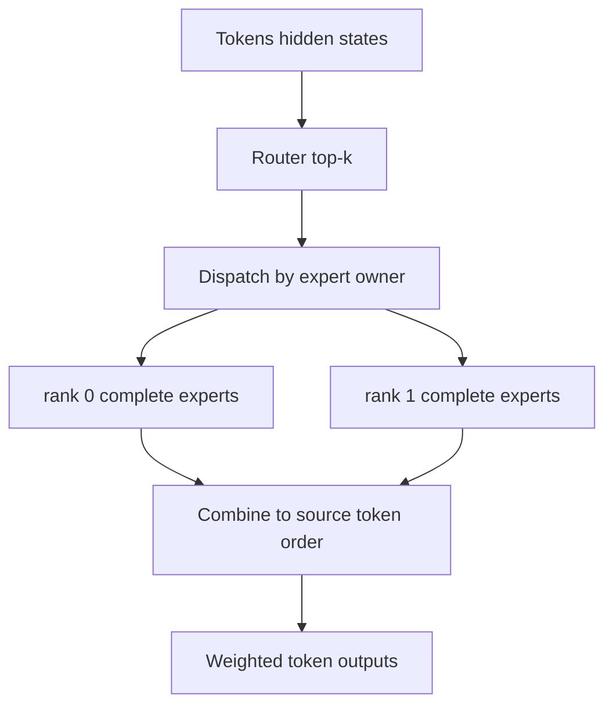

> **读图方法：** 这张图用于压缩“TP 与 EP 的差别”的整体关系。先从上向下找到起点、关键转换和终点，再问每条跨层箭头是否意味着函数调用、消息传递、内存访问或状态更新。

### 9.8.2 expert placement

当前实现支持：

- `linear`：每 rank 获得连续 expert IDs；
- `round_robin`：expert IDs 轮转分配到 ranks。

当 expert 数不能整除 EP size 时，当前代码把余数给**前面的 ranks**。源码某处说明仍写着
“最后的 ranks”，那是陈旧注释；本书以 `ExpertMapManager` 的实际计算为准。

例如 10 experts、EP=4 的 linear placement：

```text
rank 0: experts 0,1,2
rank 1: experts 3,4,5
rank 2: experts 6,7
rank 3: experts 8,9
```

### 9.8.3 route、dispatch、compute、combine

> **本节先看：** 下面先给出“route、dispatch、compute、combine”的结论清单。先理解每一项为什么存在，再记参数名或实现细节。

1. Router 为每个 token 选择 top-k experts 和权重。
2. Dispatch 根据 expert owner 把 token hidden states 发到目标 rank。
3. 每个 rank 对收到的 tokens 执行本地完整 expert MLP。
4. Combine 把结果送回 token 的源位置，并按 router weight 聚合。

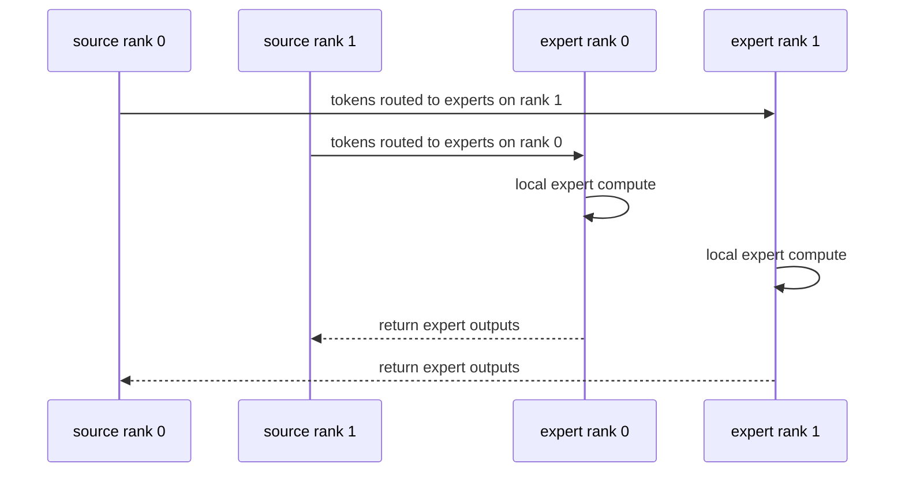

> **读图方法：** 这是“route、dispatch、compute、combine”的时序图。先从左到右确认参与者分别负责什么，再从上到下追踪消息；第一遍只看正常路径，第二遍再看返回、异步消息和失败分支。

`moe_runner` 与 modular kernel 路径把 prepare、expert compute、finalize 分开；某些 all-to-all
实现可以异步准备或完成通信，但依旧必须维护 token mapping 与 buffer 生命周期。

### 9.8.4 EP 性能由最忙的 rank 决定

设 rank `i` 收到的 routed tokens 为 `n_i`，一次专家层的关键路径近似由：

```math
T_{EP}\approx T_{dispatch}+max_i\ T_{expert}(n_i)+T_{combine}
```

决定。平均 token 数很均匀并不足够，某个 batch 内 router 热点就会让其他 ranks 等待。
因此应记录每 rank/expert token histogram，而不只看总 tokens/s。

### 9.8.5 all-to-all backend 不是可忽略细节

不同实现可能采用 all-gather+reduce-scatter、原生 all-to-all 或面向特定硬件的通信 kernel。
选择受 dtype、token 数、拓扑和后端能力影响。调优 EP 时必须把 backend 与 placement 写入
实验记录，否则相同 `EP=8` 可能是完全不同的数据路径。

---

## 9.9 PCP 与 DCP：都切 context，但切法不同

> **本节先看：** 本节要回答：**PCP 与 DCP：都切 context，但切法不同**。下面的小节会逐层拆开概念、运行过程和源码落点；第一次阅读先抓对象之间的关系，第二次再记类名、字段和分支。

### 9.9.1 先看差异表

> **本节先看：** 下面先用表格整理“先看差异表”。先横向比较每一列解决的问题和适用边界，再把具体名称映射到源码。

| 维度 | PCP | DCP |
|---|---|---|
| 全称 | Prefill Context Parallel | Decode Context Parallel |
| 主要阶段 | 长 prompt prefill | 长上下文 decode |
| 是否增加 worker world size | 是 | 否，复用已有 ranks |
| 主要 ownership | prefill token chunks | KV token/context shards |
| 结果恢复 | hidden gather 与原序重排 | partial attention 的 LSE 加权合并 |
| 当前主要实现入口 | `PCPManager` | `attention/ops/dcp.py`、`cp_utils.py` |

### 9.9.2 PCP 的 DualChunkSwap

MRV2 `PCPManager` 把 prefill tokens 切成 `2×PCP` 个 chunks。rank `r` 同时获得前侧 chunk
`r` 和镜像的后侧 chunk `2×PCP-1-r`，以改善 causal attention 工作量平衡。

例如 16 tokens、PCP=4：

```text
chunks: [0,1] [2,3] [4,5] [6,7] [8,9] [10,11] [12,13] [14,15]
rank 0: [0,1]   + [14,15]
rank 1: [2,3]   + [12,13]
rank 2: [4,5]   + [10,11]
rank 3: [6,7]   + [8,9]
```

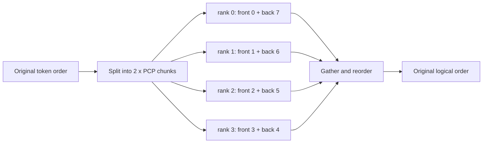

> **读图方法：** 阅读“PCP 的 DualChunkSwap”这张流程图时，先把方框看成对象或状态，把箭头看成数据或控制的移动。第一遍从左向右建立顺序，第二遍再核对分支发生的条件。

Decode tokens 不按相同方式分片，而是复制到 PCP ranks；执行结束后 gathered hidden states
还要按原 token 顺序恢复。切片只是第一步，正确重排同样属于算法契约。

### 9.9.3 当前 PCP 不是通用开关

固定版本的 MRV2 PCP 有明确限制，包括：

- 仅支持 MLA 路径；
- 不与 PP 同时使用；
- 不支持 encoder-decoder、multimodal、LoRA、speculative decode；
- sparse MLA 不支持 CUDA Graph；
- 普通 PCP 只允许 piecewise graph，不允许 full graph。

这些是当前源码约束，不是 PCP 理论本身的永久限制。升级 vLLM 后应重新核对配置校验。

### 9.9.4 DCP 如何分配 KV token

DCP 使用已有 ranks 分摊 decode attention 的 context。一个简化 owner 公式是：

```math
owner(position)=\left\lfloor position/interleave\right\rfloor\bmod DCP
```

`interleave` 允许连续若干位置先归同一 rank，再轮转到下一个 rank。

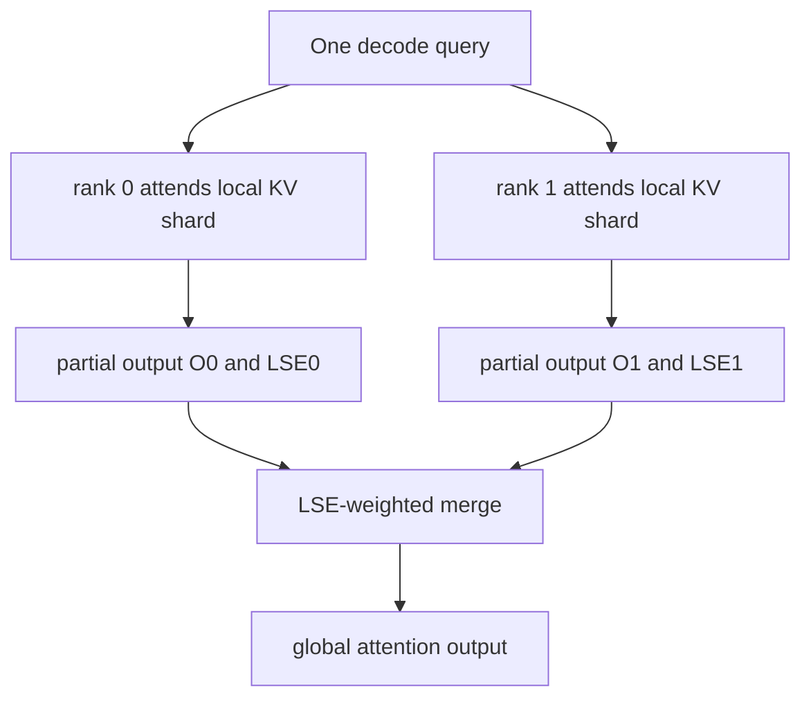

> **读图方法：** 这张图用于压缩“DCP 如何分配 KV token”的整体关系。先从上向下找到起点、关键转换和终点，再问每条跨层箭头是否意味着函数调用、消息传递、内存访问或状态更新。

### 9.9.5 partial attention 为什么不能求平均

每个 DCP rank 只看一部分 keys/values。设其局部 softmax 归一化对数为 `L_i`、局部输出为
`O_i`。全局归一化量是：

```math
L=\log\sum_i e^{L_i}
```

最终输出是：

```math
O=\sum_i e^{L_i-L}O_i
```

直接计算 `(O_0+O_1)/2` 隐含假设两个 shard 的 softmax denominator 相同，通常不成立。
因此 DCP attention backend 必须返回 LSE；没有 LSE，就无法从局部归一化结果精确恢复全局
attention。

### 9.9.6 DCP 的两类通信路径

当前代码包含 AG+RS/AR 与 A2A 等路径：

- AG+RS：收集 query 或必要元数据，本地 attention 后 reduce-scatter/all-reduce 合并；
- A2A：按目标 rank 交换数据，再执行本地 attention 与逆向交换。

哪条路径更快取决于 token shape、互联与 kernel 支持，不能只根据理论字节数下结论。

### 9.9.7 Context Parallel 与 KV Cache

PCP/DCP 会改变 block table、slot mapping 或 token owner 的解释。KV Cache 总章中“一个逻辑
token 映射到一个 block slot”的原则仍成立，但物理 slot 可能属于某个 context rank。
排查时必须同时打印 logical position、block id、slot mapping、DCP owner 和 local rank。

---

## 9.10 Executor backend：谁启动 Worker，谁传 RPC

> **本节先看：** 本节要回答：**Executor backend：谁启动 Worker，谁传 RPC**。下面的小节会逐层拆开概念、运行过程和源码落点；第一次阅读先抓对象之间的关系，第二次再记类名、字段和分支。

### 9.10.1 factory 的选择

`vllm/v1/executor/abstract.py:Executor.get_class` 根据配置与环境选择：

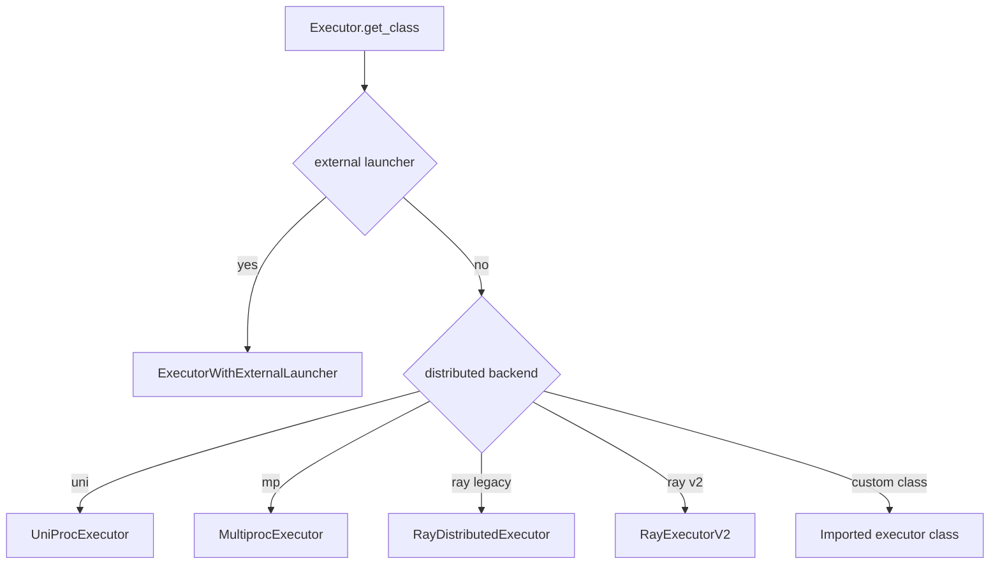

> **读图方法：** 这是“factory 的选择”的流程图。先从上向下只追一条主路径，确认输入经过哪些关键阶段到达输出；第二遍再看虚线、回边和旁路，它们通常表示反馈、复用或可选分支。

不要只因为代码库里存在 `ray_executor_v2.py` 就认定运行时一定使用它；最终选择要看 factory
和配置。

### 9.10.2 UniProc

UniProc 在 EngineCore 进程内直接构造一个 Worker，省去多进程 RPC，适合单 rank 路径和
调试。它仍通过统一 Executor 接口暴露 `execute_model`、`sample_tokens` 等方法。

### 9.10.3 Multiproc

MultiprocExecutor 的控制面主要通过 message queue 广播 Worker RPC；每个 WorkerProc 在
busy loop 中接收方法名与参数，执行后回传结果。模型 forward 内真正的 TP/PP/EP 数据面
通信，则走 torch distributed device process groups。

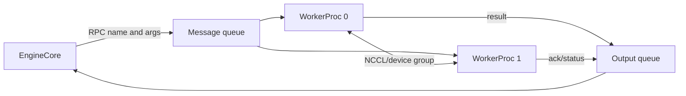

> **读图方法：** 阅读“Multiproc”这张流程图时，先把方框看成对象或状态，把箭头看成数据或控制的移动。第一遍从左向右建立顺序，第二遍再核对分支发生的条件。

控制面正常不代表数据面正常。若所有 Worker 都收到 `execute_model` 后才 hang，应优先检查
collective 顺序、shape 和 NCCL 网络，而不是 API queue。

### 9.10.4 Ray legacy 与 Ray V2

> **本节先看：** 下面先给出“Ray legacy 与 Ray V2”的结论清单。先理解每一项为什么存在，再记参数名或实现细节。

- legacy Ray 把 workers 放入 Ray actors，通过 actor RPC 或 compiled DAG 调用；
- Ray V2 继承更接近 Multiproc 的消息队列控制结构，但由 Ray 负责 actor placement 和资源；
- 两者都需要正确的 GPU placement、node ordering 与 distributed init 地址。

“使用 Ray”只说明资源编排层，不自动消除 NCCL 或 rank 拓扑问题。

### 9.10.5 External launcher

External launcher 面向 `torchrun` 兼容启动器：外部系统已经按 rank 启动进程，并通过
`RANK`、`LOCAL_RANK`、`MASTER_ADDR`、`MASTER_PORT` 让 Worker 使用 `env://` 初始化。每个
Executor 只创建一个本地 Worker；所有 ranks 必须收到确定性相同的输入和调用顺序。配置会
强制把 `VLLM_ENABLE_V1_MULTIPROCESSING` 设为 `0`，Executor 初始化时再次断言该条件；因此
external launcher 与 V1 multiprocessing 不是可自由组合的两个开关。

---

## 9.11 从单机扩展到多机

> **本节先看：** 本节要回答：**从单机扩展到多机**。下面的小节会逐层拆开概念、运行过程和源码落点；第一次阅读先抓对象之间的关系，第二次再记类名、字段和分支。

### 9.11.1 单机优先把高频通信留在高速互联内

TP 和 EP 的 collective 可能每层发生，通常应优先放在 NVLink/NVSwitch 域内；PP 只在
stage 边界传 activation，较适合作为跨节点边界；DP 的普通请求路径最独立，也常用于跨
节点扩展。这是经验规则，不替代测量。

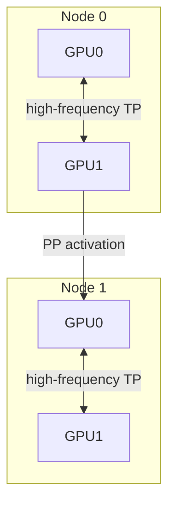

> **读图方法：** 这张图用于压缩“单机优先把高频通信留在高速互联内”的整体关系。先从上向下找到起点、关键转换和终点，再问每条跨层箭头是否意味着函数调用、消息传递、内存访问或状态更新。

### 9.11.2 启动参数必须形成同一事实

多机至少需要一致确认：

- master address 与 port；
- node rank、global rank、local rank；
- world size 与 local world size；
- 每个 rank 可见的 CUDA device；
- 模型文件和 tokenizer 是否可访问；
- 网络接口和 NCCL transport；
- 每个节点的软件、driver 与 CUDA ABI。

一个 rank 使用 8、另一个 rank 使用 16 作为 world size，通常不会友好报错，而会让部分
ranks 永久等待不存在的参与者。

### 9.11.3 hostname 可达不等于 collective 可达

控制面 TCP、Gloo 和 NCCL 可能选择不同接口。排查多机连接时应分别验证：

1. 进程 rendezvous 是否完成；
2. CPU group 是否能做小对象通信；
3. GPU group 是否能做最小 tensor collective；
4. 大 payload 是否受带宽、MTU、RDMA 或防火墙影响。

---

## 9.12 通信与计算重叠：优化之前先守住正确性

> **本节先看：** 本节要回答：**通信与计算重叠：优化之前先守住正确性**。下面的小节会逐层拆开概念、运行过程和源码落点；第一次阅读先抓对象之间的关系，第二次再记类名、字段和分支。

### 9.12.1 重叠依赖三个条件

要让通信与计算真正重叠，通常需要：

- 通信是异步提交的，而不是调用点同步等待；
- 后续计算与通信没有数据依赖；
- buffer 在通信完成前不被覆盖或释放。

```mermaid
sequenceDiagram
    participant C as Compute stream
    participant M as Communication
    C->>M: launch async collective
    C->>C: run independent work
    M-->>C: completion event
    C->>C: consume communicated result
```

> **读图方法：** 这是“重叠依赖三个条件”的时序图。先从左到右确认参与者分别负责什么，再从上到下追踪消息；第一遍只看正常路径，第二遍再看返回、异步消息和失败分支。

只加 `async_op=True` 不保证重叠。如果紧接着 `wait()`，或者两个操作争用同一关键资源，
时间线仍可能串行。

### 9.12.2 collective 顺序是全组协议

下面的逻辑在单进程中看似正常，在两个 ranks 上会 hang：

```text
rank 0: all_reduce(A) -> all_gather(B)
rank 1: all_gather(B) -> all_reduce(A)
```

每个 rank 都调用了相同两个 collective，但顺序不一致。分布式正确性不仅要求“调用集合
相同”，还要求 group、顺序、shape、dtype 与参与次数匹配。

### 9.12.3 graph capture 又增加一层约束

CUDA Graph 要求稳定地址与可捕获操作。跨 rank graph replay 还要求 ranks 对 graph mode、
padding shape 和 collective 顺序达成一致。第 8 章的 `coordinate_batch_across_dp` 正是将
异步调度、graph 与分布式约束交汇起来的例子。

---

## 9.13 启动与一次执行的完整调用链

> **本节先看：** 本节要回答：**启动与一次执行的完整调用链**。下面的小节会逐层拆开概念、运行过程和源码落点；第一次阅读先抓对象之间的关系，第二次再记类名、字段和分支。

### 9.13.1 启动阶段

> **本节先看：** 这一小节先用图建立“启动阶段”的整体路径。先找输入、关键状态和输出，再阅读图后的源码解释，不必一开始记住全部节点。

```mermaid
flowchart TD
    A[EngineArgs / VllmConfig] --> B[ParallelConfig validation]
    B --> C[EngineCoreClient selection]
    C --> D[Create one or multiple EngineCore]
    D --> E[Executor.get_class]
    E --> F[Start Worker processes or actors]
    F --> G[init_device and distributed environment]
    G --> H[initialize_model_parallel groups]
    H --> I[load local weight shards]
    I --> J[allocate local KV cache]
    J --> K[compile and warm up]
```

> **读图方法：** 阅读“启动阶段”这张流程图时，先把方框看成对象或状态，把箭头看成数据或控制的移动。第一遍从上向下建立顺序，第二遍再核对分支发生的条件。

每一步都建立后续运行所依赖的不可变事实：rank、device、group、weight shard 和 KV tensor
shape。启动错误不应只在最终 OOM 时处理，应从最早出现不一致的边界定位。

### 9.13.2 运行阶段：TP+PP 的一个 step

> **本节先看：** 这一小节先用图建立“运行阶段：TP+PP 的一个 step”的整体路径。先找输入、关键状态和输出，再阅读图后的源码解释，不必一开始记住全部节点。

```mermaid
sequenceDiagram
    participant EC as EngineCore
    participant EX as Executor
    participant P0 as PP0 TP group
    participant P1 as PP1 TP group
    EC->>EC: Scheduler.schedule
    EC->>EX: execute_model(SchedulerOutput)
    EX->>P0: broadcast same RPC
    EX->>P1: broadcast same RPC
    P0->>P0: TP local matmul and collectives
    P0-->>P1: IntermediateTensors
    P1->>P1: TP local matmul and collectives
    P1-->>EX: sampled output rank result
    EX-->>EC: ModelRunnerOutput
```

> **读图方法：** 这是“运行阶段：TP+PP 的一个 step”的时序图。先从左到右确认参与者分别负责什么，再从上到下追踪消息；第一遍只看正常路径，第二遍再看返回、异步消息和失败分支。

### 9.13.3 运行阶段：DP+EP 的一个 wave

> **本节先看：** 这一小节先用图建立“运行阶段：DP+EP 的一个 wave”的整体路径。先找输入、关键状态和输出，再阅读图后的源码解释，不必一开始记住全部节点。

```mermaid
sequenceDiagram
    participant C as DP Coordinator
    participant E0 as EngineCore DP0
    participant E1 as EngineCore DP1
    participant W0 as EP ranks from DP0
    participant W1 as EP ranks from DP1
    C->>E0: coordinated step
    C->>E1: coordinated or dummy step
    E0->>W0: execute batch
    E1->>W1: execute batch/dummy
    W0->>W1: route and all-to-all
    W1->>W0: combine all-to-all
```

> **读图方法：** 这是“运行阶段：DP+EP 的一个 wave”的时序图。先从左到右确认参与者分别负责什么，再从上到下追踪消息；第一遍只看正常路径，第二遍再看返回、异步消息和失败分支。

---

## 9.14 性能模型：先估字节，再看时间线

> **本节先看：** 本节要回答：**性能模型：先估字节，再看时间线**。下面的小节会逐层拆开概念、运行过程和源码落点；第一次阅读先抓对象之间的关系，第二次再记类名、字段和分支。

### 9.14.1 alpha-beta 通信模型

一个简化通信时间模型是：

```math
T_{comm}\approx n_{phase}\alpha+\frac{bytes}{bandwidth}
```

`alpha` 是每阶段固定延迟。小 tensor 高频 collective 常被 `alpha` 主导，大 tensor 则更受
带宽影响。该模型不能替代 NCCL profile，但能帮助判断：合并通信、降低频次和减少字节中
哪一种更可能有效。

### 9.14.2 扩展效率

若单卡吞吐为 `Q_1`，使用 `p` 卡的吞吐为 `Q_p`：

```math
speedup=Q_p/Q_1
```

```math
efficiency=\frac{Q_p}{pQ_1}
```

效率低不一定是通信问题，也可能来自：

- 每 rank batch 太小，GEMM 利用率下降；
- PP stage 不平衡；
- EP token skew；
- DP load balancer 把长请求聚到同一 engine；
- KV capacity、CPU input prep 或网络 serving 成为新瓶颈。

### 9.14.3 并行方式的成本轮廓

> **本节先看：** 下面先用表格整理“并行方式的成本轮廓”。先横向比较每一列解决的问题和适用边界，再把具体名称映射到源码。

| 方式 | 高频成本 | 容量收益 | 典型风险 |
|---|---|---|---|
| TP | 每层 collective | 权重按 TP 分片 | 小 batch latency 上升 |
| PP | stage boundary activation | layers 按 PP 分片 | bubble、stage imbalance |
| DP | 模型与 KV 副本 | 请求容量线性扩展潜力 | 负载不均、显存重复 |
| EP | 每个 MoE layer token exchange | experts 分片 | token skew、all-to-all |
| PCP | prefill gather/reorder | prompt 工作分摊 | 功能限制、重排开销 |
| DCP | attention partial merge | context 工作分摊 | backend/LSE 约束 |

---

## 9.15 配置前的检查清单

> **本节先看：** 本节要回答：**配置前的检查清单**。下面的小节会逐层拆开概念、运行过程和源码落点；第一次阅读先抓对象之间的关系，第二次再记类名、字段和分支。

### 9.15.1 拓扑

> **本节先看：** 下面先给出“拓扑”的结论清单。先理解每一项为什么存在，再记参数名或实现细节。

- 写出 `TP、PP、DP、PCP、DCP` 的具体值。
- 计算每个 DP engine 的 worker world size 与跨 DP 总 worker 数。
- 列出每个 global rank 的 node、local rank、device 和坐标。
- 列出 TP/PP/DP/EP/PCP/DCP groups。
- 确认 DCP divisibility 和 PCP 功能限制。

### 9.15.2 容量

> **本节先看：** 下面先给出“容量”的结论清单。先理解每一项为什么存在，再记参数名或实现细节。

- 每 rank 权重与量化 metadata 占用。
- CUDA context、compile 与 graph capture 额外显存。
- 每 DP engine 的 KV Cache 是独立预算。
- PP stage 层数和非 layer 参数是否平衡。
- EP 每 rank expert 数及最大 routed tokens。

### 9.15.3 通信

> **本节先看：** 下面先给出“通信”的结论清单。先理解每一项为什么存在，再记参数名或实现细节。

- 高频 collective 是否跨节点。
- NCCL 实际选择的网络接口与 transport。
- tensor shape、dtype 和调用顺序是否一致。
- 是否存在 async buffer 复用。
- profile 中 compute 与 communication 是否真的重叠。

---

## 9.16 分层排查多 GPU 故障

> **本节先看：** 本节要回答：**分层排查多 GPU 故障**。下面的小节会逐层拆开概念、运行过程和源码落点；第一次阅读先抓对象之间的关系，第二次再记类名、字段和分支。

### 9.16.1 初始化 hang

> **本节先看：** 这一小节先用图建立“初始化 hang”的整体路径。先找输入、关键状态和输出，再阅读图后的源码解释，不必一开始记住全部节点。

```mermaid
flowchart TD
    A[Startup hang] --> B{所有进程都启动了吗}
    B -- 否 --> C[检查 launcher、资源与日志]
    B -- 是 --> D{rendezvous 完成吗}
    D -- 否 --> E[检查 master addr/port/world size]
    D -- 是 --> F{CPU group collective 正常吗}
    F -- 否 --> G[检查路由、防火墙、接口]
    F -- 是 --> H{GPU collective 正常吗}
    H -- 否 --> I[检查 device binding、NCCL、拓扑]
    H -- 是 --> J[检查模型 load/warmup 的 rank 分支]
```

> **读图方法：** 阅读“初始化 hang”这张流程图时，先把方框看成对象或状态，把箭头看成数据或控制的移动。第一遍从上向下建立顺序，第二遍再核对分支发生的条件。

### 9.16.2 运行中 hang

先找最后一个所有 ranks 都完成的逻辑事件，再比较每个 rank 的下一操作：

1. RPC method 是否一致；
2. process group 是否一致；
3. collective 类型与序号是否一致；
4. tensor shape/dtype/device 是否一致；
5. 某 rank 是否因异常提前退出；
6. PP send/recv peer 是否配对；
7. MoE 空闲 DP rank 是否仍参与 wave。

### 9.16.3 OOM

多卡 OOM 要区分：

- 模型 shard 不均，例如 PP stage 多一层或 EP 多一个 expert；
- KV Cache 预算按最小剩余显存对齐；
- CUDA Graph capture 只在部分 rank 额外占用；
- 某个 EP rank 因 token skew 需要更大临时 buffer；
- local rank 绑定错误，两个进程挤在同一 GPU。

### 9.16.4 输出错误但不 hang

优先检查：

- Row Parallel bias 是否重复加入；
- gather/concat dimension 是否正确；
- PP intermediate tensor key、shape 和顺序；
- EP combine 是否恢复 source token order 并乘 router weights；
- PCP gather 后是否恢复原逻辑顺序；
- DCP 是否使用 LSE 加权而不是平均；
- async send buffer 是否过早复用。

### 9.16.5 性能没有扩展

> **本节先看：** 这一小节先用图建立“性能没有扩展”的整体路径。先找输入、关键状态和输出，再阅读图后的源码解释，不必一开始记住全部节点。

```mermaid
flowchart TD
    A[Scaling efficiency low] --> B{GPU 有长 idle gap 吗}
    B -- 是 --> C[看 PP bubble、CPU、调度、straggler]
    B -- 否 --> D{collective 占比高吗}
    D -- 是 --> E[看 topology、payload、频次和 overlap]
    D -- 否 --> F{每 rank GEMM 变小了吗}
    F -- 是 --> G[并行度过高或 batch 太小]
    F -- 否 --> H[看 KV、serving 网络与负载分布]
```

> **读图方法：** 这张图用于压缩“性能没有扩展”的整体关系。先从上向下找到起点、关键转换和终点，再问每条跨层箭头是否意味着函数调用、消息传递、内存访问或状态更新。

---

## 9.17 正确性验证：先证明等价，再谈加速

> **本节先看：** 本节要回答：**正确性验证：先证明等价，再谈加速**。下面的小节会逐层拆开概念、运行过程和源码落点；第一次阅读先抓对象之间的关系，第二次再记类名、字段和分支。

### 9.17.1 分层验证顺序

> **本节先看：** 下面先给出“分层验证顺序”的结论清单。先理解每一项为什么存在，再记参数名或实现细节。

1. **代数层**：小矩阵验证 TP shard 后 gather/reduce 等价于完整 matmul。
2. **拓扑层**：打印 rank coordinates 和 groups，与配置公式核对。
3. **组件层**：验证 PP partition、expert map、PCP chunk、DCP owner。
4. **模型层**：固定 seed 和 sampling，比较单卡与多卡 logits/output。
5. **服务层**：比较请求完成数、顺序、错误率、abort 与超时行为。
6. **故障层**：人为终止 rank 或制造配置错误，确认错误可诊断而非静默卡死。

### 9.17.2 浮点比较不能要求逐 bit 相同

Collective 改变加法顺序，TP/EP 还可能选用不同 kernel。正确比较应使用任务允许的
`atol/rtol`、logit top-k 一致性或固定 greedy 输出，而不是要求所有浮点位完全相同。

### 9.17.3 任何性能实验都要带正确性门槛

若某配置吞吐更高，却丢请求、提前截断输出、改变 sampling 参数或频繁 fallback，它不是
有效优化。第 10 章会把 correctness gate 纳入每一轮 benchmark。

---

## 9.18 随章教学代码

[`examples/ch09_parallel_topology.py`](../../examples/ch09_parallel_topology.py) 不依赖 PyTorch、
CUDA 或 NCCL，复现本章的代数与拓扑契约：

- `ParallelTopology`：rank 坐标以及 TP/PP/DP/EP/PCP/DCP groups；
- `column_parallel_linear`、`row_parallel_linear`：TP 矩阵切分；
- `pipeline_partitions`：当前默认 PP 层划分；
- `pcp_dual_chunk_assignment`：PCP 双 chunk 分配；
- `dcp_token_owner`、`lse_weighted_combine`：DCP owner 与正确归并；
- `expert_map`、`dispatch_tokens`、`combine_expert_outputs`：EP 数据流；
- `choose_dp_engine`：当前内部 DP 负载分数的教学近似；
- `collective_time_us`：alpha-beta 通信估算。

运行：

```bash
python3 examples/ch09_parallel_topology.py
python3 -m unittest tests.test_ch09_parallel_topology
```

示例输出中的 `TP=2, PP=2, DP=2` 应得到每个 DP engine 4 个 workers、跨 DP 共 8 个
workers，并打印与 9.3 节一致的 groups。

### 9.18.1 为什么教学代码不启动 NCCL

它用于验证不依赖硬件的**结构不变量**，不能预测真实 collective 性能，也不能证明 vLLM
GPU 路径已在当前机器运行。真实运行记录应填写
[`experiments/ch09-distributed.md`](../../experiments/ch09-distributed.md)。

---

## 9.19 建议实验

> **本节先看：** 下面的实验从单变量和可观察现象开始。运行前先写预期，运行后同时记录环境、结果和限制。

### 实验 A：把配置展开成 rank 表

分别对以下配置打印 rank coordinates 与全部 groups：

```text
TP=2 PP=1 DP=1 PCP=1 DCP=1
TP=2 PP=2 DP=2 PCP=1 DCP=1
TP=2 PP=1 DP=1 PCP=2 DCP=2
```

检查 group 内 rank 是否完整、无重复，并验证每个 rank 在每种启用的维度中恰好属于一个
group。

### 实验 B：TP 等价性与性能

先用小矩阵证明 Column/Row Parallel 等价于完整 matmul，再在真实模型上比较 TP=1/2：

- 每 rank 权重显存；
- prefill/decode latency；
- collective 时间占比；
- 不同 batch 与输入输出长度；
- NVLink 与 PCIe 拓扑。

不预设 TP=2 必然更快。

### 实验 C：PP activation 与 bubble

使用 PP=2，记录：

- 每 stage layer 区间；
- intermediate tensor keys、shape、dtype；
- send/recv 时间线；
- pipeline batch queue 深度从 1 增大时的吞吐、显存与延迟。

### 实验 D：DP 负载均衡

构造短长请求混合 workload，按时间记录每个 engine 的 waiting/running/KV usage 和新请求
归属。比较轮询、外部 LB 和内部 score，关注 p95/p99，不只看总吞吐。

### 实验 E：EP token skew

每个 MoE layer 记录 expert token histogram、每 rank routed tokens、all-to-all 时间和最慢 rank。
比较 linear 与 round-robin placement，但保持 workload、seed 与 backend 不变。

### 实验 F：故障注入

依次制造：

- 一个 rank 的 world size 错误；
- 一个 rank 绑定错误 GPU；
- PP stage 的 tensor shape 不一致；
- 运行中终止一个 worker。

记录首次可见错误、超时时间、其他 ranks 的最后 collective，并形成排障手册。

---

## 9.20 练习题

> **本节先看：** 下面先给出“练习题”的结论清单。先理解每一项为什么存在，再记参数名或实现细节。

1. `TP=4, PP=2, PCP=2, DP=3` 时，每个 DP engine 与跨 DP 的 worker 数分别是多少？
2. 为什么 `DCP=2` 不一定需要比 `DCP=1` 多两倍进程？
3. 对 `TP=2, PP=2, DP=2` 手工推导 rank 5 的坐标和三个 process groups。
4. 证明 Row Parallel Linear 的 partial outputs 必须求和，不能 concat。
5. 12 层模型使用 PP=5 时，根据 `get_pp_indices` 推导每 stage 层区间。
6. 为什么 PP 的非末 stage 不应该执行最终 sampling？
7. 为什么普通 dense DP 可以独立推进，而跨 DP 的 EP 可能需要 dummy step？
8. 13 experts、EP=4 时，linear 与 round-robin placement 分别是什么？
9. 给出两个 DCP shards 的 `LSE` 与局部输出，计算全局输出并比较简单平均。
10. 设计一个实验区分 TP 性能下降来自 collective latency 还是 GEMM 规模变小。

---

## 9.21 常见误解与纠正

> **本节先看：** 下面先给出“常见误解与纠正”的结论清单。先理解每一项为什么存在，再记参数名或实现细节。

1. **误解：多 GPU 就是 TP。** 纠正：并行方式取决于切分对象。
2. **误解：GPU 数等于进程总数。** 纠正：API、EngineCore、Coordinator 也可能是进程。
3. **误解：`world_size` 永远是 TP×PP。** 纠正：当前 worker world size 包含 PCP；上下文还
   可能讨论跨 DP 总规模。
4. **误解：DCP 会增加 world size。** 纠正：DCP 复用已有 ranks。
5. **误解：增大 TP 一定降低单请求延迟。** 纠正：小 batch 常被 collective 固定延迟主导。
6. **误解：Column Parallel 每层都必须 all-gather。** 纠正：后续算子可继续消费分片输出。
7. **误解：Row Parallel 输出应 concat。** 纠正：每 rank 是同一输出的 partial sum。
8. **误解：每个 PP stage 都加载完整参数。** 纠正：非本地层由 `PPMissingLayer` 占位并跳过加载。
9. **误解：`isend` 返回后 buffer 可立即覆盖。** 纠正：必须等待 send handle 完成。
10. **误解：只有返回结果的 rank 执行 forward。** 纠正：全部相关 ranks 都必须参与。
11. **误解：DP ranks 共用 Scheduler 和 KV Cache。** 纠正：普通 DP engine 的执行状态独立。
12. **误解：空闲 MoE DP rank 可以完全睡眠。** 纠正：wide EP collective 可能要求其参与。
13. **误解：EP 把每个 expert 再按 TP 切分。** 纠正：当前 EP 模式让每设备拥有完整 experts，
    MoE-local TP 为 1。
14. **误解：expert 余数给最后 ranks。** 纠正：当前实现给前面的 ranks。
15. **误解：PCP 就是 DCP。** 纠正：阶段、进程数、ownership 和归并公式都不同。
16. **误解：DCP partial outputs 直接平均。** 纠正：必须使用 LSE 权重恢复全局 softmax。
17. **误解：Ray 会自动解决通信问题。** 纠正：Ray 管理资源，GPU 数据面仍依赖正确 collective。
18. **误解：collective 全部出现一次就不会 hang。** 纠正：group、顺序、shape 和 dtype 也必须一致。

---

## 9.22 本章总结：用七个问题阅读任何分布式路径

面对一段多 GPU 代码，依次问：

1. **切什么？** 权重、layers、requests、experts 还是 context tokens？
2. **谁拥有状态？** 模型 shard、KV block、request state 和临时 buffer 在哪个 rank？
3. **rank 怎样排列？** global/local/group rank 分别是什么？
4. **在哪个 group 通信？** 参与者、顺序、shape 和 dtype 是否一致？
5. **怎样恢复单卡语义？** concat、sum、token reorder 还是 LSE-weighted merge？
6. **关键路径是谁？** 最慢 stage、最忙 expert rank、collective 还是 CPU control plane？
7. **如何证明？** 拓扑表、小规模代数测试、真实 trace 和端到端正确性是否相互印证？

掌握这七个问题，就不必死记每个 backend 的细节；即使源码演进，也能从 ownership 与
communication contract 重新建立理解。

---

## 9.23 源码阅读索引

建议按以下顺序阅读固定版本源码：

1. `vllm/config/parallel.py`：`ParallelConfig`、world size 与配置约束。
2. `vllm/distributed/parallel_state.py`：`GroupCoordinator` 和各 process group。
3. `vllm/distributed/utils.py`：`get_pp_indices`。
4. `vllm/model_executor/layers/linear.py`：Column/Row Parallel Linear。
5. `vllm/model_executor/models/utils.py`：`make_layers`、`PPMissingLayer`。
6. `vllm/model_executor/models/llama.py`：PP first/last stage 模型路径。
7. `vllm/v1/worker/gpu_worker.py`：分布式初始化、PP send/recv 和执行。
8. `vllm/v1/engine/core_client.py`：DP clients 与内部负载均衡。
9. `vllm/v1/engine/coordinator.py`、`core.py`：DP coordinator 与 DP EngineCore processes。
10. `vllm/v1/worker/dp_utils.py`：跨 DP batch 协调。
11. `vllm/v1/executor/`：UniProc、Multiproc、Ray、Ray V2、external launcher。
12. `vllm/model_executor/layers/fused_moe/`：expert map、runner、modular kernel 和 all-to-all。
13. `vllm/v1/worker/gpu/pcp_manager.py`：PCP DualChunkSwap。
14. `vllm/v1/worker/cp_utils.py`、`vllm/v1/attention/ops/dcp.py`：DCP 通信与归并。
15. `tests/distributed/`、`tests/v1/engine/`、`tests/v1/worker/`：边界条件与回归测试。

本章正文、教学模拟器和 CPU 单元测试已经完成，并绑定 commit
`5893426b88f7b3cd21101d194eb1c6f0a6f0e27b`。当前环境没有可用的 NVIDIA 多 GPU vLLM
运行条件，因此真实 NCCL/Ray 多机实验仍标记为 `runtime_verified: false`，不能把静态源码
核对和 CPU 教学测试表述成真实 GPU 验证。
