# 第10章 实验、性能分析与优化

> “更快”不是一个指标，“GPU utilization 更高”不是一个结论，“改完 tokens/s 上升”也
> 不是完整归因。可信优化必须从 workload 和 SLO 开始，以正确性、重复测量和可解释证据结束。

## 本章定位

前九章解释了 vLLM 为什么能工作。本章回答工程上最后、也最容易被误用的问题：

```text
面对一个真实 workload，如何知道瓶颈在哪里，怎样选择改动，并证明收益来自目标机制？
```

这一章不是参数大全。参数名会变化，硬件会变化，模型结构也会变化；更稳定的能力是建立
从用户指标到内部机制的证据链：

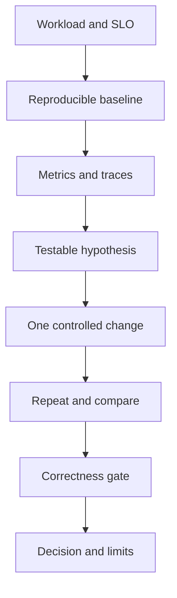

> **读图方法：** 阅读“本章定位”这张流程图时，先把方框看成对象或状态，把箭头看成数据或控制的移动。第一遍从上向下建立顺序，第二遍再核对分支发生的条件。

## 阅读目标

读完本章后，你应当能够：

1. 区分 latency、TTFT、ITL、TPOT、E2EL、throughput 和 goodput。
2. 选择 latency、offline throughput、online serve、component 或 kernel benchmark。
3. 构造固定、Poisson、burst、ramp-up 和 trace replay workload。
4. 区分客户端排队、服务端 Scheduler queue、prefill、decode 与 detokenization 时间。
5. 使用 vLLM 日志、Prometheus、PyTorch Profiler、Proton 和 Nsight Systems 分层定位。
6. 设计单变量实验、参数扫描和 Pareto 选择，而不是只找单一最大 tokens/s。
7. 对 Scheduler、KV Cache、compile/CUDA Graph 和多 GPU 参数做有边界的优化。
8. 把正确性、错误率、尾延迟、显存和稳定性纳入回归门槛。

---

## 如何阅读本章

这一章不是命令清单，而是一套证明优化有效的方法。先写假设，再选指标、控制变量和负载，
最后才运行 benchmark。没有假设的 profile 很容易得到大量时间线，却不知道下一步该改
什么。

指标公式不需要复杂统计背景，但必须分清分子、分母和观察者。TTFT、TPOT、ITL、E2EL
描述的时间区间不同；吞吐和 goodput 对“完成”也有不同要求。先在单个请求时间线上标点，
再聚合百分位，能避免把客户端排队、服务端排队和 GPU 执行混成一个数字。

第一次阅读建立指标词典和五层 benchmark；第二次学习 profiler 与诊断树；第三次设计
完整实验矩阵。任何结果至少同时报告正确性、延迟分布、吞吐、资源使用和实验环境，单个
峰值数字不能支持生产结论。

**先认识统计词。** SLO 是预先规定的服务目标；p99 是把样本排序后约 99% 不超过
的值，受样本量和插值方法影响，不是最大值。CV 是标准差除以均值，用于观察相对波动；
benchmark 测性能，profiler 解释耗时所在。先保留原始样本，再计算汇总值。

**第一遍走法：** 读 10.1–10.4、10.7、10.10、10.18，运行 10.23，再做综合案例；
多种 profiler 与扫参工具可第二遍选读。**停下来算：** 发送后 0.3 秒收到首 token，
共 5 token，末 token 在 0.5 秒，TPOT=`(0.5-0.3)/4=0.05` 秒；客户端发前排队另计。

## 10.1 先定义“谁觉得快”

> **本节先看：** 本节要回答：**先定义谁觉得快**。下面的小节会逐层拆开概念、运行过程和源码落点；第一次阅读先抓对象之间的关系，第二次再记类名、字段和分支。

### 10.1.1 不同使用者的目标不同

> **本节先看：** 下面先用表格整理“不同使用者的目标不同”。先横向比较每一列解决的问题和适用边界，再把具体名称映射到源码。

| 角色或场景 | 更关心的指标 | 可能接受的代价 |
|---|---|---|
| 交互式聊天用户 | TTFT、ITL、p99 | 为低延迟牺牲部分总吞吐 |
| 批量离线生成 | total/output tokens/s、成本 | 接受较高单请求延迟 |
| API 平台 | goodput、错误率、尾延迟 | 在 SLO 内最大化容量 |
| 长文档处理 | prefill latency、KV 容量 | 较慢 decode 可能可接受 |
| 实时语音 | RTFx、稳定 ITL | 输出吞吐必须跟上音频时长 |
| 模型开发者 | kernel latency、数值误差 | 暂不包含完整 serving 开销 |

同一个配置可以让离线吞吐上升，同时让交互 p99 TTFT 变差。没有目标用户与 SLO，“更快”
就没有可判定含义。

### 10.1.2 四种常见优化目标

> **本节先看：** 下面先给出“四种常见优化目标”的结论清单。先理解每一项为什么存在，再记参数名或实现细节。

1. **降低空载延迟**：系统几乎没有排队时，一个请求最快能多快。
2. **提高峰值容量**：在可接受错误率下最大 request/token throughput。
3. **提高 SLO goodput**：满足 TTFT/TPOT/E2EL 门槛的请求数每秒最大。
4. **降低资源成本**：同样 SLO 下减少 GPU 数、显存或功耗。

这些目标需要不同 benchmark。固定 batch latency 无法替代 online goodput，kernel benchmark
也无法直接回答每 GPU 能服务多少并发用户。

---

## 10.2 在请求时间线上定义指标

> **本节先看：** 本节要回答：**在请求时间线上定义指标**。下面的小节会逐层拆开概念、运行过程和源码落点；第一次阅读先抓对象之间的关系，第二次再记类名、字段和分支。

### 10.2.1 客户端看到的时间线

> **本节先看：** 这一小节先用图建立“客户端看到的时间线”的整体路径。先找输入、关键状态和输出，再阅读图后的源码解释，不必一开始记住全部节点。

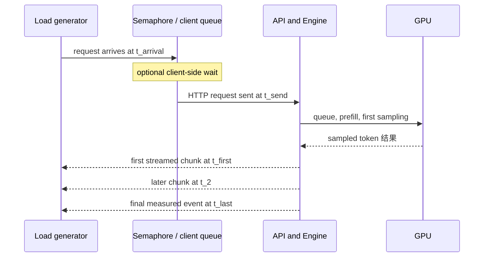

> **读图方法：** 这是“客户端看到的时间线”的时序图。先从左到右确认参与者分别负责什么，再从上到下追踪消息；第一遍只看正常路径，第二遍再看返回、异步消息和失败分支。

先采用每个内容事件对应一个 token 的教学模型。所有 `t` 来自同一客户端时钟，
以下时间差统一用秒；`N` 是输出 token 数，不是响应消息条数。由此定义：

```math
client\_queue=t_{send}-t_{arrival}
```

```math
TTFT=t_{first}-t_{send}
```

```math
ITL_j=t_j-t_{j-1}
```

```math
E2EL=t_{last}-t_{send}
```

若输出 token 数为 `N>1`：

```math
TPOT=\frac{E2EL-TTFT}{N-1}
```

### 10.2.2 ITL 与 TPOT 不是同一个统计量

> **本节先看：** 下面先给出“ITL 与 TPOT 不是同一个统计量”的结论清单。先理解每一项为什么存在，再记参数名或实现细节。

- ITL 是每两个流式事件之间的样本，长请求会贡献更多样本。
- TPOT 是每个请求一个平均值，每个请求在分位数中权重相同。
- 一个请求只有一个输出 token 时，当前 `bench serve` 把其 TPOT 视为 0 用于 goodput，
  但不会把它加入普通 TPOT 样本列表。

因此 `p99 ITL` 与 `p99 TPOT` 可能不同，不能互换名称。

### 10.2.3 chunk 不一定严格等于 token

`endpoint_request_func.py` 在流式响应中按收到的有效消息记录时间；某些 serving backend
可能在一个 chunk 中携带多个 tokens。当前 benchmark 会优先使用 usage 中的 completion
token 数，缺失时可能重新 tokenize 文本；ITL 列表则来自流式事件间隔。

所以跨 backend 比较前必须确认：

- streaming 是否开启；
- backend 是否逐 token flush；
- usage 是否返回真实 token 数；
- tokenizer 是否与服务端一致。

**当前适配器还有细微差异。** `async_request_openai_completions` 在含 choices 的
消息上更新时间戳；chat 适配器 `async_request_openai_chat_completions` 连 usage-only
消息也会更新末时间戳，而且含 choices 的空 content/role 消息可能触发首事件计时。
因此 `t_last` 应解释为该适配器计入的末事件，不能无条件称为最后一个文本 token。

[源码] `vllm/benchmarks/lib/endpoint_request_func.py` -
`async_request_openai_completions`、`async_request_openai_chat_completions`

### 10.2.4 E2EL 不等于服务器纯推理时间

客户端 E2EL 还包含网络、协议解析与流式传输。vLLM 内部 metrics 中的 inference time 则
从首次 scheduled 到最后 token，二者处于不同观测边界。两边同时记录，才能区分服务器
变慢和网络/客户端变慢。

---

## 10.3 吞吐与 goodput

> **本节先看：** 本节要回答：**吞吐与 goodput**。下面的小节会逐层拆开概念、运行过程和源码落点；第一次阅读先抓对象之间的关系，第二次再记类名、字段和分支。

### 10.3.1 三种吞吐分母相同，分子不同

设 benchmark duration 为 `T` 秒、成功请求数为 `R`、成功请求的输入和输出 token 总数
分别为 `I`、`O`。请求吞吐单位是 request/s，token 吞吐单位是 token/s：

```math
request\ throughput=R/T
```

```math
output\ throughput=O/T
```

```math
total\ token\ throughput=(I+O)/T
```

输入很长、输出很短时，total tokens/s 可能很高，却不能说明 decode 很快。报告 tokens/s
时必须写清是 input、output 还是 total。

### 10.3.2 goodput 把 SLO 加入分子

若一个请求必须同时满足 `TTFT<=S_ttft`、`TPOT<=S_tpot`、`E2EL<=S_e2el`：

```math
goodput=\frac{\#\ requests\ satisfying\ all\ configured\ SLOs}{T}
```

当前 `bench serve` 的 goodput 对已配置门槛采用 AND 关系，只计成功请求。CLI 的
`--goodput` 阈值用毫秒，计算时转为秒；未配置门槛时结果字段为 0，不能解释为
“所有请求都不达标”。吞吐 100 req/s、只有 60 req/s
满足 SLO 时，平台可售卖容量更接近 60，而不是 100。

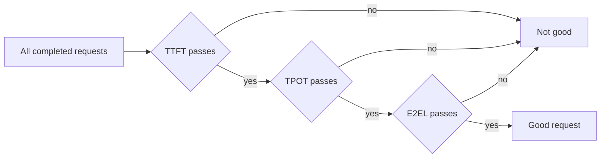

> **读图方法：** 这是“goodput 把 SLO 加入分子”的流程图。先从左向右只追一条主路径，确认输入经过哪些关键阶段到达输出；第二遍再看虚线、回边和旁路，它们通常表示反馈、复用或可选分支。

### 10.3.3 failed requests 不能从报告中消失

只对成功请求计算 latency 分位数会产生幸存者偏差：最慢的请求可能已经 timeout。报告必须
同时包含 completed、failed、错误类型和 timeout 策略。性能更高但错误率上升的实验不能
只展示成功样本的 p50。

---

## 10.4 五层 benchmark 各自回答什么

> **本节先看：** 这一小节先用图建立“五层 benchmark 各自回答什么”的整体路径。先找输入、关键状态和输出，再阅读图后的源码解释，不必一开始记住全部节点。

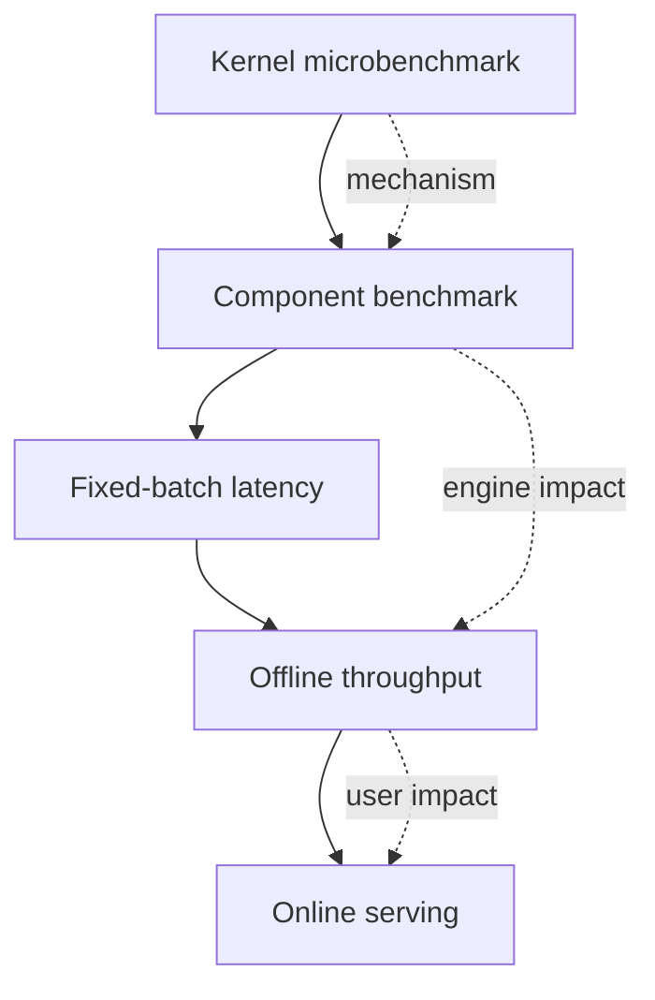

> **读图方法：** 阅读“五层 benchmark 各自回答什么”这张流程图时，先把方框看成对象或状态，把箭头看成数据或控制的移动。第一遍从上向下建立顺序，第二遍再核对分支发生的条件。

| 层级 | 代表工具 | 能回答 | 不能单独回答 |
|---|---|---|---|
| Kernel | attention/GEMM/collective benchmarks | 某 shape 下 kernel 时间 | 端到端吞吐是否上升 |
| Component | `benchmark_block_pool.py` 等 | 单个管理组件成本 | GPU 是否成为瓶颈 |
| Fixed batch | `vllm bench latency` | 固定 batch 完成时间 | 到达率与排队下的尾延迟 |
| Offline | `vllm bench throughput` | 一组已知请求的总处理能力 | HTTP、网络、真实到达过程 |
| Online | `vllm bench serve` | 服务端到端吞吐、TTFT/ITL/E2EL | 单个 kernel 的精确归因 |

优化证据通常要上下贯通：先用 trace 找到热点，再用组件或 kernel benchmark验证机制，最后
回到 online workload 验证用户收益。

---

## 10.5 `vllm bench latency`：固定批次完成时间

> **本节先看：** 本节要回答：**`vllm bench latency`：固定批次完成时间**。下面的小节会逐层拆开概念、运行过程和源码落点；第一次阅读先抓对象之间的关系，第二次再记类名、字段和分支。

### 10.5.1 计时边界

`vllm/benchmarks/latency.py` 构造 `batch_size` 个随机 token prompts，然后：

```text
start = perf_counter()
llm.generate(all prompts)
end = perf_counter()
latency = end - start
```

它不是单 token kernel latency，而是固定批次从 API 调用到所有输出完成的 wall-clock 时间。
如果请求不能在一个 engine step 内完成，Engine 会自动跨多个 batches/steps 推进。

### 10.5.2 默认设计中的几个重要事实

> **本节先看：** 下面先给出“默认设计中的几个重要事实”的结论清单。先理解每一项为什么存在，再记参数名或实现细节。

- 默认有 10 次 warmup、30 次正式迭代。
- 输入和输出长度固定，`ignore_eos=True` 保证输出达到目标长度。
- 可通过 `--disable-detokenize` 排除 detokenization。
- V1 默认启用 prefix caching，但 latency benchmark 默认把它关闭，避免重复 dummy prompts
  让后续迭代被 cache hit 人为加速。
- 输出平均值及 p10/p25/p50/p75/p90/p99，而不是只给一次时间。

### 10.5.3 合适的使用场景

> **本节先看：** 下面先给出“合适的使用场景”的结论清单。先理解每一项为什么存在，再记参数名或实现细节。

- 比较 eager、compile 与 CUDA Graph 的稳定态固定 shape 开销；
- 比较相同 batch 下 TP 或 attention backend；
- 测 cold start 与 warmed steady state，但要分开运行和命名；
- 生成小规模 profiler trace。

它不适合模拟混合长度、随机到达和 Scheduler 排队。

---

## 10.6 `vllm bench throughput`：离线总处理能力

> **本节先看：** 本节要回答：**`vllm bench throughput`：离线总处理能力**。下面的小节会逐层拆开概念、运行过程和源码落点；第一次阅读先抓对象之间的关系，第二次再记类名、字段和分支。

### 10.6.1 所有请求都已知

Offline throughput 把请求集合交给 `LLM.generate` 或 async engine，计时整个集合完成。它适合
批量生成、数据处理和“尽快清空已知队列”的场景。

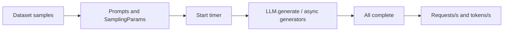

> **读图方法：** 这张图用于压缩“所有请求都已知”的整体关系。先从左向右找到起点、关键转换和终点，再问每条跨层箭头是否意味着函数调用、消息传递、内存访问或状态更新。

### 10.6.2 实际 token 与预期 token

对于能返回 `RequestOutput` 的 vLLM 路径，当前代码从真实 prompt token IDs 与 output token
IDs 统计总量；拿不到 outputs 的路径则用请求中的 `prompt_len + expected_output_len` 估算。
多模态且非 `vllm-chat` 路径还会明确警告 image tokens 计数可能不准确。

这意味着跨 backend 对比前，应确认分子来自实际 token 还是预期 token。

### 10.6.3 warmup 与 `prequeue_requests`

> **本节先看：** 下面先给出“warmup 与 `prequeue_requests`”的结论清单。先理解每一项为什么存在，再记参数名或实现细节。

- `--num-warmups` 使用另一 seed 生成单独 warmup requests，不计入正式时间。
- `prequeue_requests` 先让 scheduling 暂停并把请求全部 enqueue，再唤醒调度；它用于排除逐个
  enqueue 的差异，但不代表 online arrival。
- async engine 路径为每个请求建立 generator，并等待所有 iterators 结束。

修改 prequeue 策略会改变测试问题，不能把两种结果当作同一 workload 的直接 A/B。

---

## 10.7 `vllm bench serve`：真实到达与流式体验

> **本节先看：** 本节要回答：**`vllm bench serve`：真实到达与流式体验**。下面的小节会逐层拆开概念、运行过程和源码落点；第一次阅读先抓对象之间的关系，第二次再记类名、字段和分支。

### 10.7.1 准备、warmup 与正式测量分开

当前 `benchmark` 过程依次执行：

1. endpoint ready check 的单请求试跑；
2. 可选并发 warmup；
3. 可选 `/start_profile`；
4. 记录 Prometheus 中 speculative/diffusion 基线；
5. 按到达过程创建正式请求 tasks；
6. 等待所有 tasks 完成；
7. 停止 profiler 并计算 metrics。

ready check 和 warmup 不进入正式 duration，但会改变 cache、compile 和连接状态。这是有意测
稳定态；若目标是 cold-start，必须另建实验。

### 10.7.2 request rate 与 max concurrency 控制不同维度

> **本节先看：** 下面先给出“request rate 与 max concurrency 控制不同维度”的结论清单。先理解每一项为什么存在，再记参数名或实现细节。

- `request_rate` 决定 load generator 产生请求的速度。
- `max_concurrency` 是客户端连接/任务信号量上限。
- 请求先到达 load generator，再可能等待 semaphore；这一段记录为 `client_queue_time`。
- `RequestFuncOutput.start_time` 保留实际 HTTP 发送时间，TTFT/E2EL 不包含客户端 semaphore
  等待；整个 benchmark duration 则包含所有到达与完成过程。


> **读图方法：** 这是“request rate 与 max concurrency 控制不同维度”的流程图。先从左向右只追一条主路径，确认输入经过哪些关键阶段到达输出；第二遍再看虚线、回边和旁路，它们通常表示反馈、复用或可选分支。

因此 max concurrency 太低时，服务器看起来 TTFT 很好，但大量压力被挡在客户端。必须同时
报告 client queue time，否则会误判服务容量。

### 10.7.3 到达过程

当 request rate 有限时，默认 `burstiness=1` 使用 Poisson arrival，也就是指数分布间隔。
更一般地从 Gamma 分布采样：

```math
interval\sim Gamma(shape=b,\ scale=1/(rate\cdot b))
```

- `b<1` 更 bursty；
- `b=1` 是 Poisson process；
- `b` 趋近无穷时，间隔趋近常数 `1/rate`；
- `request_rate=inf` 时所有 delay 为 0，近似一次性压入全部请求。

`rate` 的单位为 request/s，`b` 是无单位正数，间隔以秒计；其平均值为 `1/rate`。
例如 10 request/s 的平均间隔是 0.1 秒，不表示每个间隔都恰好为 0.1 秒。
固定 request rate 时，代码还会将累计 delay 缩放到 `N/rate`，减少总负载漂移。
严格地说，这使最终间隔不再是相互独立的指数样本；“Poisson”描述原始采样方式，
不是归一化后有限序列的精确概率性质。

[源码] `vllm/benchmarks/serve.py` - `get_request`、`calculate_metrics`

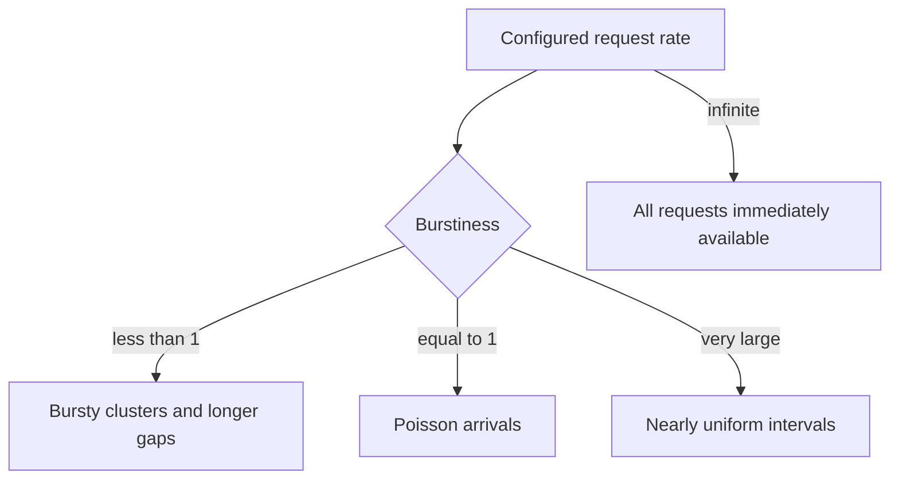

> **读图方法：** 阅读“到达过程”这张流程图时，先把方框看成对象或状态，把箭头看成数据或控制的移动。第一遍从上向下建立顺序，第二遍再核对分支发生的条件。

### 10.7.4 ramp-up 和 trace replay

`bench serve` 可以线性或指数提升 RPS，也可以使用 dataset 中的 timestamps 进行 self-timed
trace replay。前者用于寻找饱和点，后者用于重放真实业务形状。若 trace timestamp 单位错误，
负载会相差几个数量级，因此实验记录必须包含转换 multiplier。

---

## 10.8 workload 是实验的一部分，不是输入附件

> **本节先看：** 本节要回答：**workload 是实验的一部分，不是输入附件**。下面的小节会逐层拆开概念、运行过程和源码落点；第一次阅读先抓对象之间的关系，第二次再记类名、字段和分支。

### 10.8.1 长度分布决定 prefill/decode 比例

> **本节先看：** 下面先用表格整理“长度分布决定 prefill/decode 比例”。先横向比较每一列解决的问题和适用边界，再把具体名称映射到源码。

| workload | 主要压力 | 容易暴露的问题 |
|---|---|---|
| 短输入、长输出 | decode | ITL、CUDA launch、并发 decode batch |
| 长输入、短输出 | prefill | token budget、chunked prefill、attention |
| 长输入、长输出 | KV 与整体容量 | preemption、OOM、尾延迟 |
| 高共享 prefix | prefix cache | hit rate、block reuse、CoW |
| 长短混合 | Scheduler 公平性 | head-of-line interference |
| MoE 路由偏斜 | EP | all-to-all 与 straggler |

只报告平均 input/output length 会隐藏双峰分布。至少给出 min、p50、p90、p99、max 和直方图。

### 10.8.2 random dataset 的用途与风险

Random tokens 适合严格控制 token 长度，不受文本 tokenizer 内容影响；但它不能代表真实
prefix 重复、停止条件、chat template、语言分布和 structured output。因此它适合机制隔离，
不适合作为唯一容量结论。

### 10.8.3 ShareGPT 与真实 trace

真实对话数据提供自然长度与语义，但仍需记录：

- dataset revision 和抽样 seed；
- chat template 与 special tokens；
- 是否使用原回答长度作为 expected output；
- 过滤过长/过短样本的规则；
- sampling 是否 `ignore_eos`。

真实生产 trace 更接近业务，但需脱敏并明确 timestamp、取消请求、重试和多轮 session 的处理。

### 10.8.4 tokenizer 必须对齐

客户端认为 prompt 长 512 tokens，而服务端 tokenizer 得到 540，会同时污染长度分组、吞吐
分子和 max model len 判断。当前 serve benchmark 会尝试通过 `/tokenize` 检测并对齐 prompts，
但 endpoint 不可用时会跳过。最终报告仍应保存服务端实际 usage。

### 10.8.5 cache 实验必须显式构造重复

测 prefix caching 时至少控制：

- 公共 prefix 长度；
- prefix 数量与每个 prefix 重复次数；
- 请求顺序是聚集还是随机；
- block size 与 partial-tail 条件；
- warm cache、cold cache 或周期 reset；
- hit rate 的 token 口径。

否则“打开 cache 后更快”可能只是在 treatment 中碰巧重复更多 prompts。

---

## 10.9 冷启动、warmup 与稳定态

> **本节先看：** 本节要回答：**冷启动、warmup 与稳定态**。下面的小节会逐层拆开概念、运行过程和源码落点；第一次阅读先抓对象之间的关系，第二次再记类名、字段和分支。

### 10.9.1 一次启动包含多种一次性成本

> **本节先看：** 这一小节先用图建立“一次启动包含多种一次性成本”的整体路径。先找输入、关键状态和输出，再阅读图后的源码解释，不必一开始记住全部节点。

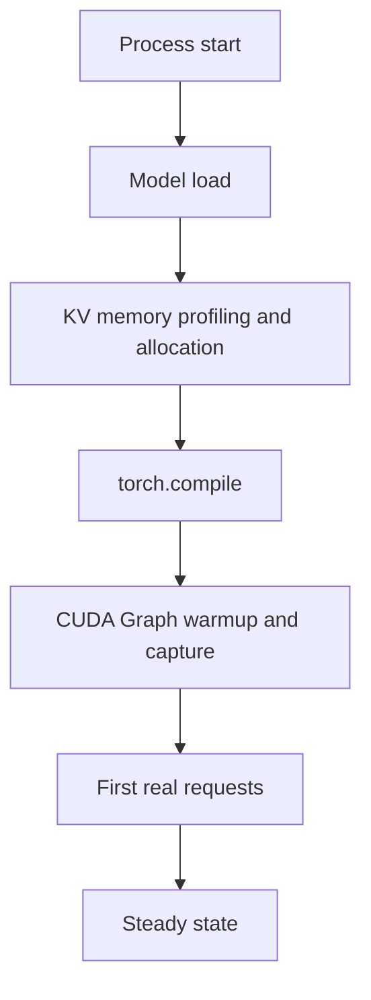

> **读图方法：** 这张图用于压缩“一次启动包含多种一次性成本”的整体关系。先从上向下找到起点、关键转换和终点，再问每条跨层箭头是否意味着函数调用、消息传递、内存访问或状态更新。

把第一请求和第 1000 个请求放在同一个平均值里，会同时测到部署冷启动与稳定态服务，通常
无法解释。

### 10.9.2 warmup 应覆盖会出现的 shape

只 warmup 一个小 batch，不保证大 batch、不同 LoRA、不同 attention mode 或 graph capture
size 已经就绪。第 8 章说明 compile range 与 CUDA Graph descriptor 都与 shape/mode 有关。
实验应记录 warmup workload 是否覆盖正式 workload 的关键 bucket。

### 10.9.3 cache 状态也属于实验状态

需要明确区分：

- cold OS/model cache；
- cold prefix cache；
- warm prefix cache；
- compile cache 命中或未命中；
- CUDA Graph 已 capture 或正在 capture；
- HTTP/TLS connection 是否复用。

### 10.9.4 两类结果都值得报告，但不能混合

> **本节先看：** 下面先给出“两类结果都值得报告，但不能混合”的结论清单。先理解每一项为什么存在，再记参数名或实现细节。

- **Startup experiment**：process start 到 ready、first request TTFT、首次 compile/capture。
- **Steady-state experiment**：完成指定 warmup 后，再开启独立计时窗口。

---

## 10.10 可重复实验的最小合同

> **本节先看：** 本节要回答：**可重复实验的最小合同**。下面的小节会逐层拆开概念、运行过程和源码落点；第一次阅读先抓对象之间的关系，第二次再记类名、字段和分支。

### 10.10.1 固定环境

每个 run 至少保存：

- vLLM commit、未提交修改和构建方式；
- 模型、tokenizer、quantization、LoRA revision；
- GPU 型号、数量、拓扑、driver、CUDA、PyTorch；
- CPU、NUMA、内存和网络；
- 所有 CLI 参数和环境变量；
- container image 或依赖 lock；
- power/clock policy 与同机干扰任务。

### 10.10.2 固定 workload

> **本节先看：** 下面先给出“固定 workload”的结论清单。先理解每一项为什么存在，再记参数名或实现细节。

- 完整 dataset 或可重建的 seed；
- 每个请求的 prompt/output 长度；
- request rate、burstiness、concurrency；
- sampling、EOS、streaming、detokenize；
- warmup、正式请求数和运行时长；
- timeout、retry 和失败统计。

### 10.10.3 一次只改变一个可归因因素

如果同时把 `max_num_batched_tokens`、TP、dtype 和 attention backend 都改了，即使性能提升，
也不知道哪一项有效，更不知道哪些项互相抵消。第一轮使用单变量实验；确认主要因素后，再
做交互矩阵。

### 10.10.4 多次重复与运行顺序

至少关注：

- 重复次数；
- mean、median、p95/p99；
- 标准差或 coefficient of variation；
- baseline/treatment 交替顺序，避免温度和背景负载随时间单向漂移；
- 每次 run 是否重启服务和清 cache。

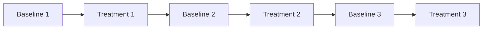

> **读图方法：** 这是“多次重复与运行顺序”的流程图。先从左向右只追一条主路径，确认输入经过哪些关键阶段到达输出；第二遍再看虚线、回边和旁路，它们通常表示反馈、复用或可选分支。

若 treatment 收益 2%，但 baseline 自身 CV 是 5%，目前证据不足以宣称稳定优化。

---

## 10.11 客户端 metrics 与 vLLM 内部 metrics 对齐

> **本节先看：** 本节要回答：**客户端 metrics 与 vLLM 内部 metrics 对齐**。下面的小节会逐层拆开概念、运行过程和源码落点；第一次阅读先抓对象之间的关系，第二次再记类名、字段和分支。

### 10.11.1 内部请求时间拆分

`vllm/v1/metrics/stats.py` 中的 request timestamps 使用两类 clock：frontend arrival 是
wall-clock，EngineCore events 是 monotonic。`IterationStats` 最终形成：

```math
queued=first\ scheduled-first\ queued
```

```math
prefill=first\ token-first\ scheduled
```

```math
decode=last\ token-first\ token
```

```math
inference=last\ token-first\ scheduled
```

preemption 发生在 prefill 或 decode 时，其等待会包含在对应区间内。`scheduled_ts` 只记录
第一次 scheduled，避免抢占后重排覆盖起点。

这些差值的起止点需来自同一时钟；不要用 wall-clock 的 arrival time 去减 monotonic
的 scheduled 时间。按同一请求计算完整区间后再汇总，不能用 E2EL p99 减去各阶段
p99 推导网络延迟，因为几个 p99 可能来自不同请求。

### 10.11.2 Prometheus 关键指标

> **本节先看：** 下面先用表格整理“Prometheus 关键指标”。先横向比较每一列解决的问题和适用边界，再把具体名称映射到源码。

| 指标 | 类型/语义 | 用途 |
|---|---|---|
| `vllm:num_requests_running` | gauge | 当前活跃请求 |
| `vllm:num_requests_waiting` | gauge | Scheduler queue 压力 |
| `vllm:kv_cache_usage_perc` | gauge，0–1 的占用比例 | KV 池内 block 压力，不是进程显存百分数 |
| `vllm:num_preemptions_total` | counter | KV/调度压力结果 |
| `vllm:prompt_tokens_total` | counter | prompt token 总量 |
| `vllm:prompt_tokens_by_source_total` | labeled counter | 本地计算、cache hit、external KV |
| `vllm:generation_tokens_total` | counter | generation token 总量 |
| `vllm:time_to_first_token_seconds` | histogram | 内部 TTFT |
| `vllm:inter_token_latency_seconds` | histogram | 内部 ITL |
| `vllm:e2e_request_latency_seconds` | histogram | 内部 E2E |
| `vllm:request_queue_time_seconds` | histogram | WAITING 时间 |
| `vllm:request_prefill_time_seconds` | histogram | prefill 区间 |
| `vllm:request_decode_time_seconds` | histogram | decode 区间 |

表中的 counter 使用 `/metrics` 导出样本名，带 `_total`；源码构造 `Counter` 时可不写
该后缀。histogram 表中列的是家族名，实际查询常用 `_bucket`、`_sum`、`_count`。
例如 `kv_cache_usage_perc=0.8` 表示池内约 80% 可分配 block 正被引用，不是 0.8%。

[源码] `vllm/v1/metrics/loggers.py` - `PrometheusStatLogger.__init__`

[设计] `docs/design/metrics.md` - 指标类型与导出名称

### 10.11.3 日志吞吐不是请求总 token 数

`LoggingStatLogger` 的 prompt throughput 使用**实际本地计算的 prompt tokens**，排除 cache
hit 与外部 KV transfer；generation throughput 使用生成 tokens。它按日志间隔计算，不等于
`bench serve` 的总输入 token throughput。

同名“prompt throughput”若分子不同，会得出相反结论。开启 prefix cache 后，本地计算
prompt throughput 可能下降，同时业务输入吞吐上升，这并不矛盾。

### 10.11.4 多进程 Prometheus 目录要清理

若用户自行设置 `PROMETHEUS_MULTIPROC_DIR`，当前代码会警告每次 vLLM run 之间必须清空；
残留 shard 文件可能让 counter/gauge 不准确。把旧 metrics 当成新 run 数据，会直接破坏 A/B。

---

## 10.12 从现象到假设：不要让单个指标独自定罪

> **本节先看：** 本节要回答：**从现象到假设：不要让单个指标独自定罪**。下面的小节会逐层拆开概念、运行过程和源码落点；第一次阅读先抓对象之间的关系，第二次再记类名、字段和分支。

### 10.12.1 常见信号组合

> **本节先看：** 下面先用表格整理“常见信号组合”。先横向比较每一列解决的问题和适用边界，再把具体名称映射到源码。

| 现象组合 | 优先假设 | 下一步证据 |
|---|---|---|
| waiting 上升、GPU 持续忙 | GPU/模型执行饱和 | kernel/collective timeline |
| KV usage 高、preemption 增加 | KV 容量压力 | block 数、请求长度、抢占日志 |
| GPU 大量空洞、CPU thread 忙 | input prep/调度/IPC | CPU trace、queue 时间 |
| GPU 忙但 throughput 低 | 小 kernel、通信或低效 shape | kernel summary、batch shape |
| TTFT 差、ITL 正常 | queue/prefill 干扰 | queue/prefill histogram |
| TTFT 正常、ITL 长尾 | decode batch/抢占/通信 | per-step tokens、preemption |
| 平均正常、p99 很差 | burst、长请求或 straggler | 按长度/rank 分组 |
| prefix hit 高但收益低 | 命中粒度或其他瓶颈 | computed tokens、GPU timeline |

### 10.12.2 GPU utilization 的局限

“GPU busy”只说明某段时间有 kernel 执行，不说明：

- kernel 是否达到理想 FLOPS 或带宽；
- shape 是否太小；
- 是否在执行无效 padding；
- 是否大量时间花在 collective；
- 是否满足用户 SLO。

因此 utilization 是入口信号，不是根因结论。

### 10.12.3 MFU/roofline 也需要 workload context

当前 `vllm/v1/metrics/perf.py` 根据模型配置和 SchedulerOutput 估算每 GPU FLOPS 与读写字节，
区分 prefill/decode 的 token-context product。它可帮助判断 compute-bound 或 memory-bound，
但属于解析模型与估算，不是硬件计数器的绝对真值；量化、稀疏和新 kernel 还可能让模型近似
不完整。

---

## 10.13 找饱和点，而不是只测“无限请求”

> **本节先看：** 本节要回答：**找饱和点，而不是只测无限请求**。下面的小节会逐层拆开概念、运行过程和源码落点；第一次阅读先抓对象之间的关系，第二次再记类名、字段和分支。

### 10.13.1 开环与闭环负载

> **本节先看：** 下面先给出“开环与闭环负载”的结论清单。先理解每一项为什么存在，再记参数名或实现细节。

- 固定 request rate 是开环：无论系统变慢，load generator 仍按计划产生请求。
- 仅设置 max concurrency 不会改变上游到达过程；配合无限 request rate 和充足待发
  请求时，向服务端补位的行为才近似闭环：请求完成后释放 slot。有限 rate 与信号量
  同时存在时，仍可能在客户端持续积累等待。
- `request_rate=inf` 且大量 prompts 是一次性 batch pressure，不代表稳态到达。

开环适合观察过载与排队；闭环适合估算一定并发用户下的体验。两者不能混为一个“并发数”。

### 10.13.2 典型饱和曲线

> **本节先看：** 这一小节先用图建立“典型饱和曲线”的整体路径。先找输入、关键状态和输出，再阅读图后的源码解释，不必一开始记住全部节点。

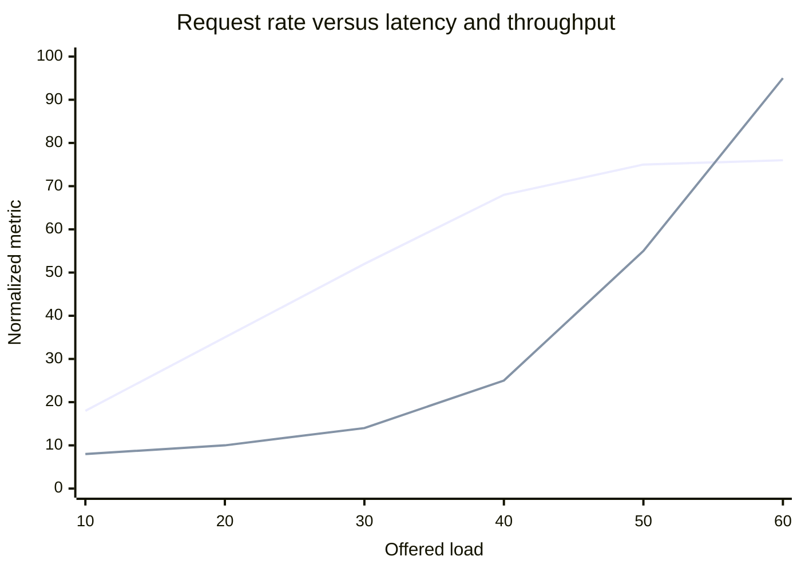

> **读图方法：** 这是“典型饱和曲线”的趋势图。先确认横轴控制变量和纵轴指标，再比较拐点与变化方向；示意曲线用于解释关系，不能替代在指定硬件和负载上的 benchmark。

曲线转折处表示 throughput 开始趋平，而 queue 与 p99 快速上升。生产容量通常应留在转折点
左侧，而不是选择峰值 throughput 对应的过载点。

### 10.13.3 用 goodput 找可服务容量

逐步增加 RPS，记录 request throughput、goodput、p99 TTFT/TPOT 和错误率。最后一个满足
全部 SLO 且 goodput 接近 offered load 的点，才是更有意义的容量估计。

### 10.13.4 probe request 观察受压体验

当前 serve benchmark 可在主 workload 之外周期发送 1-token probe。它能观察背景压力下轻量
请求的延迟，但 probe 本身也增加负载；必须记录 probe rate，并与无 probe baseline 对照。

---

## 10.14 参数实验矩阵：每个旋钮改变哪条机制

> **本节先看：** 本节要回答：**参数实验矩阵：每个旋钮改变哪条机制**。下面的小节会逐层拆开概念、运行过程和源码落点；第一次阅读先抓对象之间的关系，第二次再记类名、字段和分支。

### 10.14.1 Scheduler 参数

> **本节先看：** 下面先用表格整理“Scheduler 参数”。先横向比较每一列解决的问题和适用边界，再把具体名称映射到源码。

| 参数方向 | 可能收益 | 可能代价 | 应观察 |
|---|---|---|---|
| 增大 max batched tokens | 更大 prefill/GEMM、吞吐 | 单 step 更长、ITL 抖动、显存 | batch tokens、TTFT、ITL |
| 增大 max sequences | 更多 decode 并发 | KV 占用、小 kernel/调度压力 | running、KV、output TPS |
| chunked prefill | 限制长 prefill 独占 | 更多 steps 和调度开销 | 短请求 TTFT、长请求 E2E |
| scheduling policy | 改善目标请求优先级 | 可能牺牲公平性 | 分组尾延迟、starvation |
| async scheduling | CPU/GPU 重叠 | placeholder 与 feature 限制 | GPU gaps、stale output |

### 10.14.2 KV Cache 参数

> **本节先看：** 下面先用表格整理“KV Cache 参数”。先横向比较每一列解决的问题和适用边界，再把具体名称映射到源码。

| 参数方向 | 可能收益 | 可能代价 | 应观察 |
|---|---|---|---|
| 提高 gpu memory utilization | 更多 blocks、少抢占 | OOM 余量变小 | KV usage、preemption、峰值显存 |
| 调整 block size | 元数据/碎片折中 | kernel/backend 限制 | waste、hit、attention 时间 |
| 开启 prefix caching | 跳过重复 prefill | hash/metadata、低重复无收益 | hit、computed prompt tokens |
| KV dtype/量化 | 增加容量、降低带宽 | 精度和 kernel 支持 | 质量、容量、attention 时间 |
| KV offload/connector | 扩展容量或复用 | 传输延迟与抖动 | external hit、transfer time |

### 10.14.3 compile 与 CUDA Graph 参数

> **本节先看：** 下面先给出“compile 与 CUDA Graph 参数”的结论清单。先理解每一项为什么存在，再记参数名或实现细节。

- eager baseline 用于判断 compile/graph 的净收益。
- compile sizes 影响编译范围与冷启动。
- capture sizes 越多，覆盖更细，但 warmup/显存成本增加。
- padding 到 capture size 可能减少 launch overhead，却增加无效计算。
- backend/feature fallback 必须从运行时 descriptor 或 metrics 确认，不能只看配置值。

### 10.14.4 并行参数

第 9 章已经说明 TP/PP/DP/EP/PCP/DCP 的成本不同。实验矩阵至少同时报告每 GPU 与系统级：

- throughput；
- p99 latency；
- peak memory；
- communication fraction；
- scaling efficiency；
- 成本或 tokens/s/GPU。

只看系统总 tokens/s 会偏向无限增加 GPU，即使单位成本恶化。

---

## 10.15 Profiling：选择能回答问题的工具

> **本节先看：** 本节要回答：**Profiling：选择能回答问题的工具**。下面的小节会逐层拆开概念、运行过程和源码落点；第一次阅读先抓对象之间的关系，第二次再记类名、字段和分支。

### 10.15.1 profiling 会改变被测系统

vLLM 的 profiling 文档明确提示：profiler 用于开发诊断，会显著降低推理性能。开启 shape、
memory、stack 或 FLOPS 记录还会增加额外开销。因此：

- benchmark run 用于量化性能；
- profile run 用于解释时间花在哪里；
- 不要把 profile run 的吞吐当生产性能。

### 10.15.2 PyTorch Profiler

当前 `ProfilerConfig` 支持：

- CPU 与 CUDA activities；
- stack、shape、memory、FLOPS 选项；
- wait/warmup/active schedule；
- delay/max engine iterations；
- rank-qualified trace names；
- 可选 CUDA Graph capture trace。

```text
vllm serve MODEL \
  --profiler-config '{"profiler":"torch","torch_profiler_dir":"./trace"}'

vllm bench serve ... --profile --num-prompts 8
```

多 rank 下每个 Worker 各自产生 trace。比较之前先确认 trace 文件对应的 DP/PP/TP/DCP/EP
坐标，而不是只打开 rank 0。

### 10.15.3 Proton

Proton 面向 Triton kernel，可输出 aggregate tree 或 Chrome trace。固定源码版本中 NVIDIA
CUPTI 可用，要求 eager execution，不支持 CUDA Graph profiling；tree/trace 与输出格式有
组合约束。它适合深入 Triton kernel，但不替代完整 CPU、IPC 和网络时间线。

### 10.15.4 Nsight Systems

Nsight Systems 更适合低开销系统时间线，观察：

- CPU thread 与 CUDA API；
- kernel launch gap；
- CUDA Graph nodes；
- NCCL collective；
- streams 间 overlap；
- 多进程时间关系。

多进程 vLLM 常需 `--trace-fork-before-exec=true`，CUDA Graph 可使用
`--cuda-graph-trace=node`；动态 capture 可由 vLLM 的 CUDA profiler API 配合 start/stop。

### 10.15.5 CPU profiler

若 GPU 时间线存在空洞，应继续检查：

- tokenization 与 chat template；
- input processing 与 multimodal preprocessing；
- Scheduler Python；
- block hashing 与 BlockPool；
- IPC serialization、message queue；
- detokenization 与 HTTP streaming。

`cProfile` 适合 Python call 聚合，但对异步并发和跨进程时间线有限；必要时结合 per-process
trace 与日志中的 request ID。

---

## 10.16 读时间线的模式语言

> **本节先看：** 本节要回答：**读时间线的模式语言**。下面的小节会逐层拆开概念、运行过程和源码落点；第一次阅读先抓对象之间的关系，第二次再记类名、字段和分支。

### 10.16.1 launch-bound decode

> **本节先看：** 下面的代码或调用链只保留“launch-bound decode”的主干。阅读时依次寻找输入、状态变化和输出，暂时忽略辅助分支。

```text
GPU: [tiny kernel] gap [tiny kernel] gap [tiny kernel] gap
CPU: launch -------- launch -------- launch --------
```

特征是大量小 kernel 和明显 CPU launch gap。候选措施是 CUDA Graph、算子融合、增大 decode
batch；验证时看 gap 是否缩短，而不只是 GPU utilization 是否上升。

### 10.16.2 memory-bound attention

> **本节先看：** 下面的代码或调用链只保留“memory-bound attention”的主干。阅读时依次寻找输入、状态变化和输出，暂时忽略辅助分支。

```text
GPU: [long attention / KV read] [long attention / KV read]
HBM: near bandwidth limit
SM:  below peak FLOPS
```

长 context decode 常接近该模式。候选是更合适 backend、KV dtype、DCP 或减少 context；增大
算术并行度不一定有效。

### 10.16.3 PP bubble

> **本节先看：** 下面的代码或调用链只保留“PP bubble”的主干。阅读时依次寻找输入、状态变化和输出，暂时忽略辅助分支。

```text
PP0: compute ---- idle ---- compute ---- idle
PP1: idle ---- compute ---- idle ---- compute
```

检查 stage 层数、activation transfer、batch queue 深度和最慢 stage。只优化快 stage 不会缩短
关键路径。

### 10.16.4 EP straggler

> **本节先看：** 下面的代码或调用链只保留“EP straggler”的主干。阅读时依次寻找输入、状态变化和输出，暂时忽略辅助分支。

```text
rank 0: dispatch [expert compute---------------] combine
rank 1: dispatch [expert compute----] waiting  combine
```

需要 expert token histogram、每 rank compute 和 all-to-all，而不是只看全组平均 kernel 时间。

### 10.16.5 CPU control-plane gap

> **本节先看：** 下面的代码或调用链只保留“CPU control-plane gap”的主干。阅读时依次寻找输入、状态变化和输出，暂时忽略辅助分支。

```text
GPU: compute ................. compute
CPU: scheduler/input/IPC work
```

确认这段 gap 是否真的位于 GPU critical path。异步 input prep 即使很慢，只要与 GPU 完全重叠，
也未必影响吞吐。

### 10.16.6 KV pressure 与 preemption

> **本节先看：** 这一小节先用图建立“KV pressure 与 preemption”的整体路径。先找输入、关键状态和输出，再阅读图后的源码解释，不必一开始记住全部节点。

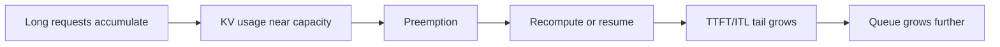

> **读图方法：** 这张图用于压缩“KV pressure 与 preemption”的整体关系。先从左向右找到起点、关键转换和终点，再问每条跨层箭头是否意味着函数调用、消息传递、内存访问或状态更新。

这是反馈循环。仅增大 token budget 可能让瞬时吞吐更高，却更快吃满 KV，最终让尾延迟恶化。

---

## 10.17 Component 与 kernel benchmark 的正确用法

> **本节先看：** 本节要回答：**Component 与 kernel benchmark 的正确用法**。下面的小节会逐层拆开概念、运行过程和源码落点；第一次阅读先抓对象之间的关系，第二次再记类名、字段和分支。

### 10.17.1 `benchmark_block_pool.py`

该微基准反复调用 `BlockPool.get_new_blocks` 和 `free_blocks`，每组前执行 GC，报告平均/最大
微秒。它能回答 Python block allocator 在指定 pool/allocate size 下的成本，不能说明完整 KV
Cache 或 GPU attention 性能。

### 10.17.2 prefix cache benchmark

`benchmark_prefix_caching.py` 可构造固定 prompt 或 ShareGPT prompts，并重复、排序或打乱。它
适合建立有/无 cache 的对照，但使用 `time.time` 包围整个 `llm.generate`，没有 TTFT/ITL
拆分。若要解释交互体验，应结合 serve benchmark 与 cache metrics。

### 10.17.3 attention/kernel benchmark

必须使用从真实 trace 提取的 shape 分布，而不是只测一个方便的 `batch=1, seq=2048`。至少覆盖：

- prefill 与 decode；
- 常见和尾部 batch sizes；
- context length buckets；
- dtype、head layout、block size；
- eager 与 graph；
- warm cache 与冷 kernel compilation。

### 10.17.4 微基准收益怎样传回端到端

先假设其他阶段耗时不变、阶段串行且工作量固定。`f` 是该 kernel 占原耗时的比例
（0 到 1），`s` 是其加速倍数，两者无单位，Amdahl 加速上限为：

```math
S_{total}\leq\frac{1}{(1-f)+f/s}
```

一个占 5% 的 kernel 即使快 2 倍，端到端理论收益也只有约 2.6%。如果报告端到端提升 20%，
说明还改变了别的机制或测量条件，应继续调查。

---

## 10.18 从 baseline 到优化结论的闭环

> **本节先看：** 本节要回答：**从 baseline 到优化结论的闭环**。下面的小节会逐层拆开概念、运行过程和源码落点；第一次阅读先抓对象之间的关系，第二次再记类名、字段和分支。

### 10.18.1 第一步：建立可复现 baseline

先运行足够长的 steady-state workload，保存原始 JSON、Prometheus 区间增量、server log、
GPU telemetry 和完整命令。检查错误率、长度分布和 run-to-run variance。

### 10.18.2 第二步：定位用户指标的主要组成

先区分两种抱怨：“从用户计划发送到看到首字很慢”可能含客户端等待；
`bench serve` 的 TTFT 已排除 semaphore 等待。对后者，应查服务端排队、prefill、
网络和前端处理，不能把客户端排队直接算进 TTFT。

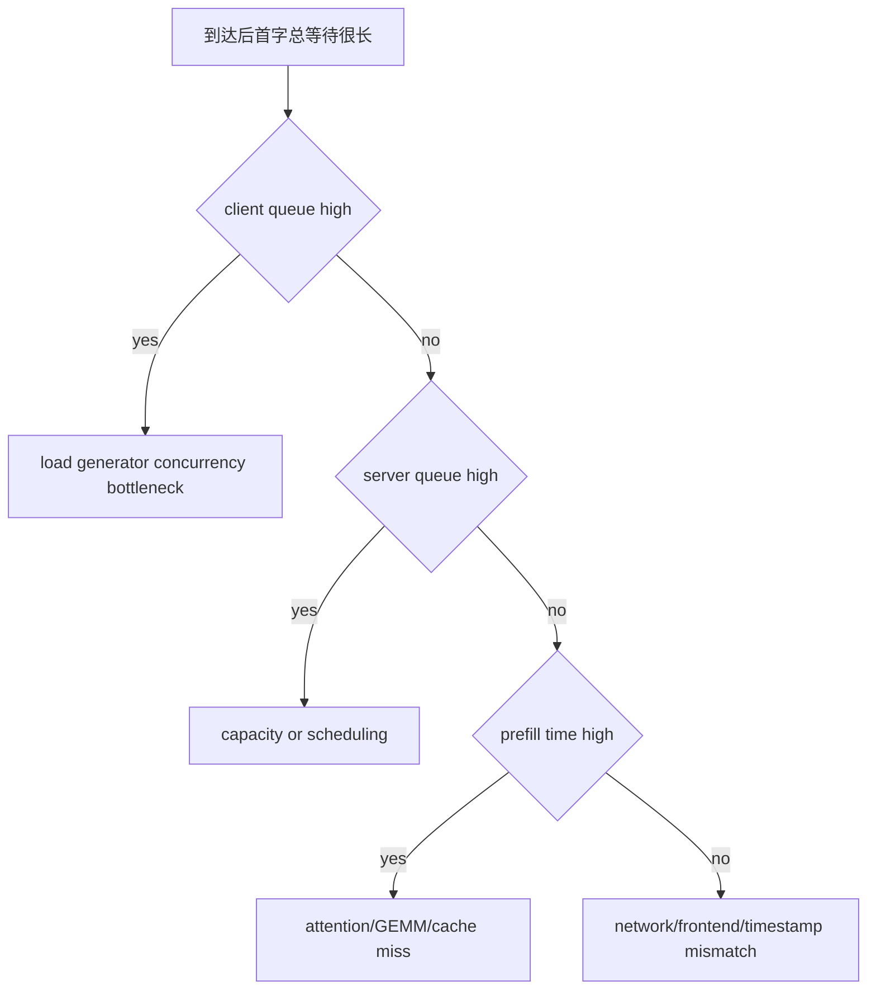

> **读图方法：** 这是“第二步：定位用户指标的主要组成”的流程图。先从上向下只追一条主路径，确认输入经过哪些关键阶段到达输出；第二遍再看虚线、回边和旁路，它们通常表示反馈、复用或可选分支。

### 10.18.3 第三步：提出可证伪假设

坏假设：“Scheduler 太慢。”

可测试假设：“在短长混合 workload 中，长 prefill 让每个 engine step 超过 80 ms，导致短请求
p99 TTFT；限制每 step prefill tokens 后，短请求 p99 TTFT 应下降，同时 GPU idle 不明显上升。”

后者明确了场景、机制、可观察证据和潜在代价。

### 10.18.4 第四步：只改一个因素并重复

记录 treatment 唯一差异，交替运行，多次重复。计算：

```math
change\%=\left(\frac{treatment}{baseline}-1\right)\times100
```

对于 latency，负 change 是改善；对于 throughput，正 change 是改善。报告中必须明确方向。

### 10.18.5 第五步：通过 correctness gate

至少检查：

- 成功请求数与错误率；
- 固定 greedy 输出或 logit 容差；
- output length 与 finish reason；
- NaN/corrupted metrics；
- timeout、abort、server health；
- 长时间内存稳定性。

### 10.18.6 第六步：写出适用边界

一项优化可能只对 H100、短 decode、batch>32、特定 attention backend 有效。明确边界不是削弱
结论，而是让结论可以被正确复用。

---

## 10.19 综合案例：长 prompt 干扰短聊天请求

> **本节先看：** 本节要回答：**综合案例：长 prompt 干扰短聊天请求**。下面的小节会逐层拆开概念、运行过程和源码落点；第一次阅读先抓对象之间的关系，第二次再记类名、字段和分支。

### 10.19.1 问题定义

Workload 包含：

- 80% 短请求：input p50 128、output p50 128；
- 20% 长请求：input p50 8192、output p50 64；
- Poisson arrival；
- SLO：短请求 TTFT p99 < 1 s、TPOT p99 < 80 ms；
- 目标：最大化满足 SLO 的 request goodput。

### 10.19.2 Baseline 要记录的证据

> **本节先看：** 这一小节先用图建立“Baseline 要记录的证据”的整体路径。先找输入、关键状态和输出，再阅读图后的源码解释，不必一开始记住全部节点。

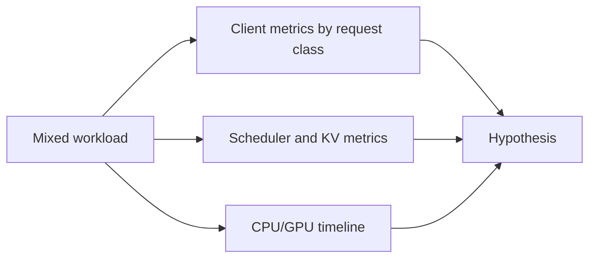

> **读图方法：** 阅读“Baseline 要记录的证据”这张流程图时，先把方框看成对象或状态，把箭头看成数据或控制的移动。第一遍从左向右建立顺序，第二遍再核对分支发生的条件。

- 按短/长请求分别计算 TTFT/TPOT/E2EL；
- Scheduler iteration 的 context/generation tokens；
- waiting/running、KV usage、preemptions；
- 每 step GPU kernel 时间和 idle gap；
- CUDA Graph mode/fallback。

### 10.19.3 候选实验顺序

> **本节先看：** 下面先给出“候选实验顺序”的结论清单。先理解每一项为什么存在，再记参数名或实现细节。

1. 调整 chunked prefill/token budget，观察短请求 TTFT 与长请求 E2EL 的交换。
2. 调整 max sequences，观察 decode batch 和 KV pressure。
3. 确认 prefix cache 是否真实命中，避免把共享 prefix 假设写进结论。
4. 检查 graph padding/capture bucket，避免新 batch shape 频繁 eager fallback。
5. 容量仍不足时，再比较 DP 扩展或 workload 隔离。

### 10.19.4 结果不能只是一张总表

总 request throughput 上升可能掩盖短请求 SLO 恶化。至少按 request class 给出：

| 配置 | 类别 | req/s | p99 TTFT | p99 TPOT | p99 E2EL | goodput | preemptions |
|---|---|---:|---:|---:|---:|---:|---:|
| baseline | short | | | | | | |
| baseline | long | | | | | | |
| treatment | short | | | | | | |
| treatment | long | | | | | | |

### 10.19.5 合格结论示例的结构

> **本节先看：** 下面的代码或调用链只保留“合格结论示例的结构”的主干。阅读时依次寻找输入、状态变化和输出，暂时忽略辅助分支。

```text
在固定 commit、模型、H100xN、Poisson RPS 和 80/20 长度分布下，配置 X 相对 baseline
使短请求 p99 TTFT 下降 A%，总 output throughput 变化 B%，长请求 p99 E2EL 上升 C%。
trace 显示最长 prefill step 从 D ms 降至 E ms，GPU idle 增加 F%。所有 greedy 输出通过
容差检查，错误率均为 0。该结论未验证其他 GPU、MoE 和 prefix-heavy workload。
```

---

## 10.20 参数扫描与 Pareto frontier

> **本节先看：** 本节要回答：**参数扫描与 Pareto frontier**。下面的小节会逐层拆开概念、运行过程和源码落点；第一次阅读先抓对象之间的关系，第二次再记类名、字段和分支。

### 10.20.1 为什么不选“分数最高的一行”

多个参数共同决定 throughput、latency、显存和成本，通常不存在所有指标都最优的配置。
Pareto frontier 保留那些没有被另一配置同时在所有目标上击败的点。

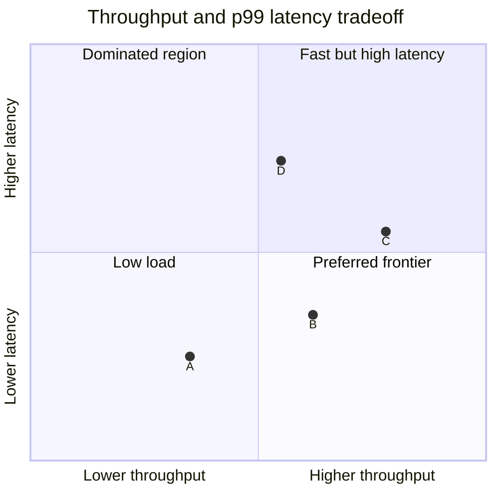

> **读图方法：** 这是“为什么不选分数最高的一行”的二维权衡图。先确认两个坐标轴越大分别意味着什么，再看方案落在哪个象限；位置表达相对取舍，不表示未经实验验证的精确性能。

### 10.20.2 当前 `bench sweep`

`ParameterSweep` 从 JSON 读取命名参数组合，把键归一化为 CLI 参数并运行 server/benchmark
组合。workload sweep 可以从 serial 到 batch 估计范围，再探索中间 request rate 或
max concurrency。结果汇总后可绘图。

### 10.20.3 每用户与每 GPU 效率

当前 Pareto 工具可计算：

```math
tokens/(s\cdot user)=output\ throughput/user\ count
```

```math
tokens/(s\cdot GPU)=output\ throughput/GPU\ count
```

**工具行为与物理含义需要分开。** `_infer_user_count` 优先使用指定字段，否则用
`request_rate`，最后才回退到 peak concurrency。但 request/s 不是用户数：
`1000 token/s ÷ 10 request/s = 100 token/request`，不能标成每用户生成速率。
要使用上面的第一式，应显式提供有定义的活跃用户/并发数，并在图上写清分母。

GPU 数可由显式字段或 TP×PP×DP 推导；当前默认推导未计入 PCP，含 PCP 实验应
显式提供 GPU count。这些是对上游工具结果的解释限制，不是推荐照搬的估算方法。

[源码] `vllm/benchmarks/sweep/plot_pareto.py` - `_infer_user_count`、`_infer_gpu_count`、
`_prepare_records`

### 10.20.4 扫参防止组合爆炸

采用分阶段策略：

1. 粗扫 workload，找到未饱和、转折、过载三个区域。
2. 单变量粗扫主要 engine 参数。
3. 淘汰被明显支配或不通过正确性门槛的点。
4. 在 frontier 附近做细扫和多次重复。
5. 对最终候选做长时间 soak 与真实 trace replay。

---

## 10.21 回归验证：性能通过还不算完成

> **本节先看：** 本节要回答：**回归验证：性能通过还不算完成**。下面的小节会逐层拆开概念、运行过程和源码落点；第一次阅读先抓对象之间的关系，第二次再记类名、字段和分支。

### 10.21.1 正确性层

> **本节先看：** 下面先给出“正确性层”的结论清单。先理解每一项为什么存在，再记参数名或实现细节。

- greedy 输出与 token IDs；
- sampling distribution 的统计测试；
- logprobs、structured output、stop conditions；
- prefix cache 命中与未命中一致性；
- TP/PP/EP/DCP 数值容差；
- multimodal/LoRA/spec decode 组合。

### 10.21.2 稳定性层

> **本节先看：** 下面先给出“稳定性层”的结论清单。先理解每一项为什么存在，再记参数名或实现细节。

- 长时间错误率与 timeout；
- worker/EngineCore 是否重启；
- host/GPU memory 是否持续增长；
- metrics cardinality 与 Prometheus 文件是否泄漏；
- abort 和 client disconnect 是否释放 KV blocks；
- 过载后能否恢复到正常 queue。

### 10.21.3 性能层

> **本节先看：** 下面先给出“性能层”的结论清单。先理解每一项为什么存在，再记参数名或实现细节。

- 不只比较 mean，保留原始样本；
- 同时比较 p50/p95/p99/max；
- 按输入长度、输出长度、request class、DP engine 分组；
- 报告 startup 与 steady-state；
- 报告每 GPU 效率和显存。

### 10.21.4 自动回归阈值要考虑噪声

固定 `throughput >= baseline * 0.99` 在噪声 3% 的机器上会频繁误报。更稳妥的方法是建立
历史分布、控制运行环境、使用重复样本并为不同 benchmark 设置不同容差。阈值也不能掩盖
严重错误率或正确性失败。

---

## 10.22 报告与原始数据

> **本节先看：** 本节要回答：**报告与原始数据**。下面的小节会逐层拆开概念、运行过程和源码落点；第一次阅读先抓对象之间的关系，第二次再记类名、字段和分支。

### 10.22.1 每次 run 的目录建议

> **本节先看：** 下面的代码或调用链只保留“每次 run 的目录建议”的主干。阅读时依次寻找输入、状态变化和输出，暂时忽略辅助分支。

```text
run-2026-09-07T120000/
  command.txt
  environment.json
  workload.jsonl
  benchmark-result.json
  prometheus-before.txt
  prometheus-after.txt
  server.log
  gpu-telemetry.csv
  traces/
  correctness.json
```

### 10.22.2 为什么保留原始逐请求数据

聚合表不能重新回答：

- p99 是否由一种长度请求主导；
- 某一分钟是否发生过载；
- failed requests 的原始错误是什么；
- client queue 与 server queue 如何相关；
- 一个新 SLO 下 goodput 是多少。

逐请求 start time、TTFT、ITLs、E2EL、长度和错误使后续分析成为可能。

### 10.22.3 JSON 中必须携带 schema/version

指标字段会演进。至少保存工具 commit、命令、字段单位和 schema version，避免半年后把秒
当毫秒、把 expected tokens 当 actual tokens。

---

## 10.23 随章教学代码

[`examples/ch10_benchmark_reasoning.py`](../../examples/ch10_benchmark_reasoning.py) 是一个无
第三方依赖的指标与实验分析器，包含：

- `RequestTrace`：客户端 arrival/send/token timestamps；
- TTFT、ITL、TPOT、E2EL 与 client queue 边界；
- `summarize`：request/output/total token throughput 和 goodput；
- NumPy 默认风格的线性插值 percentile；
- `ExperimentRun`：重复样本、CV 与 baseline/treatment change；
- `pareto_frontier`：吞吐越高、p99 越低的非支配点；
- `RuntimeSignals` 与 `diagnose`：从信号提出假设，而非自动宣称根因。

运行：

```bash
python3 examples/ch10_benchmark_reasoning.py
python3 -m unittest tests.test_ch10_benchmark_reasoning
```

24 个单元测试覆盖计时边界、失败请求、goodput AND 语义、ITL 展平、噪声、正确性门槛和
Pareto dominance。

### 10.23.1 教学代码与真实 benchmark 的边界

该脚本不会启动 vLLM、发送 HTTP 或测量 GPU。它用于让读者在 CPU 上验证指标公式，并分析
逐 token 的教学 timestamps。若直接分析真实 benchmark 导出的 SSE 事件，必须额外
提供服务端实际输出 token 数（`completion_tokens`）和适配器的末计时点
（`last_response_time`），不能把事件条数当作 token 数。GPU 性能结论必须来自真实环境，记录在
[`experiments/ch10-optimization.md`](../../experiments/ch10-optimization.md)。

---

## 10.24 全书综合实验

> **本节先看：** 本节要回答：**全书综合实验**。下面的小节会逐层拆开概念、运行过程和源码落点；第一次阅读先抓对象之间的关系，第二次再记类名、字段和分支。

### 实验 A：固定 batch 的 eager/compile/graph

使用 `bench latency`，固定模型、batch、input/output length，分别测 cold start 与 warmed
steady state。记录 compile/capture 时间、峰值显存、均值和 p99。

### 实验 B：offline Scheduler/KV 扫描

使用 `bench throughput` 和固定 request list，扫描 token budget、max sequences、prefix cache，
记录 actual input/output tokens、preemption 与 computed/cache-hit prompt tokens。

### 实验 C：online 饱和曲线

使用 `bench serve` 从低 RPS 扫到过载，固定 Poisson arrival 和 max concurrency，绘制 request
throughput、goodput、p99 TTFT/TPOT、client queue、server queue。

### 实验 D：burst sensitivity

保持平均 RPS 不变，比较 burstiness `0.5、1、infinity`。验证平均吞吐相近时，queue 和尾延迟
是否显著不同。

### 实验 E：prefix cache

固定公共 prefix 数、长度、重复次数和顺序，比较 cache off、cold on、warm on。用
`prompt_tokens_by_source` 证明实际跳过了计算。

### 实验 F：多 GPU 扩展效率

比较 TP/DP/PP 候选，报告系统 throughput、tokens/s/GPU、communication fraction、显存与 p99，
并验证输出等价。

### 实验 G：一次 profiler 归因闭环

从 online p99 回溯到内部 queue/prefill/decode，再到 CPU/GPU timeline 和 component benchmark；
实施一个单变量修改，复测并写出 Amdahl 一致性检查。

### 实验 H：长时间回归

对最终候选执行至少一个超过短 benchmark 数量级的 soak，包含取消、timeout、长度尾部和过载
恢复，检查内存、错误率与 metrics。

---

## 10.25 练习题

第一遍先完成前 5 题；余下题目是第二遍源码阅读的扩展题库，不要求一次做完。

> **本节先看：** 下面先给出“练习题”的结论清单。先理解每一项为什么存在，再记参数名或实现细节。

1. 某请求在客户端等待 semaphore 200 ms，发送后 300 ms 收到首 token，之后 4 个 token 的
   间隔为 40/50/60/50 ms。计算 client queue、TTFT、E2EL、TPOT 和 ITL 样本。
2. 为什么把 total tokens/s 与 output tokens/s 混用会偏向长 prompt workload？
3. 100 req/s 完成，但只有 70 req/s 同时满足 TTFT 与 TPOT SLO，应该怎样报告？
4. 解释 `request_rate=inf` 与稳定 100 RPS 的差别。
5. 为什么 max concurrency 太低会让服务器 TTFT 看起来很好？
6. 设计实验区分 prefix cache 收益和 warmup/compile 收益。
7. treatment throughput 提升 3%，baseline CV 为 5%，还需要哪些证据？
8. 某 kernel 占端到端 10%，加速 4 倍，根据 Amdahl 定律估计上限。
9. 为什么 `prompt_tokens` 日志 throughput 和业务输入 token throughput 可能方向相反？
10. 给出一个 p99 TTFT 高但 GPU utilization 低的可证伪假设。
11. 怎样判断 TP=2 的总吞吐提升是否值得两倍 GPU 成本？
12. 为 Scheduler token budget 与 max sequences 设计两阶段扫参矩阵。

---

## 10.26 常见误解与纠正

> **本节先看：** 下面先给出“常见误解与纠正”的结论清单。先理解每一项为什么存在，再记参数名或实现细节。

1. **误解：tokens/s 越高，用户体验越好。** 纠正：TTFT、ITL、尾延迟和 goodput 可能变差。
2. **误解：平均延迟足够。** 纠正：排队系统的 p95/p99 往往决定 SLO。
3. **误解：一次 benchmark 就能比较。** 纠正：需要 warmup、重复和噪声估计。
4. **误解：第一次运行代表稳定态。** 纠正：model load、compile、capture 和 cache 都是一次性状态。
5. **误解：warmup 越多越科学。** 纠正：warmup 必须匹配目标状态，并明确是否预热 cache。
6. **误解：`request_rate=inf` 就是生产峰值。** 纠正：它近似一次性提交，不是随机稳态到达。
7. **误解：max concurrency 就是服务器并发。** 纠正：它也可能在客户端拦截请求。
8. **误解：TTFT 包含 client semaphore queue。** 纠正：当前 serve benchmark 单独记录该等待。
9. **误解：一个 SSE chunk 永远是一个 token。** 纠正：backend 可能打包多个 tokens。
10. **误解：TPOT 就是所有 ITL 的平均。** 纠正：TPOT 先按请求平均，样本权重不同。
11. **误解：失败请求可以从 latency 报告忽略。** 纠正：这会造成幸存者偏差。
12. **误解：GPU utilization 高说明优化成功。** 纠正：无效 padding 和通信也能让 GPU 很忙。
13. **误解：profiler trace 中测得的吞吐可直接用于容量。** 纠正：profiling 自身有显著开销。
14. **误解：微基准快 20%，端到端也快 20%。** 纠正：收益受热点占比和系统瓶颈转移限制。
15. **误解：只改一个参数就不需要记录其他配置。** 纠正：环境漂移同样能改变结果。
16. **误解：prefix hit rate 高一定节省同等比例时间。** 纠正：还取决于命中 token 数和剩余瓶颈。
17. **误解：峰值 throughput 点就是生产配置。** 纠正：通常应选择饱和拐点左侧或 SLO frontier。
18. **误解：性能通过后不必测正确性。** 纠正：少生成、丢请求或数值错误都能虚假提速。
19. **误解：Pareto frontier 会自动选出唯一最佳配置。** 纠正：它只去掉被支配点，最终选择仍由 SLO
    和成本权重决定。
20. **误解：同名 metrics 在客户端与服务器含义相同。** 纠正：计时点、clock 和 token 分子可能不同。

---

## 10.27 本章总结：优化报告的十个问题

在接受任何“vLLM 优化了 X%”的结论前，逐项问：

1. **目标是谁？** 交互、离线、平台容量还是成本？
2. **指标是什么？** TTFT、TPOT、ITL、E2EL、哪一种 tokens/s 或 goodput？
3. **workload 是什么？** 长度、到达、burst、prefix、sampling 是否固定？
4. **计时边界在哪里？** 是否含 client queue、网络、detokenize、warmup？
5. **baseline 可复现吗？** commit、硬件、命令、环境和原始数据是否齐全？
6. **只改了什么？** 是否存在共同变化或状态污染？
7. **证据链是什么？** 用户指标、内部 metrics、trace 与组件测试是否一致？
8. **噪声多大？** 重复、CV、顺序和置信程度如何？
9. **正确吗？** 输出、失败、NaN、超时和稳定性是否过关？
10. **边界是什么？** 哪些模型、硬件和 workload 尚未验证？

当这十个问题都有答案，优化才从“跑分变化”成为可复用的工程知识。

---

## 10.28 源码阅读索引

建议按以下顺序阅读固定版本源码：

1. `vllm/benchmarks/latency.py`：固定 batch、warmup 与 percentile。
2. `vllm/benchmarks/throughput.py`：offline 请求构造、计时和 token 统计。
3. `vllm/benchmarks/serve.py`：arrival process、concurrency、goodput 与结果聚合。
4. `vllm/benchmarks/lib/endpoint_request_func.py`：客户端 start/TTFT/ITL/E2EL 时间戳。
5. `vllm/benchmarks/datasets/datasets.py`：random、ShareGPT、timed trace 与 prefix repetition。
6. `vllm/benchmarks/sweep/param_sweep.py`：参数组合到 CLI。
7. `vllm/benchmarks/sweep/serve_workload.py`：serial 到 batch 的 workload 探索。
8. `vllm/benchmarks/sweep/plot_pareto.py`：每用户/每 GPU 与 frontier。
9. `vllm/v1/metrics/stats.py`：Scheduler、request 和 prompt token stats。
10. `vllm/v1/metrics/loggers.py`：日志与 Prometheus 指标定义和聚合。
11. `vllm/v1/metrics/prometheus.py`：多进程 registry 生命周期。
12. `vllm/v1/metrics/perf.py`：FLOPS/bytes 解析模型与 MFU。
13. `vllm/config/profiler.py`、`vllm/v1/worker/gpu_worker.py`：profiler 配置与 Worker 控制。
14. `docs/contributing/profiling.md`：PyTorch、Proton、Nsight Systems 工作流。
15. `benchmarks/benchmark_block_pool.py`、`benchmark_prefix_caching.py` 和
    `benchmarks/attention_benchmarks/`：组件与 kernel 层实例。
16. `tests/benchmarks/`：CLI、dataset adapter、sweep 和参数稳定性测试。

本章正文、指标分析器和 CPU 单元测试已经完成，并绑定 commit
`5893426b88f7b3cd21101d194eb1c6f0a6f0e27b`。当前机器没有可用的 NVIDIA GPU vLLM
运行环境，因此 profiler、NCCL 与真实服务性能数据仍标记为 `runtime_verified: false`。
本章给出的数值曲线均为教学示意，不能冒充实测结果。
