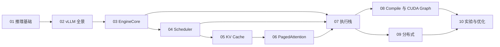

# 《vLLM 源码教程》写作蓝图

## 读者与终点

默认读者使用过 LLM，理解 prompt、token、上下文长度和流式输出等产品概念；会 Python，
能够阅读类、函数、异步代码和基本单元测试；具备向量、矩阵、概率和复杂度的基础直觉，
但可能没有系统学习过 Transformer、CUDA、编译器、操作系统内存管理或分布式算法。

因此，本书不把“有开发经验”等同于“熟悉推理原理”。每个机制都按以下坡度展开：

```text
使用时看到的现象
        ↓
一句话结论与生活化直觉
        ↓
小数字、单请求或单 GPU 例子
        ↓
必要公式、shape 和单位
        ↓
当前 revision 的真实源码
        ↓
异常路径、性能取舍和适用边界
```

第一次阅读允许跳过较深的推导和平台分支，只要能复述主路径；第二次再手算例子并追源码；
第三次通过实验和源码追踪题建立独立分析能力。

读完全书后，读者应能够：

1. 画出一次请求从 API 到 GPU 再返回客户端的完整路径。
2. 解释 Scheduler、KV Cache、PagedAttention 和 Model Runner 如何协作。
3. 使用路径和符号定位当前 revision 的真实实现。
4. 判断性能瓶颈位于排队、CPU、GPU、显存还是通信层。
5. 修改一个局部机制，并选择合适的测试和 benchmark 验证。

## 教学主线

全书采用同一个主问题串联：

```text
一段文本如何变成 token？
        ↓
模型如何预测下一个 token？
        ↓
多个长度不同的请求如何同时推进？
        ↓
历史 token 的 KV 如何放进有限显存？
        ↓
GPU 如何根据 block table 执行 attention？
        ↓
多个进程和 GPU 如何协同？
        ↓
怎样证明优化真的有效？
```

第一遍主线限定为：文本生成、decoder-only 模型、vLLM V1、NVIDIA GPU。其他平台、
多模态、MoE、speculative decoding 和 KV transfer 在主线建立后作为扩展说明。

## 统一章节结构

每章正文按以下顺序组织：

1. 本章要解决的问题。
2. 面向非 LLM 读者的直觉解释。
3. 最小可运行实现或模拟器。
4. 本章机制在全系统中的位置。
5. 当前 revision 的源码地图。
6. 一条逐跳验证的主调用链。
7. 关键状态、数据结构和并发边界。
8. 设计取舍、异常路径和常见误解。
9. 最小实验、观察结果和解释。
10. 小结、自检题和源码追踪题。

## 图文规范

每章至少规划以下三类图：

- **直觉图：** 先解释为什么需要该机制。
- **结构图：** 标出类、模块、进程和设备边界。
- **时序或状态图：** 展示请求或 block 随 step 的变化。

图中的重要边必须能回到源码。CPU、GPU、线程、进程、ZMQ、共享内存和 collective
通信边界必须明确标注。

每张图必须配套读图说明：流程图指出阅读方向和主路径，时序图区分参与者与时间方向，
状态图说明触发条件，性能图说明坐标轴和不可直接外推的边界。图不是正文的装饰，也不能
要求读者自己猜出作者想表达的结论。

## 章节依赖



## 版本策略

- 当前写作基线记录在 `meta/source-revisions.md`。
- 主体叙事以 vLLM V1 Engine 为准。
- 必须区分 vLLM V1 Engine、Model Runner V1（MRV1）和 Model Runner V2
  （MRV2）。
- V0、历史 PagedAttention kernel 和旧架构仅用于解释演进，不作为当前行为。
- 每完成一章，将该章从 `outline` 改为 `draft`；完成源码和实验复核后才改为
  `verified`。

## 篇幅分配

| 模块 | 章节 | 目标页数 |
|---|---|---:|
| 基础与全景 | 01-03 | 140 |
| 核心调度与显存 | 04-06 | 205 |
| 执行与并行 | 07-09 | 165 |
| 实验与优化 | 10 | 50 |
| **合计** |  | **560** |

## 不纳入第一版主线

以下主题保留接口和扩展阅读位置，但不在第一版逐行展开：

- 所有模型架构的逐个适配过程。
- 每一种 quantization backend。
- 所有 speculative decoding 算法。
- 全部多模态 processor 和 encoder cache 路径。
- 每一种硬件平台的 attention kernel。
- 训练、微调和 RL 系统本身。

这些内容应在主线完成后形成专题卷，避免第一版失去清晰的学习路径。
